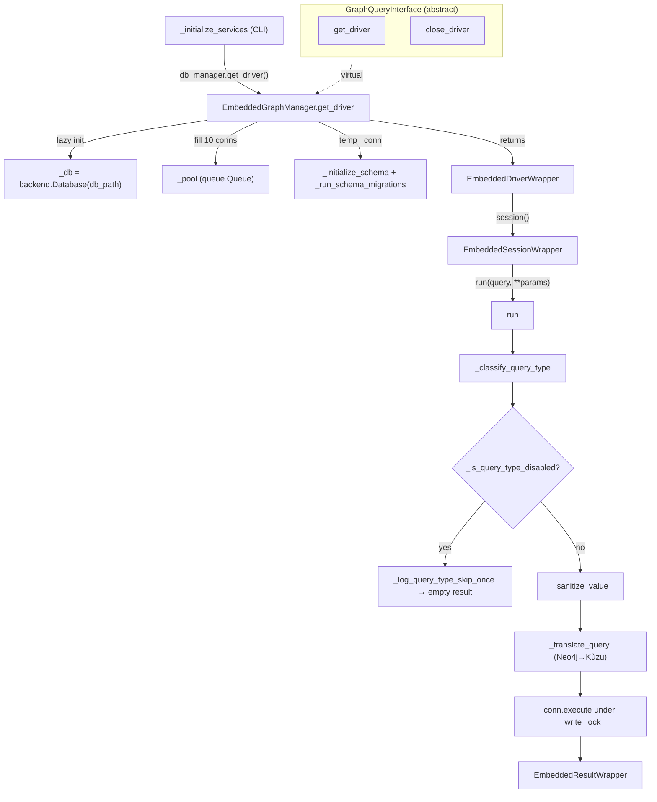

# Embedded Kùzu graph-database backend

<!-- connect:up:begin -->
> **Cross-repo concept:** part of [symbol-graph](../../../concepts/symbol-graph.md) across this wiki's repos.
<!-- connect:up:end -->
## Overview
This module is the **store the code graph lives in** when CodeGraphContext runs without
a database server. CodeGraphContext models a codebase as a property graph — `Function`,
`Class`, `File`, `Module` … nodes joined by `CONTAINS`, `CALLS`, `IMPORTS`, `INHERITS`
edges — and the rest of the system (indexer, MCP query tools) is written against a
**Neo4j-shaped driver API**: `driver.session().run(cypher, **params) → result`. The
embedded backend keeps that contract while swapping the server for an *in-process,
file-based* engine (KùzuDB or its LadybugDB fork). It does so with three shim classes —
[`EmbeddedDriverWrapper`](../catalog/src/codegraphcontext/core/database_embedded_kuzu.md#EmbeddedDriverWrapper),
[`EmbeddedSessionWrapper`](../catalog/src/codegraphcontext/core/database_embedded_kuzu.md#EmbeddedSessionWrapper),
and [`EmbeddedResultWrapper`](../catalog/src/codegraphcontext/core/database_embedded_kuzu.md#EmbeddedResultWrapper) —
plus a **runtime Cypher translator** ([`_translate_query`](../catalog/src/codegraphcontext/core/database_embedded_kuzu.md#EmbeddedSessionWrapper._translate_query))
that rewrites the callers' Neo4j Cypher into Kùzu's dialect on every query. The single
key idea: *one code-comprehension pipeline, two interchangeable substrates (server vs.
embedded), reconciled by an adapter layer rather than by branching the callers.*

The module header states the design directly: it is a "shared embedded graph-database
layer for Kùzu-dialect engines," where backend-specific modules "supply an
`EmbeddedBackendSpec` and thin manager subclass; all Cypher translation, connection
pooling, and schema logic lives here." That parametrization over engines lives in
[`EmbeddedBackendSpec`](../catalog/src/codegraphcontext/core/database_embedded_kuzu.md#EmbeddedBackendSpec).

## Diagram

## Design rationale (why it's built this way)

**Why an adapter, not a rewrite.** CodeGraphContext already speaks the Neo4j driver
protocol. Rather than fork every caller, the embedded layer impersonates that protocol:
[`get_driver`](../catalog/src/codegraphcontext/core/database_embedded_kuzu.md#EmbeddedGraphManager.get_driver)
returns an [`EmbeddedDriverWrapper`](../catalog/src/codegraphcontext/core/database_embedded_kuzu.md#EmbeddedDriverWrapper)
whose `session()` yields an [`EmbeddedSessionWrapper`](../catalog/src/codegraphcontext/core/database_embedded_kuzu.md#EmbeddedSessionWrapper)
with a `run()` method and context-manager semantics, and results come back as an
[`EmbeddedResultWrapper`](../catalog/src/codegraphcontext/core/database_embedded_kuzu.md#EmbeddedResultWrapper)
exposing `single()`/`data_raw()`/`consume()`. The wrapper even "accepts and ignores
Neo4j-specific kwargs (e.g. `default_access_mode`)" so callers need no conditionals. This
is the concrete other side of the abstract
[`get_driver`](../catalog/src/codegraphcontext/core/graph_query.md#GraphQueryInterface.get_driver)
and [`close_driver`](../catalog/src/codegraphcontext/core/graph_query.md#GraphQueryInterface.close_driver)
declared on `GraphQueryInterface` — the seam where a server backend (Neo4j/FalkorDB) and
this embedded one become interchangeable.

**Why a spec dataclass.** The frozen
[`EmbeddedBackendSpec`](../catalog/src/codegraphcontext/core/database_embedded_kuzu.md#EmbeddedBackendSpec)
carries [`python_module`](../catalog/src/codegraphcontext/core/database_embedded_kuzu.md#EmbeddedBackendSpec.python_module)
(imported dynamically), [`display_name`](../catalog/src/codegraphcontext/core/database_embedded_kuzu.md#EmbeddedBackendSpec.display_name),
[`backend_id`](../catalog/src/codegraphcontext/core/database_embedded_kuzu.md#EmbeddedBackendSpec.backend_id),
and an [`install_hint`](../catalog/src/codegraphcontext/core/database_embedded_kuzu.md#EmbeddedBackendSpec.install_hint).
Because the engine handle is `importlib.import_module(spec.python_module)`, the exact same
manager code drives KùzuDB and LadybugDB — a subclass only supplies a different
[`BACKEND_SPEC`](../catalog/src/codegraphcontext/core/database_embedded_kuzu.md#EmbeddedGraphManager.BACKEND_SPEC).

**Why translate Cypher at runtime.** Kùzu's Cypher is not Neo4j's. Instead of maintaining
two query sets, [`_translate_query`](../catalog/src/codegraphcontext/core/database_embedded_kuzu.md#EmbeddedSessionWrapper._translate_query)
("Translates Neo4j Cypher to Kuzu Cypher") rewrites on the fly: it expands `SET n += $props`
map-merges into explicit, per-label `SCHEMA_MAP`-filtered property assignments inline (Kùzu
has no map-merge `SET`), and separately filters explicit non-`+=` `SET n.prop = value` clauses
against that same `SCHEMA_MAP` via
[`_filter_set_clause`](../catalog/src/codegraphcontext/core/database_embedded_kuzu.md#EmbeddedSessionWrapper._filter_set_clause),
rewrites multi-label and negated-label match patterns through
[`single_label_replacer`](../catalog/src/codegraphcontext/core/database_embedded_kuzu.md#EmbeddedSessionWrapper.single_label_replacer),
[`not_label_replacer`](../catalog/src/codegraphcontext/core/database_embedded_kuzu.md#EmbeddedSessionWrapper.not_label_replacer),
and [`poly_replacer`](../catalog/src/codegraphcontext/core/database_embedded_kuzu.md#EmbeddedSessionWrapper.poly_replacer),
and applies further known-incompatibility fixes in
[`_rewrite_kuzu_compat_patterns`](../catalog/src/codegraphcontext/core/database_embedded_kuzu.md#EmbeddedSessionWrapper._rewrite_kuzu_compat_patterns).
The `uid_map` bridges a real modelling gap: Neo4j lets a node be identified by a
`(name, path, line_number)` triple, but the Kùzu schema gives most types a single-column
`PRIMARY KEY (uid)`, so [`uid_map`](../catalog/src/codegraphcontext/core/database_embedded_kuzu.md#EmbeddedSessionWrapper.uid_map)
records which properties compose each type's synthetic `uid`.

> [!inferred]
> The translation layer is fundamentally a **compatibility tax** the embedded backend pays
> that a native Neo4j backend does not. It buys "no server to run" at the cost of a
> growing table of dialect fixups and engine-bug workarounds — a tradeoff worth naming on
> the survey's store axis: embedded is operationally simpler but semantically leakier.

## Entry points

- [`_initialize_services`](../catalog/src/codegraphcontext/cli/cli_helpers.md#_initialize_services)
  is where control first reaches the backend from the CLI: after resolving a context it
  builds the manager and calls `db_manager.get_driver()`, catching a FalkorDB failure to
  fall back to Kùzu. This is the survey-relevant switch point — the same call site serves
  the server and embedded stores.
- [`get_driver`](../catalog/src/codegraphcontext/core/database_embedded_kuzu.md#EmbeddedGraphManager.get_driver)
  is the lazy bootstrap: the "embedded driver. Initialises the database and connection
  pool" on first call, then hands back a reusable
  [`EmbeddedDriverWrapper`](../catalog/src/codegraphcontext/core/database_embedded_kuzu.md#EmbeddedDriverWrapper).
  Every graph read/write ultimately flows from a driver it returned.
- [`run`](../catalog/src/codegraphcontext/core/database_embedded_kuzu.md#EmbeddedSessionWrapper.run)
  on the session wrapper is the per-query hot path — classify, guard, sanitize, translate,
  execute, wrap — and where all the Kùzu-specific defensive logic concentrates.
- [`close_driver`](../catalog/src/codegraphcontext/core/database_embedded_kuzu.md#EmbeddedGraphManager.close_driver)
  is the teardown that must run explicitly (see Edge cases): it "closes the connection
  pool and releases database resources."

## Mechanism (step-by-step)

1. **Resolve where the DB lives.** The manager's
   [`__init__`](../catalog/src/codegraphcontext/core/database_embedded_kuzu.md#EmbeddedGraphManager.__init__)
   computes [`db_path`](../catalog/src/codegraphcontext/core/database_embedded_kuzu.md#EmbeddedGraphManager.db_path)
   from, in priority order, an explicit argument, the spec's `path_env_var`, the config
   value, then a default under `~/.codegraphcontext/global/`. The config lookup goes
   through [`get_config_value`](../catalog/src/codegraphcontext/cli/config_manager.md#get_config_value)
   → [`load_config`](../catalog/src/codegraphcontext/cli/config_manager.md#load_config)
   (env > local `.env` > global `.env`). Because the manager is a per-subclass singleton,
   `__init__` guards with [`_initialized`](../catalog/src/codegraphcontext/core/database_embedded_kuzu.md#EmbeddedGraphManager._initialized):
   re-constructing with the same path is a no-op, and with a *different* path it first
   tears down the old handle via `close_driver`. This is why the store is a single file
   directory per process, not a connection per call.

2. **Open the engine and fill a connection pool.**
   [`get_driver`](../catalog/src/codegraphcontext/core/database_embedded_kuzu.md#EmbeddedGraphManager.get_driver)
   double-checks [`_db`](../catalog/src/codegraphcontext/core/database_embedded_kuzu.md#EmbeddedGraphManager._db)
   under [`_lock`](../catalog/src/codegraphcontext/core/database_embedded_kuzu.md#EmbeddedGraphManager._lock),
   dynamically imports the engine named by
   [`python_module`](../catalog/src/codegraphcontext/core/database_embedded_kuzu.md#EmbeddedBackendSpec.python_module),
   opens `backend.Database(db_path)`, and pushes **10** `Connection` objects into
   [`_pool`](../catalog/src/codegraphcontext/core/database_embedded_kuzu.md#EmbeddedGraphManager._pool)
   (a `queue.Queue`). Initialization wraps up to 5 retries with exponential backoff on
   lock-contention errors — an embedded file DB can be held by another process — logging
   through [`info_logger`](../catalog/src/codegraphcontext/utils/debug_log.md#info_logger)
   and [`warning_logger`](../catalog/src/codegraphcontext/utils/debug_log.md#warning_logger);
   a missing engine raises with the spec's install hint via
   [`error_logger`](../catalog/src/codegraphcontext/utils/debug_log.md#error_logger).

3. **Create / migrate the graph schema.** Still inside `get_driver`, one connection is
   borrowed and stashed on [`_conn`](../catalog/src/codegraphcontext/core/database_embedded_kuzu.md#EmbeddedGraphManager._conn)
   just long enough for [`_initialize_schema`](../catalog/src/codegraphcontext/core/database_embedded_kuzu.md#EmbeddedGraphManager._initialize_schema)
   to run, then reset to `None` and returned to the pool. `_initialize_schema` "creates
   Node and Rel tables if they don't exist" — this is where CodeGraphContext's entire
   graph model is materialized as Kùzu tables (`Function`, `Class`, `File`, `Module`,
   `Repository`, … with `PRIMARY KEY (uid)` or `(path)`/`(name)`, and rel-table groups
   `CONTAINS`/`CALLS`/`IMPORTS`/`INHERITS`). For databases created by an older version,
   [`_run_schema_migrations`](../catalog/src/codegraphcontext/core/database_embedded_kuzu.md#EmbeddedGraphManager._run_schema_migrations)
   then "add[s] columns introduced after older local Kùzu databases were created" —
   including per-sub-table `ALTER`s, because a Kùzu `REL TABLE GROUP` fans out into
   `<group>_<From>_<To>` sub-tables that must be altered individually.

4. **Take a connection per session.** `EmbeddedDriverWrapper.session()` builds an
   [`EmbeddedSessionWrapper`](../catalog/src/codegraphcontext/core/database_embedded_kuzu.md#EmbeddedSessionWrapper),
   which pops one live connection from the pool into
   [`conn`](../catalog/src/codegraphcontext/core/database_embedded_kuzu.md#EmbeddedSessionWrapper.conn)
   (its private [`_pool`](../catalog/src/codegraphcontext/core/database_embedded_kuzu.md#EmbeddedSessionWrapper._pool)
   reference), and returns it to the pool on `__exit__`. It also seeds the
   [`uid_map`](../catalog/src/codegraphcontext/core/database_embedded_kuzu.md#EmbeddedSessionWrapper.uid_map)
   used during translation.

5. **Run a query with full defensive handling.**
   [`run`](../catalog/src/codegraphcontext/core/database_embedded_kuzu.md#EmbeddedSessionWrapper.run)
   first classifies the query with
   [`_classify_query_type`](../catalog/src/codegraphcontext/core/database_embedded_kuzu.md#EmbeddedSessionWrapper._classify_query_type)
   (`fulltext`, `module_deps`, `inheritance_resolution`, `calls_resolution`, `write`,
   `generic`); if that type was previously disabled
   ([`_is_query_type_disabled`](../catalog/src/codegraphcontext/core/database_embedded_kuzu.md#EmbeddedSessionWrapper._is_query_type_disabled)),
   it short-circuits to an empty
   [`EmbeddedResultWrapper`](../catalog/src/codegraphcontext/core/database_embedded_kuzu.md#EmbeddedResultWrapper)
   after logging once via
   [`_log_query_type_skip_once`](../catalog/src/codegraphcontext/core/database_embedded_kuzu.md#EmbeddedSessionWrapper._log_query_type_skip_once).
   Otherwise it coerces every parameter through
   [`_sanitize_value`](../catalog/src/codegraphcontext/core/database_embedded_kuzu.md#EmbeddedSessionWrapper._sanitize_value)
   (tuples/sets → lists, struct-key normalization, sentinel `-1` for null id columns),
   translates the Cypher via
   [`_translate_query`](../catalog/src/codegraphcontext/core/database_embedded_kuzu.md#EmbeddedSessionWrapper._translate_query),
   and executes `conn.execute(...)` under the write lock. The step is bracketed by
   [`debug_log`](../catalog/src/codegraphcontext/utils/debug_log.md#debug_log)
   traces of the original and translated query.

6. **Absorb Kùzu's quirks on failure.** The `except` arm around execute is where the
   embedded backend earns its keep: `"already exists"` collisions are swallowed to
   preserve idempotent `CREATE`; a `binder exception` is re-raised (expected during
   label-matching probes); and the notorious Kùzu `unordered_map::at` UNWIND
   relationship-planner bug is worked around by rewriting the batch `UNWIND` into a
   per-row loop that re-enters `run` (which is why
   [`_write_lock`](../catalog/src/codegraphcontext/core/database_embedded_kuzu.md#EmbeddedGraphManager._write_lock)
   is a *reentrant* `RLock`). Genuinely unsupported query types are permanently disabled
   for the run when [`_should_fail_fast`](../catalog/src/codegraphcontext/core/database_embedded_kuzu.md#EmbeddedSessionWrapper._should_fail_fast)
   says so, via [`_disable_query_type`](../catalog/src/codegraphcontext/core/database_embedded_kuzu.md#EmbeddedSessionWrapper._disable_query_type).

## Key data structures

- [`EmbeddedBackendSpec`](../catalog/src/codegraphcontext/core/database_embedded_kuzu.md#EmbeddedBackendSpec) —
  frozen configuration ("Configuration for a Kùzu-dialect embedded graph backend") that
  makes the whole module engine-agnostic; the manager reads it as
  [`BACKEND_SPEC`](../catalog/src/codegraphcontext/core/database_embedded_kuzu.md#EmbeddedGraphManager.BACKEND_SPEC).
- The **graph store itself**: [`_db`](../catalog/src/codegraphcontext/core/database_embedded_kuzu.md#EmbeddedGraphManager._db)
  (the open engine handle) plus [`_pool`](../catalog/src/codegraphcontext/core/database_embedded_kuzu.md#EmbeddedGraphManager._pool)
  (a `queue.Queue` of connections) and the transient
  [`_conn`](../catalog/src/codegraphcontext/core/database_embedded_kuzu.md#EmbeddedGraphManager._conn)
  used only during schema setup. The schema created by
  [`_initialize_schema`](../catalog/src/codegraphcontext/core/database_embedded_kuzu.md#EmbeddedGraphManager._initialize_schema)
  *is* the persisted code graph.
- [`EmbeddedCompatState`](../catalog/src/codegraphcontext/core/database_embedded_kuzu.md#EmbeddedCompatState) —
  "Shared fail-fast state for unsupported query types," holding
  [`disabled_query_types`](../catalog/src/codegraphcontext/core/database_embedded_kuzu.md#EmbeddedCompatState.disabled_query_types),
  [`logged_disabled_query_types`](../catalog/src/codegraphcontext/core/database_embedded_kuzu.md#EmbeddedCompatState.logged_disabled_query_types),
  and a [`lock`](../catalog/src/codegraphcontext/core/database_embedded_kuzu.md#EmbeddedCompatState.lock).
  It lives on the manager as
  [`_compat_state`](../catalog/src/codegraphcontext/core/database_embedded_kuzu.md#EmbeddedGraphManager._compat_state)
  (long-lived) so a disabled type "sticks across sessions instead of resetting with every
  new session wrapper" — each session mirrors it through
  [`_disabled_query_types`](../catalog/src/codegraphcontext/core/database_embedded_kuzu.md#EmbeddedSessionWrapper._disabled_query_types),
  [`_logged_disabled_query_types`](../catalog/src/codegraphcontext/core/database_embedded_kuzu.md#EmbeddedSessionWrapper._logged_disabled_query_types),
  and [`_state_lock`](../catalog/src/codegraphcontext/core/database_embedded_kuzu.md#EmbeddedSessionWrapper._state_lock).

## Dynamics (design intent)

Concurrency is deliberately coarse. The comment on `run` explains that
[`_write_lock`](../catalog/src/codegraphcontext/core/database_embedded_kuzu.md#EmbeddedGraphManager._write_lock)
(mirrored on the session as
[`_write_lock`](../catalog/src/codegraphcontext/core/database_embedded_kuzu.md#EmbeddedSessionWrapper._write_lock))
"now serializes ALL access, reads included: `kuzu.Connection` is not thread-safe, and
concurrent `asyncio.to_thread` tool calls can otherwise race a read against a write on the
same connection." So although a 10-connection
[`_pool`](../catalog/src/codegraphcontext/core/database_embedded_kuzu.md#EmbeddedGraphManager._pool)
exists, the write lock funnels execution to one query at a time — the pool mainly avoids
connection churn, not true parallelism. Singleton construction is separately guarded by
[`_lock`](../catalog/src/codegraphcontext/core/database_embedded_kuzu.md#EmbeddedGraphManager._lock),
and the compat-state mutations by
[`_state_lock`](../catalog/src/codegraphcontext/core/database_embedded_kuzu.md#EmbeddedSessionWrapper._state_lock).
Logging itself is level-gated: [`info_logger`](../catalog/src/codegraphcontext/utils/debug_log.md#info_logger)
and friends defer to [`_should_log`](../catalog/src/codegraphcontext/utils/debug_log.md#_should_log)
against [`LOG_LEVELS`](../catalog/src/codegraphcontext/utils/debug_log.md#LOG_LEVELS)
on the shared [`logger`](../catalog/src/codegraphcontext/utils/debug_log.md#logger),
while [`debug_log`](../catalog/src/codegraphcontext/utils/debug_log.md#debug_log)
writes to a file only when `_get_config_value` enables it.

## Edge cases

- **Explicit close is mandatory.**
  [`close_driver`](../catalog/src/codegraphcontext/core/database_embedded_kuzu.md#EmbeddedGraphManager.close_driver)
  drains the pool and calls `_db.close()` because, per its comment, "`kuzu.Database` has no
  `__del__`, so Python GC alone cannot release the C++ resources. Without this call the
  process hangs on exit because the embedded Kùzu engine keeps background threads alive."
  It then forces a `gc.collect()`. This is a class of failure a server backend never has.
- **Reserved-keyword labels.** In `_initialize_schema`, labels like `Macro`, `Property`,
  `Union` are Kùzu reserved keywords and must be backtick-escaped in `CREATE REL TABLE`,
  or "the rel table creation will fail silently, leading to runtime 'Binder exception:
  Table CONTAINS does not exist'."
- **UNWIND relationship writes** are pre-emptively forced down the loop-fallback path in
  [`run`](../catalog/src/codegraphcontext/core/database_embedded_kuzu.md#EmbeddedSessionWrapper.run)
  to dodge a planner bug that "can incorrectly bind/corrupt relationship endpoints across
  rows in the batch."
- **Fail-fast is asymmetric.**
  [`_should_fail_fast`](../catalog/src/codegraphcontext/core/database_embedded_kuzu.md#EmbeddedSessionWrapper._should_fail_fast)
  disables `fulltext`/`module_deps` on their signature errors but *never* disables
  `calls_resolution`/`inheritance_resolution`, because the writer iterates label pairs
  itself and blanket-disabling would "silently drop valid edges … causing parity
  mismatches vs FalkorDB / Neo4j."

## Open questions

- The concrete `KùzuDB` / `LadybugDB` manager subclasses and their `BACKEND_SPEC` values
  live in sibling modules (`database_kuzu`, `database_ladybug`) not in this packet, so the
  exact `python_module`/`default_dir` per engine is not verifiable here.
- The `EmbeddedResultWrapper` result-shaping path (`data_raw`, Node/Rel adaptation for
  Kùzu ≥ 0.11) is only partially in-subgraph; its full record contract is confirmable only
  by reading the class body.
- How graph *freshness* (watching / re-indexing) interacts with this singleton store is
  owned by the indexer/watcher subsystems, not this backend module.

## See also
- Sibling concept pages under `wiki/code/codegraphcontext/concepts/` for the indexing
  pipeline, the graph model, and the MCP query interface.
- The tool's `overview.md` for how this store fits the end-to-end code-comprehension flow.
- Top-level `wiki/concepts/` cross-repo pages on the **symbol-graph** / grounding-substrate
  axis, comparing this embedded store to server-backed and file-based stores in the other
  surveyed tools.
