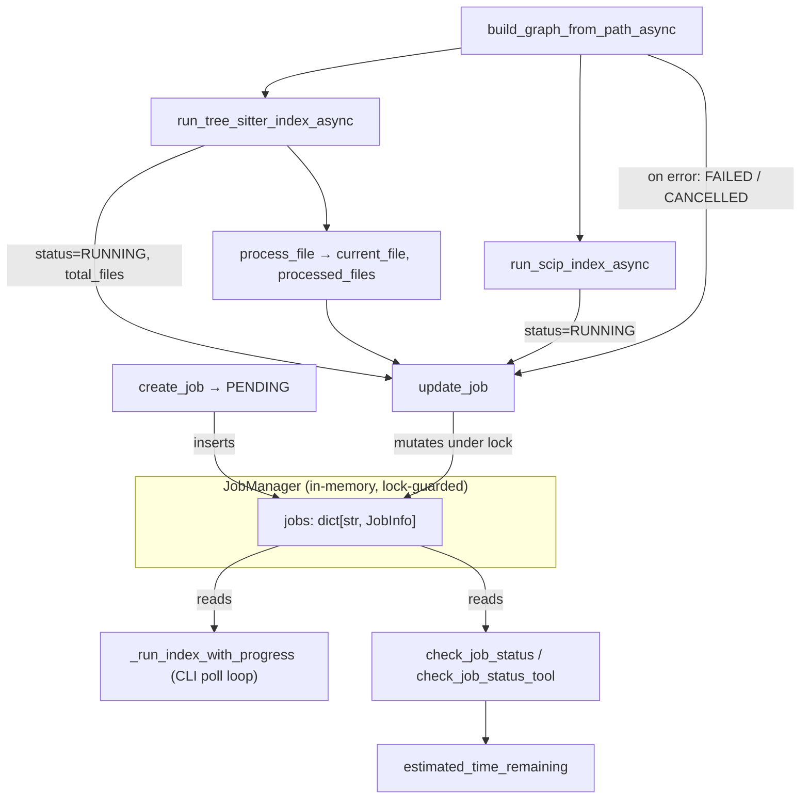

# Async job model — tracking long-running indexing as background jobs

Indexing a repository into the graph can take minutes; CodeGraphContext refuses to
make an agent (or a CLI, or the MCP server) block on it. Instead, every indexing run
is registered as a **job** — a mutable record with a status lifecycle and live
progress counters — held in a small in-memory registry. The indexer runs as an
`asyncio` task and *pushes* progress into that record; observers (a CLI progress bar,
an MCP `check_job_status` tool) *poll* the same record. Producer and observer never
call each other directly; they meet only at the shared `JobInfo`. That indirection is
the whole point: the server can fire off indexing and return a job id immediately,
then answer "how far along is it?" whenever asked.

## Overview
The subsystem is three types plus a scatter of call sites. [`JobInfo`](../catalog/src/codegraphcontext/core/jobs.md#JobInfo)
is a dataclass holding one job's entire state; [`JobStatus`](../catalog/src/codegraphcontext/core/jobs.md#JobStatus)
is the five-value lifecycle enum; and [`jobs`](../catalog/src/codegraphcontext/core/jobs.md#JobManager.jobs)
(a `job_id → JobInfo` dict guarded by [`lock`](../catalog/src/codegraphcontext/core/jobs.md#JobManager.lock))
is the registry inside `JobManager`. A run is born PENDING via
[`create_job`](../catalog/src/codegraphcontext/core/jobs.md#JobManager.create_job),
flips to [`RUNNING`](../catalog/src/codegraphcontext/core/jobs.md#JobStatus.RUNNING)
and accrues counters through [`update_job`](../catalog/src/codegraphcontext/core/jobs.md#JobManager.update_job),
and is read back by the reporting tools. The single design idea to hold onto: the job
record is a *shared mailbox* between the indexer coroutine and its observers.

## Diagram

## Design rationale (why it's built this way)
The registry is deliberately **in-memory only** — `JobManager` stores jobs in a plain
dict ([`jobs`](../catalog/src/codegraphcontext/core/jobs.md#JobManager.jobs)) with no
persistence. The consequence is baked into the tool's own error message:
[`check_job_status`](../catalog/src/codegraphcontext/tools/handlers/management_handlers.md#check_job_status)
tells the caller a missing id "may have been cleared after a server restart." Jobs are
process-lifetime state, not durable records — cheap, and adequate because a job only
needs to outlive the indexing run that spawned it.

Because indexing is CPU/IO heavy and runs on a worker thread while status is read from
the async event loop (or another thread), every touch of the registry is serialized by
a single [`lock`](../catalog/src/codegraphcontext/core/jobs.md#JobManager.lock).
[`update_job`](../catalog/src/codegraphcontext/core/jobs.md#JobManager.update_job)'s
docstring states the intent plainly: it "updates the information for a specific job in
a thread-safe manner." The lock is coarse (one mutex for the whole dict) but the
critical sections are tiny, so contention is negligible.

`update_job` is intentionally a **generic setter**: it loops over `**kwargs` and only
`setattr`s keys the job actually `hasattr`. That is why the same one method can set
`status`, `total_files`, `current_file`, `processed_files`, `status_message`,
`end_time`, and `errors` from wildly different call sites without a bespoke method per
field — and why an unknown kwarg is silently ignored rather than raising.

> [!inferred]
> The generic-setter design trades type safety for call-site convenience: a typo in a
> field name (e.g. `precessed_files=`) is dropped silently rather than flagged. The
> `hasattr` guard makes that a deliberate choice, not an oversight.

## Entry points
- [`create_job`](../catalog/src/codegraphcontext/core/jobs.md#JobManager.create_job) —
  the birth of a job. Called before indexing starts (e.g. the CLI's
  [`_run_index_with_progress`](../catalog/src/codegraphcontext/cli/cli_helpers.md#_run_index_with_progress)
  calls it first thing). It mints a UUID, constructs a
  [`JobInfo`](../catalog/src/codegraphcontext/core/jobs.md#JobInfo) in
  [`PENDING`](../catalog/src/codegraphcontext/core/jobs.md#JobStatus.PENDING) with
  `start_time=now`, files it into [`jobs`](../catalog/src/codegraphcontext/core/jobs.md#JobManager.jobs)
  under [`lock`](../catalog/src/codegraphcontext/core/jobs.md#JobManager.lock), and
  returns the id — the handle the caller uses to poll later.
- [`build_graph_from_path_async`](../catalog/src/codegraphcontext/tools/graph_builder.md#GraphBuilder.build_graph_from_path_async) —
  the indexing coroutine itself, launched (in the CLI path) as an `asyncio` task so it
  runs concurrently with the poll loop. It dispatches to the SCIP or Tree-sitter
  pipeline, and owns the *terminal* failure transition: its `except` marks the job
  [via `update_job`] as CANCELLED (missing/deleted path) or FAILED (anything else),
  stamping `end_time` and `errors`.
- [`check_job_status`](../catalog/src/codegraphcontext/tools/handlers/management_handlers.md#check_job_status)
  and [`check_job_status_tool`](../catalog/src/codegraphcontext/tools/system.md#SystemTools.check_job_status_tool) —
  the read side, reached when an agent asks "is my index done?". Both fetch the job,
  `asdict()` it, and enrich the payload with human-readable timing derived from
  [`start_time`](../catalog/src/codegraphcontext/core/jobs.md#JobInfo.start_time),
  [`status`](../catalog/src/codegraphcontext/core/jobs.md#JobInfo.status), and
  [`estimated_time_remaining`](../catalog/src/codegraphcontext/core/jobs.md#JobInfo.estimated_time_remaining).
- [`find_active_job_by_path`](../catalog/src/codegraphcontext/core/jobs.md#JobManager.find_active_job_by_path) —
  a dedup lookup: given a repo [`path`](../catalog/src/codegraphcontext/core/jobs.md#JobInfo.path),
  returns the most recent job that is still PENDING or RUNNING, so a caller can avoid
  starting a second concurrent index of the same directory.

## Mechanism (step-by-step)
1. **Register (PENDING).** A caller invokes
   [`create_job`](../catalog/src/codegraphcontext/core/jobs.md#JobManager.create_job)
   with the target path. It generates a `uuid4` id, and under
   [`lock`](../catalog/src/codegraphcontext/core/jobs.md#JobManager.lock) stores a fresh
   [`JobInfo`](../catalog/src/codegraphcontext/core/jobs.md#JobInfo) with
   [`status`](../catalog/src/codegraphcontext/core/jobs.md#JobInfo.status) =
   [`PENDING`](../catalog/src/codegraphcontext/core/jobs.md#JobStatus.PENDING),
   `start_time=datetime.now()`, and the
   [`path`](../catalog/src/codegraphcontext/core/jobs.md#JobInfo.path) /
   [`is_dependency`](../catalog/src/codegraphcontext/core/jobs.md#JobInfo.is_dependency)
   fields set. The [`job_id`](../catalog/src/codegraphcontext/core/jobs.md#JobInfo.job_id)
   is returned to the caller.
2. **Flip to RUNNING + set total.** When the pipeline actually begins,
   [`run_tree_sitter_index_async`](../catalog/src/codegraphcontext/tools/indexing/pipeline.md#run_tree_sitter_index_async)
   (or its SCIP sibling
   [`run_scip_index_async`](../catalog/src/codegraphcontext/tools/indexing/scip_pipeline.md#run_scip_index_async))
   calls [`update_job`](../catalog/src/codegraphcontext/core/jobs.md#JobManager.update_job)
   with `status=`[`RUNNING`](../catalog/src/codegraphcontext/core/jobs.md#JobStatus.RUNNING).
   The Tree-sitter path then discovers the file set and pushes `total_files=len(files)`
   — the denominator every progress readout needs.
3. **Per-file progress.** Files are parsed concurrently under a semaphore inside
   [`process_file`](../catalog/src/codegraphcontext/tools/indexing/pipeline.md#run_tree_sitter_index_async.process_file),
   which reports the file it is about to parse via `update_job(job_id, current_file=…)`.
   As each coroutine completes, the outer loop bumps `processed_files`. Later
   post-processing phases (inheritance, CALLS edges, C++/Spring/Maven passes) report
   coarse phase names through `status_message` — again all via the one
   [`update_job`](../catalog/src/codegraphcontext/core/jobs.md#JobManager.update_job)
   setter.
4. **Observe by polling.** The CLI's
   [`_run_index_with_progress`](../catalog/src/codegraphcontext/cli/cli_helpers.md#_run_index_with_progress)
   launches the indexer as an `asyncio.create_task` and, while it is not done, loops
   every 0.1s reading the job back to drive a `rich` progress bar — preferring
   `status_message` over `current_file` for the label — and breaks early if
   [`status`](../catalog/src/codegraphcontext/core/jobs.md#JobInfo.status) reaches a
   terminal value. This is the concrete expression of the push/poll split.
5. **Report on demand (MCP).** An agent calls
   [`check_job_status`](../catalog/src/codegraphcontext/tools/handlers/management_handlers.md#check_job_status)
   / [`check_job_status_tool`](../catalog/src/codegraphcontext/tools/system.md#SystemTools.check_job_status_tool).
   When the job is [`RUNNING`](../catalog/src/codegraphcontext/core/jobs.md#JobStatus.RUNNING)
   they attach an ETA from
   [`estimated_time_remaining`](../catalog/src/codegraphcontext/core/jobs.md#JobInfo.estimated_time_remaining)
   and an elapsed time from
   [`start_time`](../catalog/src/codegraphcontext/core/jobs.md#JobInfo.start_time); when
   COMPLETED they compute the actual duration; and they serialize `status.value` so the
   JSON reply is a plain string, not an enum.
6. **Terminal transition.** On any exception the indexing coroutine
   [`build_graph_from_path_async`](../catalog/src/codegraphcontext/tools/graph_builder.md#GraphBuilder.build_graph_from_path_async)
   classifies the error — a missing/deleted path becomes CANCELLED, everything else
   FAILED — and records it with `end_time` and `errors` through
   [`update_job`](../catalog/src/codegraphcontext/core/jobs.md#JobManager.update_job).
   The poll loop and the status tools see the terminal status on their next read.

## Key data structures
- [`JobInfo`](../catalog/src/codegraphcontext/core/jobs.md#JobInfo) — the whole state of
  one job: identity ([`job_id`](../catalog/src/codegraphcontext/core/jobs.md#JobInfo.job_id),
  [`path`](../catalog/src/codegraphcontext/core/jobs.md#JobInfo.path),
  [`is_dependency`](../catalog/src/codegraphcontext/core/jobs.md#JobInfo.is_dependency)),
  lifecycle ([`status`](../catalog/src/codegraphcontext/core/jobs.md#JobInfo.status),
  [`start_time`](../catalog/src/codegraphcontext/core/jobs.md#JobInfo.start_time),
  `end_time`), and progress (`total_files`, `processed_files`, `current_file`,
  `status_message`, `errors`). Two derived read-only views hang off it:
  `progress_percentage` and
  [`estimated_time_remaining`](../catalog/src/codegraphcontext/core/jobs.md#JobInfo.estimated_time_remaining),
  the latter extrapolating from average time-per-file — it deliberately returns `None`
  unless the job is [`RUNNING`](../catalog/src/codegraphcontext/core/jobs.md#JobStatus.RUNNING)
  and at least one file has been processed, so no ETA is shown before there is data to
  base it on.
- [`JobStatus`](../catalog/src/codegraphcontext/core/jobs.md#JobStatus) — the five-state
  lifecycle:
  [`PENDING`](../catalog/src/codegraphcontext/core/jobs.md#JobStatus.PENDING) →
  [`RUNNING`](../catalog/src/codegraphcontext/core/jobs.md#JobStatus.RUNNING) →
  {COMPLETED | FAILED | CANCELLED}. Its string values are what cross the tool boundary
  into JSON.
- [`jobs`](../catalog/src/codegraphcontext/core/jobs.md#JobManager.jobs) +
  [`lock`](../catalog/src/codegraphcontext/core/jobs.md#JobManager.lock) — the registry
  and its mutex. Together they are the only shared mutable state of the subsystem.

## Dynamics (design intent)
The docstrings frame the concurrency contract directly:
[`update_job`](../catalog/src/codegraphcontext/core/jobs.md#JobManager.update_job) is
"thread-safe," and the [`lock`](../catalog/src/codegraphcontext/core/jobs.md#JobManager.lock)
comment says it exists "to ensure thread-safe access to the jobs dictionary." This
matters because parsing is CPU-bound work dispatched off the event loop (the pipeline
runs `parse_file` via `asyncio.to_thread`), so the same job record is written from a
worker thread and read from the loop; the lock keeps those interleavings consistent.
[`find_active_job_by_path`](../catalog/src/codegraphcontext/core/jobs.md#JobManager.find_active_job_by_path)
does its path-resolution and sort *inside* the lock and returns the newest job whose
[`status`](../catalog/src/codegraphcontext/core/jobs.md#JobInfo.status) is still
PENDING/RUNNING — its docstring names the intent: "the most recent, currently active …
job for a given path."

## Edge cases
- **Unknown kwarg on update.** [`update_job`](../catalog/src/codegraphcontext/core/jobs.md#JobManager.update_job)
  first checks `job_id in self.jobs` and each field with `hasattr`; a stale id or a
  misspelled field is a silent no-op, never an error.
- **Job cleared after restart.** Because the registry is in-memory, a valid id can
  return "not_found";
  [`check_job_status`](../catalog/src/codegraphcontext/tools/handlers/management_handlers.md#check_job_status)
  returns `success: True` with `status: "not_found"` rather than an error wrapper, so
  the agent isn't misled into thinking the tool itself failed.
- **CANCELLED vs FAILED.** The terminal classification in
  [`build_graph_from_path_async`](../catalog/src/codegraphcontext/tools/graph_builder.md#GraphBuilder.build_graph_from_path_async)
  keys off substrings in the error message ("no such file", "deleted", "not found") —
  a deleted target is treated as a benign cancellation, not a failure.
- **No ETA yet.** [`estimated_time_remaining`](../catalog/src/codegraphcontext/core/jobs.md#JobInfo.estimated_time_remaining)
  returns `None` while `processed_files == 0`, so the status tools simply omit the ETA
  field early on rather than dividing by zero.

## Open questions
- The COMPLETED transition is not unaccounted for: it happens directly inside
  [`run_tree_sitter_index_async`](../catalog/src/codegraphcontext/tools/indexing/pipeline.md#run_tree_sitter_index_async),
  which stamps `status=COMPLETED` and `end_time` once all phases finish — separate
  from the FAILED/CANCELLED transitions, which are classified one level up in
  [`build_graph_from_path_async`](../catalog/src/codegraphcontext/tools/graph_builder.md#GraphBuilder.build_graph_from_path_async).
  `JobManager.cleanup_old_jobs` (the memory-leak guard) remains out of this packet's
  subgraph, so how/when stale jobs get evicted from the registry is still not covered
  here.
- The MCP wiring that turns an index request into a background job and hands the caller
  its [`job_id`](../catalog/src/codegraphcontext/core/jobs.md#JobInfo.job_id) is only
  partly represented here (the CLI's
  [`_run_index_with_progress`](../catalog/src/codegraphcontext/cli/cli_helpers.md#_run_index_with_progress)
  is the clearest launch site in-subgraph); the server-side add-code-to-graph handler is
  not.

## See also
- Sibling concept pages under `wiki/code/codegraphcontext/concepts/` for the indexing
  pipeline (Tree-sitter / SCIP) that produces the progress this subsystem tracks, and
  the graph-writer / MCP-tool layers.
- The repo overview: `wiki/code/codegraphcontext/overview.md`.
