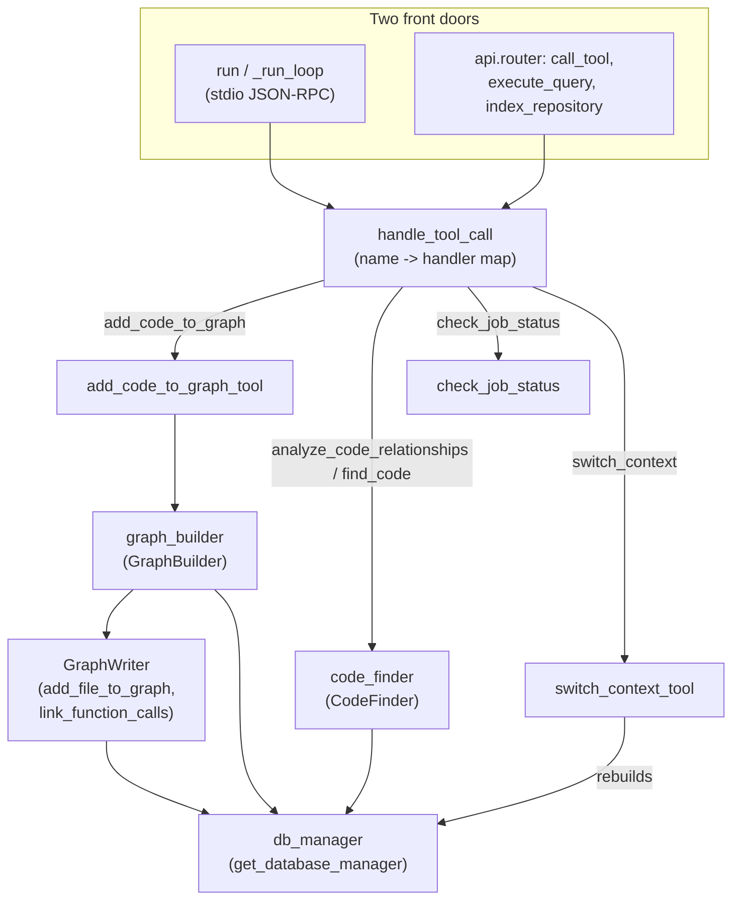

# The MCP server — exposing the code graph to an LLM agent

## Overview
This is CodeGraphContext's **query interface**: the seam where an LLM agent stops reasoning
about a codebase from raw text and starts asking a **graph database** structured questions
about it. A single class, `MCPServer`, owns four long-lived components — a
[`db_manager`](../catalog/src/codegraphcontext/server.md#MCPServer.db_manager) (the graph
store), a [`graph_builder`](../catalog/src/codegraphcontext/server.md#MCPServer.graph_builder)
(writes nodes/edges), a [`code_finder`](../catalog/src/codegraphcontext/server.md#MCPServer.code_finder)
(reads them back), and a [`code_watcher`](../catalog/src/codegraphcontext/server.md#MCPServer.code_watcher)
(keeps the graph current) — and presents them to the model as a flat menu of MCP *tools*. Every
tool call, whether it arrives over stdio JSON-RPC or over HTTP, funnels through one dispatcher,
[`handle_tool_call`](../catalog/src/codegraphcontext/server.md#MCPServer.handle_tool_call), which
maps a tool name to a thin wrapper method that injects the right component and delegates to a
functional handler. The key design idea: the *graph* is the durable state; the server is a
stateless-per-call router in front of it, so the same tool surface serves an editor's stdio MCP
client and a REST API without duplication.

## Diagram

## Design rationale (why it's built this way)
**One dispatcher, two transports.** The stdio loop
([`_run_loop`](../catalog/src/codegraphcontext/server.md#MCPServer._run_loop)) and the FastAPI
router ([`call_tool`](../catalog/src/codegraphcontext/api/router.md#call_tool)) are independent
front doors that both reduce to a single call into
[`handle_tool_call`](../catalog/src/codegraphcontext/server.md#MCPServer.handle_tool_call). This
is a deliberate choice: the HTTP endpoints are not a parallel implementation but thin adapters —
[`index_repository`](../catalog/src/codegraphcontext/api/router.md#index_repository) literally
translates an HTTP body into `handle_tool_call("add_code_to_graph", {"path": ...})`, and
[`execute_query`](../catalog/src/codegraphcontext/api/router.md#execute_query) into
`handle_tool_call("execute_cypher_query", ...)`. New tools appear on both transports for free.

**Wrappers inject, handlers compute.** The tool map in `handle_tool_call` points at bound
*wrapper* methods (`add_code_to_graph_tool`, etc.), each of which does nothing but pass the
long-lived components into a stateless functional handler
([`add_code_to_graph_tool`](../catalog/src/codegraphcontext/server.md#MCPServer.add_code_to_graph_tool)
forwards `graph_builder` and `job_manager`). Keeping the handlers as free functions that take
their dependencies explicitly is what lets a context switch swap those dependencies out from
under them (see Dynamics).

**Read and write are different objects — but not different drivers.** Writing the graph goes through
[`GraphBuilder`](../catalog/src/codegraphcontext/tools/graph_builder.md#GraphBuilder) ("Build and
manage the code graph… a high-level facade over the indexing pipeline"); reading it goes through
[`CodeFinder`](../catalog/src/codegraphcontext/tools/code_finder.md#CodeFinder) ("finding relevant
code snippets and analyzing relationships"). Each calls `get_driver()` for its own `driver` handle,
but because [`DatabaseManager`](../catalog/src/codegraphcontext/core/database.md#DatabaseManager) is
a singleton, both handles resolve to the *same* underlying driver and connection pool — so
query-side traffic and the builder's transaction bookkeeping share that one pool rather than running
on separate drivers.

**Backend is chosen once, hidden forever.** The store is picked by a factory,
[`get_database_manager`](../catalog/src/codegraphcontext/core/__init__.md#get_database_manager),
whose docstring lays out the selection ladder (runtime override → configured default → implicit
FalkorDB/Kùzu/Neo4j). Everything above it is written against a uniform manager interface, so the
same call graph and Cypher work whether the graph lives in Neo4j, FalkorDB, or Kùzu.

## Entry points
- [`run`](../catalog/src/codegraphcontext/server.md#MCPServer.run) — the stdio MCP entry. It
  starts the file watcher, then awaits [`_run_loop`](../catalog/src/codegraphcontext/server.md#MCPServer._run_loop),
  and guarantees [`shutdown`](../catalog/src/codegraphcontext/server.md#MCPServer.shutdown) runs
  on exit. This is the process an editor's MCP client spawns and speaks JSON-RPC to over
  stdin/stdout.
- [`_run_loop`](../catalog/src/codegraphcontext/server.md#MCPServer._run_loop) — the JSON-RPC
  read/dispatch loop. Control reaches it once per line on stdin; it decodes the request and
  branches on the method (`initialize`, `tools/list`, `tools/call`). The `initialize` reply
  advertises the tool capability and ships the LLM system prompt; `tools/call` is where a model's
  request becomes a graph operation.
- [`call_tool`](../catalog/src/codegraphcontext/api/router.md#call_tool),
  [`execute_query`](../catalog/src/codegraphcontext/api/router.md#execute_query),
  [`index_repository`](../catalog/src/codegraphcontext/api/router.md#index_repository),
  [`get_status`](../catalog/src/codegraphcontext/api/router.md#get_status),
  [`list_repositories`](../catalog/src/codegraphcontext/api/router.md#list_repositories) — the
  HTTP front door. Each is a FastAPI route that takes an injected `MCPServer` and forwards to the
  same handler surface, so the graph is reachable from a plain REST client as well as an MCP one.
- [`handle_tool_call`](../catalog/src/codegraphcontext/server.md#MCPServer.handle_tool_call) — the
  convergence point for both transports and the true "query interface." Every tool invocation,
  regardless of origin, is routed here to reach the graph.

## Mechanism (step-by-step)
1. **Boot and bind the graph.** On construction `MCPServer` resolves which graph store to use via
   [`resolve_context`](../catalog/src/codegraphcontext/cli/config_manager.md#resolve_context)
   (CLI flag → local `.codegraphcontext/` → global config → fallback), opens the store through
   [`get_database_manager`](../catalog/src/codegraphcontext/core/__init__.md#get_database_manager),
   and forces a connection with
   [`get_driver`](../catalog/src/codegraphcontext/core/database.md#DatabaseManager.get_driver). The
   [`graph_builder`](../catalog/src/codegraphcontext/server.md#MCPServer.graph_builder) and
   [`code_finder`](../catalog/src/codegraphcontext/server.md#MCPServer.code_finder) are both handed
   that same [`db_manager`](../catalog/src/codegraphcontext/server.md#MCPServer.db_manager)
   directly; [`code_watcher`](../catalog/src/codegraphcontext/server.md#MCPServer.code_watcher) is
   instead constructed from `graph_builder` and
   [`job_manager`](../catalog/src/codegraphcontext/server.md#MCPServer.job_manager), so it reaches
   the store only indirectly, through `graph_builder`. Either way, the whole server points at one
   store.

2. **Advertise the tool menu.** When the loop
   ([`_run_loop`](../catalog/src/codegraphcontext/server.md#MCPServer._run_loop)) receives
   `tools/list`, it returns the manifest the model uses to know what it can ask — the registered
   set that `handle_tool_call` can route. This is the model-facing catalog of graph operations
   (indexing, search, relationship analysis, complexity, watching, context, reporting).

3. **Route a tool call to a handler.**
   [`handle_tool_call`](../catalog/src/codegraphcontext/server.md#MCPServer.handle_tool_call) first
   rejects disabled tools and normalizes the `path`/`repo_path` argument aliasing, then looks the
   tool name up in a literal dict mapping names to bound wrapper methods and runs the chosen
   handler on a worker thread (`asyncio.to_thread`) because the handlers make blocking DB calls.
   This dict *is* the query interface's routing table.

4. **Indexing tools write the graph.** A `add_code_to_graph` /`add_package_to_graph` call lands on
   [`add_code_to_graph_tool`](../catalog/src/codegraphcontext/server.md#MCPServer.add_code_to_graph_tool)
   or [`add_package_to_graph_tool`](../catalog/src/codegraphcontext/server.md#MCPServer.add_package_to_graph_tool),
   which forward to the indexing handler with the shared
   [`graph_builder`](../catalog/src/codegraphcontext/server.md#MCPServer.graph_builder) and
   [`job_manager`](../catalog/src/codegraphcontext/server.md#MCPServer.job_manager). The
   [`GraphBuilder`](../catalog/src/codegraphcontext/tools/graph_builder.md#GraphBuilder) facade then
   parses files and persists them via its writer: file/repo nodes through
   [`add_file_to_graph`](../catalog/src/codegraphcontext/tools/indexing/persistence/writer.md#GraphWriter.add_file_to_graph)
   and [`add_repository_to_graph`](../catalog/src/codegraphcontext/tools/indexing/persistence/writer.md#GraphWriter.add_repository_to_graph),
   then edges through the writer's own `write_inheritance_links` and `write_function_call_groups`
   passes. That's the full-index path; the *incremental* re-index that `code_watcher` runs after a
   filesystem edit instead calls the facade's own
   [`link_function_calls`](../catalog/src/codegraphcontext/tools/graph_builder.md#GraphBuilder.link_function_calls)
   and [`link_inheritance`](../catalog/src/codegraphcontext/tools/graph_builder.md#GraphBuilder.link_inheritance)
   to patch just the changed files' edges. Because indexing is long-running it is tracked as a
   background job, so the tool returns a job id rather than blocking the loop.

5. **Query tools read the graph.** `analyze_code_relationships`, `find_code`, and
   `execute_cypher_query` route to handlers backed by
   [`code_finder`](../catalog/src/codegraphcontext/server.md#MCPServer.code_finder). Its
   [`analyze_code_relationships`](../catalog/src/codegraphcontext/tools/code_finder.md#CodeFinder.analyze_code_relationships)
   dispatches on a `query_type` string (`find_callers`, `find_callees`, `find_importers`, …), each
   branch running a Cypher traversal over the stored call/import graph via the finder's own
   [`driver`](../catalog/src/codegraphcontext/tools/code_finder.md#CodeFinder.driver). This is where
   the graph substrate pays off: "who calls X" is a one-hop `MATCH`, not a text search.

6. **Management, watching, and reporting.** Book-keeping tools route to their handlers the same
   way — [`check_job_status`](../catalog/src/codegraphcontext/tools/handlers/management_handlers.md#check_job_status)
   reports on a background indexing job (its state comes from the
   [`JobStatus`](../catalog/src/codegraphcontext/core/jobs.md#JobStatus) enum),
   [`load_bundle`](../catalog/src/codegraphcontext/tools/handlers/management_handlers.md#load_bundle)
   imports a prebuilt `.cgc` graph, and
   [`generate_report`](../catalog/src/codegraphcontext/tools/report_generator.md#generate_report)
   runs a suite of analytic Cypher queries (god nodes, complexity, dead code) into a markdown
   report. All read from or write to the one graph store.

7. **Switch which graph you're talking to.** A `switch_context` call reaches
   [`switch_context_tool`](../catalog/src/codegraphcontext/server.md#MCPServer.switch_context_tool),
   which tears down the current `db_manager`, opens a new one at the target `.codegraphcontext/db`
   path, and then **rebuilds** `graph_builder`, `code_finder`, and `code_watcher` against it. The
   tool surface stays identical; only the store behind it changes. It gates the target path with
   [`is_path_allowed`](../catalog/src/codegraphcontext/utils/path_sandbox.md#is_path_allowed) and
   can persist the choice via `save_workspace_mapping`, which records a workspace-to-context mapping
   in the CLI config — a different persistence path than the CLI's own `save_context_config`.

8. **Serialize and reply / tear down.** Back in
   [`_run_loop`](../catalog/src/codegraphcontext/server.md#MCPServer._run_loop) the handler result
   is wrapped as JSON-RPC — a `-32000` error envelope when the result carries an `"error"` key,
   otherwise a text content block (after a token-limit trim). On EOF or loop exit,
   [`shutdown`](../catalog/src/codegraphcontext/server.md#MCPServer.shutdown) stops the watcher and
   tears down the DB manager so no connection leaks.

## Key data structures
- **`self.tools` (the manifest)** — the filtered map of tool name → JSON schema definition that
  `tools/list` returns and `handle_tool_call` routes against. What isn't in this map, the model
  cannot invoke.
- **The four component handles** — [`db_manager`](../catalog/src/codegraphcontext/server.md#MCPServer.db_manager),
  [`graph_builder`](../catalog/src/codegraphcontext/server.md#MCPServer.graph_builder),
  [`code_finder`](../catalog/src/codegraphcontext/server.md#MCPServer.code_finder),
  [`code_watcher`](../catalog/src/codegraphcontext/server.md#MCPServer.code_watcher). These are the
  server's entire mutable state; a context switch replaces all four at once.
- **`resolved_context`** — the resolved DB selection whose fields (`database`,
  [`database`](../catalog/src/codegraphcontext/cli/config_manager.md#ResolvedContext.database),
  [`cgcignore_path`](../catalog/src/codegraphcontext/cli/config_manager.md#ResolvedContext.cgcignore_path))
  record which graph store this server instance is bound to.
- **`JobManager` / [`JobStatus`](../catalog/src/codegraphcontext/core/jobs.md#JobStatus)** — the
  background-job registry that lets long indexing runs return immediately and be polled, held on
  [`job_manager`](../catalog/src/codegraphcontext/server.md#MCPServer.job_manager).

## Dynamics (design intent)
The stdio loop is single-threaded and sequential — it reads one line, dispatches, replies — but
each blocking handler is offloaded to a thread via `asyncio.to_thread`, so a slow Cypher query
doesn't stall the event loop. Indexing never runs inline: the indexing tools hand work to the
[`job_manager`](../catalog/src/codegraphcontext/server.md#MCPServer.job_manager) and return a job
id, and [`_run_loop`](../catalog/src/codegraphcontext/server.md#MCPServer._run_loop) periodically
prunes old jobs. Writes into the store go through a retry-aware transaction wrapper
([`execute_write_operation`](../catalog/src/codegraphcontext/tools/indexing/persistence/utils.md#execute_write_operation),
which uses managed transactions on Neo4j and a plain session elsewhere), reflecting that the graph
backend is pluggable and its transaction semantics vary
([`get_backend_type`](../catalog/src/codegraphcontext/tools/indexing/persistence/utils.md#get_backend_type)
resolves which one is live). The singleton
[`DatabaseManager`](../catalog/src/codegraphcontext/core/database.md#DatabaseManager) exists so one
connection pool is shared across the builder and finder threads rather than each opening its own.

## Edge cases
- **Argument aliasing.** [`handle_tool_call`](../catalog/src/codegraphcontext/server.md#MCPServer.handle_tool_call)
  bridges the `path`/`repo_path` mismatch between tool schemas and handlers, but *skips* the
  `repo_path → path` direction for `calculate_cyclomatic_complexity`, where the two keys mean
  different things (file path vs. repo filter). A blind alias there would misroute the query.
- **Disabled tools.** Tools listed in `mcp.json`'s `disabledTools` are stripped from the manifest
  and rejected by [`handle_tool_call`](../catalog/src/codegraphcontext/server.md#MCPServer.handle_tool_call)
  even if the model asks for them.
- **Global vs. per-repo switch.**
  [`switch_context_tool`](../catalog/src/codegraphcontext/server.md#MCPServer.switch_context_tool)
  deliberately does *not* call
  [`resolve_context`](../catalog/src/codegraphcontext/cli/config_manager.md#resolve_context) when
  switching back to `global`, because resolution would re-detect a local `.codegraphcontext/` in
  the CWD and return per-repo instead — so it computes the global DB path directly.
- **Sandbox refusal.** A context path or bundle path outside the allowed roots is rejected up front
  by [`is_path_allowed`](../catalog/src/codegraphcontext/utils/path_sandbox.md#is_path_allowed);
  the tool returns an error rather than touching the filesystem.

## Open questions
- The exact tool schemas (the `TOOLS` manifest) and the LLM system prompt shipped in the
  `initialize` reply are referenced by the loop but their definitions are outside this packet's
  subgraph — they'd be the place to see the full model-facing contract.
- How the `CodeWatcher` translates a filesystem event into an incremental re-index (and whether it
  reuses the same job pipeline) is only visible from the `code_watcher` handle here; the watcher's
  internals are out of scope for this page.

## See also
- The catalog entries under `../catalog/src/codegraphcontext/server.md` for the full `MCPServer`
  surface (every tool wrapper).
- [`GraphBuilder`](../catalog/src/codegraphcontext/tools/graph_builder.md#GraphBuilder) and
  [`CodeFinder`](../catalog/src/codegraphcontext/tools/code_finder.md#CodeFinder) — the write and
  read sides of the graph this server fronts.
- [`resolve_context`](../catalog/src/codegraphcontext/cli/config_manager.md#resolve_context),
  [`load_config`](../catalog/src/codegraphcontext/cli/config_manager.md#load_config),
  [`load_context_config`](../catalog/src/codegraphcontext/cli/config_manager.md#load_context_config)
  — the configuration layer that decides which graph store a server binds to.
</content>
</invoke>
