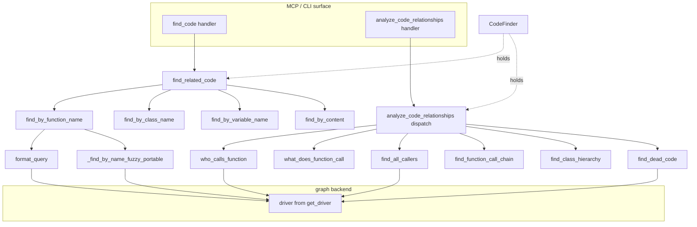

# CodeFinder: the query interface over the code graph

<!-- connect:up:begin -->
> **Cross-repo concept:** part of [symbol-graph](../../../concepts/symbol-graph.md) across this wiki's repos.
<!-- connect:up:end -->
## Overview
CodeFinder is the **read side** of CodeGraphContext: once the indexer has parsed a codebase into a
property graph of `Function` / `Class` / `Variable` / `Module` / `File` / `Parameter` / `Repository`
nodes joined by `CALLS`, `IMPORTS`, `INHERITS`, `CONTAINS`, and `HAS_PARAMETER` edges, every question an
agent can ask — *who calls X, what does X call, who imports this module, what overrides this method, what
is dead, what is most complex, find code related to "auth"* — is answered here as a Cypher query against
that graph. The [`CodeFinder`](../catalog/src/codegraphcontext/tools/code_finder.md#CodeFinder) class is a
thin facade: each public method opens a driver session, runs one (occasionally two) parameterized Cypher
statements, and returns plain dicts. There is no in-process traversal engine — **the graph database is the
query engine**, and CodeFinder's job is to compose the right Cypher for the right question and normalize
the rows. Two method families matter: a *retrieval* family (fuzzy name/content search that ranks candidate
snippets) and a *relationship* family (structural traversals), unified behind one string-keyed dispatcher,
[`analyze_code_relationships`](../catalog/src/codegraphcontext/tools/code_finder.md#CodeFinder.analyze_code_relationships).

## Diagram

## Design rationale (why it's built this way)

**One dispatcher, "fixed return types."** The relationship family is not exposed as fifteen separate MCP
tools; instead [`analyze_code_relationships`](../catalog/src/codegraphcontext/tools/code_finder.md#CodeFinder.analyze_code_relationships)
takes a `query_type` string and routes it to the matching traversal, wrapping each result in a stable
envelope (`query_type`, `target`, `results`, a human-readable `summary`). Its docstring states the intent
directly — *"Main method to analyze different types of code relationships with fixed return types."* The
payoff is a single, small tool schema for the LLM: the model picks a `query_type` from an enumerated list
rather than choosing among many near-identical tools, and unknown types return an `error` that *lists* the
supported types, so the model can self-correct. Several types are aliased (`class_hierarchy` /
`inheritance` / `extends`; `dead_code` / `unused` / `unreachable`) to absorb natural-language variation.

**Backend portability is a first-class concern, not an afterthought.** The graph can live in Neo4j,
FalkorDB, or KùzuDB, and they disagree on full-text search. CodeFinder computes
[`_lacks_native_fulltext`](../catalog/src/codegraphcontext/tools/code_finder.md#CodeFinder._lacks_native_fulltext)
once at construction (true for anything that is not `neo4j`) and branches on it everywhere retrieval
happens. On Neo4j it emits `CALL db.index.fulltext.queryNodes("code_search_index", ...)` with Lucene fuzzy
syntax (`term~2`); on portable backends it falls back to pure-Cypher `toLower(...) CONTAINS ...` plus an
in-process Levenshtein rescan. This is why [`format_query`](../catalog/src/codegraphcontext/tools/code_finder.md#CodeFinder.format_query)
and [`_find_by_content_falkordb`](../catalog/src/codegraphcontext/tools/code_finder.md#CodeFinder._find_by_content_falkordb)
exist as separate code paths rather than one query string.

**Depth is interpolated into Cypher, so it is sanitized.** Variable-length path queries embed the depth
bound directly into the query text (`[:CALLS*1..3]`), which cannot be a bound parameter. To keep that safe
and bounded, [`_sanitize_depth`](../catalog/src/codegraphcontext/tools/code_finder.md#_sanitize_depth)
coerces and clamps the value before it is spliced in — its docstring calls it "*coerce and clamp a
traversal depth before interpolating it into Cypher*."

> [!inferred]
> Every traversal ends in `LIMIT` (20, 50, or 100) and most `ORDER BY is_dependency ASC` — this is an LLM-
> context-budget discipline: results are capped and first-party code is surfaced above vendored
> dependencies so the most relevant rows survive truncation. The `is_dependency` flag being a sort key on
> nearly every query strongly implies it is set at index time specifically to serve this ranking.

## Entry points

- **[`find_related_code`](../catalog/src/codegraphcontext/tools/code_finder.md#CodeFinder.find_related_code)** — reached when the agent asks "find code about X." Its MCP wrapper
  [`find_code`](../catalog/src/codegraphcontext/tools/handlers/analysis_handlers.md#find_code) passes the raw query, a `fuzzy_search` flag, and an `edit_distance`; this is the retrieval front door that fans out across name and content strategies and ranks the union.
- **[`analyze_code_relationships`](../catalog/src/codegraphcontext/tools/code_finder.md#CodeFinder.analyze_code_relationships)** — the relationship front door, reached via its handler
  [`analyze_code_relationships`](../catalog/src/codegraphcontext/tools/handlers/analysis_handlers.md#analyze_code_relationships) (which validates `query_type`/`target` and clamps `depth` to 1..20 before delegating). Every structural question flows through here.
- **[`code_finder`](../catalog/src/codegraphcontext/server.md#MCPServer.code_finder)** — the single live `CodeFinder` instance the MCP server holds. [`switch_context_tool`](../catalog/src/codegraphcontext/server.md#MCPServer.switch_context_tool) rebuilds it (`self.code_finder = CodeFinder(self.db_manager)`) whenever the active repo/database context changes, so all queries retarget the new graph atomically.
- **[`_initialize_services`](../catalog/src/codegraphcontext/cli/cli_helpers.md#_initialize_services)** — the CLI's construction path; it resolves the context, builds a `DatabaseManager`, and returns a `CodeFinder` alongside the graph builder, so the same query surface backs `cgc` CLI commands and the MCP server.
- The dedicated analysis tools — [`find_dead_code`](../catalog/src/codegraphcontext/tools/handlers/analysis_handlers.md#find_dead_code), [`find_most_complex_functions`](../catalog/src/codegraphcontext/tools/handlers/analysis_handlers.md#find_most_complex_functions), [`calculate_cyclomatic_complexity`](../catalog/src/codegraphcontext/tools/handlers/analysis_handlers.md#calculate_cyclomatic_complexity), [`find_java_spring_endpoints`](../catalog/src/codegraphcontext/tools/handlers/analysis_handlers.md#find_java_spring_endpoints), [`find_java_spring_beans`](../catalog/src/codegraphcontext/tools/handlers/analysis_handlers.md#find_java_spring_beans), [`find_datasource_nodes`](../catalog/src/codegraphcontext/tools/handlers/analysis_handlers.md#find_datasource_nodes) — are thin wrappers exposing individual `CodeFinder` methods as first-class MCP tools when a caller wants them directly rather than via the dispatcher.

## Mechanism (step-by-step)

1. **Acquire the driver, detect the backend.** On construction, `CodeFinder` pulls a shared connection from
   its [`db_manager`](../catalog/src/codegraphcontext/tools/code_finder.md#CodeFinder.db_manager) via
   [`get_driver`](../catalog/src/codegraphcontext/core/database.md#DatabaseManager.get_driver) and caches it as
   [`driver`](../catalog/src/codegraphcontext/tools/code_finder.md#CodeFinder.driver). Because
   [`DatabaseManager`](../catalog/src/codegraphcontext/core/database.md#DatabaseManager) is a thread-safe
   singleton (double-checked locking around [`_driver`](../catalog/src/codegraphcontext/core/database.md#DatabaseManager._driver)),
   every CodeFinder shares one connection pool; `get_driver` also does a lightweight
   [`check_port_reachable`](../catalog/src/codegraphcontext/core/database.md#DatabaseManager.check_port_reachable)
   preflight against [`neo4j_uri`](../catalog/src/codegraphcontext/core/database.md#DatabaseManager.neo4j_uri)
   (and logs via [`info_logger`](../catalog/src/codegraphcontext/utils/debug_log.md#info_logger) /
   [`error_logger`](../catalog/src/codegraphcontext/utils/debug_log.md#error_logger)) so a query never blocks
   on a dead endpoint. The backend-capability flag `_lacks_native_fulltext` is set here and steers every
   later branch.

2. **Retrieval: fan out, then rank.** [`find_related_code`](../catalog/src/codegraphcontext/tools/code_finder.md#CodeFinder.find_related_code)
   runs four searches in parallel conceptually — [`find_by_function_name`](../catalog/src/codegraphcontext/tools/code_finder.md#CodeFinder.find_by_function_name),
   [`find_by_class_name`](../catalog/src/codegraphcontext/tools/code_finder.md#CodeFinder.find_by_class_name),
   [`find_by_variable_name`](../catalog/src/codegraphcontext/tools/code_finder.md#CodeFinder.find_by_variable_name),
   and [`find_by_content`](../catalog/src/codegraphcontext/tools/code_finder.md#CodeFinder.find_by_content) —
   then merges the rows, tags each with a `search_type`, assigns a hard-coded `relevance_score` (function-
   name hits 0.9, class 0.8, variable 0.7, content 0.6, each discounted if `is_dependency`), sorts
   descending, and returns the top 15 as `ranked_results`. The query text itself is preprocessed per
   backend: for Lucene it splits `snake_case` on `_` and appends the `~edit_distance` fuzzy modifier; for
   portable backends it passes the verbatim identifier so the portable matcher can normalize it.

3. **Name lookup dispatches on backend.** Each `find_by_*_name` method has three modes. Exact (`fuzzy_search`
   false) is a direct label+`{name: $name}` match. Fuzzy on Neo4j delegates to
   [`format_query`](../catalog/src/codegraphcontext/tools/code_finder.md#CodeFinder.format_query), which
   builds the full-text `queryNodes` call. Fuzzy on a portable backend delegates to
   [`_find_by_name_fuzzy_portable`](../catalog/src/codegraphcontext/tools/code_finder.md#CodeFinder._find_by_name_fuzzy_portable),
   which scans up to 20 000 candidate nodes and scores each by the *minimum* Levenshtein distance between
   the raw lowercased query and its separator-stripped form vs. the same two forms of the stored name —
   deliberately so a camelCase query matches a snake_case symbol without distance inflation. Content search
   mirrors this split: `find_by_content` uses the full-text index on Neo4j and
   [`_find_by_content_falkordb`](../catalog/src/codegraphcontext/tools/code_finder.md#CodeFinder._find_by_content_falkordb)
   does per-label `CONTAINS` matching on name/source/docstring elsewhere.

4. **Relationship dispatch.** [`analyze_code_relationships`](../catalog/src/codegraphcontext/tools/code_finder.md#CodeFinder.analyze_code_relationships)
   lowercases and strips the `query_type`, then routes to exactly one traversal method and wraps its result
   with a summary. This is a flat `if/elif` ladder mapping ~20 accepted type strings (including aliases)
   onto the methods below; an unrecognized type returns the enumerated `supported_types` list, and the
   whole body is wrapped in a try/except that converts any driver error into a structured `error` dict
   rather than raising.

5. **Call-graph traversals.** *Direct* edges: [`who_calls_function`](../catalog/src/codegraphcontext/tools/code_finder.md#CodeFinder.who_calls_function)
   matches `(caller)-[:CALLS]->(target:Function {name})` (with a fallback that drops the `path` constraint
   if the precise match is empty), and [`what_does_function_call`](../catalog/src/codegraphcontext/tools/code_finder.md#CodeFinder.what_does_function_call)
   walks the same edge outward. *Transitive* edges: [`find_all_callers`](../catalog/src/codegraphcontext/tools/code_finder.md#CodeFinder.find_all_callers)
   and [`find_all_callees`](../catalog/src/codegraphcontext/tools/code_finder.md#CodeFinder.find_all_callees)
   use variable-length `[:CALLS*1..depth]` paths (depth first passed through
   [`_sanitize_depth`](../catalog/src/codegraphcontext/tools/code_finder.md#_sanitize_depth)),
   unwinding each path's relationships into distinct caller→callee edges. [`find_function_call_chain`](../catalog/src/codegraphcontext/tools/code_finder.md#CodeFinder.find_function_call_chain)
   finds shortest `[:CALLS*1..max_depth]` paths between two named functions and materializes the node/rel
   objects into plain dicts (defensively, since Kùzu and Neo4j wrap path elements differently).

6. **Structure & usage traversals.** [`find_class_hierarchy`](../catalog/src/codegraphcontext/tools/code_finder.md#CodeFinder.find_class_hierarchy)
   runs three queries over `[:INHERITS]` and `[:CONTAINS]` to return a class's parents, children, and
   methods; [`find_function_overrides`](../catalog/src/codegraphcontext/tools/code_finder.md#CodeFinder.find_function_overrides)
   finds every `Class -[:CONTAINS]-> Function` sharing a name (i.e. implementations of the same method
   across classes). Parameter/decorator queries — [`find_functions_by_argument`](../catalog/src/codegraphcontext/tools/code_finder.md#CodeFinder.find_functions_by_argument)
   (over `[:HAS_PARAMETER]`) and [`find_functions_by_decorator`](../catalog/src/codegraphcontext/tools/code_finder.md#CodeFinder.find_functions_by_decorator)
   (over the `decorators` list property) — answer "what uses this argument/decorator." Import and variable
   scope come from [`who_imports_module`](../catalog/src/codegraphcontext/tools/code_finder.md#CodeFinder.who_imports_module)
   and [`find_module_dependencies`](../catalog/src/codegraphcontext/tools/code_finder.md#CodeFinder.find_module_dependencies)
   over `[:IMPORTS]`, and [`who_modifies_variable`](../catalog/src/codegraphcontext/tools/code_finder.md#CodeFinder.who_modifies_variable)
   / [`find_variable_usage_scope`](../catalog/src/codegraphcontext/tools/code_finder.md#CodeFinder.find_variable_usage_scope)
   over `Variable` containment.

7. **Health / metric queries.** [`find_dead_code`](../catalog/src/codegraphcontext/tools/code_finder.md#CodeFinder.find_dead_code)
   finds first-party functions with zero non-dependency `CALLS` in-edges, excluding entry-point-shaped names
   (`main`, `test_`, dunders, decorator-excluded) and paths filtered by
   [`cypher_path_not_under_ignore_dirs`](../catalog/src/codegraphcontext/utils/path_ignore.md#cypher_path_not_under_ignore_dirs)
   — its own note admits results "*might be unused, but could be entry points, callbacks, or called
   dynamically.*" [`find_most_complex_functions`](../catalog/src/codegraphcontext/tools/code_finder.md#CodeFinder.find_most_complex_functions)
   and [`get_cyclomatic_complexity`](../catalog/src/codegraphcontext/tools/code_finder.md#CodeFinder.get_cyclomatic_complexity)
   read a precomputed `cyclomatic_complexity` node property; [`list_indexed_repositories`](../catalog/src/codegraphcontext/tools/code_finder.md#CodeFinder.list_indexed_repositories)
   enumerates `Repository` nodes; and [`audit_kotlin_call_ambiguity`](../catalog/src/codegraphcontext/tools/code_finder.md#CodeFinder.audit_kotlin_call_ambiguity)
   surfaces multi-target Kotlin `CALLS` edges where static resolution was uncertain.

## Key data structures
- **The property graph** is the real data structure — CodeFinder holds no index of its own beyond the
  cached [`driver`](../catalog/src/codegraphcontext/tools/code_finder.md#CodeFinder.driver). Node labels
  (`Function`, `Class`, `Variable`, `Module`, `File`, `Parameter`, `Repository`) and edges (`CALLS`,
  `IMPORTS`, `INHERITS`, `CONTAINS`, `HAS_PARAMETER`) carry properties every query reads: `name`, `path`,
  `line_number`, `source`, `docstring`, `is_dependency`, `decorators`, `cyclomatic_complexity`.
- **The result envelope.** Retrieval returns `{query, functions_by_name, classes_by_name, ...,
  ranked_results, total_matches}`; relationship queries return `{query_type, target, results, summary}`.
  Both are plain JSON-serializable dicts, so the same shapes serve MCP and CLI.
- **[`_lacks_native_fulltext`](../catalog/src/codegraphcontext/tools/code_finder.md#CodeFinder._lacks_native_fulltext)** is the one piece of durable per-instance state that changes query construction; treat it as the backend-capability switch.

## Dynamics (design intent)
The [`DatabaseManager`](../catalog/src/codegraphcontext/core/database.md#DatabaseManager) singleton exists
precisely so concurrent queries (MCP is async; CLI is sync) share one connection pool — its docstring says
the pattern "*is crucial for performance and resource management in a multi-threaded or asynchronous
application*," and [`get_driver`](../catalog/src/codegraphcontext/core/database.md#DatabaseManager.get_driver)
guards creation with double-checked locking. Each CodeFinder call takes a fresh `driver.session()`, so
queries are independent units of work with no shared mutable state on the finder itself. Context switching
is the one lifecycle event that matters: [`switch_context_tool`](../catalog/src/codegraphcontext/server.md#MCPServer.switch_context_tool)
tears down the old manager and reassigns [`code_finder`](../catalog/src/codegraphcontext/server.md#MCPServer.code_finder),
which is why in-flight assumptions about which graph is "current" must go through the server-held instance.

## Edge cases
- **Backend without full-text.** All fuzzy/content paths silently reroute through the portable Cypher +
  Levenshtein code; the unbounded portable name scan is capped at 20 000 candidates in
  [`_find_by_name_fuzzy_portable`](../catalog/src/codegraphcontext/tools/code_finder.md#CodeFinder._find_by_name_fuzzy_portable)
  when no `repo_path` narrows it.
- **Path vs. no path.** Traversals like [`who_calls_function`](../catalog/src/codegraphcontext/tools/code_finder.md#CodeFinder.who_calls_function)
  first try an exact `{name, path}` match and only fall back to name-only if that returns nothing — so an
  imprecise `path` degrades gracefully instead of returning empty.
- **Depth clamping.** A caller can request any `depth`; the handler clamps to 1..20 and
  [`_sanitize_depth`](../catalog/src/codegraphcontext/tools/code_finder.md#_sanitize_depth) clamps
  again before interpolation, so a runaway variable-length path is impossible.
- **Dead-code false positives** are expected by design — dynamically dispatched or externally invoked
  functions look uncalled; [`find_dead_code`](../catalog/src/codegraphcontext/tools/code_finder.md#CodeFinder.find_dead_code) attaches a caveat note rather than asserting.
- **Query errors don't propagate.** [`analyze_code_relationships`](../catalog/src/codegraphcontext/tools/code_finder.md#CodeFinder.analyze_code_relationships) wraps everything in try/except and returns an `error` dict, so a malformed target or driver hiccup yields a structured failure, not a crash.

## Open questions
- Result caps (`LIMIT 20/50/100/15`) are hard-coded per query; there is no visible paging cursor, so how a
  caller retrieves matches beyond the cap is not settled by this packet.
- The `relevance_score` weights in [`find_related_code`](../catalog/src/codegraphcontext/tools/code_finder.md#CodeFinder.find_related_code)
  are constants, not learned or tuned; whether they were calibrated against anything is not evident from the
  source.
- Fuzzy variable search is explicitly *not* supported (variables bypass the full-text index); whether that
  is a deliberate scoping choice or a known gap is unclear.

## See also
- `../overview.md` — how the retrieval and relationship families fit the full index → store → query pipeline.
- Sibling concept pages on the indexing/graph-building side (the write path that populates the `CALLS`/`INHERITS`/`IMPORTS`/`CONTAINS` edges this page queries).
- Top-level `wiki/concepts/symbol-graph.md` — the cross-repo view of how the surveyed tools each expose a symbol/call graph and its query interface.
