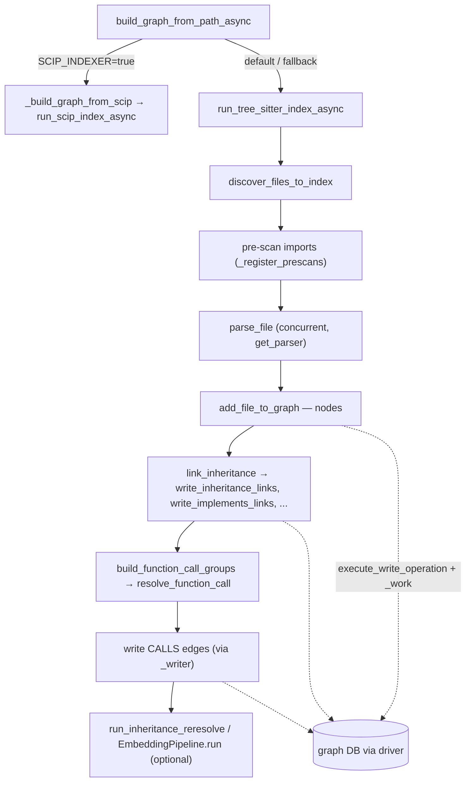

# GraphBuilder — turning a repo into a queryable code graph

<!-- connect:up:begin -->
> **Cross-repo concept:** part of [incremental-reconcile](../../../concepts/incremental-reconcile.md), [multi-language-extraction](../../../concepts/multi-language-extraction.md), [scip-grounding](../../../concepts/scip-grounding.md), [symbol-graph](../../../concepts/symbol-graph.md) across this wiki's repos.
<!-- connect:up:end -->
## Overview
`GraphBuilder` is CodeGraphContext's ingestion facade: it takes a directory of source and turns it into a persistent property graph — `Function`, `Class`, `File`, `Repository` nodes joined by `CALLS`, `INHERITS`, `IMPLEMENTS`, `DECORATED_BY` and a dozen more edge types — living in a graph database (Neo4j / FalkorDB / Kùzu). That graph is the *grounding substrate* an LLM agent later queries through the MCP server, so it is the answer to "how does this tool represent a codebase". The single key design idea is a **two-phase pipeline**: parse every file *independently and concurrently* into a language-neutral dict of extracted symbols, then run a **whole-repo resolution pass** that stitches those isolated facts into cross-file `CALLS` and `INHERITS` edges — because call/inheritance targets can only be resolved once every file's symbols are known. [`GraphBuilder`](../catalog/src/codegraphcontext/tools/graph_builder.md#GraphBuilder) is deliberately a thin orchestrator: it owns a database [`driver`](../catalog/src/codegraphcontext/tools/graph_builder.md#GraphBuilder.driver) and a [`_writer`](../catalog/src/codegraphcontext/tools/graph_builder.md#GraphBuilder._writer), but delegates the heavy lifting to free functions in the `indexing/` package.

## Diagram

## Design rationale (why it's built this way)

**Parse concurrently, write in sorted order.** Files are parsed under an `asyncio.Semaphore`, but the graph writes that follow are done over `sorted(all_file_data, ...)`. The pipeline comment states the reason directly: *"Parsing remains concurrent, but graph writes are ordered so shared nodes such as imported modules receive deterministic canonical metadata."* Parsing is CPU-bound and embarrassingly parallel; writing touches shared nodes (an imported module referenced by many files) where nondeterministic ordering would produce nondeterministic node properties. [`add_file_to_graph`](../catalog/src/codegraphcontext/tools/indexing/persistence/writer.md#GraphWriter.add_file_to_graph) uses `MERGE` (upsert) precisely so repeated touches of a shared node converge.

**Resolution is a separate, later phase because it needs global knowledge.** A call `foo.bar()` in file A can only be pointed at a definition once the symbols of every file are indexed. Hence [`build_function_call_groups`](../catalog/src/codegraphcontext/tools/indexing/resolution/calls.md#build_function_call_groups) runs *after* all nodes are written, consuming an `imports_map` built by a pre-scan pass and the full `all_file_data`. Its docstring — *"Resolve all function calls and return grouped CALLS payloads"* — captures that it batches results by edge shape (fn→fn, fn→class, file→fn, …) so the writer can emit label-specific Cypher in few round-trips.

**SCIP when available, Tree-sitter always.** [`build_graph_from_path_async`](../catalog/src/codegraphcontext/tools/graph_builder.md#GraphBuilder.build_graph_from_path_async) treats a compiler-grade SCIP index as the *preferred* source of truth and Tree-sitter as the universal fallback. If `SCIP_INDEXER=true` (read via [`get_config_value`](../catalog/src/codegraphcontext/cli/config_manager.md#get_config_value)) and a `scip-<lang>` binary exists, it delegates to [`_build_graph_from_scip`](../catalog/src/codegraphcontext/tools/graph_builder.md#GraphBuilder._build_graph_from_scip); on *any* failure it logs via [`warning_logger`](../catalog/src/codegraphcontext/utils/debug_log.md#warning_logger) and falls through to [`run_tree_sitter_index_async`](../catalog/src/codegraphcontext/tools/indexing/pipeline.md#run_tree_sitter_index_async). This is the tool's answer to the precision/coverage tradeoff: SCIP gives compiler-accurate cross-references but needs toolchain setup (e.g. `compile_commands.json` for C/C++), whereas Tree-sitter parses anything and resolves heuristically.

**Backend-agnostic persistence.** Every write goes through [`execute_write_operation`](../catalog/src/codegraphcontext/tools/indexing/persistence/utils.md#execute_write_operation), which branches on [`get_backend_type`](../catalog/src/codegraphcontext/tools/indexing/persistence/utils.md#get_backend_type): Neo4j gets managed transactions (`execute_write`, with automatic retry on transient errors), other backends get a plain session. This lets the same `GraphWriter` code target Neo4j, FalkorDB, or Kùzu without per-backend branches in the graph logic itself.

## Entry points
- [`build_graph_from_path_async`](../catalog/src/codegraphcontext/tools/graph_builder.md#GraphBuilder.build_graph_from_path_async) — the one true ingestion entry. Every code path (CLI index command, MCP `add_code_to_graph` tool, watcher rebuild) eventually calls this coroutine with a `Path`. It picks SCIP vs Tree-sitter, wraps the whole run in a try/except that maps errors onto a [`JobStatus`](../catalog/src/codegraphcontext/core/jobs.md#JobStatus) (`CANCELLED` for missing/deleted files, else `FAILED`) via [`update_job`](../catalog/src/codegraphcontext/core/jobs.md#JobManager.update_job).
- [`GraphBuilder`](../catalog/src/codegraphcontext/tools/graph_builder.md#GraphBuilder) — the object itself. Its constructor acquires the DB [`driver`](../catalog/src/codegraphcontext/tools/graph_builder.md#GraphBuilder.driver), builds the [`_writer`](../catalog/src/codegraphcontext/tools/graph_builder.md#GraphBuilder._writer), and fixes the extension→language `parsers` map that defines which languages the tool can extract.
- [`_initialize_services`](../catalog/src/codegraphcontext/cli/cli_helpers.md#_initialize_services) and [`_run_index_with_progress`](../catalog/src/codegraphcontext/cli/cli_helpers.md#_run_index_with_progress) — the CLI seam. `_initialize_services` constructs the `GraphBuilder` (and `JobManager`) for a resolved context/database; `_run_index_with_progress` creates a job and drives `build_graph_from_path_async` under a Rich progress bar, polling job state.
- [`graph_builder`](../catalog/src/codegraphcontext/server.md#MCPServer.graph_builder) and [`switch_context_tool`](../catalog/src/codegraphcontext/server.md#MCPServer.switch_context_tool) — the MCP-server seam. The server holds a `GraphBuilder` instance; switching context tears down the DB manager and rebuilds a fresh `GraphBuilder` against the new database, which is how one server process serves multiple indexed repos.
- [`_initial_scan`](../catalog/src/codegraphcontext/core/watcher.md#RepositoryEventHandler._initial_scan), [`synchronize_with_disk`](../catalog/src/codegraphcontext/core/watcher.md#RepositoryEventHandler.synchronize_with_disk), and [`_handle_modification`](../catalog/src/codegraphcontext/core/watcher.md#RepositoryEventHandler._handle_modification) — the live-update seam. These reuse `GraphBuilder`'s parse/link primitives to keep the graph current as files change (see *Incremental reconcile* below).

## Mechanism (step-by-step)

1. **Construction wires the graph store.** The [`GraphBuilder`](../catalog/src/codegraphcontext/tools/graph_builder.md#GraphBuilder) constructor calls `db_manager.get_driver()` to obtain the [`driver`](../catalog/src/codegraphcontext/tools/graph_builder.md#GraphBuilder.driver) and constructs a `GraphWriter` as [`_writer`](../catalog/src/codegraphcontext/tools/graph_builder.md#GraphBuilder._writer). It also freezes the `parsers` dict mapping ~25 file extensions to Tree-sitter language names (`.py→python`, `.ts→typescript`, `.go→go`, `.rs→rust`, `.cs→c_sharp`, …) — this map *is* the tool's declared multi-language surface, and its keys later bound file discovery.

2. **The DB driver is a shared singleton.** [`get_driver`](../catalog/src/codegraphcontext/core/database.md#DatabaseManager.get_driver) on [`DatabaseManager`](../catalog/src/codegraphcontext/core/database.md#DatabaseManager) lazily creates one driver under a lock (double-checked), validates credentials, and *fast-fails on an unreachable host* before building a full Neo4j driver. The class is an explicit singleton so one connection pool is shared across the async/threaded pipeline. The `GraphWriter` holds the same [`driver`](../catalog/src/codegraphcontext/tools/indexing/persistence/writer.md#GraphWriter.driver) plus a [`_db_manager`](../catalog/src/codegraphcontext/tools/indexing/persistence/writer.md#GraphWriter._db_manager) reference used to detect the backend.

3. **The entry coroutine chooses an indexer.** [`build_graph_from_path_async`](../catalog/src/codegraphcontext/tools/graph_builder.md#GraphBuilder.build_graph_from_path_async) reads `SCIP_INDEXER` / `SCIP_LANGUAGES` via [`get_config_value`](../catalog/src/codegraphcontext/cli/config_manager.md#get_config_value), detects the project language, and if a matching SCIP binary is available delegates to [`_build_graph_from_scip`](../catalog/src/codegraphcontext/tools/graph_builder.md#GraphBuilder._build_graph_from_scip) → [`run_scip_index_async`](../catalog/src/codegraphcontext/tools/indexing/scip_pipeline.md#run_scip_index_async) (whose docstring: *"Run SCIP CLI, write graph, supplement with Tree-sitter, write SCIP CALLS edges"*). Otherwise — or on any SCIP exception — it calls [`run_tree_sitter_index_async`](../catalog/src/codegraphcontext/tools/indexing/pipeline.md#run_tree_sitter_index_async), passing bound method references (`self.parse_file`, `self.get_parser`, `self.add_minimal_file_node`) so the free-function pipeline can call back into the builder.

4. **Discover, then pre-scan for imports.** [`run_tree_sitter_index_async`](../catalog/src/codegraphcontext/tools/indexing/pipeline.md#run_tree_sitter_index_async) first writes the `Repository` node via [`add_repository_to_graph`](../catalog/src/codegraphcontext/tools/indexing/persistence/writer.md#GraphWriter.add_repository_to_graph) (which stores the git commit hash and `indexed_at`, making the graph a *pinned* snapshot), then calls [`discover_files_to_index`](../catalog/src/codegraphcontext/tools/indexing/discovery.md#discover_files_to_index) — filtered by `.cgcignore` and by the `parsers.keys()` extension set so it never walks tens of thousands of irrelevant files. A pre-scan pass (per-language scanners registered by [`_register_prescans`](../catalog/src/codegraphcontext/tools/indexing/pre_scan.md#_register_prescans)) builds the `imports_map` — the global name→definition table that the later resolution phase depends on.

5. **Parse each file concurrently into language-neutral facts.** Files are parsed under a semaphore; each goes through [`parse_file`](../catalog/src/codegraphcontext/tools/graph_builder.md#GraphBuilder.parse_file), which picks a parser via [`get_parser`](../catalog/src/codegraphcontext/tools/graph_builder.md#GraphBuilder.get_parser) and returns a dict of functions/classes/imports/etc. (or a dict with an `error` key on failure — never raising). `get_parser` caches `TreeSitterParser` instances *thread-locally*, so the concurrent workers never share a parser. The parser records its [`language_name`](../catalog/src/codegraphcontext/tools/tree_sitter_parser.md#TreeSitterParser.language_name) and a per-language [`language_specific_parser`](../catalog/src/codegraphcontext/tools/tree_sitter_parser.md#TreeSitterParser.language_specific_parser) hook that does the language-specific symbol extraction.

6. **Write nodes in deterministic order.** After parsing, the pipeline writes each file's symbols via [`add_file_to_graph`](../catalog/src/codegraphcontext/tools/indexing/persistence/writer.md#GraphWriter.add_file_to_graph) — its docstring: *"Adds a file and its contents using batched UNWIND queries (one round-trip per node type)"* — iterating over files *sorted by path* so shared nodes get canonical metadata. (The builder also exposes its own [`add_file_to_graph`](../catalog/src/codegraphcontext/tools/graph_builder.md#GraphBuilder.add_file_to_graph) used on the watcher paths.)

7. **Resolve and write inheritance.** [`link_inheritance`](../catalog/src/codegraphcontext/tools/graph_builder.md#GraphBuilder.link_inheritance) — *"Resolve and persist INHERITS / C# IMPLEMENTS / Go IMPLEMENTS relationships"* — builds per-relationship batches and hands each to a dedicated writer: [`write_inheritance_links`](../catalog/src/codegraphcontext/tools/indexing/persistence/writer.md#GraphWriter.write_inheritance_links), [`write_implements_links`](../catalog/src/codegraphcontext/tools/indexing/persistence/writer.md#GraphWriter.write_implements_links), [`write_embeds_links`](../catalog/src/codegraphcontext/tools/indexing/persistence/writer.md#GraphWriter.write_embeds_links) (Go struct embedding), [`write_companion_of_links`](../catalog/src/codegraphcontext/tools/indexing/persistence/writer.md#GraphWriter.write_companion_of_links), [`write_partial_of_links`](../catalog/src/codegraphcontext/tools/indexing/persistence/writer.md#GraphWriter.write_partial_of_links), [`write_part_of_links`](../catalog/src/codegraphcontext/tools/indexing/persistence/writer.md#GraphWriter.write_part_of_links), [`write_metaclass_links`](../catalog/src/codegraphcontext/tools/indexing/persistence/writer.md#GraphWriter.write_metaclass_links), and [`write_decorated_by_links`](../catalog/src/codegraphcontext/tools/indexing/persistence/writer.md#GraphWriter.write_decorated_by_links). The inheritance writer notably records a `confidence_label` (`EXTRACTED` for internal, `INFERRED` for `ExternalClass`) on each edge — the graph tracks *how sure* it is of a relationship.

8. **Resolve and write calls (the hardest phase).** [`link_function_calls`](../catalog/src/codegraphcontext/tools/graph_builder.md#GraphBuilder.link_function_calls) calls [`build_function_call_groups`](../catalog/src/codegraphcontext/tools/indexing/resolution/calls.md#build_function_call_groups), which invokes [`resolve_function_call`](../catalog/src/codegraphcontext/tools/indexing/resolution/calls.md#resolve_function_call) once per observed call site. That resolver is where CodeGraphContext recovers dynamic dispatch statically: it walks the class hierarchy through [`method_target_for_type`](../catalog/src/codegraphcontext/tools/indexing/resolution/calls.md#resolve_function_call.method_target_for_type) (BFS over base classes, filtering candidates by language compatibility and arity), normalizes receiver types through [`canonical_type`](../catalog/src/codegraphcontext/tools/indexing/resolution/calls.md#resolve_function_call.canonical_type) and [`strip_type_modifiers`](../catalog/src/codegraphcontext/tools/type_utils.md#strip_type_modifiers) (`List<T>? → List`), and assigns each result a numeric `resolution_tier` (best resolution = low tier; a give-up guess defaults to tier 9). Unresolved calls are collected into `diagnostics` rather than silently dropped, then the grouped payloads are persisted. Skipped calls are surfaced via [`info_logger`](../catalog/src/codegraphcontext/utils/debug_log.md#info_logger) and failures re-raised through [`error_logger`](../catalog/src/codegraphcontext/utils/debug_log.md#error_logger).

9. **Optional post-passes refine and enrich.** Config-gated tails run after the core graph exists. [`run_inheritance_reresolve`](../catalog/src/codegraphcontext/tools/indexing/resolution/post_resolution.md#run_inheritance_reresolve) — *"Re-resolve low-confidence CALLS edges using INHERITS graph + optional embeddings"* — finds tier-8/9 edges and upgrades them by consulting the now-complete `INHERITS` graph. If vector resolution is enabled, [`run`](../catalog/src/codegraphcontext/tools/indexing/embeddings.md#EmbeddingPipeline.run) embeds un-embedded `Function` nodes so calls can be matched by semantic similarity. Build-system structure is layered on via [`write_maven_build_graph`](../catalog/src/codegraphcontext/tools/indexing/persistence/writer.md#GraphWriter.write_maven_build_graph) and [`write_gradle_build_graph`](../catalog/src/codegraphcontext/tools/indexing/persistence/writer.md#GraphWriter.write_gradle_build_graph). Finally [`update_job`](../catalog/src/codegraphcontext/core/jobs.md#JobManager.update_job) marks the [`JobStatus`](../catalog/src/codegraphcontext/core/jobs.md#JobStatus) `COMPLETED`.

## Key data structures
- **`all_file_data: list[Dict]`** — the parsed-symbol dicts (functions, classes, imports, structs, traits, decorators, ORM/Spring annotations …) produced by [`parse_file`](../catalog/src/codegraphcontext/tools/graph_builder.md#GraphBuilder.parse_file). This language-neutral shape is the bridge between per-language Tree-sitter extraction and backend-neutral persistence — every downstream resolver consumes it.
- **`imports_map: dict`** — the global name→definition index built during pre-scan (see [`_register_prescans`](../catalog/src/codegraphcontext/tools/indexing/pre_scan.md#_register_prescans)); it is what makes *cross-file* call/inheritance resolution possible.
- **The property graph itself** — `Repository`/`File`/`Directory`/`Function`/`Class` (and `Interface`, `Struct`, `Trait`, `Enum`, `Object`, `ExternalClass`) nodes, joined by `CALLS`, `INHERITS`, `IMPLEMENTS`, `EMBEDS`, `DECORATED_BY`, `METACLASS`, `COMPANION_OF`, `PART_OF`, `MODULE_DEPENDS_ON` edges. Edges carry metadata like `resolution_tier` and `confidence_label`. Written only through [`_writer`](../catalog/src/codegraphcontext/tools/graph_builder.md#GraphBuilder._writer).
- **`JobInfo` / [`JobManager`](../catalog/src/codegraphcontext/core/jobs.md#JobManager)** — thread-safe in-memory tracking of an indexing run (status, total/processed files, current file), surfaced to the CLI progress bar and MCP status queries.

## Dynamics (design intent)
Parsing is concurrent (`asyncio.Semaphore(10)` + `asyncio.to_thread` for the CPU-bound parse), but writes are serialized in path-sorted order for determinism, as the source comment documents. Persistence relies on managed transactions with retry for Neo4j via [`execute_write_operation`](../catalog/src/codegraphcontext/tools/indexing/persistence/utils.md#execute_write_operation); the inner [`_work`](../catalog/src/codegraphcontext/tools/indexing/persistence/writer.md#GraphWriter._work) closure is the unit handed to the transaction runner. Job state mutations are guarded by a lock inside [`update_job`](../catalog/src/codegraphcontext/core/jobs.md#JobManager.update_job), and the DB driver is a locked singleton, so the async pipeline and the polling progress loop can safely share state.

**Incremental reconcile (keeping the graph current).** The watcher does not re-index the whole repo on a file change. [`_handle_modification`](../catalog/src/codegraphcontext/core/watcher.md#RepositoryEventHandler._handle_modification) — *"Incremental update: re-parse and re-link only the changed file and its neighbours"* — computes the affected set as the changed file plus its callers and inheritors, deletes just those outgoing edges, re-parses only that subset via [`parse_file`](../catalog/src/codegraphcontext/tools/graph_builder.md#GraphBuilder.parse_file), and re-links with [`link_function_calls`](../catalog/src/codegraphcontext/tools/graph_builder.md#GraphBuilder.link_function_calls) / [`link_inheritance`](../catalog/src/codegraphcontext/tools/graph_builder.md#GraphBuilder.link_inheritance). [`synchronize_with_disk`](../catalog/src/codegraphcontext/core/watcher.md#RepositoryEventHandler.synchronize_with_disk) does the coarser reconcile — delete graph files no longer on disk, refresh changed ones, and re-link only the touched files — explicitly *not* wiping the whole call graph. [`_initial_scan`](../catalog/src/codegraphcontext/core/watcher.md#RepositoryEventHandler._initial_scan) is the full first pass that mirrors the batch pipeline (pre-scan → parse → [`add_repository_to_graph`](../catalog/src/codegraphcontext/tools/indexing/persistence/writer.md#GraphWriter.add_repository_to_graph) → add files → link).

## Edge cases
- **SCIP requested but unusable.** If `SCIP_INDEXER=true` but no binary or (for C/C++) no `compile_commands.json`, [`build_graph_from_path_async`](../catalog/src/codegraphcontext/tools/graph_builder.md#GraphBuilder.build_graph_from_path_async) warns and silently falls back to Tree-sitter rather than failing the run.
- **Unparseable / unsupported files.** [`parse_file`](../catalog/src/codegraphcontext/tools/graph_builder.md#GraphBuilder.parse_file) returns an `error` dict (never raises); the pipeline still creates a minimal `File` node for generic/unknown-extension files (`unsupported=False`) and drops files for which no parser exists at all (`unsupported=True`) — nothing aborts the whole index.
- **Missing `Repository` node during a file write.** [`add_file_to_graph`](../catalog/src/codegraphcontext/tools/indexing/persistence/writer.md#GraphWriter.add_file_to_graph) falls back to the raw repo path and emits a [`warning_logger`](../catalog/src/codegraphcontext/utils/debug_log.md#warning_logger) rather than crashing.
- **Cross-backend Cypher label differences.** Inheritance/implements writers wrap each `session.run` in a try/except that swallows "binder" exceptions (`_is_binder_exception`) so a label absent in one backend doesn't abort the batch.
- **Builtins / external calls.** [`resolve_function_call`](../catalog/src/codegraphcontext/tools/indexing/resolution/calls.md#resolve_function_call) returns `None` for Python builtins and (when `SKIP_EXTERNAL_RESOLUTION` is set) skips external targets, keeping the graph focused on repo-internal edges.
- **Path prefix false matches.** [`run_inheritance_reresolve`](../catalog/src/codegraphcontext/tools/indexing/resolution/post_resolution.md#run_inheritance_reresolve) appends a trailing slash to the repo path so `myapp` doesn't match `myapp_extra` in `STARTS WITH` queries.

## Open questions
- The exact `resolution_tier` scale (what 1–9 mean, and which tiers `run_inheritance_reresolve` treats as "low confidence" beyond the 8/9 seen in source) is only partially visible in this subgraph; the full tier taxonomy lives in `resolution/calls.py` beyond the cited fragments.
- How the SCIP path (`run_scip_index_async`) reconciles/dedupes symbols it *supplements* with Tree-sitter — the merge semantics between the two indexers — is out of this packet's subgraph.
- Whether concurrent `add_file_to_graph` MERGE upserts across backends other than Neo4j are transactionally safe under the same-node contention the sorted-write ordering is meant to tame.

## See also
- `codegraphcontext-tools-indexing-*` — the resolution, discovery, and persistence packets referenced above (calls resolver, writer, pipeline).
- `codegraphcontext-server` — the MCP server that queries the graph this subsystem builds.
- `codegraphcontext-core-watcher` — the file-watching layer driving incremental reconcile.
- Cross-repo concept pages: `symbol-graph`, `multi-language-extraction`, `scip-grounding`, `incremental-reconcile`.
