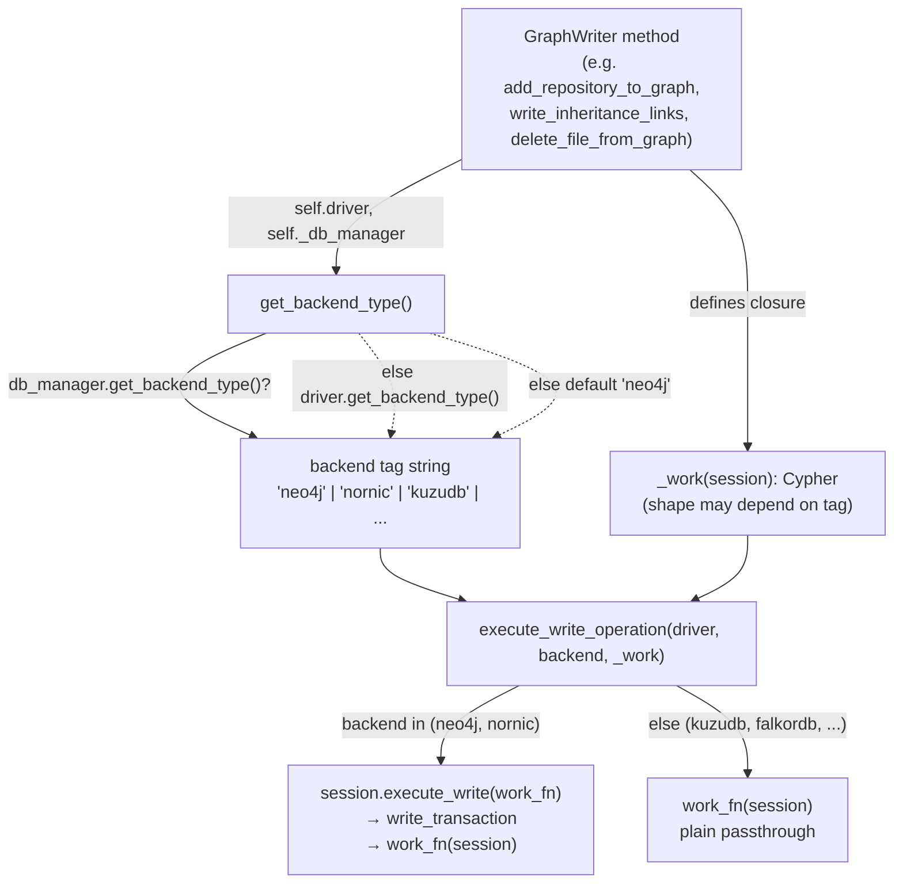

# Persistence backend seam — backend detection and transaction dispatch

Three tiny free functions in `persistence/utils.py` are the entire abstraction that lets CodeGraphContext's graph writer target *any* of several graph stores — Neo4j, Nornic, KuzuDB, LadybugDB, FalkorDB — without the writer ever holding a store-specific object. `get_backend_type` reduces the live driver to a string tag; `execute_write_operation` / `execute_read_operation` take that tag plus a closure of Cypher and decide *how* to run it: inside a retryable managed transaction for a server DB, or as a plain session call for an embedded/other backend. This is the seam. Every one of the ~30 `GraphWriter` methods in the subgraph is written against it and nothing lower.

## Overview

The design idea is **duck-typed dispatch through a string**. The writer never asks "am I talking to Neo4j or Kuzu?" as a type check; it calls [`get_backend_type`](../catalog/src/codegraphcontext/tools/indexing/persistence/utils.md#get_backend_type), gets back a lowercase tag (`"neo4j"`, `"kuzudb"`, …), and threads that tag into two places: the transaction runner ([`execute_write_operation`](../catalog/src/codegraphcontext/tools/indexing/persistence/utils.md#execute_write_operation) / [`execute_read_operation`](../catalog/src/codegraphcontext/tools/indexing/persistence/utils.md#execute_read_operation)), and — inside the work closure — the Cypher dialect it builds. So a single string carries *both* "which transaction semantics" and "which SQL/Cypher flavor" decisions, and the writer stays backend-agnostic by construction.

Every write in the graph model — repository/file nodes, the whole zoo of relationship-link writers (INHERITS, IMPLEMENTS, DECORATED_BY, MAPS_TO, READS/WRITES, …), and the incremental-reconcile deletes — funnels through this one seam.

## Diagram

## Design rationale (why it's built this way)

**Why a string tag and free functions, not a backend class hierarchy.** The alternative — a `Backend` base class with `Neo4jBackend`/`KuzuBackend` subclasses — would push polymorphism into every call site. Instead the seam is functional and duck-typed: [`get_backend_type`](../catalog/src/codegraphcontext/tools/indexing/persistence/utils.md#get_backend_type) just probes for a `get_backend_type` attribute on whatever object it's handed. That keeps `GraphWriter` decoupled from the concrete driver class, and it means adding a backend is a matter of returning a new tag string plus teaching the closures to branch on it — no new type to wire through.

**Why the write path has two modes.** The author's docstring on [`execute_write_operation`](../catalog/src/codegraphcontext/tools/indexing/persistence/utils.md#execute_write_operation) states the intent directly: *"For Neo4j/Nornic, utilizes managed transactions (execute_write or write_transaction) to automatically retry on transient errors and group all operations in a single block. For other backends (e.g. KuzuDB, FalkorDB), passes through the standard session."* Server databases can retry a transaction function on transient failures; embedded bindings (KuzuDB, FalkorDB) do not offer that API, so the helper degrades to a direct `work_fn(session)` call rather than pretending they're the same.

**Why the work is a closure.** Passing a `work_fn(session)` closure — rather than a pre-built query string — is what makes retry safe: the managed-transaction machinery can invoke the *same* function again on a retry, re-running all its `session.run(...)` statements as one atomic unit. It also lets the closure capture `backend` and shape its own Cypher; e.g. [`write_function_call_groups`](../catalog/src/codegraphcontext/tools/indexing/persistence/writer.md#GraphWriter.write_function_call_groups) picks `calls_keyword = "CREATE" if backend in ("neo4j", "nornic") else "MERGE"` and toggles a "fast/slow MATCH split" on the same tag, and [`_get_all_node_labels`](../catalog/src/codegraphcontext/tools/indexing/persistence/writer.md#GraphWriter._get_all_node_labels) branches its label-discovery query entirely on the tag (`CALL db.labels()` for Neo4j vs. a full `MATCH (n) RETURN DISTINCT label(n)` node scan for KuzuDB/LadybugDB, because `SHOW TABLES` is unavailable in Kuzu ≤ 0.11).

> [!inferred]
> Because retryable managed transactions may run `work_fn` more than once, the Cypher inside closures leans almost entirely on `MERGE` (idempotent upsert) rather than `CREATE`. The one deliberate exception — `CREATE` for CALLS edges on Neo4j in [`write_function_call_groups`](../catalog/src/codegraphcontext/tools/indexing/persistence/writer.md#GraphWriter.write_function_call_groups) — is safe only because those edges are cleared first (see [`delete_relationship_links`](../catalog/src/codegraphcontext/tools/indexing/persistence/writer.md#GraphWriter.delete_relationship_links)). This idempotency requirement is a design constraint the seam imposes on its callers, inferred from the retry docstring plus the pervasive `MERGE` usage.

## Entry points

- [`get_backend_type`](../catalog/src/codegraphcontext/tools/indexing/persistence/utils.md#get_backend_type) — called at the top of essentially every `GraphWriter` method (and standalone in [`run_inheritance_reresolve`](../catalog/src/codegraphcontext/tools/indexing/resolution/post_resolution.md#run_inheritance_reresolve)). Control reaches it once per operation to resolve the current backend tag before any query is built or run.
- [`execute_write_operation`](../catalog/src/codegraphcontext/tools/indexing/persistence/utils.md#execute_write_operation) — the sink for every mutating operation: node writers ([`add_repository_to_graph`](../catalog/src/codegraphcontext/tools/indexing/persistence/writer.md#GraphWriter.add_repository_to_graph), [`add_file_to_graph`](../catalog/src/codegraphcontext/tools/indexing/persistence/writer.md#GraphWriter.add_file_to_graph), [`add_minimal_file_node`](../catalog/src/codegraphcontext/tools/indexing/persistence/writer.md#GraphWriter.add_minimal_file_node)), relationship writers ([`write_inheritance_links`](../catalog/src/codegraphcontext/tools/indexing/persistence/writer.md#GraphWriter.write_inheritance_links), [`write_implements_links`](../catalog/src/codegraphcontext/tools/indexing/persistence/writer.md#GraphWriter.write_implements_links), [`write_scip_call_edges`](../catalog/src/codegraphcontext/tools/indexing/persistence/writer.md#GraphWriter.write_scip_call_edges), and the DB/ORM family [`write_orm_mappings`](../catalog/src/codegraphcontext/tools/indexing/persistence/writer.md#GraphWriter.write_orm_mappings)/[`write_query_links`](../catalog/src/codegraphcontext/tools/indexing/persistence/writer.md#GraphWriter.write_query_links)), and deletes ([`delete_file_from_graph`](../catalog/src/codegraphcontext/tools/indexing/persistence/writer.md#GraphWriter.delete_file_from_graph)). Reached once the caller has its backend tag and a `_work` closure.
- [`execute_read_operation`](../catalog/src/codegraphcontext/tools/indexing/persistence/utils.md#execute_read_operation) — the read sibling, hit by the query-side getters that feed incremental reconcile: [`get_repo_file_paths`](../catalog/src/codegraphcontext/tools/indexing/persistence/writer.md#GraphWriter.get_repo_file_paths), [`get_caller_file_paths`](../catalog/src/codegraphcontext/tools/indexing/persistence/writer.md#GraphWriter.get_caller_file_paths), [`get_inheritance_neighbor_paths`](../catalog/src/codegraphcontext/tools/indexing/persistence/writer.md#GraphWriter.get_inheritance_neighbor_paths), [`get_repo_class_lookup`](../catalog/src/codegraphcontext/tools/indexing/persistence/writer.md#GraphWriter.get_repo_class_lookup), and the label-discovery branch of [`_get_all_node_labels`](../catalog/src/codegraphcontext/tools/indexing/persistence/writer.md#GraphWriter._get_all_node_labels).

## Mechanism (step-by-step)

1. **Resolve the backend tag.** [`get_backend_type`](../catalog/src/codegraphcontext/tools/indexing/persistence/utils.md#get_backend_type) tries, in order: `db_manager.get_backend_type()` if a `db_manager` was passed and exposes that attribute; else `driver.get_backend_type()`; else the literal default `"neo4j"` (via `getattr(driver, "get_backend_type", lambda: "neo4j")()`). The db-manager-first precedence is stated in a `#` comment inside [`_get_all_node_labels`](../catalog/src/codegraphcontext/tools/indexing/persistence/writer.md#GraphWriter._get_all_node_labels) (immediately after its docstring closes): "Prefer `db_manager.get_backend_type()`; fall back to driver, then neo4j". The result is a lowercase string the rest of the operation keys off.

2. **Build a work closure that may consult the tag.** The calling method defines a local `_work(session)` holding one or more `session.run(cypher, params)` calls. Where dialects diverge, the closure branches on the tag it captured — most visibly in [`write_function_call_groups`](../catalog/src/codegraphcontext/tools/indexing/persistence/writer.md#GraphWriter.write_function_call_groups) (`CREATE` vs `MERGE`, fast/slow MATCH split) and [`_get_all_node_labels`](../catalog/src/codegraphcontext/tools/indexing/persistence/writer.md#GraphWriter._get_all_node_labels) (per-backend label-discovery query). For most writers the Cypher is identical across backends and the tag only matters in the next step.

3. **Dispatch the write.** [`execute_write_operation`](../catalog/src/codegraphcontext/tools/indexing/persistence/utils.md#execute_write_operation) opens `driver.session()` and, if `backend in ("neo4j", "nornic")`, hands `work_fn` to a managed transaction with a three-level capability fallback — `session.execute_write` (Neo4j driver 5+), else `session.write_transaction` (driver < 5), else a bare `work_fn(session)`. For any other tag it skips managed transactions entirely and calls `work_fn(session)` directly. The helper returns whatever `work_fn` returns, so callers like [`delete_inherits_for_files`](../catalog/src/codegraphcontext/tools/indexing/persistence/writer.md#GraphWriter.delete_inherits_for_files) and [`delete_outgoing_calls_from_files`](../catalog/src/codegraphcontext/tools/indexing/persistence/writer.md#GraphWriter.delete_outgoing_calls_from_files) can propagate a deleted-count out of the transaction.

4. **Reads take the symmetric path.** [`execute_read_operation`](../catalog/src/codegraphcontext/tools/indexing/persistence/utils.md#execute_read_operation) mirrors the write helper but with `session.execute_read` / `session.read_transaction` for the server-DB branch, again passing through for embedded backends. Getters materialize the cursor into a Python set/dict *inside* the closure (e.g. [`get_repo_file_paths`](../catalog/src/codegraphcontext/tools/indexing/persistence/writer.md#GraphWriter.get_repo_file_paths) returns `{record["p"] …}`) so the result outlives the session scope.

5. **Loop-scoped re-resolution of the tag.** In long, batched operations the tag is re-fetched per iteration rather than hoisted once. [`delete_repository_from_graph`](../catalog/src/codegraphcontext/tools/indexing/persistence/writer.md#GraphWriter.delete_repository_from_graph) calls [`get_backend_type`](../catalog/src/codegraphcontext/tools/indexing/persistence/utils.md#get_backend_type) again inside its `while True` relationship-deletion loop (deleting CALLS/INHERITS/IMPORTS/INCLUDES in 5000-row LIMIT batches), and threads the same seam through both its existence check and a legacy-backslash-path fallback. This is the pattern the reconcile deletes ([`delete_relationship_links`](../catalog/src/codegraphcontext/tools/indexing/persistence/writer.md#GraphWriter.delete_relationship_links)) share.

## Key data structures

- **The backend tag (a `str`).** The only piece of state the seam produces. Observed values across the closures: `"neo4j"`, `"nornic"` (managed-transaction backends), `"kuzudb"`, `"ladybugdb"`, `"falkordb"`, `"falkordb-remote"` (passthrough backends). Membership in the tuple `("neo4j", "nornic")` is the sole decision the transaction helpers make.
- **The `work_fn` closure.** A `callable(session) -> Any`. It is the unit of retry and the unit of atomicity for server DBs, and the unit of Cypher-dialect selection. Its return value is the operation's result.
- **`driver` and `db_manager` (both `Any`).** Deliberately untyped — the seam only ever probes them by `hasattr`/`getattr`, never by class. `db_manager` is the authoritative source of the tag when present; `driver` is both the tag fallback and the thing that yields sessions.

## Dynamics (design intent)

Managed transactions on the Neo4j/Nornic path give the writer automatic retry on transient errors and single-block grouping (per the [`execute_write_operation`](../catalog/src/codegraphcontext/tools/indexing/persistence/utils.md#execute_write_operation) docstring). Because a retried `work_fn` re-executes from the top, the intended contract is that closures be idempotent — which is why most relationship writers use `MERGE`, the exception being [`write_function_call_groups`](../catalog/src/codegraphcontext/tools/indexing/persistence/writer.md#GraphWriter.write_function_call_groups), whose CALLS edges use `CREATE` instead when `backend in ("neo4j", "nornic")`. The embedded backends get no such grouping: each `session.run` in a passthrough `_work` stands alone. The read helper's intent ([`execute_read_operation`](../catalog/src/codegraphcontext/tools/indexing/persistence/utils.md#execute_read_operation) docstring: "utilizing managed read transactions where supported") is the read-side analogue — managed read transactions on server DBs, plain session reads elsewhere.

> [!inferred]
> No tests in the configured paths exercise this subgraph (the packet's Evidence section is empty), so concurrency/retry behavior is asserted only from the docstrings and the driver-capability fallbacks in source, not observed.

## Edge cases

- **Unknown driver defaults to Neo4j semantics.** If neither `db_manager` nor `driver` exposes `get_backend_type`, [`get_backend_type`](../catalog/src/codegraphcontext/tools/indexing/persistence/utils.md#get_backend_type) returns `"neo4j"` — so an unrecognized or bare driver is routed down the *managed-transaction* branch of [`execute_write_operation`](../catalog/src/codegraphcontext/tools/indexing/persistence/utils.md#execute_write_operation), which assumes `session.execute_write`/`write_transaction` exist (with a final `work_fn(session)` fallback if they don't).
- **Driver version drift is absorbed, backend-name typos are not.** The `execute_write`→`write_transaction`→direct ladder in [`execute_write_operation`](../catalog/src/codegraphcontext/tools/indexing/persistence/utils.md#execute_write_operation) tolerates Neo4j driver 4 vs 5. But the branch is an exact string membership test: any tag outside `("neo4j", "nornic")` silently takes the passthrough path with no managed transaction.
- **Retry re-runs side effects.** A `work_fn` that mutates Python-side state (counters, accumulators) rather than only issuing Cypher can double-count if the managed transaction retries; the safe pattern used in the codebase is to compute counts *from* the query result and return them, as [`delete_outgoing_calls_from_files`](../catalog/src/codegraphcontext/tools/indexing/persistence/writer.md#GraphWriter.delete_outgoing_calls_from_files) does.
- **Backend-aware Cypher lives in the caller, not the seam.** The helpers never rewrite queries; if a closure emits Cypher a given backend can't parse, it fails there. Callers guard this themselves — e.g. [`write_inheritance_links`](../catalog/src/codegraphcontext/tools/indexing/persistence/writer.md#GraphWriter.write_inheritance_links) loops over label pairs and swallows a binder exception per pair rather than aborting the batch; [`write_companion_of_links`](../catalog/src/codegraphcontext/tools/indexing/persistence/writer.md#GraphWriter.write_companion_of_links), by contrast, uses fixed `Object`/`Class` labels (no label loop) and instead swallows a binder exception per row.

## Open questions

- The exhaustive set of legal backend tags is not defined in this subgraph; values above are collected from the branching in `writer.py` closures. A canonical list would live in the DB-manager / embedded-Kuzu modules, outside this packet.
- Whether `"nornic"` is a distinct store or a Neo4j-compatible variant isn't determinable from these files — it is only ever grouped with `"neo4j"` for transaction purposes.
- `db_manager` is threaded as `self._db_manager` on `GraphWriter`, but where it is constructed/assigned is outside this subgraph.

## See also

- [GraphWriter — the graph-model writer](codegraphcontext-tools-indexing-persistence-writer.md) — the ~30-method class that is the sole consumer of this seam; every method here appears there.
- [Embedded KuzuDB backend](codegraphcontext-core-database_embedded_kuzu.md) — the passthrough-branch store this seam abstracts over, and the source of the `get_backend_type` the driver exposes.
