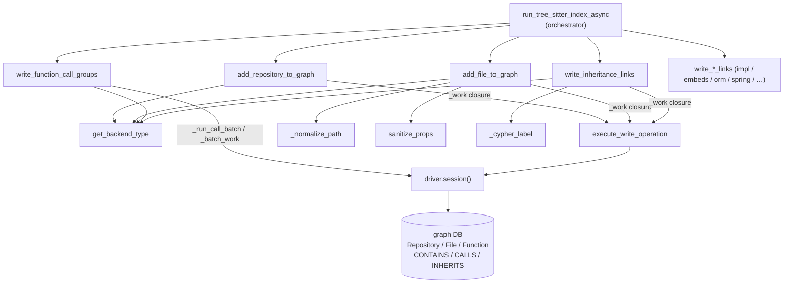

# Persistence writer — turning parsed relationships into graph records

<!-- connect:up:begin -->
> **Cross-repo concept:** part of [incremental-reconcile](../../../concepts/incremental-reconcile.md), [symbol-graph](../../../concepts/symbol-graph.md) across this wiki's repos.
<!-- connect:up:end -->
## Overview
This is the single choke point where CodeGraphContext's parsed model of a codebase — repositories,
files, functions, classes, and the call/import/inheritance edges between them — actually becomes rows
in a graph database. The `GraphWriter` class owns *every* indexing write; upstream parsers produce
plain Python dicts, and this layer is the only place that emits Cypher. Its defining design idea is a
**backend-neutral write closure**: each public method computes the live backend type, defines a nested
`_work(session)` function holding the actual Cypher, and hands that closure to a transaction runner that
knows how each backend (Neo4j, Kùzu, FalkorDB, …) wants transactions driven. Nodes are written with
`MERGE` (idempotent upsert keyed on `path`), so re-indexing the same repo converges instead of
duplicating — the substrate on which incremental re-indexing is built.

## Diagram

## Design rationale (why it's built this way)

**One persistence entry point, many backends.** The module docstring states the intent plainly: "All
graph DB writes for indexing (single persistence entry point)." Rather than let each backend leak into
the parsers, `GraphWriter` holds a `driver` and an optional `_db_manager`
([`driver`](../catalog/src/codegraphcontext/tools/indexing/persistence/writer.md#GraphWriter.driver),
[`_db_manager`](../catalog/src/codegraphcontext/tools/indexing/persistence/writer.md#GraphWriter._db_manager))
and routes every write through two helpers so backend differences are localized to one file.
[`get_backend_type`](../catalog/src/codegraphcontext/tools/indexing/persistence/utils.md#get_backend_type)
resolves the backend *dynamically* — preferring `_db_manager.get_backend_type()`, then the driver's own
method, and finally defaulting to `"neo4j"` — which is why the constructor warns when no `db_manager` is
supplied ([`_db_manager`](../catalog/src/codegraphcontext/tools/indexing/persistence/writer.md#GraphWriter._db_manager)).

**Managed transactions only where they help.**
[`execute_write_operation`](../catalog/src/codegraphcontext/tools/indexing/persistence/utils.md#execute_write_operation)
encodes the key non-obvious decision: for Neo4j/Nornic it wraps the closure in `session.execute_write`
(or the pre-5.x `write_transaction`), gaining automatic retry on transient errors and atomic grouping;
for embedded backends like Kùzu and FalkorDB it just opens a session and calls the closure directly,
because those drivers don't offer the managed-transaction API. The read side
([`execute_read_operation`](../catalog/src/codegraphcontext/tools/indexing/persistence/utils.md#execute_read_operation))
mirrors this. The docstring names the tradeoff: managed transactions "automatically retry on transient
errors and group all operations in a single block."

**Paths are the primary key, so they must be canonical.** Every node is `MERGE`d on a `path`, and
lookups use `STARTS WITH` to scope to a repository subtree. That only works if paths are stored
consistently, so all paths flow through
[`_normalize_path`](../catalog/src/codegraphcontext/tools/indexing/persistence/writer.md#_normalize_path)
(`Path.resolve().as_posix()` — forward slashes even on Windows) and prefixes through
[`_normalize_prefix`](../catalog/src/codegraphcontext/tools/indexing/persistence/writer.md#_normalize_prefix).
The docstring cites [issue #1080](https://github.com/CodeGraphContext/CodeGraphContext/issues/1080):
Windows backslashes broke `STARTS WITH`.

**Defensive Cypher for weaker backends.** Kùzu reserves identifiers like `Union`/`Macro`/`Property`, so
labels are wrapped when needed by
[`_cypher_label`](../catalog/src/codegraphcontext/tools/indexing/persistence/writer.md#_cypher_label);
Kùzu's "binder" errors (a label that doesn't exist yet) are recognized by
[`_is_binder_exception`](../catalog/src/codegraphcontext/tools/indexing/persistence/writer.md#_is_binder_exception)
and swallowed rather than aborting a batch. And because FalkorDB/Kùzu accept only primitive or
flat-list properties, values are coerced by
[`sanitize_props`](../catalog/src/codegraphcontext/tools/indexing/sanitize.md#sanitize_props) before
they hit the store.

## Entry points

- **[`run_tree_sitter_index_async`](../catalog/src/codegraphcontext/tools/indexing/pipeline.md#run_tree_sitter_index_async)** —
  the pipeline orchestrator and the writer's principal caller. Its docstring is the whole subsystem in
  one line: "Parse all discovered files, write symbols, then inheritance + CALLS." It calls
  [`add_repository_to_graph`](../catalog/src/codegraphcontext/tools/indexing/persistence/writer.md#GraphWriter.add_repository_to_graph)
  first, then fans out to the per-relationship writers
  ([`write_inheritance_links`](../catalog/src/codegraphcontext/tools/indexing/persistence/writer.md#GraphWriter.write_inheritance_links),
  [`write_function_call_groups`](../catalog/src/codegraphcontext/tools/indexing/persistence/writer.md#GraphWriter.write_function_call_groups),
  and the language/framework-specific ones), establishing the ordering that the graph's referential
  integrity depends on.

- **[`add_repository_to_graph`](../catalog/src/codegraphcontext/tools/indexing/persistence/writer.md#GraphWriter.add_repository_to_graph)** —
  the root write, reached once per repo before any files. It `MERGE`s the `Repository` node keyed on the
  normalized path and stamps `commit_hash` and `indexed_at`, so the graph records *which* commit it
  reflects. Everything else hangs off this node via `CONTAINS`.

- **[`add_file_to_graph`](../catalog/src/codegraphcontext/tools/indexing/persistence/writer.md#GraphWriter.add_file_to_graph)** —
  the per-file bulk write, reached once for each parsed file. It creates the `File` node, walks the
  relative path to `MERGE` the intermediate `Directory` chain (`Repository/Directory*→File` via
  `CONTAINS`), then writes all the symbol nodes (Function, Class, Trait, Variable, …) the parser found
  in that file.

- **The `delete_*` and `get_*` family** — reached during re-indexing and repo removal, e.g.
  [`delete_repository_from_graph`](../catalog/src/codegraphcontext/tools/indexing/persistence/writer.md#GraphWriter.delete_repository_from_graph)
  (also surfaced to callers via the thin
  [`GraphBuilder.delete_repository_from_graph`](../catalog/src/codegraphcontext/tools/graph_builder.md#GraphBuilder.delete_repository_from_graph)
  wrapper) and
  [`delete_file_from_graph`](../catalog/src/codegraphcontext/tools/indexing/persistence/writer.md#GraphWriter.delete_file_from_graph).
  These are how the graph is kept current when source changes (see Dynamics).

## Mechanism (step-by-step)

1. **Establish the repository root.**
   [`add_repository_to_graph`](../catalog/src/codegraphcontext/tools/indexing/persistence/writer.md#GraphWriter.add_repository_to_graph)
   normalizes the repo path, reads the git commit hash, resolves the backend via
   [`get_backend_type`](../catalog/src/codegraphcontext/tools/indexing/persistence/utils.md#get_backend_type),
   and runs a `MERGE (r:Repository {path})` + `SET` inside a `_work` closure passed to
   [`execute_write_operation`](../catalog/src/codegraphcontext/tools/indexing/persistence/utils.md#execute_write_operation).
   Because it's `MERGE`, re-indexing updates the same node rather than creating a second — the first
   expression of the idempotency that makes the whole store reconcilable.

2. **Write each file and its containment spine.**
   [`add_file_to_graph`](../catalog/src/codegraphcontext/tools/indexing/persistence/writer.md#GraphWriter.add_file_to_graph)
   `MERGE`s the `File` node, then iterates the relative path parts to build the `Directory` hierarchy,
   linking parent→child with `CONTAINS` at each level and finally attaching the file. It resolves the
   repository node first (falling back to a
   [`warning_logger`](../catalog/src/codegraphcontext/utils/debug_log.md#warning_logger) if the
   `Repository` node is missing). All paths pass through
   [`_normalize_path`](../catalog/src/codegraphcontext/tools/indexing/persistence/writer.md#_normalize_path)
   so directory and file keys line up. When only a stub is needed (e.g. a file that failed to parse),
   [`add_minimal_file_node`](../catalog/src/codegraphcontext/tools/indexing/persistence/writer.md#GraphWriter.add_minimal_file_node)
   writes just the Repository→…→File spine so the file still appears in the graph.

3. **Coerce properties to backend-safe types.** Symbol node properties are passed through
   [`sanitize_props`](../catalog/src/codegraphcontext/tools/indexing/sanitize.md#sanitize_props), which
   keeps primitives and flat lists as-is, truncates strings to
   [`MAX_STR_LEN`](../catalog/src/codegraphcontext/tools/indexing/sanitize.md#MAX_STR_LEN) (4096 — Neo4j
   RANGE index key-size limit; long C++ template names blow past it), and JSON-serializes anything
   nested via its inner
   [`_coerce`](../catalog/src/codegraphcontext/tools/indexing/sanitize.md#sanitize_props._coerce) /
   [`_is_flat_list`](../catalog/src/codegraphcontext/tools/indexing/sanitize.md#sanitize_props._is_flat_list)
   helpers. This is what lets the same node dicts round-trip into FalkorDB/Kùzu, which reject complex
   property values.

4. **Write CALLS edges — the perf-critical batch path.**
   [`write_function_call_groups`](../catalog/src/codegraphcontext/tools/indexing/persistence/writer.md#GraphWriter.write_function_call_groups)
   is the heaviest writer and the most tuned. It takes ten pre-bucketed edge lists (fn→fn, fn→class,
   file→fn, …), sanitizes/deduplicates each row (building a tuple `dedup_key` to drop duplicate calls),
   and writes in `batch_size = 1000` chunks. It branches on backend: Neo4j/Nornic use `CREATE` and a
   **fast/slow MATCH split** — rows whose callee line number is known take a precise
   `{name, path, line_number}` MATCH, the rest fall back to a `{name, path}` MATCH — while embedded
   backends use `MERGE` with a unified MATCH plus a line `WHERE` filter, for parity. Each sub-batch is
   run through the nested
   [`_run_call_batch`](../catalog/src/codegraphcontext/tools/indexing/persistence/writer.md#GraphWriter._run_call_batch),
   which wraps the Cypher in a
   [`_batch_work`](../catalog/src/codegraphcontext/tools/indexing/persistence/writer.md#GraphWriter._batch_work)
   transaction closure and runs the whole sub-batch (up to 1000 rows) through a single `tx.run` call;
   a caught exception swallows binder errors for the entire sub-batch via
   [`_is_binder_exception`](../catalog/src/codegraphcontext/tools/indexing/persistence/writer.md#_is_binder_exception),
   not per row.
   Notably this method drives the session itself (`with self.driver.session()`) rather than going
   through `execute_write_operation`, so it can control its own per-batch transactions.

5. **Resolve inheritance across the whole repo.**
   [`write_inheritance_links`](../catalog/src/codegraphcontext/tools/indexing/persistence/writer.md#GraphWriter.write_inheritance_links)
   runs as a post-pass (after all file nodes exist) because a child and its parent often live in
   different files. It splits the batch into internal vs `__external__` parents, then brute-forces the
   **cartesian product of type labels** (Class × Trait × Interface × Struct × …), running an
   `UNWIND … MATCH child … MATCH parent … MERGE (child)-[:INHERITS]->(parent)` for each pair, with
   labels quoted through
   [`_cypher_label`](../catalog/src/codegraphcontext/tools/indexing/persistence/writer.md#_cypher_label).
   The label cross-product is the price of not knowing a symbol's node label at edge-write time. C#'s
   class-vs-interface disambiguation is handled specially by
   [`_create_csharp_inheritance_and_interfaces`](../catalog/src/codegraphcontext/tools/indexing/persistence/writer.md#GraphWriter._create_csharp_inheritance_and_interfaces),
   which emits `IMPLEMENTS` for interfaces and `INHERITS` for base classes.

6. **Write the long tail of typed relationships.** A family of writers each emits one edge kind, all
   following the identical backend/`_work`/`execute_write_operation` shape:
   [`write_implements_links`](../catalog/src/codegraphcontext/tools/indexing/persistence/writer.md#GraphWriter.write_implements_links),
   [`write_decorated_by_links`](../catalog/src/codegraphcontext/tools/indexing/persistence/writer.md#GraphWriter.write_decorated_by_links),
   [`write_embeds_links`](../catalog/src/codegraphcontext/tools/indexing/persistence/writer.md#GraphWriter.write_embeds_links),
   [`write_metaclass_links`](../catalog/src/codegraphcontext/tools/indexing/persistence/writer.md#GraphWriter.write_metaclass_links),
   [`write_part_of_links`](../catalog/src/codegraphcontext/tools/indexing/persistence/writer.md#GraphWriter.write_part_of_links),
   [`write_partial_of_links`](../catalog/src/codegraphcontext/tools/indexing/persistence/writer.md#GraphWriter.write_partial_of_links),
   [`write_companion_of_links`](../catalog/src/codegraphcontext/tools/indexing/persistence/writer.md#GraphWriter.write_companion_of_links).
   A C++-specific post-pass,
   [`write_cpp_class_function_links`](../catalog/src/codegraphcontext/tools/indexing/persistence/writer.md#GraphWriter.write_cpp_class_function_links),
   links out-of-line method definitions in `.cpp` files back to their `Class` node in the `.h` file —
   an edge that *can't* be written per-file because the class node may not exist yet when the `.cpp` is
   processed.

7. **Persist framework- and data-layer relationships.** Beyond code structure, the writer records how
   code touches build systems and databases:
   [`write_maven_build_graph`](../catalog/src/codegraphcontext/tools/indexing/persistence/writer.md#GraphWriter.write_maven_build_graph)
   and
   [`write_gradle_build_graph`](../catalog/src/codegraphcontext/tools/indexing/persistence/writer.md#GraphWriter.write_gradle_build_graph)
   emit module/dependency edges (batched at 200);
   [`write_datasource_graph`](../catalog/src/codegraphcontext/tools/indexing/persistence/writer.md#GraphWriter.write_datasource_graph),
   [`write_orm_mappings`](../catalog/src/codegraphcontext/tools/indexing/persistence/writer.md#GraphWriter.write_orm_mappings),
   [`write_query_links`](../catalog/src/codegraphcontext/tools/indexing/persistence/writer.md#GraphWriter.write_query_links),
   [`write_mybatis_links`](../catalog/src/codegraphcontext/tools/indexing/persistence/writer.md#GraphWriter.write_mybatis_links),
   [`write_spring_data_repo_links`](../catalog/src/codegraphcontext/tools/indexing/persistence/writer.md#GraphWriter.write_spring_data_repo_links),
   [`write_spring_inject_links`](../catalog/src/codegraphcontext/tools/indexing/persistence/writer.md#GraphWriter.write_spring_inject_links),
   and
   [`write_spring_endpoint_properties`](../catalog/src/codegraphcontext/tools/indexing/persistence/writer.md#GraphWriter.write_spring_endpoint_properties)
   write `READS`/`WRITES`/`MAPS_TO`/`INJECTS` edges and HTTP endpoint properties onto Function nodes.
   A separate SCIP-sourced path,
   [`write_scip_call_edges`](../catalog/src/codegraphcontext/tools/indexing/persistence/writer.md#GraphWriter.write_scip_call_edges),
   `MERGE`s `CALLS` edges tagged `source: 'scip'`, using a caller `name_from_symbol` resolver — a second,
   precision-oriented source of call edges alongside the tree-sitter path.

8. **Log progress through a level-gated logger.** Throughout, the writers narrate via
   [`info_logger`](../catalog/src/codegraphcontext/utils/debug_log.md#info_logger) and
   [`warning_logger`](../catalog/src/codegraphcontext/utils/debug_log.md#warning_logger), which only
   emit when [`_should_log`](../catalog/src/codegraphcontext/utils/debug_log.md#_should_log) (driven by
   [`_get_config_value`](../catalog/src/codegraphcontext/utils/debug_log.md#_get_config_value) reading
   from [`get_config_value`](../catalog/src/codegraphcontext/cli/config_manager.md#get_config_value))
   says the configured level allows it, then delegate to the module
   [`logger`](../catalog/src/codegraphcontext/utils/debug_log.md#logger). This is how CALLS-batch
   throughput (`edges written … s elapsed`) becomes visible without hard-coding a log level.

## Key data structures
- **`GraphWriter.driver` / `GraphWriter._db_manager`** — the connection handles the whole class writes
  through ([`driver`](../catalog/src/codegraphcontext/tools/indexing/persistence/writer.md#GraphWriter.driver),
  [`_db_manager`](../catalog/src/codegraphcontext/tools/indexing/persistence/writer.md#GraphWriter._db_manager)).
  `_db_manager` is the authoritative source of backend type; `driver` is the fallback and the object
  whose `.session()` yields the Cypher-running session.
- **The `_work(session)` closure** — not a stored field but the recurring runtime structure: every write
  method builds a fresh nested function capturing its parameters, so `execute_write_operation` can run
  it under whatever transaction discipline the backend needs. The `_get_all_node_labels` variant
  ([`_get_all_node_labels`](../catalog/src/codegraphcontext/tools/indexing/persistence/writer.md#GraphWriter._get_all_node_labels))
  shows the same pattern on the *read* side, with per-backend label-discovery queries.
- **Edge-row dicts** — the parser's output shape the writers consume: for CALLS, dicts carrying
  `caller_name/caller_file_path/caller_line_number`, `called_name/called_file_path/called_line_number`,
  plus `confidence`, `resolution_tier`, and `args_key`
  ([`write_function_call_groups`](../catalog/src/codegraphcontext/tools/indexing/persistence/writer.md#GraphWriter.write_function_call_groups)).
  These carried properties are what later query tools can filter call edges on.
- **Import metadata ordering** —
  [`sort_import_rows_for_metadata`](../catalog/src/codegraphcontext/tools/indexing/persistence/writer.md#sort_import_rows_for_metadata)
  picks the "most descriptive" import row when several share a module name (e.g. Rust `pub use` glob vs.
  explicit), so a module's stored import metadata is deterministic.

## Dynamics (design intent)
The writer is called in a **strict order** set by the pipeline: repository → files/symbols → inheritance
→ CALLS → framework edges. This ordering is load-bearing: cross-file edges (inheritance, C++ method
containment, CALLS) are written as **post-passes** precisely because their endpoints may live in files
that hadn't been processed when the edge was discovered — writing them last guarantees both nodes exist
to MATCH against. Within
[`write_function_call_groups`](../catalog/src/codegraphcontext/tools/indexing/persistence/writer.md#GraphWriter.write_function_call_groups),
work is chunked into 1000-row batches and (on Neo4j) split into fast/slow paths so the common
line-number-known case gets the selective index, a documented perf change.

For **keeping the graph current** (the incremental-reconcile angle), the writer exposes a
delete-then-relink toolkit rather than a full rebuild:
[`delete_relationship_links`](../catalog/src/codegraphcontext/tools/indexing/persistence/writer.md#GraphWriter.delete_relationship_links)
clears CALLS/INHERITS under a path prefix before re-linking;
[`delete_outgoing_calls_from_files`](../catalog/src/codegraphcontext/tools/indexing/persistence/writer.md#GraphWriter.delete_outgoing_calls_from_files)
and
[`delete_inherits_for_files`](../catalog/src/codegraphcontext/tools/indexing/persistence/writer.md#GraphWriter.delete_inherits_for_files)
scope the purge to changed files;
[`delete_file_from_graph`](../catalog/src/codegraphcontext/tools/indexing/persistence/writer.md#GraphWriter.delete_file_from_graph)
removes a file, its contained elements, and now-empty parent directories. The read helpers that make an
incremental pass possible —
[`get_repo_file_paths`](../catalog/src/codegraphcontext/tools/indexing/persistence/writer.md#GraphWriter.get_repo_file_paths)
(every indexed File under a root),
[`get_caller_file_paths`](../catalog/src/codegraphcontext/tools/indexing/persistence/writer.md#GraphWriter.get_caller_file_paths),
[`get_inheritance_neighbor_paths`](../catalog/src/codegraphcontext/tools/indexing/persistence/writer.md#GraphWriter.get_inheritance_neighbor_paths),
and
[`get_repo_class_lookup`](../catalog/src/codegraphcontext/tools/indexing/persistence/writer.md#GraphWriter.get_repo_class_lookup)
— let a caller compute *which* files changed and which neighbors must be re-linked, so only the delta is
rewritten.

## Edge cases
- **Legacy Windows paths.**
  [`delete_repository_from_graph`](../catalog/src/codegraphcontext/tools/indexing/persistence/writer.md#GraphWriter.delete_repository_from_graph)
  first looks up the normalized (forward-slash) path; if not found it retries with the native
  backslash path, because older CGC versions stored Windows paths unnormalized. Deletes are bounded per
  iteration to avoid huge single transactions, though the limit differs by target: the CALLS/INHERITS/
  IMPORTS/INCLUDES relationship loop uses `LIMIT 5000`, while the CONTAINS relationship loop and the
  per-label node `DETACH DELETE` loop use `LIMIT 10000`.
- **Missing repository node.** `add_file_to_graph` warns via
  [`warning_logger`](../catalog/src/codegraphcontext/utils/debug_log.md#warning_logger) and falls back to
  the file's own `repo_path` rather than failing.
- **Kùzu binder errors.** Cartesian-product label loops routinely MATCH labels that don't exist for a
  given batch; [`_is_binder_exception`](../catalog/src/codegraphcontext/tools/indexing/persistence/writer.md#_is_binder_exception)
  distinguishes those from real errors so the batch continues.
- **Reserved identifiers / oversized properties.**
  [`_cypher_label`](../catalog/src/codegraphcontext/tools/indexing/persistence/writer.md#_cypher_label)
  backticks Kùzu-reserved labels; [`sanitize_props`](../catalog/src/codegraphcontext/tools/indexing/sanitize.md#sanitize_props)
  truncates at [`MAX_STR_LEN`](../catalog/src/codegraphcontext/tools/indexing/sanitize.md#MAX_STR_LEN) to
  stay under Neo4j's index key-size limit.
- **Orphaned shared nodes.**
  [`_purge_dangling_pathless_nodes`](../catalog/src/codegraphcontext/tools/indexing/persistence/writer.md#GraphWriter._purge_dangling_pathless_nodes)
  removes pathless nodes (e.g. imported Module headers) left without references after a delete.

## Open questions
- Transaction granularity differs by method — `write_function_call_groups` manages its own per-batch
  transactions inside one session while most methods delegate to `execute_write_operation`. The
  consistency guarantee if a mid-batch failure occurs (partial CALLS written) isn't spelled out in
  source.
- The label cross-product in `write_inheritance_links` and `write_scip_call_edges` is O(labels²) MATCH
  attempts per batch; whether this is a practical bottleneck on large polyglot repos isn't measured in
  the code I read.
- Exactly which caller computes the changed-file delta and invokes the `delete_*`/`get_*` reconcile
  helpers (vs. a full re-index) lives outside this packet's subgraph.

## See also
- Sibling concept pages under `wiki/code/codegraphcontext/concepts/` for the parsing/extraction pipeline
  that produces the dicts this layer consumes, and the MCP query tools that read the graph it writes.
- Cross-repo concept pages `wiki/concepts/symbol-graph.md` and `wiki/concepts/incremental-reconcile.md`
  (how wikify-repo, graphify, and understand-anything build and refresh their symbol/call graphs).
