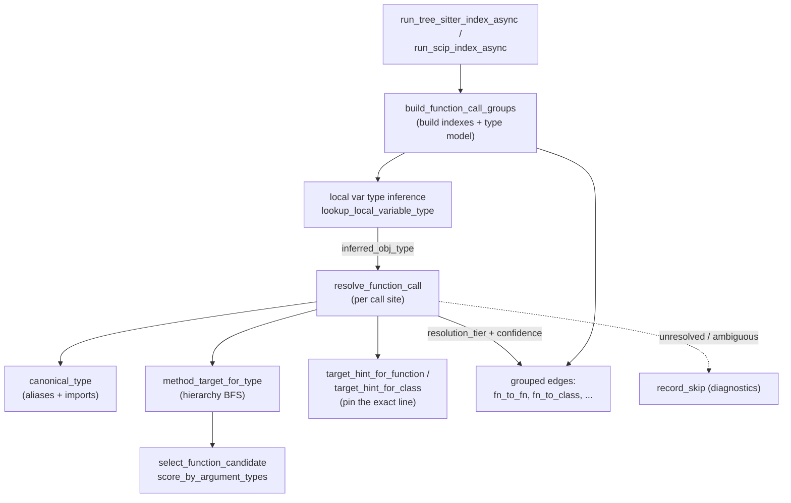

# Call resolution — from raw call sites to CALLS edges

<!-- connect:up:begin -->
> **Cross-repo concept:** part of [multi-language-extraction](../../../concepts/multi-language-extraction.md), [symbol-graph](../../../concepts/symbol-graph.md) across this wiki's repos.
<!-- connect:up:end -->
## Overview
This is the subsystem that turns a *syntactic* call site — the text `foo.bar(x)` that the
Tree-sitter parser saw — into a *semantic* edge: a `CALLS` relationship pointing at the one
function/method definition that call actually reaches. It is the crux of building an accurate
call graph, and it is hard for one reason: CodeGraphContext parses 20+ languages with
Tree-sitter and has **no compiler, no type checker, and no symbol table**. So the callee is
recovered entirely by heuristics — infer the receiver's type from nearby variable declarations,
walk the class hierarchy to find where the method is defined, disambiguate overloads by arity
and argument types — and every result is stamped with a **confidence tier** so downstream
consumers know how much to trust the edge. The batch driver
[`build_function_call_groups`](../catalog/src/codegraphcontext/tools/indexing/resolution/calls.md#build_function_call_groups)
builds the cross-file indexes and the per-function type model, then calls
[`resolve_function_call`](../catalog/src/codegraphcontext/tools/indexing/resolution/calls.md#resolve_function_call)
once per call site.

## Diagram

## Design rationale (why it's built this way)
The module docstring states the mandate plainly: *"Heuristic resolution of function calls into
CALLS edge payloads (no DB I/O)."* Two consequences follow from that word *heuristic*.

First, **resolution is graded, not binary.** Rather than emit an edge or drop it, every resolved
call carries a `resolution_tier` and a derived `confidence` float (the module-level
`_TIER_CONFIDENCE` table, consumed inside
[`resolve_function_call`](../catalog/src/codegraphcontext/tools/indexing/resolution/calls.md#resolve_function_call),
runs 1.00 for an explicit `self`/`super` receiver down to 0.08 for the last-resort same-file
fallback). A companion label maps the tier to `EXTRACTED` / `INFERRED` / `AMBIGUOUS`, so a query
can distinguish an edge the parser proved from one the resolver guessed. This is the honest
answer to "we can't be sure" — surface the uncertainty rather than hide it.

> [!inferred]
> The tier numbers are ordered by *strategy strength*, not numerically: tier 5 (unique short-name
> lookup, 0.90) outranks tiers 3–4 (inferred-receiver-type, 0.88/0.72), because a globally unique
> name is more certain than a type inference that might be wrong. The comments on `_TIER_CONFIDENCE`
> confirm this reading.

Second, **when the resolver can't be confident, it refuses rather than guesses.** An overloaded
method it can't narrow, an ambiguous class target, or an unresolved external all return `None`
and log a structured diagnostic via
[`record_skip`](../catalog/src/codegraphcontext/tools/indexing/resolution/calls.md#resolve_function_call.record_skip)
instead of emitting a wrong edge. A wrong `CALLS` edge is worse than a missing one, because it
pollutes every downstream traversal. The `skip_external` knob (read once from config via
[`get_config_value`](../catalog/src/codegraphcontext/cli/config_manager.md#get_config_value),
key `SKIP_EXTERNAL_RESOLUTION`) lets an operator drop unresolved external calls entirely.

The whole design is **multi-language by dispatch**: language is detected from the file suffix by
[`detect_lang_from_path`](../catalog/src/codegraphcontext/tools/indexing/resolution/calls.md#detect_lang_from_path).
[`resolve_function_call`](../catalog/src/codegraphcontext/tools/indexing/resolution/calls.md#resolve_function_call)
itself carries the explicit branches for Perl `SUPER::`, Rust `super::`, Scala `apply`, Ruby
`new`→`initialize`, and PHP trait methods; Kotlin/Dart receiver-type inference is handled earlier,
in [`build_function_call_groups`](../catalog/src/codegraphcontext/tools/indexing/resolution/calls.md#build_function_call_groups)'s
per-file loop, which infers the receiver type from the local variable model before ever calling the resolver.

## Entry points
- [`build_function_call_groups`](../catalog/src/codegraphcontext/tools/indexing/resolution/calls.md#build_function_call_groups) —
  the batch driver. Control reaches it once per index run, after all files are parsed, with the
  full list of per-file symbol data plus the global `imports_map`. It builds every cross-file
  index and the per-function type model, drives resolution over every call site, and returns the
  edges already **grouped** by target kind (`fn_to_fn`, `fn_to_class`, `fn_to_interface`, …).
- [`resolve_function_call`](../catalog/src/codegraphcontext/tools/indexing/resolution/calls.md#resolve_function_call) —
  the per-call-site resolver, invoked from inside the driver's loop for every parsed call. It is
  a large pure function: given one `call` dict and the indexes, it returns a single edge payload
  or `None`. All the interesting heuristics live here.
- [`run_tree_sitter_index_async`](../catalog/src/codegraphcontext/tools/indexing/pipeline.md#run_tree_sitter_index_async)
  and [`run_scip_index_async`](../catalog/src/codegraphcontext/tools/indexing/scip_pipeline.md#run_scip_index_async) —
  the two pipelines that call the driver. Their docstrings ("Parse all discovered files, write
  symbols, then inheritance + CALLS"; "Run SCIP CLI, write graph, supplement with Tree-sitter,
  write SCIP CALLS edges") show call resolution is the final phase of both: symbols and
  inheritance must exist before calls can be resolved against them.
- [`GraphBuilder`](../catalog/src/codegraphcontext/tools/graph_builder.md#GraphBuilder) via
  [`link_function_calls`](../catalog/src/codegraphcontext/tools/graph_builder.md#GraphBuilder.link_function_calls)
  ("Resolve and persist CALLS relationships") — the facade path. `GraphBuilder` is the high-level
  object over the whole pipeline; its private
  [`_resolve_function_call`](../catalog/src/codegraphcontext/tools/graph_builder.md#GraphBuilder._resolve_function_call)
  is a thin single-call wrapper, but the bulk resolution goes through `link_function_calls` →
  `build_function_call_groups`.

## Mechanism (step-by-step)
1. **Build the cross-file indexes.** The driver first walks every file's symbol data to build
   the lookup tables resolution will need: a `file_symbol_labels` / `file_class_lookup` map (so a
   resolved target can be classified Class vs Interface vs Object vs Function), a `type_aliases`
   map, and the keyed indexes `function_index`, `class_index`, `class_method_index`, and
   `extension_method_index` (all keyed by `(canonical-type, name)`). The keys are computed with
   [`type_keys_for_maps`](../catalog/src/codegraphcontext/tools/indexing/resolution/calls.md#build_function_call_groups.type_keys_for_maps)
   and [`simple_type_key`](../catalog/src/codegraphcontext/tools/indexing/resolution/calls.md#build_function_call_groups.simple_type_key),
   which lean on
   [`canonical_type_for_maps`](../catalog/src/codegraphcontext/tools/indexing/resolution/calls.md#build_function_call_groups.canonical_type_for_maps)
   to normalize a written type through imports, package prefix, and aliases into one canonical
   name. This is done inside
   [`build_function_call_groups`](../catalog/src/codegraphcontext/tools/indexing/resolution/calls.md#build_function_call_groups),
   and the config-driven `skip_external` flag is read here.

2. **Build the per-function local variable type model.** For each file, the driver records the
   inferred type of every local variable declaration keyed by *scope*, where scope is the
   enclosing function resolved by line range. A variable declared at line N belongs to whatever
   function's `[line_number, end_line]` range contains N — computed by
   [`function_scope_for_line`](../catalog/src/codegraphcontext/tools/indexing/resolution/calls.md#build_function_call_groups.function_scope_for_line)
   (via bisect over pre-sorted intervals) and surfaced through
   [`variable_scope`](../catalog/src/codegraphcontext/tools/indexing/resolution/calls.md#build_function_call_groups.variable_scope)
   and [`call_scope`](../catalog/src/codegraphcontext/tools/indexing/resolution/calls.md#build_function_call_groups.call_scope).
   Declarations are stored by
   [`record_local_variable_declaration`](../catalog/src/codegraphcontext/tools/indexing/resolution/calls.md#build_function_call_groups.record_local_variable_declaration)
   and
   [`add_local_variable_type`](../catalog/src/codegraphcontext/tools/indexing/resolution/calls.md#build_function_call_groups.add_local_variable_type),
   after normalization by
   [`local_type_values`](../catalog/src/codegraphcontext/tools/indexing/resolution/calls.md#build_function_call_groups.local_type_values)
   and [`normalize_full_type`](../catalog/src/codegraphcontext/tools/indexing/resolution/calls.md#build_function_call_groups.normalize_full_type).
   The model even understands *derived* types: element types of collections via
   [`collection_element_type`](../catalog/src/codegraphcontext/tools/indexing/resolution/calls.md#build_function_call_groups.collection_element_type)
   and [`collection_type_from_operator`](../catalog/src/codegraphcontext/tools/indexing/resolution/calls.md#build_function_call_groups.collection_type_from_operator)
   (so `for x in items` gives `x` the element type), and inherited property types via
   [`inherited_member_property_type`](../catalog/src/codegraphcontext/tools/indexing/resolution/calls.md#build_function_call_groups.inherited_member_property_type).

3. **Infer the receiver's type for each call site.** Before resolving, the driver looks up the
   base object of a member call (`obj` in `obj.method()`) against the local model with
   [`lookup_local_variable_type`](../catalog/src/codegraphcontext/tools/indexing/resolution/calls.md#build_function_call_groups.lookup_local_variable_type)
   (and its full-qualified and expression-level siblings
   [`lookup_local_variable_full_type`](../catalog/src/codegraphcontext/tools/indexing/resolution/calls.md#build_function_call_groups.lookup_local_variable_full_type),
   [`lookup_local_expression_type`](../catalog/src/codegraphcontext/tools/indexing/resolution/calls.md#build_function_call_groups.lookup_local_expression_type)).
   When a member's return type is needed to type a chained call, it consults the pre-built
   member-return-type map, itself keyed with
   [`function_context_names_for_maps`](../catalog/src/codegraphcontext/tools/indexing/resolution/calls.md#build_function_call_groups.function_context_names_for_maps).
   The inferred type is written onto the call as `inferred_obj_type` — this is the single most
   important input that lets `resolve_function_call` reach a method definition rather than falling
   back to a name guess.

4. **Resolve one call.**
   [`resolve_function_call`](../catalog/src/codegraphcontext/tools/indexing/resolution/calls.md#resolve_function_call)
   first detects the caller language, drops Python builtins, and rewrites the called name for
   language-specific forms (Perl `SUPER::`/`->`, Rust `super::`). It classifies the syntax:
   `base_obj` (the receiver), `is_chained_call`, `is_type_method_call`, and whether the receiver
   is `self`/`this`/`super`/`cls`. It then runs a **cascade of resolution strategies in priority
   order**, each of which, on success, sets `resolved_path` and a `resolution_tier` and stops the
   cascade. Type names are normalized throughout by
   [`canonical_type`](../catalog/src/codegraphcontext/tools/indexing/resolution/calls.md#resolve_function_call.canonical_type),
   which resolves a written name through local imports, `type_aliases`, and same-package prefixing
   into the key the indexes use.

5. **Resolve a method target by walking the class hierarchy.** The heart of method resolution is
   [`method_target_for_type`](../catalog/src/codegraphcontext/tools/indexing/resolution/calls.md#resolve_function_call.method_target_for_type):
   given a receiver type and a method name, it does a breadth-first walk *up the base-class chain*
   (`global_class_bases`), at each level collecting candidates from `class_method_index` and
   `extension_method_index`, filtered to language-compatible definitions and de-duplicated by
   arity/argument-type signature. Candidates whose owner doesn't match the call's enclosing class
   are pruned by
   [`filter_method_candidates_by_call_owner`](../catalog/src/codegraphcontext/tools/indexing/resolution/calls.md#resolve_function_call.filter_method_candidates_by_call_owner).
   This hierarchy walk is what recovers a **virtual-dispatch** edge — a call on a base-typed
   receiver that lands on an inherited method definition — which a naive static "same-file
   function of this name" scan would miss entirely. Fallbacks: if a name is a known method of the
   class but has no indexed candidate, it uses
   [`first_import_path`](../catalog/src/codegraphcontext/tools/indexing/resolution/calls.md#resolve_function_call.first_import_path)
   to point at the owning file.

6. **Disambiguate overloads by arity and argument types.** When several definitions share a name,
   [`select_function_candidate`](../catalog/src/codegraphcontext/tools/indexing/resolution/calls.md#resolve_function_call.select_function_candidate)
   narrows them: first to arity-compatible candidates via
   [`arity_compatible_function_candidates`](../catalog/src/codegraphcontext/tools/indexing/resolution/calls.md#resolve_function_call.arity_compatible_function_candidates)
   (using
   [`function_arg_count`](../catalog/src/codegraphcontext/tools/indexing/resolution/calls.md#resolve_function_call.function_arg_count)
   and
   [`function_required_arg_count`](../catalog/src/codegraphcontext/tools/indexing/resolution/calls.md#resolve_function_call.function_required_arg_count)
   to respect default parameters), then by argument-type scoring via
   [`score_by_argument_types`](../catalog/src/codegraphcontext/tools/indexing/resolution/calls.md#resolve_function_call.score_by_argument_types),
   which compares each call argument's inferred type — from explicit hints, literals, or a named-
   parameter cross-reference — against candidate parameter types
   ([`candidate_param_type_for_arg`](../catalog/src/codegraphcontext/tools/indexing/resolution/calls.md#resolve_function_call.candidate_param_type_for_arg),
   [`function_arg_types`](../catalog/src/codegraphcontext/tools/indexing/resolution/calls.md#resolve_function_call.function_arg_types)).
   Crucially, when the call *has* type hints and they don't uniquely pick a candidate
   ([`call_has_argument_type_hints`](../catalog/src/codegraphcontext/tools/indexing/resolution/calls.md#resolve_function_call.call_has_argument_type_hints),
   [`call_has_strict_argument_type_hints`](../catalog/src/codegraphcontext/tools/indexing/resolution/calls.md#resolve_function_call.call_has_strict_argument_type_hints)),
   it returns `None` — refusing to guess among overloads.

7. **Fall back through import lookups, then to last resort.** If no receiver-based strategy fires,
   the cascade tries import-based resolution: a qualified/aliased import name, a same-package name,
   a wildcard-import match, and finally a bare short-name lookup in `imports_map`. These populate
   the higher tiers (5–7). If even that fails, a local same-file name gives tier 2; a name present
   in `imports_map` under multiple files picks the alphabetical first (tier 8, confidence 0.25); and
   an unresolvable `obj.method()` degrades to the caller's own file (tier 9, confidence 0.08). Extension
   receivers are resolved earliest, aided by
   [`unique_lower_camel_receiver_type`](../catalog/src/codegraphcontext/tools/indexing/resolution/calls.md#resolve_function_call.unique_lower_camel_receiver_type)
   and [`member_type_for_owner`](../catalog/src/codegraphcontext/tools/indexing/resolution/calls.md#resolve_function_call.member_type_for_owner);
   `self`/`super` receivers by
   [`target_hint_for_class`](../catalog/src/codegraphcontext/tools/indexing/resolution/calls.md#resolve_function_call.target_hint_for_class).
   All of this lives inside `resolve_function_call`.

8. **Pin the exact target line, or refuse.** Once a target *file* is chosen, the resolver pins the
   exact definition line: [`target_hint_for_class`](../catalog/src/codegraphcontext/tools/indexing/resolution/calls.md#resolve_function_call.target_hint_for_class)
   for a class target and
   [`target_hint_for_function`](../catalog/src/codegraphcontext/tools/indexing/resolution/calls.md#resolve_function_call.target_hint_for_function)
   for a function, both consulting `function_index`/`class_index` and narrowing by context, owner
   line, and (for C++) argument text. If the file holds several same-named definitions and none can
   be singled out, they set an *ambiguous* flag and the call is skipped via `record_skip` rather
   than pointing the edge at an arbitrary one.

9. **Stamp confidence and emit.** The chosen `resolution_tier` maps to a `confidence` float and an
   `EXTRACTED`/`INFERRED`/`AMBIGUOUS` label, both attached to the returned edge payload by
   [`resolve_function_call`](../catalog/src/codegraphcontext/tools/indexing/resolution/calls.md#resolve_function_call).
   The payload records caller, called name, resolved file/line/context, args, and the tier. Skips
   (external, ambiguous, unresolved overload, failed receiver) are logged as diagnostics by
   [`record_skip`](../catalog/src/codegraphcontext/tools/indexing/resolution/calls.md#resolve_function_call.record_skip),
   giving an auditable trail of *why* a call produced no edge.

10. **Group edges by target kind.** Back in
    [`build_function_call_groups`](../catalog/src/codegraphcontext/tools/indexing/resolution/calls.md#build_function_call_groups),
    each resolved edge is classified using the `file_symbol_labels` map into one of ten buckets
    (`fn_to_fn`, `fn_to_class`, `fn_to_interface`, `fn_to_object`, the `file_to_*` variants,
    `fn_to_param`, `fn_to_file`). The label drives which Neo4j node type the graph writer will
    `MATCH` against, so grouping here lets the writer emit label-specific queries instead of a slow
    label-OR scan. Progress is logged through
    [`info_logger`](../catalog/src/codegraphcontext/utils/debug_log.md#info_logger).

## Key data structures
- **The indexes** (built in `build_function_call_groups`, passed into `resolve_function_call`):
  `function_index`, `class_index`, `class_method_index`, `extension_method_index` — all keyed by a
  `(canonical-name, symbol-name)` tuple built via
  [`canonical_type_for_maps`](../catalog/src/codegraphcontext/tools/indexing/resolution/calls.md#build_function_call_groups.canonical_type_for_maps)
  and [`type_keys_for_maps`](../catalog/src/codegraphcontext/tools/indexing/resolution/calls.md#build_function_call_groups.type_keys_for_maps).
  Plus `global_class_bases`/`local_class_bases` (the inheritance edges the hierarchy walk follows),
  `class_method_names`, and `member_return_types`/`member_property_types` (for chained-call typing).
- **The local type model** — per-function maps of variable → inferred type, scoped by line range
  ([`variable_scope`](../catalog/src/codegraphcontext/tools/indexing/resolution/calls.md#build_function_call_groups.variable_scope)),
  written by
  [`add_local_variable_type`](../catalog/src/codegraphcontext/tools/indexing/resolution/calls.md#build_function_call_groups.add_local_variable_type)
  and read by
  [`lookup_local_variable_type`](../catalog/src/codegraphcontext/tools/indexing/resolution/calls.md#build_function_call_groups.lookup_local_variable_type).
- **The `call` dict** — the parser's output for one call site: `name`, `full_name`, `args`,
  `arg_type_hints`, `context`, `enclosing_class`, and the inference-fed fields `inferred_obj_type`,
  `extension_receiver_type`, `implicit_receiver_type`, `receiver_base_type`.
- **The edge payload** — the resolver's return: `type` (function/file/parameter), caller/called
  file+line+context, `full_call_name`, `resolution_tier`, `confidence`, `confidence_label`.
- **`imports_map`** — the global name → candidate-paths map that underpins the import-based tiers;
  the config-backed `skip_external` flag from
  [`get_config_value`](../catalog/src/codegraphcontext/cli/config_manager.md#get_config_value)
  decides whether unresolved externals become edges at all.

## Dynamics (design intent)
Resolution is a **batch** pass, not incremental, but only the cross-file indexes are built fully
up front: `build_function_call_groups` walks every file once to build `function_index`,
`class_index`, `class_method_index`, `extension_method_index`, and `global_class_bases` — because a
call can target a definition in any other file, so those indexes must be complete before resolution
begins. The per-function local variable type model, by contrast, is built **per file**, interleaved
with that file's own call resolution inside one loop: for each file the driver first records its
local variable types, then immediately calls `resolve_function_call` for that file's call sites
before moving to the next file. Both pipelines run it as the final graph-building phase, after symbol and
inheritance writes (their docstrings say exactly this). The pass is single-pass over call sites but
logs progress every 1000 files via
[`info_logger`](../catalog/src/codegraphcontext/utils/debug_log.md#info_logger)
(gated by
[`_should_log`](../catalog/src/codegraphcontext/utils/debug_log.md#_should_log));
file *parsing* upstream is concurrent (a semaphore in
[`run_tree_sitter_index_async`](../catalog/src/codegraphcontext/tools/indexing/pipeline.md#run_tree_sitter_index_async)),
but resolution itself is deterministic and order-independent.

## Edge cases
- **Overloads with ambiguous type hints** → deliberately unresolved (`None` + `record_skip`), not
  a wrong edge (step 6). Same for a class name that resolves to multiple definitions in one file
  ([`target_hint_for_class`](../catalog/src/codegraphcontext/tools/indexing/resolution/calls.md#resolve_function_call.target_hint_for_class)).
- **Language mixing** — the hierarchy walk in
  [`method_target_for_type`](../catalog/src/codegraphcontext/tools/indexing/resolution/calls.md#resolve_function_call.method_target_for_type)
  filters candidates to compatible languages (JVM ↔ JVM, C ↔ C++, JS ↔ TS grouped), so a
  same-named symbol in an unrelated language isn't picked.
- **Python builtins** are dropped up front (`called_name in __builtins__`).
- **Chained calls** (`a.b().c()`) need the return type of `b()` — resolvable only if the
  member-return-type map has an entry; otherwise the receiver is unresolved and the call skips.
- **Extension functions** get a dedicated early path (Kotlin/Dart), including inferring a receiver
  type from a lowerCamel receiver name via
  [`unique_lower_camel_receiver_type`](../catalog/src/codegraphcontext/tools/indexing/resolution/calls.md#resolve_function_call.unique_lower_camel_receiver_type).
- **The last-resort tiers (8, 9)** *do* emit edges but at very low confidence — a consumer that
  wants precision should filter on `confidence`/`confidence_label`.

## Open questions
- The Java interface→implementor fan-out (adding extra edges for each implementing class) and the
  callback-argument targeting both add edges *outside* `resolve_function_call`, in the driver loop;
  their exact precision/recall tradeoff versus the tier system isn't captured by a single tier
  constant.
- `score_by_argument_types` depends on the parser having populated `arg_types`/`arg_type_hints`;
  how completely each of the 20+ Tree-sitter grammars fills those fields (and thus how often
  overload disambiguation actually fires vs. falls back) is not visible from this module alone.

## See also
- The indexing pipelines that drive this pass:
  [`run_tree_sitter_index_async`](../catalog/src/codegraphcontext/tools/indexing/pipeline.md#run_tree_sitter_index_async),
  [`run_scip_index_async`](../catalog/src/codegraphcontext/tools/indexing/scip_pipeline.md#run_scip_index_async).
- The facade that persists the edges:
  [`GraphBuilder`](../catalog/src/codegraphcontext/tools/graph_builder.md#GraphBuilder) /
  [`link_function_calls`](../catalog/src/codegraphcontext/tools/graph_builder.md#GraphBuilder.link_function_calls).
- The shared type-name normalizer:
  [`strip_type_modifiers`](../catalog/src/codegraphcontext/tools/type_utils.md#strip_type_modifiers).
