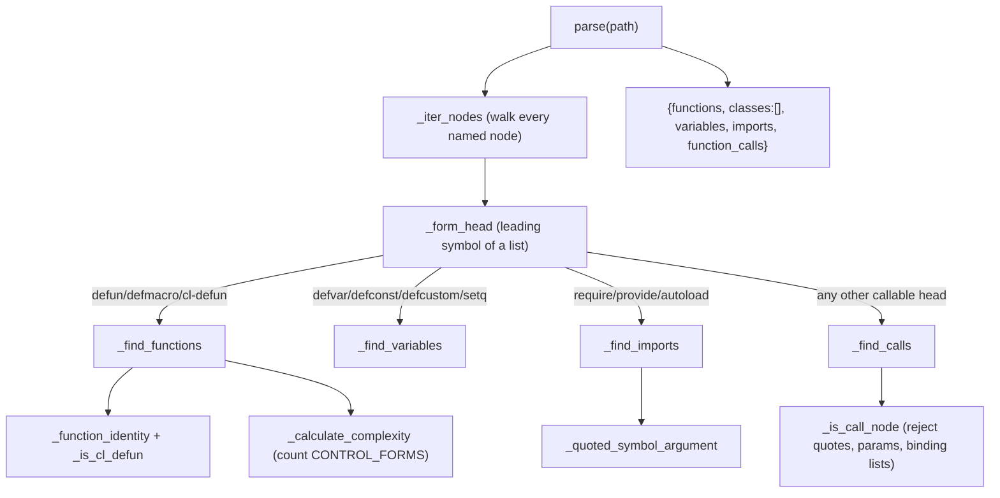

# Emacs Lisp extractor — mapping s-expressions into the node/edge model

<!-- connect:up:begin -->
> **Cross-repo concept:** part of [multi-language-extraction](../../../concepts/multi-language-extraction.md) across this wiki's repos.
<!-- connect:up:end -->
## Overview
CodeGraphContext indexes every language into one normalized shape — a dict of
`functions`, `classes`, `variables`, `imports`, `function_calls` — that later
becomes graph nodes and edges. For imperative languages tree-sitter hands the
extractor *distinct* node types (a `call_expression`, a `function_definition`),
so classification is nearly free. Emacs Lisp only partly fits that pattern: the
grammar *does* give `defun`/`defmacro` their own dedicated node types
(`function_definition`, `macro_definition`) and groups many core forms under a
`special_form` node type — but an ordinary call, a `defcustom`, and the
`require`/`provide`/`autoload` imports all land as the same generic
`list` node `(head arg …)`, indistinguishable by type alone; only the
**leading symbol** ("head") tells those apart. The whole
[`ElispTreeSitterParser`](../catalog/src/codegraphcontext/tools/languages/elisp.md#ElispTreeSitterParser)
is therefore built around one primitive —
[`_form_head`](../catalog/src/codegraphcontext/tools/languages/elisp.md#ElispTreeSitterParser._form_head),
which reads the grammar's own keyword type for `function_definition`/
`macro_definition`/`special_form` nodes and falls back to the leading symbol
for plain `list` nodes — plus a handful of *form-name sets* that say what a
given head *means*. That single design choice is what lets a structurally
alien Lisp file land in the same node/edge model as Python or TypeScript.

## Diagram

## Design rationale (why it's built this way)
The docstring on
[`parse`](../catalog/src/codegraphcontext/tools/languages/elisp.md#ElispTreeSitterParser.parse)
— *"Parse an Emacs Lisp file and return CGC's normalized structure"* — states the
contract: whatever Lisp's shape, the output must be the shared five-key dict. The
interesting engineering is the classification layer that makes that possible.

Because tree-sitter's Elisp grammar exposes only a few generic node types
(`function_definition`, `macro_definition`, `special_form`, `list`, `symbol`,
`string`, `quote`), the parser cannot key off node type alone. Instead it keys
off the head symbol and matches it against curated sets:
[`FUNCTION_FORMS`](../catalog/src/codegraphcontext/tools/languages/elisp.md#FUNCTION_FORMS),
[`VARIABLE_FORMS`](../catalog/src/codegraphcontext/tools/languages/elisp.md#VARIABLE_FORMS),
[`IMPORT_FORMS`](../catalog/src/codegraphcontext/tools/languages/elisp.md#IMPORT_FORMS),
[`SPECIAL_FORMS`](../catalog/src/codegraphcontext/tools/languages/elisp.md#SPECIAL_FORMS),
[`BINDING_FORMS`](../catalog/src/codegraphcontext/tools/languages/elisp.md#BINDING_FORMS)
and
[`CONTROL_FORMS`](../catalog/src/codegraphcontext/tools/languages/elisp.md#CONTROL_FORMS).
The whole "what is *not* a real call" problem is then solved by set union:
[`CALL_EXCLUDED_FORMS`](../catalog/src/codegraphcontext/tools/languages/elisp.md#CALL_EXCLUDED_FORMS)
is literally `FUNCTION_FORMS | VARIABLE_FORMS | IMPORT_FORMS | SPECIAL_FORMS |
BINDING_FORMS` — a list whose head is any of those is a definition or a control
construct, not a function call, so it is excluded.

> [!inferred]
> The author keeps a parallel `ELISP_QUERIES` block of tree-sitter S-expression
> queries at the top of the module, but the live extraction path is the manual
> `_iter_nodes` + `_form_head` walk documented here, not those queries. Reading
> the code, the queries appear to be reference/documentation of the shapes the
> hand-written classifier targets rather than the executed mechanism.

A second deliberate decision: **`classes` is always `[]`**. Lisp in this model
has no class construct (EIEIO `defclass`/CLOS is not handled), so
[`parse`](../catalog/src/codegraphcontext/tools/languages/elisp.md#ElispTreeSitterParser.parse)
hardcodes the empty list rather than pretending. This is the clearest case of
"what doesn't map cleanly": the inheritance axis that other language extractors
populate simply has no source here.

## Entry points
- [`parse`](../catalog/src/codegraphcontext/tools/languages/elisp.md#ElispTreeSitterParser.parse)
  is the public per-file entry, called by the indexing pipeline once tree-sitter
  has a parser for `.el` files. It reads the file (with `errors="ignore"` so a
  bad byte never aborts a scan), parses to a tree, and fans out to the four
  finders; any exception is swallowed and reported via
  [`error_logger`](../catalog/src/codegraphcontext/utils/debug_log.md#error_logger)
  so one unparseable file returns `{"path", "error"}` instead of killing the run.
- [`pre_scan_elisp`](../catalog/src/codegraphcontext/tools/languages/elisp.md#pre_scan_elisp)
  is the *cross-file resolution* entry. Its docstring — *"Scan Emacs Lisp files
  to map functions, macros, variables, and provided features to file paths"* —
  says it builds a `name → [file paths]` index so that a `require` in one file
  can later be resolved to the file that `provide`s the feature. It reuses the
  same finders (`_find_functions`, `_find_variables`,
  [`_find_imports`](../catalog/src/codegraphcontext/tools/languages/elisp.md#ElispTreeSitterParser._find_imports)),
  and notably only indexes imports whose `import_type == "provide"` — i.e. it
  treats `provide` as the *export* side of the feature system.
- [`_register_prescans`](../catalog/src/codegraphcontext/tools/indexing/pre_scan.md#_register_prescans)
  is where Elisp joins the multi-language roster: it imports the `elisp` module
  alongside python, javascript, go, rust, … and wires `pre_scan_elisp` into the
  extension→pre-scan dispatch table. This is the seam that makes Elisp one of
  many peers rather than a special case.

## Mechanism (step-by-step)
1. **One walk, four passes.**
   [`parse`](../catalog/src/codegraphcontext/tools/languages/elisp.md#ElispTreeSitterParser.parse)
   parses the file once, then calls
   [`_find_functions`](../catalog/src/codegraphcontext/tools/languages/elisp.md#ElispTreeSitterParser._find_functions),
   `_find_variables`,
   [`_find_imports`](../catalog/src/codegraphcontext/tools/languages/elisp.md#ElispTreeSitterParser._find_imports),
   and
   [`_find_calls`](../catalog/src/codegraphcontext/tools/languages/elisp.md#ElispTreeSitterParser._find_calls).
   Each independently re-walks the tree via
   [`_iter_nodes`](../catalog/src/codegraphcontext/tools/languages/elisp.md#ElispTreeSitterParser._iter_nodes),
   a recursive generator that yields every *named* node depth-first. There is no
   shared visitor; each finder filters the full node stream itself.

2. **Head classification is the whole game.**
   [`_form_head`](../catalog/src/codegraphcontext/tools/languages/elisp.md#ElispTreeSitterParser._form_head)
   returns the leading symbol's text for a `list`, or the keyword type for the
   grammar's dedicated `function_definition`/`macro_definition`/`special_form`
   nodes. Every downstream decision — is this a definition, a variable, an
   import, a call, a control construct — is a set-membership test on that string.
   This is the adaptation Lisp forces: imperative extractors branch on node
   *type*; here they branch on the head *symbol*.

3. **Functions: three shapes, one identity.**
   [`_find_functions`](../catalog/src/codegraphcontext/tools/languages/elisp.md#ElispTreeSitterParser._find_functions)
   accepts nodes of type `function_definition`/`macro_definition` *and* plain
   lists that
   [`_is_cl_defun`](../catalog/src/codegraphcontext/tools/languages/elisp.md#ElispTreeSitterParser._is_cl_defun)
   recognizes (a `list` whose head is `cl-defun`, which the grammar does *not*
   give a dedicated node type). Name and kind come from
   [`_function_identity`](../catalog/src/codegraphcontext/tools/languages/elisp.md#ElispTreeSitterParser._function_identity),
   which uses `child_by_field_name("name")` for the native forms but positional
   `_named_children` for the `cl-defun` list. Parameters are located by
   [`_parameter_node`](../catalog/src/codegraphcontext/tools/languages/elisp.md#ElispTreeSitterParser._parameter_node)
   and flattened by
   [`_extract_parameters`](../catalog/src/codegraphcontext/tools/languages/elisp.md#ElispTreeSitterParser._extract_parameters),
   which drops Lisp lambda-list markers (anything starting with `&`, e.g.
   `&optional`, `&rest`) and descends into `(name default)` destructuring lists.
   A `(start_byte, end_byte)` `seen` set dedupes. `defun`/`cl-defun` and
   `defmacro` land in distinct grammar node types (`function_definition` vs.
   `macro_definition`), but
   [`_function_identity`](../catalog/src/codegraphcontext/tools/languages/elisp.md#ElispTreeSitterParser._function_identity),
   [`_parameter_node`](../catalog/src/codegraphcontext/tools/languages/elisp.md#ElispTreeSitterParser._parameter_node),
   and
   [`_function_docstring`](../catalog/src/codegraphcontext/tools/languages/elisp.md#ElispTreeSitterParser._function_docstring)
   all test membership in the same two-element set and treat both identically;
   the emitted record's `type` field comes from the `kind` string (the literal
   head keyword, e.g. `defun`/`defmacro`) rather than from `node.type`.

4. **Variables: heads with different argument positions.**
   `_find_variables` branches per head:
   [`VARIABLE_FORMS`](../catalog/src/codegraphcontext/tools/languages/elisp.md#VARIABLE_FORMS)
   members `defvar`/`defconst` take the name at child 0, `defcustom` at child 1,
   and `setq` interleaves `name value name value …` so it loops in pairs — a
   single `setq` form can emit *several* variable records. Each is materialized
   by
   [`_append_variable`](../catalog/src/codegraphcontext/tools/languages/elisp.md#ElispTreeSitterParser._append_variable),
   which resolves the enclosing function for `context` and, when source-indexing
   is on, pulls the doc via
   [`_variable_docstring`](../catalog/src/codegraphcontext/tools/languages/elisp.md#ElispTreeSitterParser._variable_docstring).

5. **Imports: the require/provide/autoload triad.**
   [`_find_imports`](../catalog/src/codegraphcontext/tools/languages/elisp.md#ElispTreeSitterParser._find_imports)
   fires on heads in
   [`IMPORT_FORMS`](../catalog/src/codegraphcontext/tools/languages/elisp.md#IMPORT_FORMS).
   The imported feature name is a *quoted symbol* (`(require 'foo)`), extracted by
   [`_quoted_symbol_argument`](../catalog/src/codegraphcontext/tools/languages/elisp.md#ElispTreeSitterParser._quoted_symbol_argument)
   → [`_first_symbol_in_quote`](../catalog/src/codegraphcontext/tools/languages/elisp.md#ElispTreeSitterParser._first_symbol_in_quote).
   `autoload` additionally reads a third positional string (the source file) via
   [`_string_value`](../catalog/src/codegraphcontext/tools/languages/elisp.md#ElispTreeSitterParser._string_value).
   The head itself is stored as `import_type`, which is how `provide` (an
   *export*) rides in the imports slot and is later filtered by
   [`pre_scan_elisp`](../catalog/src/codegraphcontext/tools/languages/elisp.md#pre_scan_elisp).

6. **Calls: everything else that looks callable.**
   [`_find_calls`](../catalog/src/codegraphcontext/tools/languages/elisp.md#ElispTreeSitterParser._find_calls)
   treats a `list` as a call when
   [`_is_call_node`](../catalog/src/codegraphcontext/tools/languages/elisp.md#ElispTreeSitterParser._is_call_node)
   passes — i.e. the head is a symbol, is not a keyword/`&`-marker, is not in
   [`CALL_EXCLUDED_FORMS`](../catalog/src/codegraphcontext/tools/languages/elisp.md#CALL_EXCLUDED_FORMS),
   and the list is not itself quoted data
   ([`_has_quote_ancestor`](../catalog/src/codegraphcontext/tools/languages/elisp.md#ElispTreeSitterParser._has_quote_ancestor)),
   a parameter list
   ([`_has_parameter_list_ancestor`](../catalog/src/codegraphcontext/tools/languages/elisp.md#ElispTreeSitterParser._has_parameter_list_ancestor)),
   or a `let`/`dolist` binding list
   ([`_is_binding_list`](../catalog/src/codegraphcontext/tools/languages/elisp.md#ElispTreeSitterParser._is_binding_list)).
   Higher-order dispatch is unwrapped: for `funcall`/`apply` the *real* target is
   the quoted symbol argument, so those record the callee's name (with
   `skip_first=2`), not `funcall`. Each accepted call is recorded by
   [`_append_call`](../catalog/src/codegraphcontext/tools/languages/elisp.md#ElispTreeSitterParser._append_call),
   which attaches the enclosing function so the graph gets a real caller→callee
   edge.

7. **Complexity as a control-form count.**
   [`_calculate_complexity`](../catalog/src/codegraphcontext/tools/languages/elisp.md#ElispTreeSitterParser._calculate_complexity)
   starts at 1 and increments once per node whose head is in
   [`CONTROL_FORMS`](../catalog/src/codegraphcontext/tools/languages/elisp.md#CONTROL_FORMS)
   (`if`, `cond`, `when`, `while`, `and`/`or`, …) — an s-expression analogue of
   cyclomatic complexity. Its inner
   [`traverse`](../catalog/src/codegraphcontext/tools/languages/elisp.md#ElispTreeSitterParser.traverse)
   is bounded by
   [`MAX_AST_DEPTH`](../catalog/src/codegraphcontext/tools/indexing/constants.md#MAX_AST_DEPTH)
   (200); overrun sets a flag and emits
   [`warning_logger`](../catalog/src/codegraphcontext/utils/debug_log.md#warning_logger)
   noting the count may be underestimated — a deliberate guard against pathologically
   deeply-nested Lisp blowing the Python recursion stack.

## Key data structures
- **The normalized dict** returned by
  [`parse`](../catalog/src/codegraphcontext/tools/languages/elisp.md#ElispTreeSitterParser.parse):
  `{path, functions, classes, variables, imports, function_calls, is_dependency,
  lang}`, with `classes` always empty and `lang` fixed to
  [`language_name`](../catalog/src/codegraphcontext/tools/languages/elisp.md#ElispTreeSitterParser.language_name)
  = `"elisp"`. This uniform shape is the contract with the rest of the pipeline.
- **The form-name sets** (`FUNCTION_FORMS`, `VARIABLE_FORMS`, `IMPORT_FORMS`,
  `SPECIAL_FORMS`, `BINDING_FORMS`, `CONTROL_FORMS`, and the derived
  [`CALL_EXCLUDED_FORMS`](../catalog/src/codegraphcontext/tools/languages/elisp.md#CALL_EXCLUDED_FORMS)).
  These *are* the language model: the classifier's entire knowledge of Elisp
  semantics lives in these string sets.
- **`index_source` flag** on
  [`index_source`](../catalog/src/codegraphcontext/tools/languages/elisp.md#ElispTreeSitterParser.index_source):
  when false (default), function/variable records omit raw `source` and
  `docstring` to stay lean; `parse` flips it per call.
- **`imports_map`** built by
  [`pre_scan_elisp`](../catalog/src/codegraphcontext/tools/languages/elisp.md#pre_scan_elisp):
  `name → [resolved file paths]`, spanning defined functions, `VARIABLE_FORMS`
  variables, and `provide`d features — the substrate for cross-file `require`
  resolution.

## Dynamics (design intent)
Extraction is single-file and stateless: [`parse`](../catalog/src/codegraphcontext/tools/languages/elisp.md#ElispTreeSitterParser.parse)
holds no state between files beyond the `index_source` toggle, so files can be
processed independently. Cross-file linkage is deferred entirely to the pre-scan
phase, where
[`pre_scan_elisp`](../catalog/src/codegraphcontext/tools/languages/elisp.md#pre_scan_elisp)
builds the feature index before the main index run, matching the two-phase design
shared with the other languages registered in
[`_register_prescans`](../catalog/src/codegraphcontext/tools/indexing/pre_scan.md#_register_prescans).
Logging is gated centrally:
[`warning_logger`](../catalog/src/codegraphcontext/utils/debug_log.md#warning_logger)
and
[`error_logger`](../catalog/src/codegraphcontext/utils/debug_log.md#error_logger)
consult
[`_should_log`](../catalog/src/codegraphcontext/utils/debug_log.md#_should_log)
so a large scan's parse failures are throttled by configured level rather than
flooding output.

## Edge cases
- **`cl-defun` is invisible to the grammar** — it is a plain `list`, not a
  `function_definition`, so
  [`_is_cl_defun`](../catalog/src/codegraphcontext/tools/languages/elisp.md#ElispTreeSitterParser._is_cl_defun)
  must be threaded through identity, parameters, and docstring extraction as a
  special case everywhere.
- **Quoted lists are data, not code.** `'(if x y)` looks exactly like a call;
  [`_has_quote_ancestor`](../catalog/src/codegraphcontext/tools/languages/elisp.md#ElispTreeSitterParser._has_quote_ancestor)
  suppresses it so quoted forms never emit phantom calls.
- **Binding lists mimic calls.** In `(let ((x 1)) …)` the `(x 1)` pair is a
  `list` whose head `x` looks like a callee;
  [`_is_binding_list`](../catalog/src/codegraphcontext/tools/languages/elisp.md#ElispTreeSitterParser._is_binding_list)
  walks parent/grandparent to recognize `let`/`let*`/`dolist`/`dotimes` binding
  positions and reject them.
- **Lambda-list markers pollute params.** `&optional`/`&rest`/`&key` are symbols
  in the parameter list;
  [`_extract_parameters`](../catalog/src/codegraphcontext/tools/languages/elisp.md#ElispTreeSitterParser._extract_parameters)
  filters any name starting with `&`.
- **String literal decoding.**
  [`_string_value`](../catalog/src/codegraphcontext/tools/languages/elisp.md#ElispTreeSitterParser._string_value)
  runs `ast.literal_eval` to unescape, falling back to stripping surrounding
  quotes if that raises — so a docstring with unusual escaping still yields text.
- **Deep nesting.** complexity traversal silently caps at `MAX_AST_DEPTH` and
  warns rather than recursing unbounded.

## Open questions
- The `ELISP_QUERIES` tree-sitter query strings at module top are not in this
  packet's subgraph and appear unused by the live path; whether any other stage
  consumes them is unresolved here.
- `keymap`/advice/`define-*` macros and EIEIO `defclass` are not in any form set,
  so definitions expressed through them are not captured as functions, variables,
  or classes — presumably an accepted coverage gap, but the source does not say.
- How the normalized dict's `context` tuple (enclosing function) is consumed when
  building caller→callee edges lives in the graph-builder stage, outside this
  packet.

## See also
- [Kotlin extractor](codegraphcontext-tools-languages-kotlin.md) — sibling language, imperative/OO baseline for contrast.
- [TypeScript extractor](codegraphcontext-tools-languages-typescript.md) — sibling language extractor.
- [graph_builder](codegraphcontext-tools-graph_builder.md) — consumes the normalized dict into graph nodes/edges.
- [tree_sitter_manager](codegraphcontext-utils-tree_sitter_manager.md) — supplies the parser wrapper each extractor wraps.
