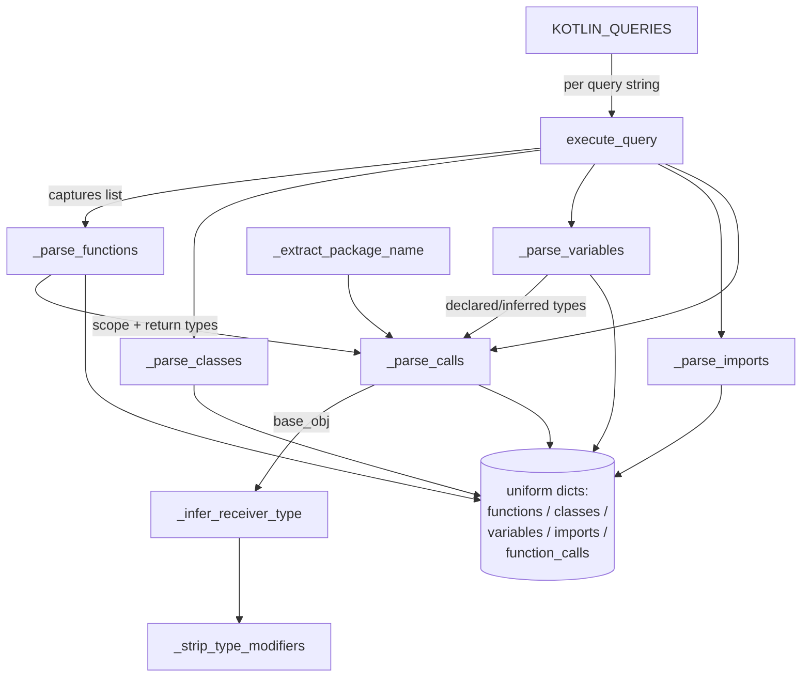
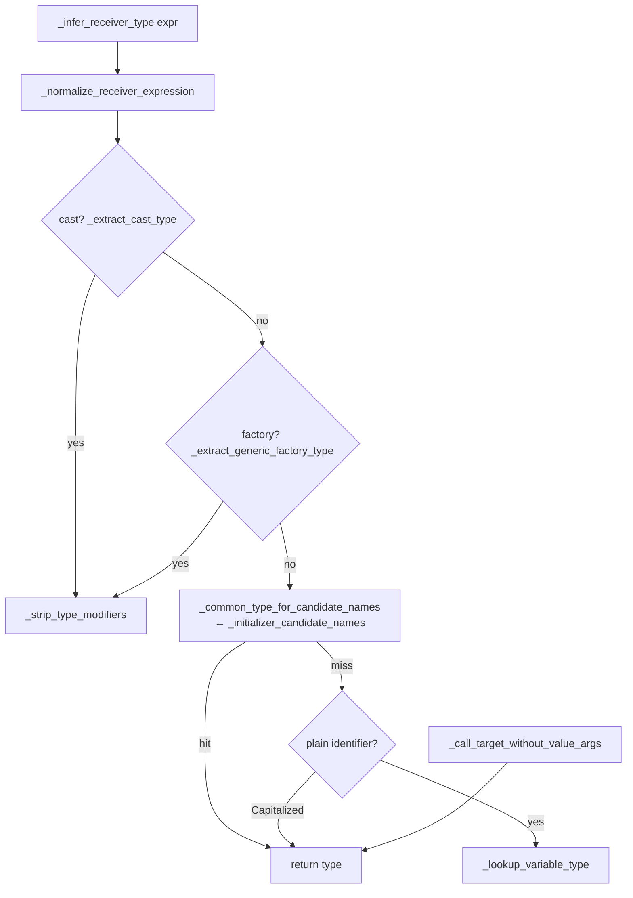

# Kotlin extractor: tree-sitter syntax → language-agnostic graph

<!-- connect:up:begin -->
> **Cross-repo concept:** part of [multi-language-extraction](../../../concepts/multi-language-extraction.md), [symbol-graph](../../../concepts/symbol-graph.md) across this wiki's repos.
<!-- connect:up:end -->
## Overview
`KotlinTreeSitterParser` is one **per-language module** in CodeGraphContext's
plug-in extractor family. Its whole job is to turn a single Kotlin source file into
the tool's *uniform, language-agnostic dictionaries* — functions, classes,
interfaces, objects, variables, typealiases, imports, and function-calls — that a
downstream loader turns into graph nodes and `CALLS`/`INHERITS`/`IMPORTS` edges in
the store. Every language module honours the same **contract**: a set of
tree-sitter S-expression queries ([`KOTLIN_QUERIES`](../catalog/src/codegraphcontext/tools/languages/kotlin.md#KOTLIN_QUERIES)),
one dispatch method that runs them and fans the captures out to per-kind
`_parse_*` builders, and a common return shape keyed by `lang`
([`language_name`](../catalog/src/codegraphcontext/tools/languages/kotlin.md#KotlinTreeSitterParser.language_name) = `"kotlin"`).
Read this page as the **template every language extractor follows**, with Kotlin's
distinguishing feature — a deep, heuristic **receiver-type inference** engine
(`_infer_receiver_type` and its helpers) — foregrounded, because that is what lets
a call like `foo.bar()` be resolved to the *concrete* type of `foo` so the call
edge lands on the right method node.

## Diagram

## Design rationale (why it's built this way)
The uniform-dict contract is what makes CodeGraphContext multi-language: the store
and query layer never see Kotlin syntax, only the same node/edge dicts every
extractor emits, so adding a language is "write another `_parse_*` family," not
"touch the graph model." The interesting design tension is Kotlin-specific.
Tree-sitter gives an **untyped** syntax tree — it knows `foo.bar()` is a
navigation-then-call, but not what `foo` *is*. A call graph is only useful if
`bar()` resolves to a method on a real type, so this module invests heavily in
recovering receiver types *statically, without a compiler*, from declarations,
initializers, casts, smart-casts, and scope-function lambdas. That is why the
subgraph is dominated by inference helpers rather than parsing code.

The consistent choice throughout is **degrade gracefully, never guess wrong**:
[`_strip_type_modifiers`](../catalog/src/codegraphcontext/tools/languages/kotlin.md#KotlinTreeSitterParser._strip_type_modifiers)
(delegating to the shared
[`strip_type_modifiers`](../catalog/src/codegraphcontext/tools/type_utils.md#strip_type_modifiers))
reduces `List<T>?` to just `List` — its docstring is explicit: *"Return the receiver
type CGC can resolve."* An unresolvable type becomes `"Unknown"` rather than a
fabricated node, and inference helpers return `None` on any doubt. The parser also
never lets one bad node kill a file: builders wrap each node in `try/except` and
[`error_logger`](../catalog/src/codegraphcontext/utils/debug_log.md#error_logger)
the failure, and the top-level `parse` returns empty lists on total failure — a
malformed file drops out of the graph instead of aborting the index.

> [!inferred]
> The name "CGC can resolve" (in the docstring) implies type strings are later
> matched by exact name against class nodes in the store; generics/nullability
> would never match, so they are stripped at extraction time. The matching itself
> lives in the loader, outside this packet.

## Entry points
- **The query table + dispatch.**
  [`KOTLIN_QUERIES`](../catalog/src/codegraphcontext/tools/languages/kotlin.md#KOTLIN_QUERIES)
  is a dict of tree-sitter query strings, one per node kind (`functions`,
  `classes`, `imports`, `calls`, `variables`). The `parse` method (the contract
  entry, not in this subgraph — see Open questions) stores the
  [`index_source`](../catalog/src/codegraphcontext/tools/languages/kotlin.md#KotlinTreeSitterParser.index_source)
  flag on the instance, computes the package via
  [`_extract_package_name`](../catalog/src/codegraphcontext/tools/languages/kotlin.md#KotlinTreeSitterParser._extract_package_name),
  and runs each query against the parsed tree through
  [`execute_query`](../catalog/src/codegraphcontext/utils/tree_sitter_manager.md#execute_query),
  which is the compatibility shim that normalises the tree-sitter 0.22+ /
  QueryCursor result back to the old `(node, capture_name)` tuple list every
  builder expects. Control reaches here once per file the indexer visits.
- **The type-inference core.**
  [`_infer_receiver_type`](../catalog/src/codegraphcontext/tools/languages/kotlin.md#KotlinTreeSitterParser._infer_receiver_type)
  is where every call with a receiver (`base_obj`) lands to answer "what type is the
  thing before the dot?". It orchestrates the cast / factory / variable-lookup
  helpers below and is the reason a Kotlin call edge can be typed at all.

## Mechanism (step-by-step)
1. **Order matters: functions, then variables, then everything else.** `parse`
   runs the `functions` query first and builds function records with
   [`_parse_functions`](../catalog/src/codegraphcontext/tools/languages/kotlin.md#KotlinTreeSitterParser._parse_functions),
   which reads the name, parameter names/types/defaults
   ([`_extract_parameter_names`](../catalog/src/codegraphcontext/tools/languages/kotlin.md#KotlinTreeSitterParser._extract_parameter_names),
   [`_extract_parameter_types`](../catalog/src/codegraphcontext/tools/languages/kotlin.md#KotlinTreeSitterParser._extract_parameter_types),
   [`_extract_parameter_defaults`](../catalog/src/codegraphcontext/tools/languages/kotlin.md#KotlinTreeSitterParser._extract_parameter_defaults)),
   the `receiver_type` (extension functions), and a `return_type` — inferring it
   from an expression body via
   [`_extract_initializer_type`](../catalog/src/codegraphcontext/tools/languages/kotlin.md#KotlinTreeSitterParser._extract_initializer_type)
   when no explicit type is written. Variables are parsed *after* functions on
   purpose (per the source comment) so their fallback destructuring can inherit the
   enclosing function's scope.
2. **Structural facts become nodes.**
   [`_parse_classes`](../catalog/src/codegraphcontext/tools/languages/kotlin.md#KotlinTreeSitterParser._parse_classes)
   splits one `classes` query into three buckets — classes, interfaces (a
   `class_declaration` whose children include an `interface`), and objects
   (`object_declaration` / `companion_object`) — and walks `delegation_specifier`
   children to fill a `bases` list; those base names are what the loader turns into
   `INHERITS`/`IMPLEMENTS` edges. This is the concrete Kotlin→graph mapping: a
   `type_identifier` becomes a class node's `name`, a delegation specifier becomes
   an inheritance edge.
   [`_parse_imports`](../catalog/src/codegraphcontext/tools/languages/kotlin.md#KotlinTreeSitterParser._parse_imports)
   strips the `import ` keyword and any ` as ` alias to record import edges, and
   [`_parse_typealiases`](../catalog/src/codegraphcontext/tools/languages/kotlin.md#KotlinTreeSitterParser._parse_typealiases)
   captures `typealias` declarations by regex (there is no query for them).
3. **Every node's identity comes from two shared primitives.**
   [`_get_node_text`](../catalog/src/codegraphcontext/tools/languages/kotlin.md#KotlinTreeSitterParser._get_node_text)
   (the most-called helper in the module — it just UTF-8-decodes `node.text`)
   supplies names and source slices, and
   [`_get_parent_context`](../catalog/src/codegraphcontext/tools/languages/kotlin.md#KotlinTreeSitterParser._get_parent_context)
   walks *up* the tree to find the enclosing function/class/object, returning a
   `(name, node_type, line_number)` triple; the caller then derives the boolean
   `class_context` from `node_type` — this is how a nested function or method is
   attached to its owner in the graph rather than floating at file scope.
4. **Variable typing feeds call resolution.**
   [`_parse_variables`](../catalog/src/codegraphcontext/tools/languages/kotlin.md#KotlinTreeSitterParser._parse_variables)
   handles `val`/`var` properties, constructor `class_parameter`s, function
   `parameter`s, and destructuring declarations. When a variable has no explicit
   type it infers one from the initializer
   ([`_extract_initializer_type`](../catalog/src/codegraphcontext/tools/languages/kotlin.md#KotlinTreeSitterParser._extract_initializer_type)),
   and it also records softer hints —
   [`_initializer_member_hint`](../catalog/src/codegraphcontext/tools/languages/kotlin.md#KotlinTreeSitterParser._initializer_member_hint),
   [`_initializer_collection_return_hint`](../catalog/src/codegraphcontext/tools/languages/kotlin.md#KotlinTreeSitterParser._initializer_collection_return_hint),
   and candidate names from
   [`_initializer_candidate_names`](../catalog/src/codegraphcontext/tools/languages/kotlin.md#KotlinTreeSitterParser._initializer_candidate_names)
   (which handles elvis `?:`, `if`, and `when` branches, taking the common type of
   all arms). These type maps are exactly the input the call parser consumes next.
5. **Calls become typed edges.**
   [`_parse_calls`](../catalog/src/codegraphcontext/tools/languages/kotlin.md#KotlinTreeSitterParser._parse_calls)
   first builds lookup maps from the already-parsed variables and functions
   (`var_map`, `function_return_map`, `function_receiver_map`), then for each
   `call_node` capture splits it into `(call_name, base_obj)` via
   [`_extract_call_parts`](../catalog/src/codegraphcontext/tools/languages/kotlin.md#KotlinTreeSitterParser._extract_call_parts),
   extracts arguments with
   [`_extract_call_arguments`](../catalog/src/codegraphcontext/tools/languages/kotlin.md#KotlinTreeSitterParser._extract_call_arguments),
   and — when there is a receiver — routes `base_obj` through
   [`_infer_receiver_type`](../catalog/src/codegraphcontext/tools/languages/kotlin.md#KotlinTreeSitterParser._infer_receiver_type).
   Constructor invocations, `this`/`super` delegation, and callable references
   (`::foo`) are each special-cased so a `class`, a superclass, or a method
   reference resolves correctly.
6. **Receiver inference is a waterfall of cheap-to-expensive guesses.** Inside
   [`_infer_receiver_type`](../catalog/src/codegraphcontext/tools/languages/kotlin.md#KotlinTreeSitterParser._infer_receiver_type)
   the expression is first canonicalised by
   [`_normalize_receiver_expression`](../catalog/src/codegraphcontext/tools/languages/kotlin.md#KotlinTreeSitterParser._normalize_receiver_expression)
   (drops `?.` safe-calls, `!!` assertions, outer parens), then tried against, in
   order: an explicit cast
   ([`_extract_cast_type`](../catalog/src/codegraphcontext/tools/languages/kotlin.md#KotlinTreeSitterParser._extract_cast_type)),
   a generic factory like `mutableListOf<Foo>()`
   ([`_extract_generic_factory_type`](../catalog/src/codegraphcontext/tools/languages/kotlin.md#KotlinTreeSitterParser._extract_generic_factory_type)),
   a common type over candidate names
   ([`_common_type_for_candidate_names`](../catalog/src/codegraphcontext/tools/languages/kotlin.md#KotlinTreeSitterParser._common_type_for_candidate_names)),
   the literal `this` (→ enclosing class), a plain variable
   ([`_lookup_variable_type`](../catalog/src/codegraphcontext/tools/languages/kotlin.md#KotlinTreeSitterParser._lookup_variable_type)),
   a Capitalized bare name (assumed to be a type itself), and finally a chained
   call target
   ([`_call_target_without_value_args`](../catalog/src/codegraphcontext/tools/languages/kotlin.md#KotlinTreeSitterParser._call_target_without_value_args)).
   First hit wins; anything unresolved returns `None`.
7. **Kotlin idioms get dedicated recovery.** Beyond the plain waterfall,
   `_parse_calls` layers Kotlin-specific hints onto the receiver type: indexed
   access `map[k]`
   ([`_indexed_access_value_type`](../catalog/src/codegraphcontext/tools/languages/kotlin.md#KotlinTreeSitterParser._indexed_access_value_type)),
   smart-casts after `is` checks in `if`/`when`
   ([`_smart_cast_receiver_hint`](../catalog/src/codegraphcontext/tools/languages/kotlin.md#KotlinTreeSitterParser._smart_cast_receiver_hint)),
   the implicit receiver inside `apply`/`run`/`with`/`let`/`also` scope-function
   lambdas
   ([`_scope_function_receiver_hint`](../catalog/src/codegraphcontext/tools/languages/kotlin.md#KotlinTreeSitterParser._scope_function_receiver_hint)),
   and collection-lambda element types for `forEach`/`map`/etc.
   ([`_collection_lambda_hint`](../catalog/src/codegraphcontext/tools/languages/kotlin.md#KotlinTreeSitterParser._collection_lambda_hint)).
   Each hint, when it fires, overwrites `inferred_type`/`extension_receiver_type` so
   the emitted call carries the most specific receiver the parser could recover.

## Key data structures
- **`KOTLIN_QUERIES`** — the declarative surface of the extractor. Each entry is a
  tree-sitter S-expression with `@name`/`@params`/`@class`/`@import`/`@call_node`/
  `@variable` captures. Adding a syntactic form to the graph means editing a query
  here, not the traversal code
  ([`KOTLIN_QUERIES`](../catalog/src/codegraphcontext/tools/languages/kotlin.md#KOTLIN_QUERIES)).
- **The output dicts** — the uniform contract. A function dict carries
  `name/args/arg_types/return_type/receiver_type/context/class_context`; a class
  dict carries `name/node_type/bases/node_label`; a call dict carries
  `name/full_name/base_obj/inferred_obj_type/extension_receiver_type/
  scope_receiver_type/enclosing_class/context`. The rich per-call type fields are
  what let the loader disambiguate overloaded/inherited targets. Built in
  [`_parse_calls`](../catalog/src/codegraphcontext/tools/languages/kotlin.md#KotlinTreeSitterParser._parse_calls).
- **The scope/type maps** — `var_map` and `raw_var_map` (name+scope → type),
  `var_declarations` (line-aware, so a redeclared name resolves to the type live at
  the call's line via
  [`_lookup_scoped_declaration_type`](../catalog/src/codegraphcontext/tools/languages/kotlin.md#KotlinTreeSitterParser._lookup_scoped_declaration_type)
  and
  [`_unique_variable_type`](../catalog/src/codegraphcontext/tools/languages/kotlin.md#KotlinTreeSitterParser._unique_variable_type)),
  `function_return_map`, and `function_receiver_map`. Scope keys come from
  [`function_scope_for_line`](../catalog/src/codegraphcontext/tools/languages/kotlin.md#KotlinTreeSitterParser.function_scope_for_line)
  and
  [`variable_scope`](../catalog/src/codegraphcontext/tools/languages/kotlin.md#KotlinTreeSitterParser.variable_scope).

## Dynamics (design intent)
Extraction is single-pass and file-local — there is no cross-file resolution in
this module; each file is parsed independently and receiver types are resolved only
from what is visible in that file (declarations, initializers, imports as names).
The ordering inside `parse` is a genuine data dependency, not incidental: functions
before variables (destructuring scope), and both before calls (the call parser
reads the function/variable type maps). The `index_source` flag
([`index_source`](../catalog/src/codegraphcontext/tools/languages/kotlin.md#KotlinTreeSitterParser.index_source))
toggles whether the full source slice is attached to each node — off by default to
keep node payloads small, on when the graph is meant to serve source back to an
agent. Logging is level-gated through
[`warning_logger`](../catalog/src/codegraphcontext/utils/debug_log.md#warning_logger)
/ [`error_logger`](../catalog/src/codegraphcontext/utils/debug_log.md#error_logger)
→ [`_should_log`](../catalog/src/codegraphcontext/utils/debug_log.md#_should_log)
→ [`_get_config_value`](../catalog/src/codegraphcontext/utils/debug_log.md#_get_config_value)
→ [`get_config_value`](../catalog/src/codegraphcontext/cli/config_manager.md#get_config_value),
writing to the shared [`logger`](../catalog/src/codegraphcontext/utils/debug_log.md#logger).

## Edge cases
- **Empty / whitespace-only files** short-circuit to all-empty dicts with a
  [`warning_logger`](../catalog/src/codegraphcontext/utils/debug_log.md#warning_logger),
  so blank files still produce a well-formed (empty) result.
- **Deduplication.** `_parse_functions` and `_parse_classes` key on
  `(start_byte, end_byte, node.type)` to skip nodes a query captured twice; calls
  track `seen_calls` similarly.
- **Explicit delegation (`class X by y`)** is recognised as a
  `delegation_specifier` but the `explicit_delegation` branch is a deliberate no-op
  in [`_parse_classes`](../catalog/src/codegraphcontext/tools/languages/kotlin.md#KotlinTreeSitterParser._parse_classes)
  — delegated interfaces are not yet turned into edges.
- **Unresolvable receivers** yield `inferred_obj_type = None`; the call is still
  emitted (so the edge exists by name) but is untyped, which the loader must
  tolerate.
- **`super` delegation** sets both `call_name` and `base_obj` to `"super"`; `this`
  delegation resolves to the enclosing class name — both via the
  `constructor_delegation_call` branch in
  [`_parse_calls`](../catalog/src/codegraphcontext/tools/languages/kotlin.md#KotlinTreeSitterParser._parse_calls).
- **Anonymous / companion objects** get synthetic names (`"AnonymousObject"`,
  `"Companion"`) from
  [`_get_parent_context`](../catalog/src/codegraphcontext/tools/languages/kotlin.md#KotlinTreeSitterParser._get_parent_context)
  so nested members still have a nameable owner.

## Open questions
- The contract entry `parse` (line 65) and helpers like `_extract_initializer_text`
  and `_split_top_level_operator` are referenced by in-subgraph symbols but are not
  themselves in this packet's subgraph, so this page cites the flag
  [`index_source`](../catalog/src/codegraphcontext/tools/languages/kotlin.md#KotlinTreeSitterParser.index_source)
  and [`KOTLIN_QUERIES`](../catalog/src/codegraphcontext/tools/languages/kotlin.md#KOTLIN_QUERIES)
  for the dispatch step rather than the method itself. The exact interface the
  generic parser wrapper exposes (`self.language`
  [`language`](../catalog/src/codegraphcontext/tools/languages/kotlin.md#KotlinTreeSitterParser.language),
  `self.parser`) is defined at construction, outside the packet.
- How the emitted dicts are turned into store nodes/edges (the loader that consumes
  `inferred_obj_type`, `bases`, `full_import_name`) is downstream of this module and
  not visible here.
- [`find_child_text`](../catalog/src/codegraphcontext/tools/languages/kotlin.md#pre_scan_kotlin.find_child_text)
  belongs to a `pre_scan_kotlin` function (a separate pre-scan pass) whose role
  relative to `KotlinTreeSitterParser` is not settled by this packet.

## See also
- `wiki/code/codegraphcontext/overview.md` — where the language extractors sit in
  the indexing pipeline.
- Sibling per-language extractor concept pages (other `tools/languages/*` modules)
  — same contract, different queries.
- The cross-repo concept page for **multi-language-extraction** — how CGC's
  tree-sitter approach compares to the other surveyed tools' grounding substrates.
