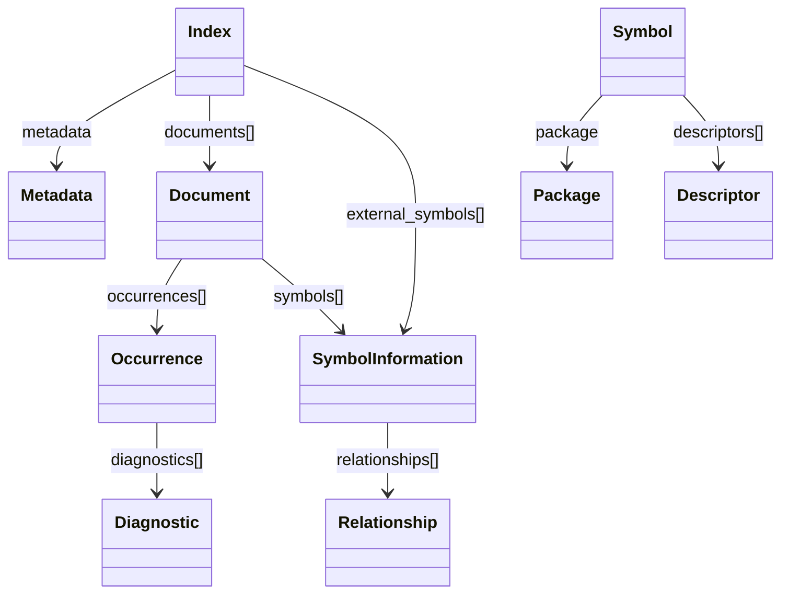

# SCIP schema (scip_pb2) — the cross-language grounding substrate

<!-- connect:up:begin -->
> **Cross-repo concept:** part of [scip-grounding](../../../concepts/scip-grounding.md) across this wiki's repos.
<!-- connect:up:end -->
`scip_pb2.py` is the protoc-generated Python binding for Sourcegraph's **SCIP**
(SCIP Code Intelligence Protocol) schema — `scip.proto`, package `scip`. It contributes
no algorithm of its own; it defines the *wire format* that CodeGraphContext parses when it
wants **precise, indexer-produced** symbol facts instead of its own tree-sitter heuristics.
An external SCIP indexer (scip-python, scip-typescript, rust-analyzer, …) emits an
`index.scip` blob; CodeGraphContext deserializes it through the message classes in this
module and lifts the result into Neo4j nodes and edges. This is the **scip-grounding** axis
of the survey: a language-neutral, resolver-grade symbol index that the graph builder trusts
over anything it could infer syntactically.

## Overview
The schema is a small, self-describing containment tree. An [`Index`](../catalog/src/codegraphcontext/tools/scip_pb2.md#Index)
is the root of one indexing run; it holds one [`Metadata`](../catalog/src/codegraphcontext/tools/scip_pb2.md#Metadata)
header and a list of [`Document`](../catalog/src/codegraphcontext/tools/scip_pb2.md#Document)s (one per source
file). Each document carries a stream of [`Occurrence`](../catalog/src/codegraphcontext/tools/scip_pb2.md#Occurrence)s
(every place a symbol is written or referenced, with a source range) and a set of
[`SymbolInformation`](../catalog/src/codegraphcontext/tools/scip_pb2.md#SymbolInformation) records (per-symbol
metadata: kind, documentation, relationships to other symbols). The connective tissue is a
**string symbol name** — SCIP's globally-unique moniker — which lets an occurrence in one
file point at a definition anywhere in the index. That single design choice (identity as an
opaque string rather than a pointer) is what makes the format streamable and cross-file
resolvable, and it is exactly the key CodeGraphContext joins on when it builds the graph.

## Diagram

## Design rationale (why it's built this way)
The module is machine-generated — the header literally reads *"Generated by the protocol
buffer compiler. DO NOT EDIT!"* — so the "rationale" that matters here is *why SCIP's shape
suits CodeGraphContext*, not why the descriptors look the way they do. Three decisions carry
the weight:

- **Occurrences and symbol-metadata are separated.** The bulky, positional data (every
  reference, with ranges) lives in [`Occurrence`](../catalog/src/codegraphcontext/tools/scip_pb2.md#Occurrence),
  while the rarer, richer per-symbol facts live in
  [`SymbolInformation`](../catalog/src/codegraphcontext/tools/scip_pb2.md#SymbolInformation). CodeGraphContext
  walks these in two passes for exactly this reason: first the occurrences to find *where*
  definitions are, then the symbol records to attach *what* each symbol is.
- **Roles are a bitmask, not an enum.** [`_SYMBOLROLE`](../catalog/src/codegraphcontext/tools/scip_pb2.md#_SYMBOLROLE)
  defines `Definition=1`, `Import=2`, `WriteAccess=4`, `ReadAccess=8`, etc. as powers of two,
  so one occurrence can be several things at once. The consumer's `role & 1` test for
  "is this a definition" is a direct consequence of that encoding.
- **Relationships are first-class.** [`Relationship`](../catalog/src/codegraphcontext/tools/scip_pb2.md#Relationship)
  gives the indexer a place to state `is_implementation` / `is_reference` /
  `is_type_definition` between two symbols — i.e. the inheritance and implementation edges a
  purely syntactic pass would miss. This is the most valuable thing SCIP hands the graph.

> [!inferred]
> The grounding value is asymmetric: CodeGraphContext leans on SCIP for the facts a
> tree-sitter walk cannot cheaply resolve — cross-file definition sites, canonical symbol
> identity, and inheritance/implementation relationships — and mostly ignores the parts it
> can compute itself. The message set below is broader than what the current consumer reads.

## Entry points
- [`Index`](../catalog/src/codegraphcontext/tools/scip_pb2.md#Index) — the deserialization entry
  point. CodeGraphContext's SCIP parser instantiates an empty `Index` and fills it with
  `ParseFromString(...)` over the raw `index.scip` bytes; from that one object hang all
  documents and external symbols. Reaching this object *is* the moment the tool switches from
  its own parsing to trusting the external indexer.
- [`Document`](../catalog/src/codegraphcontext/tools/scip_pb2.md#Document) — reached by iterating
  `Index.documents`. Each carries a `relative_path` (the file identity used for graph File
  nodes), its occurrence stream, and its symbol records. It is the unit of per-file iteration.
- [`Metadata`](../catalog/src/codegraphcontext/tools/scip_pb2.md#Metadata) — the run header, reached
  once per index. It records the protocol version, the [`ToolInfo`](../catalog/src/codegraphcontext/tools/scip_pb2.md#ToolInfo)
  (which indexer produced this), the project root, and the text encoding — the provenance a
  consumer needs to interpret ranges correctly.

## Mechanism (step-by-step)
1. **Module import registers every generated class with the shared symbol database.** At
   import, [`_sym_db`](../catalog/src/codegraphcontext/tools/scip_pb2.md#_sym_db) is bound to
   `symbol_database.Default()`, and after each message type is created it is handed back via
   `_sym_db.RegisterMessage(...)`. This only records a descriptor→generated-class mapping in
   the database's dict; it does not itself resolve cross-message field types — by the time
   `Document` registers, its `occurrences` field descriptor already carries no direct class
   reference (`message_type=None` on the raw `FieldDescriptor`, since `_DOCUMENT` is built
   before the `Occurrence` class exists). Cross-message field-type resolution is handled by the
   `FileDescriptor` construction described next.
2. **A single `FileDescriptor` carries the entire compiled schema.**
   [`DESCRIPTOR`](../catalog/src/codegraphcontext/tools/scip_pb2.md#DESCRIPTOR) is built from the
   serialized `scip.proto` (the `serialized_pb` byte blob names every message, field, and
   enum). Every other descriptor in the file — messages and enums alike — attaches to this one
   `FileDescriptor`, which is what actually lets a field typed `.scip.Occurrence` resolve to the
   right message by name, so the module is really *one* schema object decorated with typed
   accessors.
3. **Each message class is generated over its Descriptor.** The public
   [`Index`](../catalog/src/codegraphcontext/tools/scip_pb2.md#Index),
   [`Document`](../catalog/src/codegraphcontext/tools/scip_pb2.md#Document),
   [`Occurrence`](../catalog/src/codegraphcontext/tools/scip_pb2.md#Occurrence), and
   [`SymbolInformation`](../catalog/src/codegraphcontext/tools/scip_pb2.md#SymbolInformation) classes are
   produced by `GeneratedProtocolMessageType` from their private descriptors
   ([`_INDEX`](../catalog/src/codegraphcontext/tools/scip_pb2.md#_INDEX),
   [`_DOCUMENT`](../catalog/src/codegraphcontext/tools/scip_pb2.md#_DOCUMENT),
   [`_OCCURRENCE`](../catalog/src/codegraphcontext/tools/scip_pb2.md#_OCCURRENCE),
   [`_SYMBOLINFORMATION`](../catalog/src/codegraphcontext/tools/scip_pb2.md#_SYMBOLINFORMATION)). The private
   `_UPPERCASE` descriptor holds the field layout; the public class is the object a consumer
   actually reads and writes.
4. **Occurrences resolve position and role.** An [`Occurrence`](../catalog/src/codegraphcontext/tools/scip_pb2.md#Occurrence)
   pairs a `symbol` string with a `range` and a `symbol_roles` bitmask keyed to
   [`_SYMBOLROLE`](../catalog/src/codegraphcontext/tools/scip_pb2.md#_SYMBOLROLE); its `syntax_kind`
   ([`_SYNTAXKIND`](../catalog/src/codegraphcontext/tools/scip_pb2.md#_SYNTAXKIND)) and embedded
   [`Diagnostic`](../catalog/src/codegraphcontext/tools/scip_pb2.md#Diagnostic)s (severity via
   [`_SEVERITY`](../catalog/src/codegraphcontext/tools/scip_pb2.md#_SEVERITY)) round out what the file
   line means. CodeGraphContext reads `symbol_roles & Definition` here to decide which
   occurrences seed graph definition nodes.
5. **Symbol metadata enriches each definition.** For symbols already located, the consumer
   reads [`SymbolInformation`](../catalog/src/codegraphcontext/tools/scip_pb2.md#SymbolInformation)'s
   `display_name`, `documentation`, `kind`
   ([`_SYMBOLINFORMATION_KIND`](../catalog/src/codegraphcontext/tools/scip_pb2.md#_SYMBOLINFORMATION_KIND) —
   Class, Function, Method, Interface, …), and its
   [`Relationship`](../catalog/src/codegraphcontext/tools/scip_pb2.md#Relationship) list, where
   `is_implementation` yields the base/interface edges that become inheritance relationships in
   the graph.

## Key data structures
- **[`Index`](../catalog/src/codegraphcontext/tools/scip_pb2.md#Index)** — root: `metadata`,
  `documents[]`, and `external_symbols[]` (a top-level [`SymbolInformation`](../catalog/src/codegraphcontext/tools/scip_pb2.md#SymbolInformation)
  list for symbols defined outside the indexed project, e.g. library APIs).
- **[`Document`](../catalog/src/codegraphcontext/tools/scip_pb2.md#Document)** — per-file:
  `relative_path`, `language`, `occurrences[]`, `symbols[]`, and a `position_encoding`.
- **[`Occurrence`](../catalog/src/codegraphcontext/tools/scip_pb2.md#Occurrence)** — the positional
  atom: `symbol`, `range`, `symbol_roles`, `syntax_kind`, `diagnostics[]`.
- **[`SymbolInformation`](../catalog/src/codegraphcontext/tools/scip_pb2.md#SymbolInformation)** — the
  per-symbol record: `symbol`, `documentation[]`, `kind`, `display_name`, `relationships[]`.
- **[`Symbol`](../catalog/src/codegraphcontext/tools/scip_pb2.md#Symbol)** — the *structured* form of
  a symbol name: `scheme`, a [`Package`](../catalog/src/codegraphcontext/tools/scip_pb2.md#Package)
  (`manager`/`name`/`version`), and a list of
  [`Descriptor`](../catalog/src/codegraphcontext/tools/scip_pb2.md#Descriptor)s whose `suffix`
  ([`_DESCRIPTOR_SUFFIX`](../catalog/src/codegraphcontext/tools/scip_pb2.md#_DESCRIPTOR_SUFFIX):
  Namespace, Type, Term, Method, …) classifies each path component. In practice occurrences
  carry the symbol as an already-encoded string, so this parsed form is the schema's
  documentation of *how* that string is built.
- **Enums as vocabularies** — [`_LANGUAGE`](../catalog/src/codegraphcontext/tools/scip_pb2.md#_LANGUAGE)
  enumerates ~100 languages, [`_POSITIONENCODING`](../catalog/src/codegraphcontext/tools/scip_pb2.md#_POSITIONENCODING)
  and [`_TEXTENCODING`](../catalog/src/codegraphcontext/tools/scip_pb2.md#_TEXTENCODING) fix how ranges
  and text are measured, [`_PROTOCOLVERSION`](../catalog/src/codegraphcontext/tools/scip_pb2.md#_PROTOCOLVERSION)
  and [`_DIAGNOSTICTAG`](../catalog/src/codegraphcontext/tools/scip_pb2.md#_DIAGNOSTICTAG) cover
  versioning and diagnostic hints. These are the cross-language dictionaries that let one
  consumer handle every indexer's output.

## Dynamics (design intent)
This module is pure schema — there is no control flow to observe at runtime beyond
deserialization. The intent encoded in the layout is a **two-pass read**: definitions come
from occurrences (positional, role-tagged) and enrichment comes from symbol records (name,
kind, relationships), joined on the opaque `symbol` string. Because identity is a string, the
same [`SymbolInformation`](../catalog/src/codegraphcontext/tools/scip_pb2.md#SymbolInformation) can
appear as an `external_symbols` entry on the [`Index`](../catalog/src/codegraphcontext/tools/scip_pb2.md#Index)
or inside a [`Document`](../catalog/src/codegraphcontext/tools/scip_pb2.md#Document), letting a
consumer resolve references to code it never indexed.

## Edge cases
- **Local symbols.** SCIP names project-local, non-exported symbols with a `"local "` prefix;
  these are intentionally *not* globally unique, so a graph builder joining on symbol identity
  must skip them rather than merge unrelated locals.
- **Kind may be unspecified.** [`_SYMBOLINFORMATION_KIND`](../catalog/src/codegraphcontext/tools/scip_pb2.md#_SYMBOLINFORMATION_KIND)
  includes `UnspecifiedKind=0`; some indexers report 0 for everything, so downstream code
  cannot assume `kind` distinguishes a class from an interface and may need source inspection.
- **`proto3` optional-field semantics.** Every field is technically optional and absent fields
  read as defaults (empty string / empty list / enum 0), so a missing `metadata` or empty
  `relationships` is a normal state, not an error — [`Index`](../catalog/src/codegraphcontext/tools/scip_pb2.md#Index)
  is declared `syntax='proto3'`.
- **The Suffix enum has aliased values.** [`_DESCRIPTOR_SUFFIX`](../catalog/src/codegraphcontext/tools/scip_pb2.md#_DESCRIPTOR_SUFFIX)
  marks `Package` as an alias of `Namespace` (allow-alias), a subtlety only relevant if a
  consumer parses the structured [`Symbol`](../catalog/src/codegraphcontext/tools/scip_pb2.md#Symbol)
  form rather than treating the name as opaque.

## Open questions
- The actual consumer (`scip_indexer.py` / the graph builder) is outside this packet's
  subgraph, so this page describes the schema and the intent of its shape; the exact mapping
  from these messages to Neo4j node/edge types is documented where that consumer is ingested.
- The [`Diagnostic`](../catalog/src/codegraphcontext/tools/scip_pb2.md#Diagnostic) stream
  ([`_DIAGNOSTIC`](../catalog/src/codegraphcontext/tools/scip_pb2.md#_DIAGNOSTIC),
  [`_DIAGNOSTICTAG`](../catalog/src/codegraphcontext/tools/scip_pb2.md#_DIAGNOSTICTAG)) is part of
  the schema, but whether CodeGraphContext surfaces indexer diagnostics into the graph is not
  visible from this module.

## See also
- The `scip-grounding` cross-repo concept page — how each surveyed tool acquires resolver-grade
  symbol facts (SCIP here vs. the other tools' approaches).
- The SCIP indexer / graph-builder concept pages in this silo — the consumer that turns these
  messages into graph nodes and edges.
