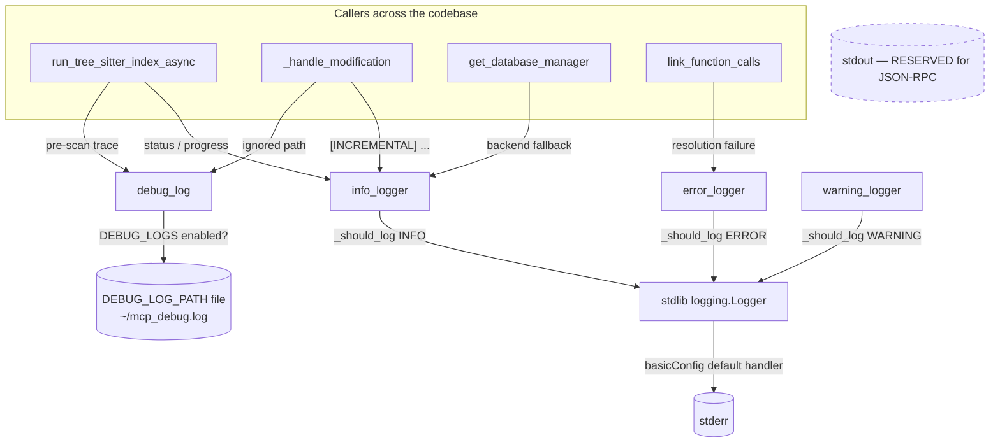

# Logging utility (debug_log / info / warning / error)

## Overview
`utils/debug_log` is the one place every part of CodeGraphContext emits diagnostics — the
indexing pipeline, the file watcher, the database managers, the language parsers, and the MCP
tool handlers all route their messages through four tiny functions defined here. The single
design idea that shapes it: **CodeGraphContext runs as an MCP server over stdio, so stdout is
reserved for the JSON-RPC protocol** — a stray `print` on stdout corrupts the wire. This module
keeps logging off stdout in two independent ways. The severity family
([`info_logger`](../catalog/src/codegraphcontext/utils/debug_log.md#info_logger),
[`warning_logger`](../catalog/src/codegraphcontext/utils/debug_log.md#warning_logger),
[`error_logger`](../catalog/src/codegraphcontext/utils/debug_log.md#error_logger)) delegates to
Python's stdlib `logging`, whose default handler writes to **stderr**; the
[`debug_log`](../catalog/src/codegraphcontext/utils/debug_log.md#debug_log) function bypasses the
streams entirely and appends to a **file**. Both are config-gated and cheap-to-noop when disabled.

## Diagram

## Design rationale (why it's built this way)
**Two sinks, one motive: never touch stdout.** The MCP server's
[`_run_loop`](../catalog/src/codegraphcontext/server.md#MCPServer._run_loop) reads JSON-RPC
requests from `sys.stdin` line by line, and the framed responses go back on stdout. Anything else
on stdout is a protocol violation. The severity loggers therefore lean on the stdlib `logging`
module (`logger = logging.getLogger(__name__)`), whose root configuration is set once in
`cli/main.py` via `logging.basicConfig(level=logging.WARNING, …)` — a default `StreamHandler` that
targets **stderr**, not stdout. The startup banner in the server's `run()` is the tell: the
`info_logger(...)` call is commented out and replaced by an explicit
`print("MCP Server is running. …", file=sys.stderr, flush=True)`. Stderr is a safe side channel
for a stdio MCP host; stdout is not.

**`debug_log` is a file side-channel, not a log level.** Verbose per-file tracing during a long
index would flood even stderr and interleave with the host's console. Instead
[`debug_log`](../catalog/src/codegraphcontext/utils/debug_log.md#debug_log) writes timestamped
lines to a file (`DEBUG_LOG_PATH`, default `~/mcp_debug.log`), creating the parent directory and
`flush()`-ing each line so a crash still leaves a readable trail. Its docstring states the intent
directly: *"Write debug message to a file if DEBUG_LOGS is enabled."* It is **off by default**
(`DEBUG_LOGS` defaults to `False`), so in production it is a single config read then an early
`return` — near-zero cost at the many call sites that sprinkle it through the pipeline.

**Config-driven, per-call gating.** The severity functions do not rely solely on the stdlib
logger's level. Each re-reads the `ENABLE_APP_LOGS` config value (via the same
[`get_config_value`](../catalog/src/codegraphcontext/cli/config_manager.md#get_config_value)
accessor used everywhere else) and compares numeric levels through a local `LOG_LEVELS` map, which
includes a `'DISABLED'` sentinel set above `CRITICAL` to silence everything. This lets an operator
raise or mute application logs at runtime through config without restarting, and it tolerates a
legacy boolean value for the setting.

> [!inferred]
> The config read is deliberately fail-open: the private `_get_config_value` helper wraps the
> import-and-read in a `try/except Exception` that returns the caller's default on any error. The
> effect (my reading of the source) is that a broken or missing config can never make a logging
> call raise — logging must not be able to crash the indexer or the server loop.

## Entry points
- [`info_logger`](../catalog/src/codegraphcontext/utils/debug_log.md#info_logger),
  [`warning_logger`](../catalog/src/codegraphcontext/utils/debug_log.md#warning_logger),
  [`error_logger`](../catalog/src/codegraphcontext/utils/debug_log.md#error_logger) — the
  everyday severity API. Control reaches them from nearly every subsystem: the indexer's
  [`run_tree_sitter_index_async`](../catalog/src/codegraphcontext/tools/indexing/pipeline.md#run_tree_sitter_index_async)
  and
  [`run_scip_index_async`](../catalog/src/codegraphcontext/tools/indexing/scip_pipeline.md#run_scip_index_async),
  the database factory
  [`get_database_manager`](../catalog/src/codegraphcontext/core/__init__.md#get_database_manager)
  (backend-selection and fallback messages), driver setup such as
  [`get_driver`](../catalog/src/codegraphcontext/core/database.md#DatabaseManager.get_driver), the
  graph writer's
  [`_work`](../catalog/src/codegraphcontext/tools/indexing/persistence/writer.md#GraphWriter._work),
  and the per-language parsers' `index_source` /
  [`parse`](../catalog/src/codegraphcontext/tools/languages/haskell.md#HaskellTreeSitterParser.parse)
  paths. They emit to stderr only when `_should_log` says the configured level permits it.
- [`debug_log`](../catalog/src/codegraphcontext/utils/debug_log.md#debug_log) — the opt-in
  file-trace entry point. Reached from hot indexing paths that want fine-grained provenance without
  polluting the normal logs:
  [`discover_files_to_index`](../catalog/src/codegraphcontext/tools/indexing/discovery.md#discover_files_to_index)
  (`.cgcignore` decisions),
  [`parse_file`](../catalog/src/codegraphcontext/tools/graph_builder.md#GraphBuilder.parse_file),
  the watcher's
  [`_handle_modification`](../catalog/src/codegraphcontext/core/watcher.md#RepositoryEventHandler._handle_modification)
  (ignored-path traces), the Kùzu query shim
  [`run`](../catalog/src/codegraphcontext/core/database_embedded_kuzu.md#EmbeddedSessionWrapper.run),
  and tool handlers like
  [`load_bundle`](../catalog/src/codegraphcontext/tools/handlers/management_handlers.md#load_bundle)
  and
  [`check_job_status`](../catalog/src/codegraphcontext/tools/handlers/management_handlers.md#check_job_status).

## Mechanism (step-by-step)
1. **Resolve the config value (fail-open).** Every logging call begins by consulting configuration
   through the module's private `_get_config_value`, which in turn calls the shared
   [`get_config_value`](../catalog/src/codegraphcontext/cli/config_manager.md#get_config_value),
   normalizing string booleans (`"true"`/`"false"`) and returning a caller-supplied default on
   `None` or any exception. This is why the same accessor governs the log *level*
   (`ENABLE_APP_LOGS`), the file *switch* (`DEBUG_LOGS`), and the file *path* (`DEBUG_LOG_PATH`).
2. **Severity gate, then emit to the stdlib logger.**
   [`info_logger`](../catalog/src/codegraphcontext/utils/debug_log.md#info_logger),
   [`warning_logger`](../catalog/src/codegraphcontext/utils/debug_log.md#warning_logger), and
   [`error_logger`](../catalog/src/codegraphcontext/utils/debug_log.md#error_logger) each call the
   private `_should_log(level_name)`, which maps the configured `ENABLE_APP_LOGS` string and the
   message's level through `LOG_LEVELS` and returns `True` only when
   `message_numeric >= configured_numeric` (with `'DISABLED'` short-circuiting to `False`). Only
   then do they delegate to `logger.info/warning/error`, so the message lands on the stdlib
   handler configured elsewhere — stderr — never stdout.
3. **File sink for opt-in tracing.**
   [`debug_log`](../catalog/src/codegraphcontext/utils/debug_log.md#debug_log) first reads the
   `DEBUG_LOGS` flag and returns immediately if it is falsy. When enabled, it resolves
   `DEBUG_LOG_PATH` (default `~/mcp_debug.log`), ensures the parent directory exists, and appends a
   `"[{timestamp}] {message}\n"` line, flushing on each write. This runs completely independently
   of `_should_log` and of the stdlib logger — a separate, durable channel.
4. **How callers exploit the split.** Lifecycle and outcome messages use the severity family — e.g.
   [`_handle_modification`](../catalog/src/codegraphcontext/core/watcher.md#RepositoryEventHandler._handle_modification)
   announces an incremental update and the count of affected files via `info_logger`, while
   [`build_graph_from_path_async`](../catalog/src/codegraphcontext/tools/graph_builder.md#GraphBuilder.build_graph_from_path_async)
   uses `warning_logger` for SCIP-unavailable fallbacks. High-volume provenance uses the file sink —
   [`run_tree_sitter_index_async`](../catalog/src/codegraphcontext/tools/indexing/pipeline.md#run_tree_sitter_index_async)
   brackets its import pre-scan with `debug_log` lines, and the same function logs a resolvable
   status through `info_logger`. The two channels are chosen per message-purpose, not per module.

## Key data structures
- `LOG_LEVELS` (module-level dict, not in subgraph): maps level names to `logging` numerics plus a
  synthetic `'DISABLED' = CRITICAL + 10`. It is the whole of the severity comparison logic used by
  the gate behind
  [`info_logger`](../catalog/src/codegraphcontext/utils/debug_log.md#info_logger) et al.
- `logger = logging.getLogger(__name__)` (module-level): the single stdlib logger all three
  severity functions share; its sink/format/level are owned by `cli/main.py`'s `basicConfig`, not
  by this module.
- Config keys (strings, read on demand): `ENABLE_APP_LOGS` (severity threshold),
  `DEBUG_LOGS` (file-trace on/off), `DEBUG_LOG_PATH` (trace file location) — all fetched via
  [`get_config_value`](../catalog/src/codegraphcontext/cli/config_manager.md#get_config_value).

## Dynamics (design intent)
The module is stateless and holds no locks: each call independently reads config and either writes a
stdlib log record or appends one file line. Under the indexer's concurrency (the pipeline in
[`run_tree_sitter_index_async`](../catalog/src/codegraphcontext/tools/indexing/pipeline.md#run_tree_sitter_index_async)
processes files under an `asyncio.Semaphore`), stdlib `logging` provides its own handler-level
locking for the severity family. The `debug_log` file path relies on append-mode `open` plus
`flush()` per line; interleaving is line-granular.

## Edge cases
- **`ENABLE_APP_LOGS` unset or unrecognized** → `_should_log` falls back to `INFO`, so info/warning/
  error all pass by default; setting it to `'DISABLED'` mutes all three
  ([`info_logger`](../catalog/src/codegraphcontext/utils/debug_log.md#info_logger),
  [`warning_logger`](../catalog/src/codegraphcontext/utils/debug_log.md#warning_logger),
  [`error_logger`](../catalog/src/codegraphcontext/utils/debug_log.md#error_logger)).
- **`DEBUG_LOGS` off (the default)** → [`debug_log`](../catalog/src/codegraphcontext/utils/debug_log.md#debug_log)
  returns before any filesystem access; the many `debug_log(...)` call sites cost only one config
  read.
- **Legacy boolean `ENABLE_APP_LOGS`** → `_should_log` returns the boolean directly, bypassing the
  numeric comparison, preserving older on/off configs.
- **Config subsystem broken** → the fail-open `try/except` in `_get_config_value` means logging
  degrades to defaults rather than raising into the caller (see the inferred note above).

## Open questions
- The stdlib `logger` here has no per-module handler; its output depends entirely on the root config
  set in `cli/main.py`. Whether the MCP server process re-points that handler (e.g. adds a file
  handler) at startup is outside this packet's subgraph — the sink is asserted as stderr from
  `basicConfig` defaults, but a definitive trace would need the server-bootstrap module.
- `debug_logger` (a stdlib-`DEBUG`-level counterpart) exists in the source but is not in this
  packet's subgraph, so its call sites (if any) are not characterized here.

## See also
- [`run_tree_sitter_index_async`](../catalog/src/codegraphcontext/tools/indexing/pipeline.md#run_tree_sitter_index_async) — the Tree-sitter indexing pipeline, a heavy user of both channels.
- [`_handle_modification`](../catalog/src/codegraphcontext/core/watcher.md#RepositoryEventHandler._handle_modification) — incremental watcher updates, showing severity + debug tracing together.
- [`get_config_value`](../catalog/src/codegraphcontext/cli/config_manager.md#get_config_value) — the shared configuration accessor every logging decision goes through.
