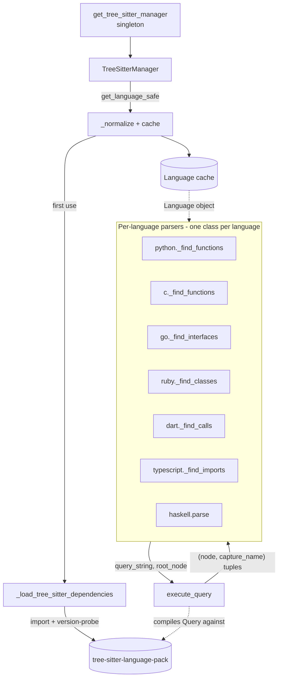

# Tree-sitter grammar management & multi-language extraction

<!-- connect:up:begin -->
> **Cross-repo concept:** part of [multi-language-extraction](../../../concepts/multi-language-extraction.md), [symbol-graph](../../../concepts/symbol-graph.md) across this wiki's repos.
<!-- connect:up:end -->
## Overview
This is the substrate that lets CodeGraphContext turn source in 23 languages into graph nodes
and edges. Two ideas do all the work. First, a tiny singleton, the `TreeSitterManager`, owns the
*grammars*: it normalizes a language name ("py", "c++") to a canonical one, lazily imports the
optional tree-sitter stack, loads the matching compiled `Language`, and caches it. Second, a single
free function, [`execute_query`](../catalog/src/codegraphcontext/utils/tree_sitter_manager.md#execute_query),
is the one place a tree-sitter query is compiled and run — and *nearly every* per-language extractor
(`_find_functions`, `_find_classes`, `_find_calls`, `_find_imports`, …) funnels through it (Emacs Lisp
is the exception — see Edge cases). So the
manager answers "which grammar" and `execute_query` answers "how do I run a query against it,
regardless of which tree-sitter version is installed." Adding a language is then just: an alias
entry plus a parser class whose `_find_*` methods call `execute_query`.

## Diagram

## Design rationale (why it's built this way)
The module docstring states the four principles directly, and each is a real, non-obvious decision:

- **Cache languages, not parsers.** A compiled `Language` is immutable and safe to share; a `Parser`
  holds mutable parse state and is *not* thread-safe. So [`get_language_safe`](../catalog/src/codegraphcontext/utils/tree_sitter_manager.md#TreeSitterManager.get_language_safe)
  memoizes languages behind a lock, while parsers are minted fresh per call (see Open questions).
  This is why the cache lives on the manager but is keyed only by canonical language name.

- **The dependency is optional and loaded lazily.** [`_load_tree_sitter_dependencies`](../catalog/src/codegraphcontext/utils/tree_sitter_manager.md#_load_tree_sitter_dependencies)
  only imports `tree_sitter` / `tree_sitter_language_pack` the first time parsing is actually used, so
  the package can be installed and its non-parsing features used without the native wheels. Its
  docstring: *"Load optional tree-sitter dependencies only when parsing is used."*

- **Version-agnostic everything.** tree-sitter's Python API churned hard between 0.20, 0.22, and
  0.25. Rather than pin a version, the code *probes* at runtime: `_load_tree_sitter_dependencies`
  test-builds a parser two ways (constructor vs. `set_language`) and even falls back from
  `tree_sitter_language_pack` to the older `tree_sitter_languages`. `execute_query` similarly tries
  `Query(language, s)` then `language.query(s)`, and `QueryCursor(query).captures(node)` then
  `QueryCursor().captures(query, node)` then the legacy `query.captures(node)`.

- **The one-query-primitive design is what makes multi-language extraction tractable.** Because all
  extractors call [`execute_query`](../catalog/src/codegraphcontext/utils/tree_sitter_manager.md#execute_query),
  the entire codebase's tree-sitter-version compatibility burden collapses into one function. Its
  docstring names the goal: *"return captures in backward-compatible format"* — a list of
  `(node, capture_name)` tuples that the old 0.20.x `query.captures(node)` produced, so ~60 call
  sites written against the old shape keep working unchanged.

> [!inferred]
> The `LANGUAGE_PACK_NAMES` remap (only `c_sharp` → `csharp` today) exists because CodeGraphContext's
> canonical name and the language-pack's package name disagree for C#; the indirection lets the two
> namespaces evolve independently rather than leaking pack naming into the rest of the code.

## Entry points
- [`get_tree_sitter_manager`](../catalog/src/codegraphcontext/utils/tree_sitter_manager.md#get_tree_sitter_manager)
  — the front door. Anything that needs a grammar calls this to get the process-wide singleton
  (double-checked locking against `_instance_lock`), then asks it for languages. Control reaches it
  once per process on the first parse, and returns the same instance thereafter.

- [`get_language_safe`](../catalog/src/codegraphcontext/utils/tree_sitter_manager.md#TreeSitterManager.get_language_safe)
  — the grammar lookup. A parser class hands it a language name (canonical or alias) and gets back a
  cached, compiled `Language`. This is where a new language either resolves or raises a clear
  "not available in tree-sitter-language-pack" `ValueError`.

- [`execute_query`](../catalog/src/codegraphcontext/utils/tree_sitter_manager.md#execute_query)
  — the extraction primitive. Every per-language `_find_*` reaches here with a query string and a
  syntax-tree node; it is the single point where a tree-sitter `Query` is compiled and run. If this
  page has one hot symbol, it is this one — the subgraph shows it called from the extractors of C,
  C++, Python, Ruby, Go, Rust, Dart, TypeScript, JavaScript, Perl, and Haskell.

## Mechanism (step-by-step)
1. **Get the manager.** A caller invokes [`get_tree_sitter_manager`](../catalog/src/codegraphcontext/utils/tree_sitter_manager.md#get_tree_sitter_manager);
   on first call it constructs the sole `TreeSitterManager` under `_instance_lock`, otherwise it
   short-circuits on the already-set module global. This guarantees the language cache is shared
   across every parser and thread in the process.

2. **Resolve a language name to a grammar.** The parser calls
   [`get_language_safe`](../catalog/src/codegraphcontext/utils/tree_sitter_manager.md#TreeSitterManager.get_language_safe)
   with something like `"py"`, `"c++"`, or `"typescript"`. It first normalizes via `LANGUAGE_ALIASES`
   to a canonical name (raising `ValueError` on an unknown one), then checks the cache on a lock-free
   fast path. On a miss it acquires `_cache_lock`, double-checks, remaps the canonical name through
   `LANGUAGE_PACK_NAMES`, and asks the loader for the compiled grammar — caching the result so every
   later lookup is O(1).

3. **Lazily bring up the native stack.** The first grammar load triggers
   [`_load_tree_sitter_dependencies`](../catalog/src/codegraphcontext/utils/tree_sitter_manager.md#_load_tree_sitter_dependencies),
   which imports `tree_sitter` plus a `get_language` provider, *proves* the pair works by loading
   Python and building a test parser both the new (constructor) and old (`set_language`) way, and
   falls back from `tree_sitter_language_pack` to `tree_sitter_languages` if needed. On total failure
   it raises an actionable `ImportError` (including a specific Python-3.13 wheel caveat). The imported
   symbols are memoized in module globals so this bring-up happens exactly once.

4. **Run queries through the one primitive.** With a `Language` in hand, a language's extractor issues
   its tree-sitter query via [`execute_query`](../catalog/src/codegraphcontext/utils/tree_sitter_manager.md#execute_query).
   The function compiles the query (new `Query(...)` API, else legacy `language.query(...)`), executes
   it across the tried API shapes, and — crucially — *normalizes* every result into a flat list of
   `(node, capture_name)` tuples, converting dict-shaped captures and integer capture indices
   (via `query.capture_names`) back to the legacy tuple shape the callers expect.

5. **Shape captures into graph rows — the per-language layer.** Each extractor consumes those tuples
   and builds the node/edge dicts that become the graph. The pattern repeats across languages:
   [`python._find_functions`](../catalog/src/codegraphcontext/tools/languages/python.md#PythonTreeSitterParser._find_functions),
   [`c._find_functions`](../catalog/src/codegraphcontext/tools/languages/c.md#CTreeSitterParser._find_functions),
   [`ruby._find_classes`](../catalog/src/codegraphcontext/tools/languages/ruby.md#RubyTreeSitterParser._find_classes),
   [`go._find_interfaces`](../catalog/src/codegraphcontext/tools/languages/go.md#GoTreeSitterParser._find_interfaces),
   and [`dart._find_calls`](../catalog/src/codegraphcontext/tools/languages/dart.md#DartTreeSitterParser._find_calls)
   each walk the captured nodes, dedupe, resolve names/params/context, and emit dicts like
   `{"name", "line_number", "end_line", "args", "context", "lang", "is_dependency", …}`. Import/call
   extractors such as [`typescript._find_imports`](../catalog/src/codegraphcontext/tools/languages/typescript.md#TypescriptTreeSitterParser._find_imports)
   and [`c._find_calls`](../catalog/src/codegraphcontext/tools/languages/c.md#CTreeSitterParser._find_calls)
   produce the *edges* (imports, calls) of the graph the same way.

6. **Optionally embed raw source per node.** When indexing is asked to keep source text, the extractor
   copies the node's slice into the row. The parser's `index_source` flag — e.g.
   [`java.index_source`](../catalog/src/codegraphcontext/tools/languages/java.md#JavaTreeSitterParser.index_source),
   [`kotlin.index_source`](../catalog/src/codegraphcontext/tools/languages/kotlin.md#KotlinTreeSitterParser.index_source),
   [`csharp.index_source`](../catalog/src/codegraphcontext/tools/languages/csharp.md#CSharpTreeSitterParser.index_source) —
   is set at parse time (see [`haskell.parse`](../catalog/src/codegraphcontext/tools/languages/haskell.md#HaskellTreeSitterParser.parse),
   which assigns `self.index_source = index_source` before running the query loop) and gates whether a
   `"source"` field is attached to each node.

## Key data structures
- **`_language_cache` + `_cache_lock`** — a `Dict[str, Language]` keyed by canonical name, guarded for
  writes; the sole per-manager state, populated by
  [`get_language_safe`](../catalog/src/codegraphcontext/utils/tree_sitter_manager.md#TreeSitterManager.get_language_safe).
- **`LANGUAGE_ALIASES` / `LANGUAGE_PACK_NAMES`** — the two static maps: name → canonical, and canonical
  → language-pack package name (only `c_sharp`→`csharp` today).
- **Module globals `_Language` / `_Parser` / `_get_language` / `_manager_instance`** — one-time memos so
  the native import and singleton construction each happen exactly once.
- **Capture tuple `(node, capture_name)`** — the normalized currency between
  [`execute_query`](../catalog/src/codegraphcontext/utils/tree_sitter_manager.md#execute_query) and
  every extractor; the whole extraction layer is written against this shape.
- **The per-language node/edge dict** — the extractor output row (`name`, `line_number`, `end_line`,
  `args`, `context`, `lang`, `is_dependency`, optional `source`/`docstring`) that becomes a graph node
  or edge downstream.

## Dynamics (design intent)
The manager is explicitly designed for concurrent indexing. Reads of the language cache are lock-free
(the fast path in `get_language_safe`), and only cache-fill and singleton construction take a lock,
each using double-checked locking so a race resolves to a single load. The docstrings make the safety
boundary explicit: languages are shared, parsers are per-thread ("Parsers are NOT thread-safe and
should not be shared across threads"). `execute_query` itself is stateless — it takes the language,
query string, and node as arguments and holds no shared state — so many threads can run queries in
parallel against the same cached `Language`.

## Edge cases
- **Missing native deps.** `_load_tree_sitter_dependencies` raises an actionable `ImportError`, with a
  distinct message for Python 3.13 (no cp313 wheels).
- **Unknown vs. unavailable language.** An unrecognized *name* raises `ValueError` at normalization
  in `get_language_safe`; a recognized name whose *grammar* isn't in the pack raises a different
  `ValueError` ("not available … missing or experimental grammar").
- **tree-sitter version skew.** `_load_tree_sitter_dependencies` swallows `TypeError`/`ValueError`
  when probing constructor-vs-`set_language` parser construction; `execute_query` swallows the wider
  `TypeError`/`ValueError`/`AttributeError` to fall through to older API shapes, and also maps integer
  capture indices back to names when a version returns them.
- **Emacs Lisp bypasses the shared primitive.** [`elisp`](../catalog/src/codegraphcontext/tools/languages/elisp.md)
  defines an `ELISP_QUERIES` table but never calls `execute_query`; it walks the parse tree directly
  via `_iter_nodes` and `node.type` checks instead.
- **Empty / whitespace files.** Handled at the parser layer, not here — e.g.
  [`haskell.parse`](../catalog/src/codegraphcontext/tools/languages/haskell.md#HaskellTreeSitterParser.parse)
  short-circuits to an empty result before querying.

## Open questions
- `create_parser` (not in this packet's subgraph) is the counterpart that mints a fresh, per-thread
  `Parser` and re-probes the constructor-vs-`set_language` API; its exact interplay with `parse()` in
  each language module is out of scope here.
- The full per-language query strings (`PY_QUERIES`, `C_QUERIES`, `GO_QUERIES`, …) that drive
  `execute_query` live in the individual language modules and are not enumerated in this subgraph.

## See also
- Sibling per-language extractor concept pages under `wiki/code/codegraphcontext/concepts/` (Python,
  C/C++, Go, Ruby, TypeScript/JavaScript, Dart, Rust, Perl, Haskell parsers).
- The cross-repo `multi-language-extraction` and `symbol-graph` concept pages (top-level
  `wiki/concepts/`) that compare this grounding substrate against wikify-repo, graphify, and
  understand-anything.
