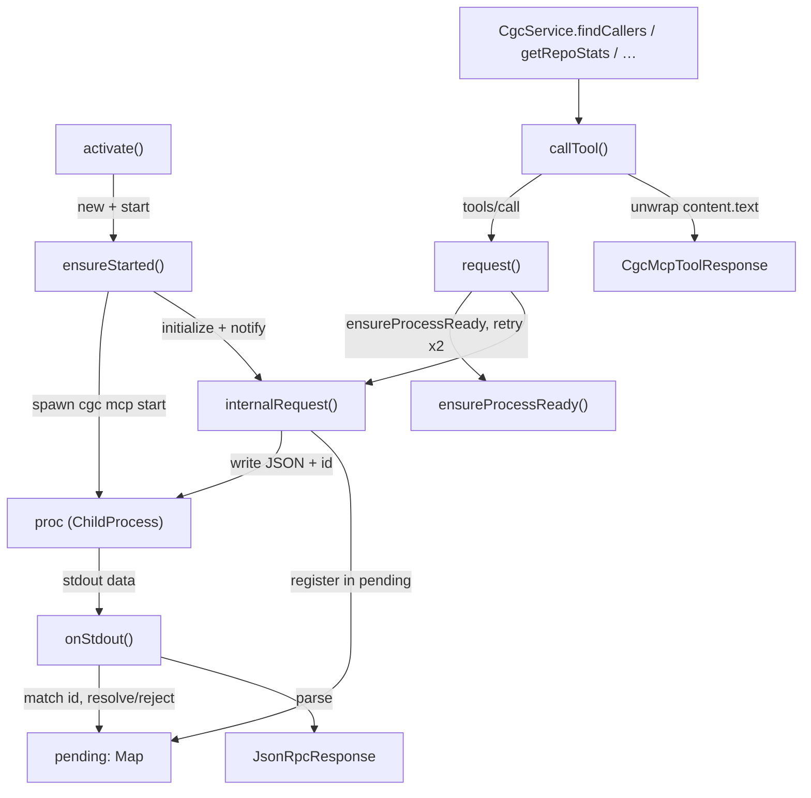

# VS Code extension: the MCP client (consumer end of the query interface)

## Overview
This is the *client* half of CodeGraphContext's query interface: the code that lets the
VS Code editor extension drive the same graph an LLM would. The extension does **not**
re-implement any graph logic — it spawns the Python `cgc` CLI as a long-lived MCP server
subprocess and talks to it over stdio using newline-delimited JSON-RPC 2.0. Two layers do
the work: [`CgcMcpClient`](../catalog/extensions/vscode/src/mcp/client.ts.md#CgcMcpClient.callTool)
is the transport (spawn, handshake, request/response correlation, restart), and `CgcService`
is a thin typed facade whose ~30 methods each collapse to a single
[`callTool`](../catalog/extensions/vscode/src/mcp/client.ts.md#CgcMcpClient.callTool). The
key design idea: the editor is *just another MCP client*, so every graph query the
extension makes goes through the identical tool surface an agent uses — the server end
described in [codegraphcontext-server](./codegraphcontext-server.md).

## Diagram

## Design rationale (why it's built this way)
- **The editor reuses the agent's interface instead of a private API.** Every graph
  question the UI asks routes through
  [`callTool`](../catalog/extensions/vscode/src/mcp/client.ts.md#CgcMcpClient.callTool),
  which issues an MCP `tools/call` — the exact call an LLM agent makes. That is the whole
  point on the survey's *query-interface* axis: one tool surface serves both consumers, so
  the extension is a living conformance test of the server's MCP contract.
- **Two layers keep transport concerns out of feature code.** The
  [`request`](../catalog/extensions/vscode/src/mcp/client.ts.md#CgcMcpClient.request) /
  [`onStdout`](../catalog/extensions/vscode/src/mcp/client.ts.md#CgcMcpClient.onStdout)
  machinery owns correlation, retries and framing; `CgcService` methods such as
  [`findCallers`](../catalog/extensions/vscode/src/mcp/service.ts.md#CgcService.findCallers)
  pick a tool name, pass args, and normalise the reply shape — for most methods that
  normalisation is itself several lines of if/else and `.map()` over differently-shaped
  server replies (as in `findCallers`), not a one-liner. Only a handful of void-returning
  methods (`switchContext`, `watchWorkspace`, `loadBundle`) reduce to a single `callTool`
  call with no further processing.
- **Defensive response normalisation is pervasive.** The Python server returns the same
  logical data under several key names across versions, so nearly every service method
  reads `res.callers ?? res.results ?? …`. See
  [`getRepoStats`](../catalog/extensions/vscode/src/mcp/service.ts.md#CgcService.getRepoStats),
  which coalesces `stats | results | (bare)` and both `file_count`/`total_files` spellings.

  > [!inferred] The redundant shape-coalescing reads like accreted compatibility with an
  > evolving server contract, not a designed union type. The `MpcToolContent` typo (vs.
  > "Mcp") in [`MpcToolContent`](../catalog/extensions/vscode/src/types/cgc.ts.md#MpcToolContent)
  > survives because it's internal to the extension.

## Entry points
- [`activate`](../catalog/extensions/vscode/src/extension.ts.md#activate) — VS Code calls
  this on extension load. It constructs the client, calls
  [`ensureStarted`](../catalog/extensions/vscode/src/mcp/client.ts.md#CgcMcpClient.ensureStarted)
  to bring the MCP server up, and wires the whole feature set (`findCallers`,
  `findClassHierarchy`, `indexWorkspace`, `watchWorkspace`, `switchContext`,
  `discoverContexts`, `generateReport`, …) onto the resulting `CgcService`. A failed start
  is caught and downgraded to a warning, so the extension loads degraded rather than not
  at all.
- [`callTool`](../catalog/extensions/vscode/src/mcp/client.ts.md#CgcMcpClient.callTool) —
  the single choke point every graph query passes through. All ~30 `CgcService` methods
  (e.g. [`getComplexityHotspots`](../catalog/extensions/vscode/src/mcp/service.ts.md#CgcService.getComplexityHotspots),
  [`runCypher`](../catalog/extensions/vscode/src/mcp/service.ts.md#CgcService.runCypher),
  [`findCode`](../catalog/extensions/vscode/src/mcp/service.ts.md#CgcService.findCode))
  reach transport here.
- [`restart`](../catalog/extensions/vscode/src/mcp/client.ts.md#CgcMcpClient.restart) and
  config panels [`_handleSave`](../catalog/extensions/vscode/src/webview/setupPanel.ts.md#SetupPanel._handleSave)
  / [`saveConfig`](../catalog/extensions/vscode/src/views/controlPanel.ts.md#SidebarControlPanel.saveConfig)
  — user-triggered lifecycle entry, but they don't tear down the process the same way:
  `restart` kills `proc` and clears `pending` inline (it never calls `dispose`), while
  `_handleSave`/`saveConfig` [`dispose`](../catalog/extensions/vscode/src/mcp/client.ts.md#CgcMcpClient.dispose)
  the client outright before re-`ensureStarted`ing. Either path makes a new executable path
  or database mode take effect.

## Mechanism (step-by-step)
1. **Spawn + handshake.**
   [`ensureStarted`](../catalog/extensions/vscode/src/mcp/client.ts.md#CgcMcpClient.ensureStarted)
   first short-circuits if a live process already exists (`!killed && exitCode === null`).
   Otherwise it reads the `cgc` workspace configuration to build the command
   (`executable` split into program + extra args, invoked as `<exe> … mcp start`) and an
   env that carries `CGC_RUNTIME_DB_TYPE` (from `databaseMode`, default `falkordb`),
   optional `PYTHONPATH`, and `MAX_TOOL_RESPONSE_TOKENS`. It spawns the child into
   [`proc`](../catalog/extensions/vscode/src/mcp/client.ts.md#CgcMcpClient.proc), attaches
   stderr→[`output`](../catalog/extensions/vscode/src/mcp/client.ts.md#CgcMcpClient.output)
   and stdout→[`onStdout`](../catalog/extensions/vscode/src/mcp/client.ts.md#CgcMcpClient.onStdout)
   listeners, then performs the MCP handshake via
   [`internalRequest`](../catalog/extensions/vscode/src/mcp/client.ts.md#CgcMcpClient.internalRequest)
   (`initialize`, protocolVersion `2025-03-26`) followed by an `initialized` notification
   through [`internalNotify`](../catalog/extensions/vscode/src/mcp/client.ts.md#CgcMcpClient.internalNotify).
   Note the deliberate use of the *internal* variants here: the public
   [`request`](../catalog/extensions/vscode/src/mcp/client.ts.md#CgcMcpClient.request) path
   would recurse back into `ensureStarted`, so the handshake bypasses readiness checks.
2. **A feature makes a typed call.** A `CgcService` method — say
   [`findCallers`](../catalog/extensions/vscode/src/mcp/service.ts.md#CgcService.findCallers)
   or [`getComplexity`](../catalog/extensions/vscode/src/mcp/service.ts.md#CgcService.getComplexity)
   — names an MCP tool (`analyze_code_relationships`, `calculate_cyclomatic_complexity`, …),
   packs a `query_type`/`target`/`repo_path` argument object, and awaits
   [`callTool`](../catalog/extensions/vscode/src/mcp/client.ts.md#CgcMcpClient.callTool).
   Many analytical queries funnel through one `analyze_code_relationships` tool
   distinguished only by `query_type` (see
   [`findCallees`](../catalog/extensions/vscode/src/mcp/service.ts.md#CgcService.findCallees),
   [`findImporters`](../catalog/extensions/vscode/src/mcp/service.ts.md#CgcService.findImporters),
   [`findModuleDeps`](../catalog/extensions/vscode/src/mcp/service.ts.md#CgcService.findModuleDeps),
   [`findClassHierarchy`](../catalog/extensions/vscode/src/mcp/service.ts.md#CgcService.findClassHierarchy),
   [`variableImpactRadius`](../catalog/extensions/vscode/src/mcp/service.ts.md#CgcService.variableImpactRadius),
   [`findCallChain`](../catalog/extensions/vscode/src/mcp/service.ts.md#CgcService.findCallChain)).
3. **`callTool` wraps MCP's `tools/call` and unwraps the payload.**
   [`callTool`](../catalog/extensions/vscode/src/mcp/client.ts.md#CgcMcpClient.callTool)
   sends method `tools/call` with `{ name, arguments }`, receives a
   [`CgcMcpToolResponse`](../catalog/extensions/vscode/src/types/cgc.ts.md#CgcMcpToolResponse),
   finds the first [`content`](../catalog/extensions/vscode/src/types/cgc.ts.md#CgcMcpToolResponse.content)
   item of `type === "text"`, and `JSON.parse`s that text into `T`. So the MCP tool result
   is *itself* a JSON string inside a text content block — a double-encoding the client has
   to peel. Missing text throws `No text payload returned`.
4. **`request` guarantees a live channel and retries once.**
   [`request`](../catalog/extensions/vscode/src/mcp/client.ts.md#CgcMcpClient.request) loops
   at most twice: it calls
   [`ensureProcessReady`](../catalog/extensions/vscode/src/mcp/client.ts.md#CgcMcpClient.ensureProcessReady)
   (which re-`ensureStarted`s a dead process), issues the
   [`internalRequest`](../catalog/extensions/vscode/src/mcp/client.ts.md#CgcMcpClient.internalRequest),
   and on a *channel* error (`"Channel has been closed"`, `"stdin is not writable"`,
   `"process exited"`) on the first attempt it kills
   [`proc`](../catalog/extensions/vscode/src/mcp/client.ts.md#CgcMcpClient.proc), restarts,
   and retries. Any non-channel error propagates immediately. This is what makes an idle
   server crash transparent to feature code.
5. **`internalRequest` frames the call and registers a pending promise.**
   [`internalRequest`](../catalog/extensions/vscode/src/mcp/client.ts.md#CgcMcpClient.internalRequest)
   assigns a monotonic id from `nextId`, serialises `{jsonrpc:"2.0", id, method, params}`,
   registers `{resolve, reject}` in
   [`pending`](../catalog/extensions/vscode/src/mcp/client.ts.md#CgcMcpClient.pending) keyed
   by id, writes `payload + "\n"` to the child's stdin, and arms a 30 s timeout that rejects
   and evicts the entry. A non-writable stdin rejects before writing. This is a classic
   correlated-async-RPC-over-a-stream pattern: the newline is the frame delimiter, the id is
   the correlation token.
6. **`onStdout` demultiplexes replies back onto their promises.**
   [`onStdout`](../catalog/extensions/vscode/src/mcp/client.ts.md#CgcMcpClient.onStdout)
   splits incoming stdout into lines, ignores any that don't start with `{` (server log
   noise is tolerated inline with protocol frames), parses each as a
   [`JsonRpcResponse`](../catalog/extensions/vscode/src/mcp/client.ts.md#JsonRpcResponse),
   and if its numeric [`id`](../catalog/extensions/vscode/src/mcp/client.ts.md#JsonRpcResponse.id)
   matches a [`pending`](../catalog/extensions/vscode/src/mcp/client.ts.md#CgcMcpClient.pending)
   entry, deletes it and either rejects with the
   [`error`](../catalog/extensions/vscode/src/mcp/client.ts.md#JsonRpcResponse.error)
   (formatting [`message`](../catalog/extensions/vscode/src/mcp/client.ts.md#JsonRpcResponse.error.typeLiteral4.message)
   + [`data`](../catalog/extensions/vscode/src/mcp/client.ts.md#JsonRpcResponse.error.typeLiteral4.data))
   or resolves with the
   [`result`](../catalog/extensions/vscode/src/mcp/client.ts.md#JsonRpcResponse.result).

## Key data structures
- [`proc`](../catalog/extensions/vscode/src/mcp/client.ts.md#CgcMcpClient.proc) — the single
  `ChildProcessWithoutNullStreams` handle to the Python `cgc mcp start` server; `undefined`
  means "no live server". Its liveness (`killed`, `exitCode`) is the lifecycle state machine.
- [`pending`](../catalog/extensions/vscode/src/mcp/client.ts.md#CgcMcpClient.pending) — a
  `Map<number, PendingRequest>` of in-flight requests, the heart of request/response
  correlation. [`PendingRequest`](../catalog/extensions/vscode/src/mcp/client.ts.md#PendingRequest)
  is just the deferred `{resolve, reject}` pair; `nextId` mints its keys.
- [`JsonRpcResponse`](../catalog/extensions/vscode/src/mcp/client.ts.md#JsonRpcResponse) —
  the wire reply shape (`id`, `result`, `error`) the client parses off stdout.
- [`CgcMcpToolResponse`](../catalog/extensions/vscode/src/types/cgc.ts.md#CgcMcpToolResponse)
  / [`MpcToolContent`](../catalog/extensions/vscode/src/types/cgc.ts.md#MpcToolContent) — the
  MCP `tools/call` envelope: a list of content blocks whose text field carries the
  (re-encoded JSON) tool payload.
- [`output`](../catalog/extensions/vscode/src/mcp/client.ts.md#CgcMcpClient.output) — the
  "CodeGraphContext" VS Code output channel; the only user-visible surface for spawn logs,
  stderr, and parse failures.

## Dynamics (design intent)
The client assumes a **single in-flight-capable, multiplexed** channel: many `callTool`
promises can be outstanding at once, disambiguated purely by id in
[`pending`](../catalog/extensions/vscode/src/mcp/client.ts.md#CgcMcpClient.pending) — there
is no request queue or mutex. Ordering of replies is irrelevant because
[`onStdout`](../catalog/extensions/vscode/src/mcp/client.ts.md#CgcMcpClient.onStdout) routes
by id, not by arrival order. Process death is broadcast: the `exit` handler in
[`ensureStarted`](../catalog/extensions/vscode/src/mcp/client.ts.md#CgcMcpClient.ensureStarted)
rejects *all* pending promises at once, so no request hangs past its server. The 500 ms
post-spawn sleep before the handshake and the 300 ms pause in
[`restart`](../catalog/extensions/vscode/src/mcp/client.ts.md#CgcMcpClient.restart) are
timing hedges for the child to come up / shut down cleanly.

## Edge cases
- **Interleaved log lines.** [`onStdout`](../catalog/extensions/vscode/src/mcp/client.ts.md#CgcMcpClient.onStdout)
  drops any stdout line not starting with `{`, so the server may print plain-text logs to
  stdout without corrupting the protocol — but a JSON log line that happens to be valid
  JSON-RPC-shaped could in principle be misread.
- **Chunk boundaries.** stdout `data` events are line-split per chunk; a JSON frame split
  across two `data` events is not reassembled — the client relies on the server flushing
  whole newline-terminated frames.
- **Double retry only for channel errors.**
  [`request`](../catalog/extensions/vscode/src/mcp/client.ts.md#CgcMcpClient.request) retries
  once *only* for the three recognised channel-error substrings; a 30 s
  [`internalRequest`](../catalog/extensions/vscode/src/mcp/client.ts.md#CgcMcpClient.internalRequest)
  timeout is not a channel error, so it surfaces directly.
- **Config change requires a full restart.** Changing executable/DB mode via
  [`_handleSave`](../catalog/extensions/vscode/src/webview/setupPanel.ts.md#SetupPanel._handleSave)
  or [`saveConfig`](../catalog/extensions/vscode/src/views/controlPanel.ts.md#SidebarControlPanel.saveConfig)
  must [`dispose`](../catalog/extensions/vscode/src/mcp/client.ts.md#CgcMcpClient.dispose) +
  re-`ensureStarted`; env vars are read only at spawn time.
- **Missing text payload.** [`callTool`](../catalog/extensions/vscode/src/mcp/client.ts.md#CgcMcpClient.callTool)
  throws if no `type:"text"` content block is present — a tool that returns only structured
  content would be unusable through this path.

## Open questions
- The retry in [`request`](../catalog/extensions/vscode/src/mcp/client.ts.md#CgcMcpClient.request)
  does not re-fire a request that timed out mid-flight; whether the server can end up
  double-executing a mutating tool (e.g. re-indexing) across a restart isn't settled by the
  client code alone.
- [`String`](../catalog/tests/fixtures/sample_projects/sample_project_typescript/src/modules-namespaces.ts.md#String)
  appears in the subgraph only as an incidental `String(...)` coercion / test-fixture
  interface; it is not part of the client's design.

## See also
- [codegraphcontext-server](./codegraphcontext-server.md) — the Python MCP server end this
  client spawns and calls; the two together are CodeGraphContext's full query interface.
- [codegraphcontext-tools-graph_builder](./codegraphcontext-tools-graph_builder.md) — what
  `add_code_to_graph` (via [`indexWorkspace`](../catalog/extensions/vscode/src/mcp/service.ts.md#CgcService.indexWorkspace))
  ultimately drives.
- [codegraphcontext-tools-indexing-persistence-writer](./codegraphcontext-tools-indexing-persistence-writer.md)
  — where indexed nodes/edges land.
