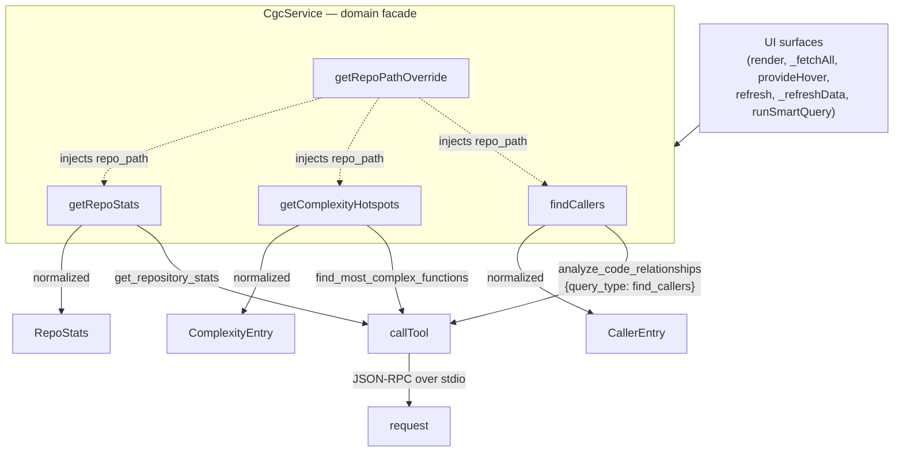

# VSCode MCP service layer (CgcService) — the graph query facade

<!-- connect:up:begin -->
> **Cross-repo concept:** part of [symbol-graph](../../../concepts/symbol-graph.md) across this wiki's repos.
<!-- connect:up:end -->
## Overview
`CgcService` is the VSCode extension's **domain-operations facade** over the code graph. Every
UI surface in the extension — the sidebar, the dashboard, the call-graph webview, hover/CodeLens
providers, tree views — talks to the CodeGraphContext backend mostly through this one class. It is
the layer that turns "show me the callers of `foo`" into a concrete MCP tool call and turns the
backend's loosely-typed JSON back into the extension's strict TypeScript interfaces.

> [!inferred]
> The facade is not exclusive: some UI code reaches past it to the injected
> `CgcMcpClient` directly for
> lifecycle operations that aren't domain queries — the sidebar's config-save handler calls
> `this.client.dispose()`
> then [`ensureStarted()`](../catalog/extensions/vscode/src/mcp/client.ts.md#CgcMcpClient.ensureStarted)
> to restart the server with new settings, and the dashboard's manual-refresh handler calls
> `this.client.restart()`
> to force a fresh DB connection.

The single key idea is **shape normalization at a stable seam**. The Python backend's MCP tools
return the same logical data under many different JSON keys across versions and query paths
(`res.stats` vs `res.results` vs the bare response; `callers` vs `results` vs `results.results`).
`CgcService` absorbs all of that variance in one place so that no UI component ever has to guess a
response shape — it always receives a `RepoStats`, a `ComplexityEntry[]`, a `CallerEntry[]`. It is
deliberately *stateless and thin*: it owns no process, no cache, no timers. All transport, spawning,
and lifecycle live one layer below in `CgcMcpClient` (see
[`extensions-vscode-src-mcp-client.ts`](extensions-vscode-src-mcp-client.ts.md)); `CgcService` just
composes tool name + arguments and reshapes the reply.

## Diagram

## Design rationale (why it's built this way)
**Why a facade at all, and why stateless.** The extension has many independent consumers of graph
data. Rather than let each one call the raw client and hand-parse responses, every operation is a
method on an injected [`CgcService`](../catalog/extensions/vscode/src/mcp/service.ts.md#CgcService)
instance. The constructors of every UI component take the service by dependency injection —
[`CallGraphPanel`'s constructor](../catalog/extensions/vscode/src/webview/callGraphPanel.ts.md#CallGraphPanel.-constructor),
[`DashboardPanel`'s constructor](../catalog/extensions/vscode/src/webview/dashboardPanel.ts.md#DashboardPanel.-constructor),
[`SidebarControlPanel`'s constructor](../catalog/extensions/vscode/src/views/controlPanel.ts.md#SidebarControlPanel.-constructor),
[`CgcCodeLensProvider`'s](../catalog/extensions/vscode/src/providers/editorProviders.ts.md#CgcCodeLensProvider.-constructor),
[`CgcHoverProvider`'s](../catalog/extensions/vscode/src/providers/editorProviders.ts.md#CgcHoverProvider.-constructor),
[`CgcDeadCodeDiagnostics`'s](../catalog/extensions/vscode/src/providers/editorProviders.ts.md#CgcDeadCodeDiagnostics.-constructor),
[`BundlesTreeProvider`'s](../catalog/extensions/vscode/src/views/explorerViews.ts.md#BundlesTreeProvider.-constructor),
[`JobPoller`'s](../catalog/extensions/vscode/src/mcp/jobPoller.ts.md#JobPoller.-constructor), and
[`ContextManager`'s](../catalog/extensions/vscode/src/mcp/contextManager.ts.md#ContextManager.-constructor)
take a service this way. Most of them share one `CgcService` instance built in
[`activate`](../catalog/extensions/vscode/src/extension.ts.md#activate), but
[`JobPoller`](../catalog/extensions/vscode/src/mcp/jobPoller.ts.md#JobPoller.-constructor) is handed
its own separate `new CgcService(client)` constructed earlier in `activate`, before the shared
instance exists — both instances wrap the same underlying client, so statelessness still makes them
interchangeable, but they are not literally one object.

**Why the response reshaping is so defensive.** Read the body of
[`getRepoStats`](../catalog/extensions/vscode/src/mcp/service.ts.md#CgcService.getRepoStats): its
comment says *"normalise multiple possible shapes"*, and it coalesces `res.stats ?? res.results ??
res` before reading fields, then falls back per-field (`base.file_count ?? base.total_files`). This
is the whole reason the layer exists — the backend is a separate Python process whose tool outputs
are not schema-locked, so the TypeScript side treats every field as optional and tries several keys.
The typed targets ([`RepoStats`](../catalog/extensions/vscode/src/types/cgc.ts.md#RepoStats),
[`ComplexityEntry`](../catalog/extensions/vscode/src/types/cgc.ts.md#ComplexityEntry),
[`CallerEntry`](../catalog/extensions/vscode/src/types/cgc.ts.md#CallerEntry)) are the contract the
UI depends on; the messy coalescing is what upholds it.

**Why `repo_path` is centralized.** Every graph query is implicitly scoped to a repository.
[`getRepoPathOverride`](../catalog/extensions/vscode/src/mcp/service.ts.md#CgcService.getRepoPathOverride)
reads the `cgc.repoPath` VSCode setting once and every operation injects it, so scoping is uniform
by default. The sidebar's
[`runSmartQuery`](../catalog/extensions/vscode/src/views/controlPanel.ts.md#SidebarControlPanel.runSmartQuery)
is an exception: for `list-functions`/`list-classes` it reads `cgc.repoPath` itself and passes it
explicitly as an argument to
`listFunctions` /
`listClasses`, rather
than relying on the centralized override.

## Entry points
- [`getRepoStats`](../catalog/extensions/vscode/src/mcp/service.ts.md#CgcService.getRepoStats) —
  fetches aggregate counts (files/functions/classes/modules) for a repo. Reached whenever a surface
  needs a summary: the sidebar's
  [`render`](../catalog/extensions/vscode/src/views/controlPanel.ts.md#SidebarControlPanel.render)
  awaits it (alongside repos, watches, hotspots) to build the control-panel HTML.
- [`getComplexityHotspots`](../catalog/extensions/vscode/src/mcp/service.ts.md#CgcService.getComplexityHotspots) —
  returns the top-N most complex functions. Called by both
  [`render`](../catalog/extensions/vscode/src/views/controlPanel.ts.md#SidebarControlPanel.render)
  (limit 10) and the dashboard's
  [`refresh`](../catalog/extensions/vscode/src/webview/dashboardPanel.ts.md#DashboardPanel.refresh)
  (limit 8) to populate their hotspot lists.
- [`findCallers`](../catalog/extensions/vscode/src/mcp/service.ts.md#CgcService.findCallers) — the
  most widely consumed relationship query. It backs the CodeLens prefetch
  [`_fetchAll`](../catalog/extensions/vscode/src/providers/editorProviders.ts.md#CgcCodeLensProvider._fetchAll),
  the [`provideHover`](../catalog/extensions/vscode/src/providers/editorProviders.ts.md#CgcHoverProvider.provideHover)
  tooltip, the call-graph webview's
  [`_refreshData`](../catalog/extensions/vscode/src/webview/callGraphPanel.ts.md#CallGraphPanel._refreshData),
  and the sidebar's `list-callers` case in
  [`runSmartQuery`](../catalog/extensions/vscode/src/views/controlPanel.ts.md#SidebarControlPanel.runSmartQuery).
- [`CgcService`](../catalog/extensions/vscode/src/mcp/service.ts.md#CgcService) itself is
  instantiated in [`activate`](../catalog/extensions/vscode/src/extension.ts.md#activate) at
  extension startup and injected into every UI component — this is where control first reaches the
  class.

## Mechanism (step-by-step)
1. **Construction and wiring.** At activation,
   [`activate`](../catalog/extensions/vscode/src/extension.ts.md#activate) builds two
   [`CgcService`](../catalog/extensions/vscode/src/mcp/service.ts.md#CgcService) instances around the
   same shared client — an early one handed to
   [`JobPoller`](../catalog/extensions/vscode/src/mcp/jobPoller.ts.md#JobPoller.-constructor) before
   the client finishes starting, and a second one built right after, which is what gets passed to
   every other panel/provider. Each instance holds only a single `private readonly client`
   reference and nothing else — both are pure translation layers over the client established in
   [`activate`](../catalog/extensions/vscode/src/extension.ts.md#activate).

2. **Scope resolution.** On each call the method first resolves the target repository via
   [`getRepoPathOverride`](../catalog/extensions/vscode/src/mcp/service.ts.md#CgcService.getRepoPathOverride),
   which reads the `cgc.repoPath` workspace setting and returns it (or `undefined` for the backend's
   default/global context). This value becomes the `repo_path` argument on the outgoing tool call.

3. **Tool invocation.** The method hands a tool name and an arguments object to
   [`callTool`](../catalog/extensions/vscode/src/mcp/client.ts.md#CgcMcpClient.callTool). The tool
   name encodes the operation: `getRepoStats` → `get_repository_stats`; `getComplexityHotspots` →
   `find_most_complex_functions`; `findCallers` → `analyze_code_relationships` with
   `query_type: "find_callers"`. Note that `analyze_code_relationships` is a *dispatcher* tool — the
   service selects the relationship kind through the `query_type` argument rather than through
   distinct tool names.

4. **Transport (delegated).**
   [`callTool`](../catalog/extensions/vscode/src/mcp/client.ts.md#CgcMcpClient.callTool) wraps the
   request as MCP `tools/call`, sends it through
   [`request`](../catalog/extensions/vscode/src/mcp/client.ts.md#CgcMcpClient.request), then finds
   the `type === "text"` entry in the response's
   [`content`](../catalog/extensions/vscode/src/types/cgc.ts.md#CgcMcpToolResponse.content) array
   (a [`CgcMcpToolResponse`](../catalog/extensions/vscode/src/types/cgc.ts.md#CgcMcpToolResponse) of
   [`MpcToolContent`](../catalog/extensions/vscode/src/types/cgc.ts.md#MpcToolContent) items) and
   `JSON.parse`s that text payload into the caller's generic type `T`. So the service receives an
   *already-parsed* object shaped by its own inline type argument, not a raw string.

5. **Shape coalescing + field normalization.** This is the load-bearing step. In
   [`getRepoStats`](../catalog/extensions/vscode/src/mcp/service.ts.md#CgcService.getRepoStats) the
   parsed reply is reduced with `res.stats ?? res.results ?? res`, then each output field tries a
   primary and a fallback key — e.g. it reads
   [`file_count`](../catalog/extensions/vscode/src/types/cgc.ts.md#RepoStats.file_count) or falls
   back to [`total_files`](../catalog/extensions/vscode/src/types/cgc.ts.md#RepoStats.total_files),
   [`function_count`](../catalog/extensions/vscode/src/types/cgc.ts.md#RepoStats.function_count)
   or [`total_functions`](../catalog/extensions/vscode/src/types/cgc.ts.md#RepoStats.total_functions),
   [`class_count`](../catalog/extensions/vscode/src/types/cgc.ts.md#RepoStats.class_count) or
   [`total_classes`](../catalog/extensions/vscode/src/types/cgc.ts.md#RepoStats.total_classes),
   plus [`module_count`](../catalog/extensions/vscode/src/types/cgc.ts.md#RepoStats.module_count).
   The `count`/`total_*` split reflects two different backend response shapes (per-repo stats vs.
   overall DB stats) that this method flattens into one.

6. **List normalization with per-item mapping.**
   [`getComplexityHotspots`](../catalog/extensions/vscode/src/mcp/service.ts.md#CgcService.getComplexityHotspots)
   picks the first present of `res.results ?? res.functions ?? res.most_complex_functions ?? []`,
   then `.map`s each raw row into a
   [`ComplexityEntry`](../catalog/extensions/vscode/src/types/cgc.ts.md#ComplexityEntry), copying
   [`function_name`](../catalog/extensions/vscode/src/types/cgc.ts.md#ComplexityEntry.function_name),
   [`path`](../catalog/extensions/vscode/src/types/cgc.ts.md#ComplexityEntry.path),
   [`line_number`](../catalog/extensions/vscode/src/types/cgc.ts.md#ComplexityEntry.line_number),
   and crucially *cross-filling* the two complexity aliases: it sets
   [`cyclomatic_complexity`](../catalog/extensions/vscode/src/types/cgc.ts.md#ComplexityEntry.cyclomatic_complexity)
   from `r.cyclomatic_complexity ?? r.complexity` and
   [`complexity`](../catalog/extensions/vscode/src/types/cgc.ts.md#ComplexityEntry.complexity) from
   `r.complexity ?? r.cyclomatic_complexity`. The type's own comment records why: the Python backend
   returns the metric "as complexity" in some paths, `cyclomatic_complexity` in others. Both output
   fields end up populated so downstream code can read either.
   [`findCallers`](../catalog/extensions/vscode/src/mcp/service.ts.md#CgcService.findCallers)
   follows the same pattern, coalescing `res.callers` / `res.results` / `res.results.results` and
   mapping each row into a
   [`CallerEntry`](../catalog/extensions/vscode/src/types/cgc.ts.md#CallerEntry) with the same
   multi-key fallback per field (`caller_name ?? caller_function ?? name`, etc.).

## Key data structures
- [`CgcService`](../catalog/extensions/vscode/src/mcp/service.ts.md#CgcService) — the class; its only
  field is the injected client. Statelessness is the whole point.
- [`RepoStats`](../catalog/extensions/vscode/src/types/cgc.ts.md#RepoStats) — the normalized repo
  summary. Every field is optional; it deliberately carries *both* the `*_count` and `total_*`
  variants so it can hold either backend shape before the service flattens them.
- [`ComplexityEntry`](../catalog/extensions/vscode/src/types/cgc.ts.md#ComplexityEntry) — one hotspot
  row: function name, path, line, and the twin complexity fields kept in sync by the mapper.
- [`CallerEntry`](../catalog/extensions/vscode/src/types/cgc.ts.md#CallerEntry) — one caller edge:
  caller name/file/line plus the call-site line, all optional.
- [`CgcMcpToolResponse`](../catalog/extensions/vscode/src/types/cgc.ts.md#CgcMcpToolResponse) /
  [`MpcToolContent`](../catalog/extensions/vscode/src/types/cgc.ts.md#MpcToolContent) — the MCP
  envelope the client unwraps before the service ever sees domain data.

## Dynamics (design intent)
The service methods are `async` and issue one MCP round-trip each; callers routinely run several in
parallel and tolerate failure per-call. The sidebar's
[`render`](../catalog/extensions/vscode/src/views/controlPanel.ts.md#SidebarControlPanel.render)
fires repos/watches/hotspots/stats together in a `Promise.all`, each with `.catch(() => [])` or
`.catch(() => ({}))` so one failed query degrades one widget instead of blanking the panel. The
CodeLens prefetch
[`_fetchAll`](../catalog/extensions/vscode/src/providers/editorProviders.ts.md#CgcCodeLensProvider._fetchAll)
similarly batches complexity/callers/callees per definition and caches results, and
[`provideHover`](../catalog/extensions/vscode/src/providers/editorProviders.ts.md#CgcHoverProvider.provideHover)
runs the same trio under a single `.catch`. The service itself does not retry or dedupe — those
concerns sit above it (caching in the providers) and below it (transport retry in the client).

## Edge cases
- **Missing text payload.** If a tool reply has no `type === "text"` content,
  [`callTool`](../catalog/extensions/vscode/src/mcp/client.ts.md#CgcMcpClient.callTool) throws
  `No text payload returned for tool <name>`; the service does not catch this, so callers must
  (and the UI ones do).
- **Empty / unrecognized shapes.** Every list method falls back to `[]` and
  [`getRepoStats`](../catalog/extensions/vscode/src/mcp/service.ts.md#CgcService.getRepoStats) to a
  bare object, so an unexpected backend shape yields empty-but-typed data rather than an exception.
- **Unset repo scope.**
  [`getRepoPathOverride`](../catalog/extensions/vscode/src/mcp/service.ts.md#CgcService.getRepoPathOverride)
  returns `undefined` when `cgc.repoPath` is blank; the backend then applies its own default/global
  context. `getRepoStats` additionally accepts an explicit `repoPath` argument that overrides the
  setting.
- **Complexity alias drift.** Because the twin fields on
  [`ComplexityEntry`](../catalog/extensions/vscode/src/types/cgc.ts.md#ComplexityEntry) are
  cross-filled, code that reads only `complexity` and code that reads only `cyclomatic_complexity`
  both work — a deliberate hedge against the backend renaming the field.

## Open questions
- The service names many other MCP tools (`find_dead_code`, `execute_cypher_query`,
  `add_code_to_graph`, `watch_directory`, `check_job_status`, …) in methods outside this packet's
  subgraph; their normalization follows the same pattern but the incremental-reindex/watch path
  (relevant to the survey's "keeps the graph current" axis) is best documented from the client and
  `jobPoller` pages, not here.
- The exact JSON schemas the Python backend emits per tool are not visible from the TypeScript side;
  the fallback chains are the only evidence of what shapes occur in practice.

## See also
- [`extensions-vscode-src-mcp-client.ts`](extensions-vscode-src-mcp-client.ts.md) — the low-level
  client this facade delegates to: process spawn/lifecycle, JSON-RPC framing over stdio, request
  timeout/retry, stdout parsing. Where `CgcService` is *what operations exist*, the client is *how
  they get to the process*.
- The repo [`overview.md`](../overview.md) for how the extension fits the whole CodeGraphContext
  system.
