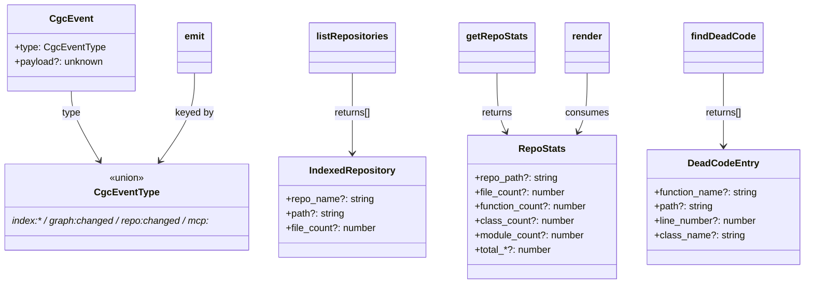

# VSCode extension wire contract (src/types/cgc.ts)

## Overview
`src/types/cgc.ts` is the small TypeScript module that declares the **data shapes the
VSCode extension expects back from the CodeGraphContext MCP server** — the graph as it
looks on the wire. There is no graph-building logic here; CGC builds the graph in its
Python/Neo4j backend, and the extension only ever sees *projections* of it: a list of
indexed repositories, aggregate node counts, and dead-code findings. These interfaces
are the contract for those projections, plus the event-type vocabulary the extension
uses internally to stay in sync when the graph changes. Everything comparable to the
other surveyed tools — the symbol/call graph, the query interface — sits behind these
types; this module tells you *what the extension assumes the graph contains*.

The defining design choice: **almost every field is optional**. The server returns the
same conceptual data in several JSON envelopes, so the types are deliberately loose and
the service layer (`service.ts`)
normalizes them into these shapes.

## Diagram

## Design rationale (why it's built this way)
The graph itself lives in the backend; the extension is a thin, resilient view over it.
That resilience is baked into these types. `RepoStats` carries **two parallel field
families** — `file_count`/`function_count`/`class_count`/`module_count` *and*
`total_files`/`total_functions`/`total_classes`/`total_modules`
([`RepoStats`](../catalog/extensions/vscode/src/types/cgc.ts.md#RepoStats)) — because
the server's `get_repository_stats` tool returns per-repo counts under one naming and
DB-wide counts under another. `getRepoStats` reads whichever is present for
`file_count`, `function_count`, and `class_count` (`base.file_count ?? base.total_files`,
and likewise for the other two) and collapses each pair into its canonical field —
but `module_count` has no `total_modules` counterpart in the tool's response type, so
it is passed through unfallback'd as `base.module_count`
([`getRepoStats`](../catalog/extensions/vscode/src/mcp/service.ts.md#CgcService.getRepoStats)).
Making the fields optional rather than modeling each envelope as its own type keeps the
call sites simple at the cost of weaker compile-time guarantees — a pragmatic trade for
a UI that must not crash on a slightly different backend response.

`CgcEventType` is a **string-literal union**, not an enum
([`CgcEventType`](../catalog/extensions/vscode/src/types/cgc.ts.md#CgcEventType)). The
values (`"index:started"`, `"index:progress"`, `"index:done"`, `"index:failed"`,
`"graph:changed"`, `"repo:changed"`, `"context:changed"`, `"mcp:online"`,
`"mcp:offline"`) double as the human-readable event names carried on the wire and as the
keys of the event-bus map, so no enum-to-string mapping is ever needed.

## Entry points
- [`listRepositories`](../catalog/extensions/vscode/src/mcp/service.ts.md#CgcService.listRepositories) —
  reached whenever a view needs the repo picker. It calls the `list_indexed_repositories`
  tool and maps each row into an [`IndexedRepository`](../catalog/extensions/vscode/src/types/cgc.ts.md#IndexedRepository),
  reconciling the backend's `repo_name` vs `name` alias into the single `repo_name` field.
- [`getRepoStats`](../catalog/extensions/vscode/src/mcp/service.ts.md#CgcService.getRepoStats) —
  reached when a panel renders graph totals. It produces a normalized
  [`RepoStats`](../catalog/extensions/vscode/src/types/cgc.ts.md#RepoStats) from whichever
  envelope (`stats`, `results`, or the bare response) the `get_repository_stats` tool returns.
- [`findDeadCode`](../catalog/extensions/vscode/src/mcp/service.ts.md#CgcService.findDeadCode) —
  reached from the dead-code diagnostics feature; returns
  [`DeadCodeEntry`](../catalog/extensions/vscode/src/types/cgc.ts.md#DeadCodeEntry)`[]`,
  pulling from `potentially_unused_functions` at either the top level or nested under `results`.
- [`emit`](../catalog/extensions/vscode/src/mcp/eventBus.ts.md#CgcEventBus.emit) /
  [`on`](../catalog/extensions/vscode/src/mcp/eventBus.ts.md#CgcEventBus.on) — reached
  whenever any component signals or subscribes to a graph/index lifecycle change, both
  keyed by a [`CgcEventType`](../catalog/extensions/vscode/src/types/cgc.ts.md#CgcEventType).

## Mechanism (step-by-step)
1. **The service turns tool responses into typed projections.** Each `CgcService` method
   wraps an MCP tool call in a defensive shape-normalizer: `listRepositories` yields
   `IndexedRepository[]` ([`listRepositories`](../catalog/extensions/vscode/src/mcp/service.ts.md#CgcService.listRepositories)),
   `getRepoStats` yields a `RepoStats` ([`getRepoStats`](../catalog/extensions/vscode/src/mcp/service.ts.md#CgcService.getRepoStats)),
   and `findDeadCode` yields `DeadCodeEntry[]` ([`findDeadCode`](../catalog/extensions/vscode/src/mcp/service.ts.md#CgcService.findDeadCode)).
   From this point on the extension speaks only in these types, not raw JSON.
2. **Views consume the projections.** The sidebar's
   [`render`](../catalog/extensions/vscode/src/views/controlPanel.ts.md#SidebarControlPanel.render)
   fetches repos, watches, hotspots and stats in parallel and passes them into
   `buildHtml`, where the payload's
   [`stats`](../catalog/extensions/vscode/src/views/controlPanel.ts.md#SidebarControlPanel.buildHtml.data-typeLiteral60.stats)
   field is typed `RepoStats`. The dashboard template's payload likewise carries a
   [`repos`](../catalog/extensions/vscode/src/webview/dashboardTemplate.ts.md#DashboardPayload.typeLiteral0.repos)
   field of `IndexedRepository[]`, and the diagnostics provider keys its
   [`index`](../catalog/extensions/vscode/src/providers/editorProviders.ts.md#CgcDeadCodeDiagnostics.index)
   map on `DeadCodeEntry`. The types thread straight from the wire into the rendered UI.
3. **Lifecycle changes fan out through the event bus, keyed by `CgcEventType`.** A
   component signals a change with [`emit`](../catalog/extensions/vscode/src/mcp/eventBus.ts.md#CgcEventBus.emit),
   which wraps the type + payload into a `CgcEvent` (whose
   [`type`](../catalog/extensions/vscode/src/types/cgc.ts.md#CgcEvent.type) field is the
   union) and dispatches to every subscriber registered via
   [`on`](../catalog/extensions/vscode/src/mcp/eventBus.ts.md#CgcEventBus.on). This is
   how the sidebar re-renders itself when e.g. `"graph:changed"` or `"index:done"` fires
   from another component — the graph-freshness signal that keeps the view current.

## Key data structures
- **`IndexedRepository`** — the extension's notion of one repo the graph knows about:
  display name, filesystem path, and a file count for the picker
  ([`IndexedRepository`](../catalog/extensions/vscode/src/types/cgc.ts.md#IndexedRepository)).
- **`RepoStats`** — aggregate node counts of the graph (files, functions, classes,
  modules), with the dual per-repo/DB-wide field families described above
  ([`RepoStats`](../catalog/extensions/vscode/src/types/cgc.ts.md#RepoStats)).
- **`DeadCodeEntry`** — one graph-derived unused-symbol finding: function/class name,
  path, line ([`DeadCodeEntry`](../catalog/extensions/vscode/src/types/cgc.ts.md#DeadCodeEntry)).
- **`CgcEventType`** — the closed vocabulary of index/graph/repo/context/mcp lifecycle
  events ([`CgcEventType`](../catalog/extensions/vscode/src/types/cgc.ts.md#CgcEventType)),
  used both as the `CgcEvent.type` discriminant and as the event-bus map key.

## Dynamics (design intent)
The event bus is the ordering mechanism these types feed. Its subscriber store
[`listeners`](../catalog/extensions/vscode/src/mcp/eventBus.ts.md#CgcEventBus.listeners)
is a `Map<CgcEventType, Set<Listener>>` — one listener set per event type — and
[`on`](../catalog/extensions/vscode/src/mcp/eventBus.ts.md#CgcEventBus.on) returns a
disposer that calls [`off`](../catalog/extensions/vscode/src/mcp/eventBus.ts.md#CgcEventBus.off)
to unsubscribe. The module docstring states the intent plainly: a "Lightweight pub/sub
event bus … All UI components subscribe here instead of managing their own polling."
`emit` iterates listeners inside a try/catch so, per its comment, "individual listener
failures must not break the bus" — the graph-changed fan-out is best-effort and isolated.

## Edge cases
- **Missing fields are normal, not errors.** Because every `RepoStats`/`IndexedRepository`/
  `DeadCodeEntry` field is optional, consumers must treat absence as "unknown"; the
  normalization in [`getRepoStats`](../catalog/extensions/vscode/src/mcp/service.ts.md#CgcService.getRepoStats)
  exists precisely to fill the canonical fields from whichever variant the server sent.
- **Empty projections on failure.** [`render`](../catalog/extensions/vscode/src/views/controlPanel.ts.md#SidebarControlPanel.render)
  catches each service call and falls back to `[]` / `{} as RepoStats`, and in
  `per-repo` context mode with no local `.codegraphcontext` index it deliberately blanks
  repos/stats to avoid leaking the global context's data into a repo-scoped view.

## Open questions
- The remaining exported types in this module (`CgcTool`, `JobStatus`, `CallerEntry`,
  `CalleeEntry`, `ComplexityEntry`, `DiscoveredContext`, `CgcMcpToolResponse`,
  `MpcToolContent`) are not in this packet's subgraph, so their consumers are not
  documented here — they widen the same wire contract (tool metadata, async index jobs,
  call-graph edges, complexity scores) but would need their own trace.

## See also
- Sibling per-repo concept pages for the CGC VSCode extension under
  `wiki/code/codegraphcontext/concepts/`.
- `wiki/code/codegraphcontext/overview.md` for how the extension, MCP service, and graph
  backend fit together.
