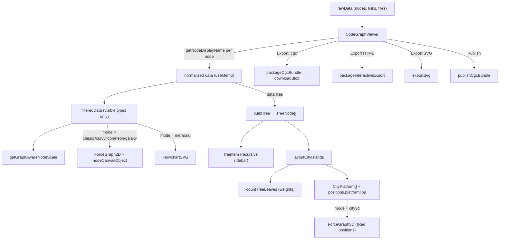

# CodeGraphViewer — rendering the code graph in the browser

## Overview
This is the demo website's presentation layer: the React component that takes a
CodeGraphContext code graph — the same `{nodes, links, files}` shape the tool builds
from parsing a repo — and turns it into something a human can pan, search, and read.
[`CodeGraphViewer`](../catalog/website/src/components/CodeGraphViewer.tsx.md#CodeGraphViewer)
is the whole viewer: a file-tree sidebar on the left, a graph canvas in the middle, and
a set of interchangeable *visualization modes* that all consume one filtered copy of the
graph. The key idea is that **layout is decoupled from data**: the graph nodes carry
type/file metadata, and each render mode (`classic` 2D force layout, `mermaid`
flowchart, `city3d` treemap-of-buildings) is just a different geometry computed over the
same node/link arrays. It is peripheral to the core indexing tool, but it is where the
symbol graph becomes legible — and where the graph is re-exported (as a `.cgc` bundle or
a standalone interactive HTML) for consumption elsewhere, including by an LLM.

## Diagram

## Design rationale (why it's built this way)
**One graph, many geometries.** The component never mutates the incoming graph; it
derives everything with `useMemo`. Raw nodes are first normalized so every node has a
displayable label —
[`getNodeDisplayName`](../catalog/website/src/components/CodeGraphViewer.tsx.md#getNodeDisplayName)
walks a fallback chain (`name ?? label ?? uid ?? node_type ?? type ?? id ?? 'Unknown'`)
so a graph produced by any language extractor still renders, even when a node lacks a
clean symbol name. This is the visual counterpart to the tool's multi-language ambition:
the renderer assumes nothing about which parser produced the node.

**Node type is the visual vocabulary.** The graph's semantic labels (Class, Function,
File, Directory, …) drive color and iconography through two lookup tables:
[`DEFAULT_NODE_COLORS`](../catalog/website/src/components/CodeGraphViewer.tsx.md#DEFAULT_NODE_COLORS)
and [`EMOJI_MAP`](../catalog/website/src/components/CodeGraphViewer.tsx.md#EMOJI_MAP).
The available modes are declared as data, not code branches, in
[`VISUALIZATION_MODES`](../catalog/website/src/components/CodeGraphViewer.tsx.md#VISUALIZATION_MODES)
— so adding a mode is adding a table row plus a render arm.

**Density-aware sizing.** A 50-node graph and a 5,000-node graph need very different
node radii to stay readable.
[`getGraphAwareNodeScale`](../catalog/website/src/components/CodeGraphViewer.tsx.md#getGraphAwareNodeScale)
encodes that as `clamp(2.5 / (1 + log10(n)*0.95), 0.45, 2.5)` — a logarithmic shrink so
big graphs get small nodes and small graphs get prominent ones. The author's inline
comment states the intent directly: *"High node count = smaller nodes to prevent overlap
and visual clutter; Low node count = larger, more prominent nodes for readability."*

**City-3D as a treemap of code.** The most distinctive mode reframes the directory tree
as a cityscape: each folder is a nested platform, each symbol a building whose height
encodes its kind ([`CITY_HEIGHTS`](../catalog/website/src/components/CodeGraphViewer.tsx.md#CITY_HEIGHTS)
— classes are tall towers, parameters are low sheds). The layout is a slice-and-dice treemap
recursion,
[`layoutCityIslands`](../catalog/website/src/components/CodeGraphViewer.tsx.md#layoutCityIslands),
that picks one split axis per recursion level from the rectangle's aspect ratio and
splits it proportionally to how much code each child contains (no per-row aspect-ratio
optimization, so it isn't squarified).

## Entry points
- [`CodeGraphViewer`](../catalog/website/src/components/CodeGraphViewer.tsx.md#CodeGraphViewer)
  is the default export and the sole entry point. Control reaches it when the Explore
  page has a graph to show — [`Explore`](../catalog/website/src/pages/Explore.tsx.md#Explore)
  (in the [`Explore`](../catalog/website/src/pages/Explore.tsx.md#Explore)
  module) fetches or parses a repository into graph data and renders `<CodeGraphViewer data=… />`.
  On mount the component reads the raw graph off its
  [`data`](../catalog/website/src/components/CodeGraphViewer.tsx.md#CodeGraphViewer.-data-rawData-onClose-.typeLiteral289.data)
  prop and immediately normalizes it (see Mechanism step 1).
- [`getOrCreateSessionId`](../catalog/website/src/lib/utils.ts.md#getOrCreateSessionId)
  is hit during render to build the ChatGPT-connect prompt. It mints (or reuses from
  `localStorage`) a short random session id — the handle an LLM agent uses to attach to
  *this* viewer's graph, tying the visual layer back to the tool's MCP/agent query path.

## Mechanism (step-by-step)
1. **Normalize the graph.** [`CodeGraphViewer`](../catalog/website/src/components/CodeGraphViewer.tsx.md#CodeGraphViewer)
   memoizes a cleaned copy of the incoming graph: it spreads `rawData`, maps every node
   through [`getNodeDisplayName`](../catalog/website/src/components/CodeGraphViewer.tsx.md#getNodeDisplayName)
   to guarantee a `name`, and defaults `links`/`files` to empty arrays. Everything
   downstream reads this derived `data`, never the raw prop, so a malformed or partial
   graph degrades gracefully instead of throwing.
2. **Filter to visible types.** A `filteredData` memo keeps only nodes whose `type` is in
   the currently-enabled set and drops links whose endpoints were filtered out. This is
   what the node-type legend toggles operate on, and it is the graph handed to every
   render mode. The visible node count then feeds
   [`getGraphAwareNodeScale`](../catalog/website/src/components/CodeGraphViewer.tsx.md#getGraphAwareNodeScale)
   to pick a global node radius multiplier.
3. **Build the file tree for the sidebar.** [`buildTree`](../catalog/website/src/components/CodeGraphViewer.tsx.md#buildTree)
   splits each path in `data.files` on `/` and threads it into a nested
   [`TreeNode`](../catalog/website/src/components/CodeGraphViewer.tsx.md#TreeNode) structure
   (directories first, then files, each alphabetized). Its load-bearing subtlety, called
   out in a source comment: leaf nodes store the **full original path** in
   [`path`](../catalog/website/src/components/CodeGraphViewer.tsx.md#TreeNode.path), because
   `onFileClick`
   later matches `graphNode.file === path` to focus the graph — a truncated path would
   silently break selection.
4. **Render the tree recursively with live search.** [`TreeItem`](../catalog/website/src/components/CodeGraphViewer.tsx.md#TreeItem)
   renders one `node`,
   recursing over its
   [`children`](../catalog/website/src/components/CodeGraphViewer.tsx.md#TreeNode.children)
   when [`isDir`](../catalog/website/src/components/CodeGraphViewer.tsx.md#TreeNode.isDir)
   is true. The
   `searchQuery`
   prop prunes the render: a subtree collapses out entirely unless it (or a descendant)
   matches, and matching subtrees auto-expand. `depth`
   drives indentation and the initial open-state (depth < 2), and
   `selectedFile`
   highlights the active row.
5. **Weight the layout by code volume.** For the treemap modes,
   [`countTreeLeaves`](../catalog/website/src/components/CodeGraphViewer.tsx.md#countTreeLeaves)
   recurses a [`TreeNode`](../catalog/website/src/components/CodeGraphViewer.tsx.md#TreeNode):
   a file's weight is the number of graph nodes attached to it (min 1), a directory's is
   the sum of its children. This makes a folder full of big classes occupy proportionally
   more of the canvas than a folder of one-liners.
6. **Lay out the 3D city.** [`layoutCityIslands`](../catalog/website/src/components/CodeGraphViewer.tsx.md#layoutCityIslands)
   consumes those weights to slice a rectangle. It alternates split axis by aspect ratio
   (`isHoriz = rect.w >= rect.h`), allocating each item a sub-rectangle proportional to
   its weight. Directories become a [`CityPlatform`](../catalog/website/src/components/CodeGraphViewer.tsx.md#CityPlatform)
   pushed onto the platform list, then recurse into an inner rect inset by
   [`PLATFORM_PAD`](../catalog/website/src/components/CodeGraphViewer.tsx.md#PLATFORM_PAD)
   at `depth + 1`. Files place their nodes on a square grid inside the leaf cell, writing
   each node's `x`/`z` and its
   [`platformTop`](../catalog/website/src/components/CodeGraphViewer.tsx.md#layoutCityIslands.positions-Map.typeLiteral64.platformTop)
   (= `depth * PLATFORM_LAYER_H`) so deeper-nested code sits on higher stacked slabs. The
   [`w`](../catalog/website/src/components/CodeGraphViewer.tsx.md#layoutCityIslands.rect-typeLiteral63.w)
   and [`h`](../catalog/website/src/components/CodeGraphViewer.tsx.md#layoutCityIslands.rect-typeLiteral63.h)
   of the incoming rect are the recursion's shrinking budget.
7. **Draw the graph in the chosen mode.** The render body switches on the mode declared in
   [`VISUALIZATION_MODES`](../catalog/website/src/components/CodeGraphViewer.tsx.md#VISUALIZATION_MODES).
   2D modes hand `filteredData` to a `ForceGraph2D` with a custom canvas painter that, for
   the `icon` mode, stamps the per-type glyph from
   [`EMOJI_MAP`](../catalog/website/src/components/CodeGraphViewer.tsx.md#EMOJI_MAP) and
   otherwise fills a circle colored via
   [`DEFAULT_NODE_COLORS`](../catalog/website/src/components/CodeGraphViewer.tsx.md#DEFAULT_NODE_COLORS).
   The `mermaid` mode delegates entirely to
   [`FlowchartSVG`](../catalog/website/src/components/FlowchartSVG.tsx.md#FlowchartSVG),
   passing the graph and viewport size (see step 8). `city3d` feeds the fixed positions
   from step 6 into a 3D force graph with the simulation disabled.
8. **Flowchart mode — deterministic SVG layout.** [`FlowchartSVG`](../catalog/website/src/components/FlowchartSVG.tsx.md#FlowchartSVG)
   receives the graph as [`data`](../catalog/website/src/components/FlowchartSVG.tsx.md#Props.data)
   (with [`nodes`](../catalog/website/src/components/FlowchartSVG.tsx.md#Props.data.typeLiteral5.nodes)),
   viewport [`width`](../catalog/website/src/components/FlowchartSVG.tsx.md#Props.width)/[`height`](../catalog/website/src/components/FlowchartSVG.tsx.md#Props.height),
   the [`nodeColors`](../catalog/website/src/components/FlowchartSVG.tsx.md#Props.nodeColors)/[`edgeColors`](../catalog/website/src/components/FlowchartSVG.tsx.md#Props.edgeColors)
   maps, and an [`isDark`](../catalog/website/src/components/FlowchartSVG.tsx.md#Props.isDark)
   theme flag. It reconstructs a containment tree from `CONTAINS` links and lays boxes out
   on fixed-size slots — [`NODE_W`](../catalog/website/src/components/FlowchartSVG.tsx.md#NODE_W)
   × [`NODE_H`](../catalog/website/src/components/FlowchartSVG.tsx.md#NODE_H), separated by
   [`NODE_GAP`](../catalog/website/src/components/FlowchartSVG.tsx.md#NODE_GAP) — rather than
   a physics simulation, so the diagram is reproducible frame to frame.
9. **Export / publish the graph.** The toolbar re-serializes the same graph four ways.
   [`exportSvg`](../catalog/website/src/lib/svg-exporter.ts.md#exportSvg) writes a static
   SVG from current node positions.
   [`packageInteractiveExport`](../catalog/website/src/lib/html-exporter.ts.md#packageInteractiveExport)
   builds a self-contained HTML file, emitting either
   [`generateClassicHTML`](../catalog/website/src/lib/html-exporter.ts.md#generateClassicHTML)
   (canvas + d3 force sim) or
   [`generateFlowchartHTML`](../catalog/website/src/lib/html-exporter.ts.md#generateFlowchartHTML).
   [`packageCgcBundle`](../catalog/website/src/lib/cgc-exporter.ts.md#packageCgcBundle)
   zips the graph into the tool's native `.cgc` format (`nodes.jsonl` + `edges.jsonl` +
   `metadata.json`), delivered locally via
   [`downloadBlob`](../catalog/website/src/lib/cgc-exporter.ts.md#downloadBlob) or pushed to
   the hosting service through
   [`publishCgcBundle`](../catalog/website/src/lib/cgc-exporter.ts.md#publishCgcBundle).

## Key data structures
- **[`TreeNode`](../catalog/website/src/components/CodeGraphViewer.tsx.md#TreeNode)** — the
  file-tree spine: [`name`](../catalog/website/src/components/CodeGraphViewer.tsx.md#TreeNode.name),
  [`path`](../catalog/website/src/components/CodeGraphViewer.tsx.md#TreeNode.path),
  [`isDir`](../catalog/website/src/components/CodeGraphViewer.tsx.md#TreeNode.isDir), and
  [`children`](../catalog/website/src/components/CodeGraphViewer.tsx.md#TreeNode.children).
  Built by `buildTree`, walked by `TreeItem`, `countTreeLeaves`, and `layoutCityIslands`.
- **[`CityPlatform`](../catalog/website/src/components/CodeGraphViewer.tsx.md#CityPlatform)**
  — one directory's slab in the 3D city: rectangle (`x,z,w,h`) plus `depth`, `name`,
  `path`. Accumulated by `layoutCityIslands` and later drawn as the ground beneath the
  buildings.
- **positions map / [`platformTop`](../catalog/website/src/components/CodeGraphViewer.tsx.md#layoutCityIslands.positions-Map.typeLiteral64.platformTop)**
  — the layout output: node id → `{x, z, platformTop}`, converted into fixed
  (`fx/fy/fz`) coordinates for the 3D force graph so nodes stay where the treemap put them.
- **Type→style tables** —
  [`DEFAULT_NODE_COLORS`](../catalog/website/src/components/CodeGraphViewer.tsx.md#DEFAULT_NODE_COLORS),
  [`EMOJI_MAP`](../catalog/website/src/components/CodeGraphViewer.tsx.md#EMOJI_MAP), and
  [`CITY_HEIGHTS`](../catalog/website/src/components/CodeGraphViewer.tsx.md#CITY_HEIGHTS)
  — the shared visual vocabulary keyed on the graph's node `type`.
- **Modal chrome** — publish/export confirmations use the shadcn AlertDialog family:
  [`AlertDialog`](../catalog/website/src/components/ui/alert-dialog.tsx.md#AlertDialog),
  [`AlertDialogOverlay`](../catalog/website/src/components/ui/alert-dialog.tsx.md#AlertDialogOverlay),
  [`AlertDialogContent`](../catalog/website/src/components/ui/alert-dialog.tsx.md#AlertDialogContent),
  [`AlertDialogHeader`](../catalog/website/src/components/ui/alert-dialog.tsx.md#AlertDialogHeader),
  [`AlertDialogFooter`](../catalog/website/src/components/ui/alert-dialog.tsx.md#AlertDialogFooter),
  [`AlertDialogTitle`](../catalog/website/src/components/ui/alert-dialog.tsx.md#AlertDialogTitle),
  [`AlertDialogDescription`](../catalog/website/src/components/ui/alert-dialog.tsx.md#AlertDialogDescription),
  [`AlertDialogAction`](../catalog/website/src/components/ui/alert-dialog.tsx.md#AlertDialogAction),
  [`AlertDialogCancel`](../catalog/website/src/components/ui/alert-dialog.tsx.md#AlertDialogCancel).

## Dynamics (design intent)
The viewer is a pure function of its input graph plus UI state; all heavy derivations
(`filteredData`, `fileTree`, `city3dData`, node scale) are `useMemo`s keyed on their
inputs, so a type-filter toggle or a mode switch recomputes only what changed rather than
re-parsing the graph. `layoutCityIslands` and `countTreeLeaves` are ordinary synchronous
recursions run once per relevant memo — there is no animation loop in the layout itself;
motion comes from the underlying force-graph library, which the city mode deliberately
freezes by supplying fixed coordinates. Export functions
([`packageCgcBundle`](../catalog/website/src/lib/cgc-exporter.ts.md#packageCgcBundle),
[`packageInteractiveExport`](../catalog/website/src/lib/html-exporter.ts.md#packageInteractiveExport),
[`publishCgcBundle`](../catalog/website/src/lib/cgc-exporter.ts.md#publishCgcBundle)) are
`async` because they zip, hash, and (for publish) upload; the render path never awaits them.

## Edge cases
- **Missing labels.** [`getNodeDisplayName`](../catalog/website/src/components/CodeGraphViewer.tsx.md#getNodeDisplayName)
  falls all the way to `'Unknown'` so a node with no usable identifier still draws;
  internally it coerces the fallback with the global
  [`String`](../catalog/tests/fixtures/sample_projects/sample_project_typescript/src/modules-namespaces.ts.md#String)
  type before trimming.
- **Unattached nodes in city mode.** Nodes with no file placement are treated as orphans
  and parked far below the grid (`platformTop`/y of `-100`) rather than being dropped —
  the layout in [`layoutCityIslands`](../catalog/website/src/components/CodeGraphViewer.tsx.md#layoutCityIslands)
  only places file-attached nodes, and the caller backfills the rest.
- **Empty subtrees.** [`countTreeLeaves`](../catalog/website/src/components/CodeGraphViewer.tsx.md#countTreeLeaves)
  returns 1 for an empty directory so a childless folder still gets a nonzero slice and
  the proportional split never divides by zero (`total || 1`).
- **Unknown types.** A node whose `type` is absent from
  [`DEFAULT_NODE_COLORS`](../catalog/website/src/components/CodeGraphViewer.tsx.md#DEFAULT_NODE_COLORS)
  falls back to the `Other` color, and [`EMOJI_MAP`](../catalog/website/src/components/CodeGraphViewer.tsx.md#EMOJI_MAP)
  misses render as `❓`, so a graph from an unfamiliar extractor still shows something.
- **Path-matching fragility.** [`buildTree`](../catalog/website/src/components/CodeGraphViewer.tsx.md#buildTree)
  must preserve full leaf paths or file selection breaks — noted explicitly in the source
  as a `MUST`.

## Open questions
- The `graph3d`, `neon`, `galaxy`, and `curvy` render arms and the `ForceGraph2D`
  `nodeCanvasObject` painter exercise the graph too, but their driving symbols are not in
  this packet's subgraph, so their exact geometry isn't grounded here.
- [`Array`](../catalog/tests/fixtures/sample_projects/sample_project_typescript/src/modules-namespaces.ts.md#Array)
  and [`String`](../catalog/tests/fixtures/sample_projects/sample_project_typescript/src/modules-namespaces.ts.md#String)
  in the subgraph resolve to *test-fixture* globals (a sample TypeScript project the tool
  indexes), not to the runtime library types — an artifact of the cross-project SCIP index
  rather than a real viewer dependency.

## See also
- [`FlowchartSVG`](../catalog/website/src/components/FlowchartSVG.tsx.md#FlowchartSVG) — the deterministic SVG flowchart renderer this component delegates to for `mermaid` mode.
- The `Explore.tsx` page ([`Explore`](../catalog/website/src/pages/Explore.tsx.md#Explore)) — where the graph is fetched/parsed and the viewer is mounted.
- The exporters: [`cgc-exporter`](../catalog/website/src/lib/cgc-exporter.ts.md) and [`html-exporter`](../catalog/website/src/lib/html-exporter.ts.md) — how the rendered graph leaves the browser.
