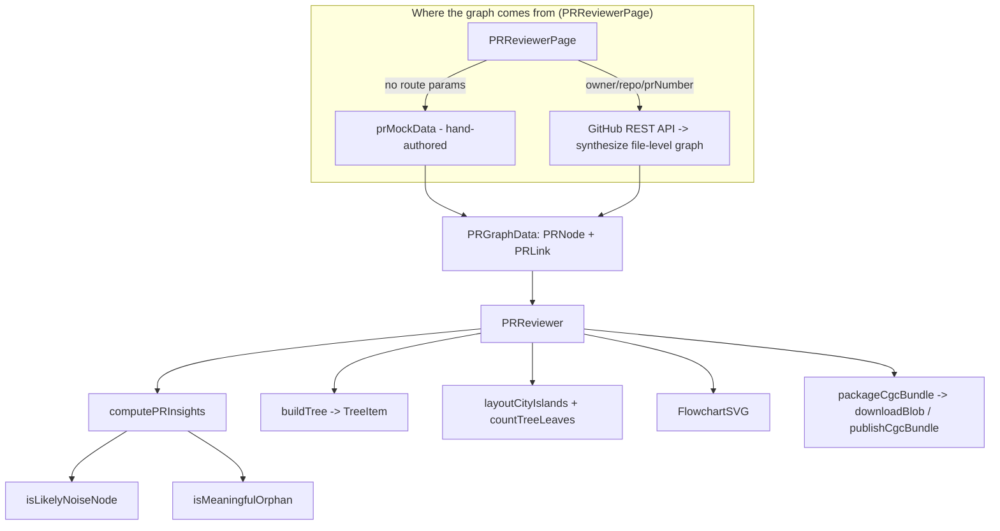

# PRReviewer: a PR-review UI over the code graph (demo surface)

<!-- connect:up:begin -->
> **Cross-repo concept:** part of [symbol-graph](../../../concepts/symbol-graph.md) across this wiki's repos.
<!-- connect:up:end -->
## Overview
`PRReviewer` is a marketing/demo React component on CodeGraphContext's website that dramatizes what the code graph is *for*: reviewing a pull request as a **blast-radius graph** rather than a flat file diff. It consumes a graph shaped like CGC's own model — typed nodes ([`PRNode`](../catalog/website/src/lib/pr-mock-data.ts.md#PRNode)) and typed call/import edges ([`PRLink`](../catalog/website/src/lib/pr-mock-data.ts.md#PRLink.source)) — classifies each symbol by how the diff touches it, and renders that graph eight different ways while a heuristic scorer ([`computePRInsights`](../catalog/website/src/lib/pr-insights.ts.md#computePRInsights)) narrates risk, key symbols, and likely dead code.

The single most important thing to understand for the code-comprehension lens: **this page does not run CGC's real indexing pipeline.** Its default data is hand-authored mock data, and its "live" path synthesizes a shallow, file-level graph client-side from the GitHub REST API — not from CGC's tree-sitter parsers or the Neo4j store. It is a *view* onto the graph idea, and a serializer for CGC's bundle format, not the graph builder itself.

## Diagram

## Design rationale (why it's built this way)

**The graph model mirrors CGC's real one — so the demo is honest about the shape even when the data is fake.** A [`PRNode`](../catalog/website/src/lib/pr-mock-data.ts.md#PRNode) carries an [`id`](../catalog/website/src/lib/pr-mock-data.ts.md#PRNode.id), [`name`](../catalog/website/src/lib/pr-mock-data.ts.md#PRNode.name), [`type`](../catalog/website/src/lib/pr-mock-data.ts.md#PRNode.type) (Function/Class/Module/Variable/File…), and a [`file`](../catalog/website/src/lib/pr-mock-data.ts.md#PRNode.file); a [`PRLink`](../catalog/website/src/lib/pr-mock-data.ts.md#PRLink.source) is a typed edge with [`source`](../catalog/website/src/lib/pr-mock-data.ts.md#PRLink.source)/[`target`](../catalog/website/src/lib/pr-mock-data.ts.md#PRLink.target) and a [`type`](../catalog/website/src/lib/pr-mock-data.ts.md#PRLink.type) drawn from the same CALLS/CONTAINS/IMPORTS/INHERITS vocabulary CGC's extractors emit. This is why the same component can also *serialize* a graph back out via [`packageCgcBundle`](../catalog/website/src/lib/cgc-exporter.ts.md#packageCgcBundle): the on-screen structure and the on-disk `.cgc` format are the same node/edge shape.

**The PR-specific twist is [`prZone`](../catalog/website/src/lib/pr-mock-data.ts.md#PRNode.prZone) and [`status`](../catalog/website/src/lib/pr-mock-data.ts.md#PRNode.status).** Beyond a plain symbol graph, each node is tagged with *where it sits relative to the change*: `direct` (a symbol the diff actually touched), `primary`/`secondary` (upstream callers rippling outward — the blast radius), or `none`. [`status`](../catalog/website/src/lib/pr-mock-data.ts.md#PRNode.status) records added/modified/deleted/unchanged/orphaned. These two axes are what turn a static call graph into a *review* artifact.

**Noise filtering exists because a raw diff-to-graph mapping over-reports.** A single Python hunk can flip many symbols to "changed" even though only one line moved. [`isLikelyNoiseNode`](../catalog/website/src/lib/pr-insights.ts.md#isLikelyNoiseNode) reads each node's [`gitDiff`](../catalog/website/src/lib/pr-mock-data.ts.md#PRNode.gitDiff) and demotes symbols that merely *share* a hunk with others without being the hunk's actual subject — the author is explicitly compensating for the coarseness of mapping line-diffs onto graph nodes.

> [!inferred]
> The heavy investment in eight visualization modes ([`VISUALIZATION_MODES`](../catalog/website/src/components/PRReviewer.tsx.md#VISUALIZATION_MODES)) — including a 3D cityscape and a neon galaxy — reads as a marketing/demo priority (show off the graph), not a reviewer-productivity one. Nothing in the reviewed source ties mode choice to review accuracy.

## Entry points

- [`PRReviewerPage`](../catalog/website/src/pages/PRReviewerPage.tsx.md#PRReviewerPage) — the route component and the *source of the graph*. With no `owner`/`repo`/`prNumber` route params it loads `prMockData` (the demo default); with params it tries a pre-built `/pr-data/<owner>__<repo>__<prNumber>.json`, and only if that misses does it hit the GitHub REST API and build a graph on the fly. Defined in the `PRReviewerPage.tsx` module. Its client-side synthesis is deliberately crude: file-to-file edges are guessed by substring `includes()` on file contents, and a fake `main_runner.py` "primary caller" node is injected so the blast-radius zones are non-empty — none of this is CGC's actual parser output.
- [`PRReviewer`](../catalog/website/src/components/PRReviewer.tsx.md#PRReviewer) — the component itself, taking `{ data, onClose }`. On mount it normalizes incoming nodes through [`getNodeDisplayName`](../catalog/website/src/components/PRReviewer.tsx.md#getNodeDisplayName) (which falls back through `name`/`label`/`uid`/`node_type`/`type`/`id` and coerces via [`String`](../catalog/tests/fixtures/sample_projects/sample_project_typescript/src/modules-namespaces.ts.md#String)), then drives every downstream view and the insights panel.

## Mechanism (step-by-step)

1. **Ingest and normalize the graph.** [`PRReviewer`](../catalog/website/src/components/PRReviewer.tsx.md#PRReviewer) memoizes a cleaned `data` object, mapping each raw node through [`getNodeDisplayName`](../catalog/website/src/components/PRReviewer.tsx.md#getNodeDisplayName) so nodes coming from heterogeneous sources (mock JSON, GitHub-synthesized, a real CGC bundle) all present a stable display name. This is the single choke point that lets the rest of the component treat any of the three data origins uniformly.

2. **Score the change.** [`computePRInsights`](../catalog/website/src/lib/pr-insights.ts.md#computePRInsights) is the analytical heart. It partitions nodes by [`prZone`](../catalog/website/src/lib/pr-mock-data.ts.md#PRNode.prZone) into `direct` and `primary` sets, splits `direct` nodes into signal vs. noise via [`isLikelyNoiseNode`](../catalog/website/src/lib/pr-insights.ts.md#isLikelyNoiseNode), and derives a `noiseRatio`. It then builds a de-duplicated **key-symbols** list — added or modified functions/classes (by [`status`](../catalog/website/src/lib/pr-mock-data.ts.md#PRNode.status) and [`type`](../catalog/website/src/lib/pr-mock-data.ts.md#PRNode.type)) plus any `direct` node that is the [`target`](../catalog/website/src/lib/pr-mock-data.ts.md#PRLink.target) of a call edge in the impact graph. This is where the "graph" pays off: a symbol is surfaced not just because it changed, but because an edge points at it.

3. **Trace meaningful call paths.** Still inside [`computePRInsights`](../catalog/website/src/lib/pr-insights.ts.md#computePRInsights), it walks the [`links`](../catalog/website/src/lib/pr-mock-data.ts.md#PRGraphData.links), resolving each edge's source/target back to nodes and keeping only paths that touch a non-noise `direct` symbol (capped at 8). Edges labeled by [`type`](../catalog/website/src/lib/pr-mock-data.ts.md#PRLink.type) become the reviewer's "here is how the change reaches the rest of the code" narrative.

4. **Separate dead code from indexing artifacts.** [`isMeaningfulOrphan`](../catalog/website/src/lib/pr-insights.ts.md#isMeaningfulOrphan) decides whether an orphaned node (no inbound callers) is *worth flagging* — excluding added symbols, primary/secondary-zone nodes, variables, and `test_*` names, and requiring that the node also has no outgoing edges. The distinction feeds two different UI messages: "potential dead code" vs. "orphan flags that look like indexing artifacts," an explicit acknowledgment that graph extraction produces false orphans.

5. **Build the file tree view.** [`buildTree`](../catalog/website/src/components/PRReviewer.tsx.md#buildTree) folds the flat `files` list into a nested [`TreeNode`](../catalog/website/src/components/PRReviewer.tsx.md#TreeNode) forest (directories first, then files, each sorted), carefully storing each leaf's full [`path`](../catalog/website/src/components/PRReviewer.tsx.md#TreeNode.path) so clicks can rejoin the tree to graph nodes. [`TreeItem`](../catalog/website/src/components/PRReviewer.tsx.md#TreeItem) renders it recursively: it auto-expands under a `searchQuery`, prunes subtrees with no matching descendant, indents by `depth`, and reports selection through `onFileClick` against the current `selectedFile`.

6. **Lay out the 3D "city."** For the `city3d` mode, [`layoutCityIslands`](../catalog/website/src/components/PRReviewer.tsx.md#layoutCityIslands) recursively squarifies the file tree into nested platforms ([`CityPlatform`](../catalog/website/src/components/PRReviewer.tsx.md#CityPlatform)), sizing each region by [`countTreeLeaves`](../catalog/website/src/components/PRReviewer.tsx.md#countTreeLeaves) — a weight that counts a directory's symbols (via `nodesByFile`), not just its file count. Files become grids of building footprints, each stamped with a [`platformTop`](../catalog/website/src/components/PRReviewer.tsx.md#layoutCityIslands.positions-Map.typeLiteral64.platformTop) elevation per nesting depth; padding is set by [`PLATFORM_PAD`](../catalog/website/src/components/PRReviewer.tsx.md#PLATFORM_PAD). Platforms themselves render as plain box geometry with no curved corners; [`CITY_ARC_SEGMENTS`](../catalog/website/src/components/PRReviewer.tsx.md#CITY_ARC_SEGMENTS) instead sizes the bezier edge-arcs drawn between buildings' rooftops. This is a treemap-as-cityscape: containment depth maps to physical height.

7. **Render the flowchart view.** [`FlowchartSVG`](../catalog/website/src/components/FlowchartSVG.tsx.md#FlowchartSVG) is the `mermaid`/flowchart mode — a self-contained pan/zoom SVG that reads the same node/edge [`data`](../catalog/website/src/components/FlowchartSVG.tsx.md#Props.data), lays boxes out on a [`NODE_W`](../catalog/website/src/components/FlowchartSVG.tsx.md#NODE_W)×[`NODE_H`](../catalog/website/src/components/FlowchartSVG.tsx.md#NODE_H) grid with [`NODE_GAP`](../catalog/website/src/components/FlowchartSVG.tsx.md#NODE_GAP) spacing, colors them from [`nodeColors`](../catalog/website/src/components/FlowchartSVG.tsx.md#Props.nodeColors)/[`edgeColors`](../catalog/website/src/components/FlowchartSVG.tsx.md#Props.edgeColors), and honors [`width`](../catalog/website/src/components/FlowchartSVG.tsx.md#Props.width)/[`height`](../catalog/website/src/components/FlowchartSVG.tsx.md#Props.height)/[`isDark`](../catalog/website/src/components/FlowchartSVG.tsx.md#Props.isDark). It follows `CONTAINS` edges to build a containment tree for expand/collapse.

8. **Export or publish the graph as a CGC bundle.** The one place the demo touches CGC's real interchange format: [`packageCgcBundle`](../catalog/website/src/lib/cgc-exporter.ts.md#packageCgcBundle) zips the current `data.nodes`/`data.links` into `nodes.jsonl` + `edges.jsonl` + `metadata.json` (a `.cgc` file). [`downloadBlob`](../catalog/website/src/lib/cgc-exporter.ts.md#downloadBlob) saves it locally; [`publishCgcBundle`](../catalog/website/src/lib/cgc-exporter.ts.md#publishCgcBundle) base64-encodes it, computes a SHA-256, and pushes it to a registry via a `/api/publish` handshake (uploading to Hugging Face LFS when required). [`getOrCreateSessionId`](../catalog/website/src/lib/utils.ts.md#getOrCreateSessionId) stashes an anonymous per-browser id in `localStorage` for these calls.

## Key data structures

- **[`PRGraphData`](../catalog/website/src/lib/pr-mock-data.ts.md#PRGraphData)** — the whole payload: `nodes`, [`links`](../catalog/website/src/lib/pr-mock-data.ts.md#PRGraphData.links), `files`, `fileContents`, and PR `metadata`. This is the contract every data source (mock, pre-built JSON, GitHub-synthesized) must satisfy.
- **[`PRNode`](../catalog/website/src/lib/pr-mock-data.ts.md#PRNode)** — a graph symbol. The review-specific fields are [`prZone`](../catalog/website/src/lib/pr-mock-data.ts.md#PRNode.prZone) (blast-radius ring), [`status`](../catalog/website/src/lib/pr-mock-data.ts.md#PRNode.status) (diff verb), and [`gitDiff`](../catalog/website/src/lib/pr-mock-data.ts.md#PRNode.gitDiff) (the raw hunk the noise heuristics parse); [`type`](../catalog/website/src/lib/pr-mock-data.ts.md#PRNode.type), [`id`](../catalog/website/src/lib/pr-mock-data.ts.md#PRNode.id), [`name`](../catalog/website/src/lib/pr-mock-data.ts.md#PRNode.name), [`file`](../catalog/website/src/lib/pr-mock-data.ts.md#PRNode.file) are the generic symbol identity.
- **[`PRLink`](../catalog/website/src/lib/pr-mock-data.ts.md#PRLink.source)** — a typed edge ([`source`](../catalog/website/src/lib/pr-mock-data.ts.md#PRLink.source), [`target`](../catalog/website/src/lib/pr-mock-data.ts.md#PRLink.target), [`type`](../catalog/website/src/lib/pr-mock-data.ts.md#PRLink.type)); optionally carries `isViolation` for architectural-boundary flags.
- **[`TreeNode`](../catalog/website/src/components/PRReviewer.tsx.md#TreeNode)** — the file-tree projection: [`name`](../catalog/website/src/components/PRReviewer.tsx.md#TreeNode.name), [`path`](../catalog/website/src/components/PRReviewer.tsx.md#TreeNode.path), [`isDir`](../catalog/website/src/components/PRReviewer.tsx.md#TreeNode.isDir), [`children`](../catalog/website/src/components/PRReviewer.tsx.md#TreeNode.children). A derived structure, not part of the graph itself.
- **Presentation tables** — [`DEFAULT_NODE_COLORS`](../catalog/website/src/components/PRReviewer.tsx.md#DEFAULT_NODE_COLORS) (color per node type), [`EMOJI_MAP`](../catalog/website/src/components/PRReviewer.tsx.md#EMOJI_MAP) (icon per type), and [`VISUALIZATION_MODES`](../catalog/website/src/components/PRReviewer.tsx.md#VISUALIZATION_MODES) drive rendering; [`getGraphAwareNodeScale`](../catalog/website/src/components/PRReviewer.tsx.md#getGraphAwareNodeScale) shrinks node markers logarithmically as the graph grows.

## Dynamics (design intent)
The pipeline is pull-based and memoized: `PRReviewerPage`'s `useEffect` fetches once per `owner/repo/prNumber` change and sets `data`; [`PRReviewer`](../catalog/website/src/components/PRReviewer.tsx.md#PRReviewer) recomputes [`computePRInsights`](../catalog/website/src/lib/pr-insights.ts.md#computePRInsights), [`buildTree`](../catalog/website/src/components/PRReviewer.tsx.md#buildTree), and the city layout only when `data` changes. All analysis is synchronous and client-side over the in-memory graph — there is no backend query, no live graph store, no re-indexing loop in this path.

## Edge cases
- **No route params → mock data.** The default `/pr-reviewer` route always shows the hand-authored demo graph; a reader must not mistake the on-screen richness for real analysis output.
- **GitHub rate limits / private repos.** The live path throws on 403/429 and on unreachable repos; the error UI offers a demo PR fallback. File contents fetched as base64 are best-effort — on failure the node's `gitDiff`/content degrades to the raw patch.
- **Synthesized edges are lexical, not semantic.** In the GitHub path, edges are created when one file's text merely `includes()` another's basename — so the "graph" can both miss real calls and invent spurious ones. The noise heuristics in [`isLikelyNoiseNode`](../catalog/website/src/lib/pr-insights.ts.md#isLikelyNoiseNode) partly exist to paper over this.
- **Empty tree leaves.** [`countTreeLeaves`](../catalog/website/src/components/PRReviewer.tsx.md#countTreeLeaves) floors a file's weight at 1 so files with no indexed symbols still get a footprint in the city layout.

## Open questions
- The subgraph includes [`Array`](../catalog/tests/fixtures/sample_projects/sample_project_typescript/src/modules-namespaces.ts.md#Array) and [`String`](../catalog/tests/fixtures/sample_projects/sample_project_typescript/src/modules-namespaces.ts.md#String) resolved against a *test fixture* project's ambient declarations rather than the app's own lib — an artifact of how the SCIP indexer resolved global types across the monorepo; harmless here but worth noting the cross-project moniker leakage.
- Whether any production route ever feeds this component a graph produced by CGC's *actual* Python/tree-sitter indexer (vs. the GitHub-synthesized or mock paths) is not visible in this packet — the wiring here only shows mock and client-side synthesis.

## See also
- `wiki/code/codegraphcontext/concepts/website-src-lib-pr-mock-data.tsx.md` — the graph data model and the demo fixture this component consumes.
- `wiki/code/codegraphcontext/concepts/website-src-lib-cgc-exporter.ts.md` — the `.cgc` bundle format that `packageCgcBundle`/`publishCgcBundle` write.
- `wiki/code/codegraphcontext/overview.md` — how the real indexing/graph-store pipeline (the thing this UI only *depicts*) is built.
