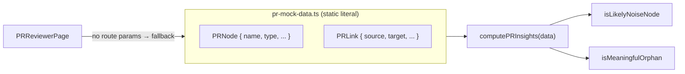

# PR-reviewer mock data — the website demo's baked-in graph

`website/src/lib/pr-mock-data.ts` is a hand-written TypeScript module that exports one
hard-coded `PRGraphData` object: a single, fixed pull request (`sktime/sktime-mcp` #453)
with a handful of nodes and edges. It is the *fallback fixture* the marketing site's
PR-reviewer page renders when no live PR is requested — not output produced by
CodeGraphContext's own indexing pipeline.

## Overview
The module defines two record shapes — a graph node (`PRNode`, whose fields include
[`name`](../catalog/website/src/lib/pr-mock-data.ts.md#PRNode.name) and
[`type`](../catalog/website/src/lib/pr-mock-data.ts.md#PRNode.type)) and a graph edge
(`PRLink`, with [`source`](../catalog/website/src/lib/pr-mock-data.ts.md#PRLink.source)
and [`target`](../catalog/website/src/lib/pr-mock-data.ts.md#PRLink.target)) — and then
literally spells out a small instance of that shape as a constant. The
`pr-mock-data.ts`
module is the type contract shared by the page that displays the graph and the helpers
that score it; the *data* itself is a static literal, not a query result.

For this survey the module's significance is corroborative, not architectural: it is
concrete evidence that the website's PR-reviewer is a **demo**. The live path — a fetch of a
pre-built `/pr-data/*.json`, falling back to the GitHub REST API plus client-side
substring-matching heuristics for linking files — involves no CGC server or parser at all; it
is not what powers the default view — a canned object is.

> [!inferred]
> The `PRNode`/`PRLink` fields mirror the vocabulary of a code-impact graph (source/target
> edges, per-node change `status`, `prZone`, `complexityDelta`, `affectedCallers`). So the
> demo is *shaped like* what a real CGC-backed reviewer would emit — the shape is real code
> comprehension vocabulary; the population is fabricated. A citable symbol here is not a
> shipping graph feature.

## Diagram

## Design rationale (why it's built this way)
Baking a fixture into the bundle lets the PR-reviewer page render something meaningful on
first load with zero backend, no auth, and no GitHub rate limit — the default demo works
offline. The type interfaces are exported alongside the literal so the same shape is reused
by the renderer and the insight scorers, which is why
[`computePRInsights`](../catalog/website/src/lib/pr-insights.ts.md#computePRInsights) can
consume either this mock or a real fetched graph interchangeably.

> [!inferred]
> Keeping mock and live paths on one `PRGraphData` type is a deliberate substitutability
> choice: the demo and any real graph are the same shape, so the UI code never branches on
> "is this fake?". That is good for the demo and, for the survey, exactly why the mock is
> easy to mistake for a live feature.

## Entry points
- [`PRReviewerPage`](../catalog/website/src/pages/PRReviewerPage.tsx.md#PRReviewerPage) — the
  React page. Its effect checks the route params; when `owner`/`repo`/`prNumber` are absent it
  sets state to the mock object (`setData(prMockData)`) and returns before any network call.
  This is the *only* automatic reader of the fixture, and it is the default landing state.
- [`computePRInsights`](../catalog/website/src/lib/pr-insights.ts.md#computePRInsights) — the
  scorer that turns a `PRGraphData` (mock or real) into summary insights; reached whenever the
  page has data to analyze.

## Mechanism (step-by-step)
1. The module declares the graph vocabulary as interface fields —
   [`name`](../catalog/website/src/lib/pr-mock-data.ts.md#PRNode.name),
   [`type`](../catalog/website/src/lib/pr-mock-data.ts.md#PRNode.type),
   [`source`](../catalog/website/src/lib/pr-mock-data.ts.md#PRLink.source),
   [`target`](../catalog/website/src/lib/pr-mock-data.ts.md#PRLink.target) — and then exports a
   constant literal of that shape (the `pr-mock-data.ts`
   module). Nothing computes these values; they are typed by hand.
2. On load with no route params, [`PRReviewerPage`](../catalog/website/src/pages/PRReviewerPage.tsx.md#PRReviewerPage)
   feeds the literal straight into component state — the demo graph appears without touching a
   server or the GitHub API.
3. Downstream, [`computePRInsights`](../catalog/website/src/lib/pr-insights.ts.md#computePRInsights)
   reads the node/edge fields to classify the graph, delegating to
   [`isLikelyNoiseNode`](../catalog/website/src/lib/pr-insights.ts.md#isLikelyNoiseNode) (drops
   nodes whose `type`/diff look like incidental churn) and
   [`isMeaningfulOrphan`](../catalog/website/src/lib/pr-insights.ts.md#isMeaningfulOrphan) (keeps
   disconnected nodes that still matter). These heuristics run identically over the mock and
   over any real graph, since both satisfy the same field contract.

## Key data structures
`PRNode` and `PRLink` are the whole story: a node carries a
[`name`](../catalog/website/src/lib/pr-mock-data.ts.md#PRNode.name) and a
[`type`](../catalog/website/src/lib/pr-mock-data.ts.md#PRNode.type) (plus change metadata like
`prZone`, `status`, `gitDiff`); an edge carries
[`source`](../catalog/website/src/lib/pr-mock-data.ts.md#PRLink.source),
[`target`](../catalog/website/src/lib/pr-mock-data.ts.md#PRLink.target) and a relationship
`type` (e.g. `CALLS`, `RUNS`). The
exported constant is one small population of exactly these.

## Dynamics (design intent)
No tests in the configured paths reference this subgraph. The insight helpers are pure functions
of their input graph, so their behavior over the mock is fully determined by the literal's field
values.

## Edge cases
- The fixture is only reached when route params are missing; supplying `owner/repo/prNumber`
  routes [`PRReviewerPage`](../catalog/website/src/pages/PRReviewerPage.tsx.md#PRReviewerPage)
  down a live fetch path (local JSON, then the GitHub API) instead — the mock is the *default*,
  not the *only* source.
- Because the mock is a compile-time literal, it never goes stale against a moving repo the way a
  real graph would; it is frozen to PR #453 forever.

## Open questions
- The exported constant `prMockData` and the `PRGraphData` container type are not in this packet's
  subgraph, so they are described but not cited here; the renderer component `PRReviewer` that
  actually draws the graph is likewise out of scope.
- The live path never touches a CGC server: it fetches a pre-built `/pr-data/*.json`, and
  failing that, hits the GitHub REST API and builds nodes/links via client-side substring
  (`includes()`) heuristics — confirmed from
  [`PRReviewerPage`](../catalog/website/src/pages/PRReviewerPage.tsx.md#PRReviewerPage)'s fetch
  logic, not from this module.

## See also
- [`computePRInsights` / PR insight heuristics](./website-src-lib-pr-insights.ts.md) — the scorer that consumes this shape.
- [codegraphcontext overview](../overview.md)
