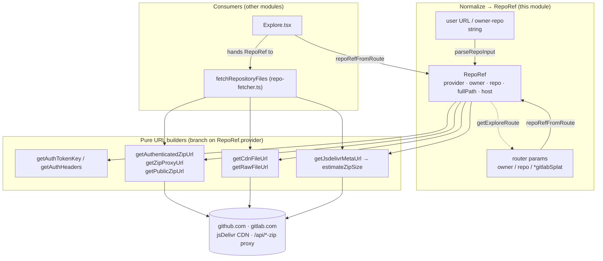

# Website repo-provider: the git-host data-source seam

## Overview
`repo-provider.ts` is the CodeGraphContext **website's** data-source layer: the module that
decides *where the code the site graphs actually comes from*. It contains no graph logic and no
UI. It does two things: (1) normalize whatever the user typed — a URL, an `owner/repo`
shorthand, or a React-Router path — into a single canonical identity, the [`RepoRef`](../catalog/website/src/lib/repo-provider.ts.md#RepoRef);
and (2) expose a family of **pure URL builders** that turn that `RepoRef` + a branch into the
concrete GitHub / GitLab / jsDelivr endpoints the fetcher will hit. The single key idea is that
every provider difference (GitHub vs GitLab path shapes, auth header names, CDN availability) is
collapsed into `RepoRef` at the seam, so the rest of the fetch pipeline never branches on
provider except by calling these helpers.

The seam this page exists to explain: **the website graphs a repo entirely from live public
git-host infrastructure, in the browser — not from any CodeGraphContext backend.** The URLs
built here point at `api.github.com`, `raw.githubusercontent.com`, `cdn.jsdelivr.net`,
`gitlab.com/api/v4`, and same-origin `/api/*-zip` proxies. The Python indexer / Neo4j store /
MCP server that the CLI side of CodeGraphContext runs is *not* in this path. (See Design
rationale for how far that claim is grounded.)

## Diagram

## Design rationale (why it's built this way)
The whole module is organized around **one struct plus mostly pure URL/parse helpers, and a few
async I/O functions** (`resolveRepoMetadata`, `listRepositoryFiles`, `estimateZipSize`, which fetch
from the git host or jsDelivr). `RepoRef`
carries five fields — [`provider`](../catalog/website/src/lib/repo-provider.ts.md#RepoRef.provider),
[`owner`](../catalog/website/src/lib/repo-provider.ts.md#RepoRef.owner),
[`repo`](../catalog/website/src/lib/repo-provider.ts.md#RepoRef.repo),
[`fullPath`](../catalog/website/src/lib/repo-provider.ts.md#RepoRef.fullPath), and
[`host`](../catalog/website/src/lib/repo-provider.ts.md#RepoRef.host) — and the docstrings tell
you why both `owner`/`repo` *and* `fullPath` are stored redundantly: `owner` "may contain slashes
for nested GitLab groups", while `fullPath` is the "Full project path, e.g. `gitlab-org/gitlab` or
`facebook/react`". GitHub's flat `owner/repo` model and GitLab's arbitrarily-nested group model do
not share one representation, so `RepoRef` keeps both derivations pre-computed. That is why
[`getPublicZipUrl`](../catalog/website/src/lib/repo-provider.ts.md#getPublicZipUrl) uses
`ref.owner`/`ref.repo` on the GitHub branch but `ref.fullPath` on the GitLab branch — the shape
of each host's URL dictates which field is correct.

The `RepoProvider` union ([`RepoProvider`](../catalog/website/src/lib/repo-provider.ts.md#RepoProvider)
= `"github" | "gitlab"`) plus per-function `if (ref.provider === …)` conditionals is a deliberate
choice of *inline strategy over polymorphism*. There is no `Provider` class hierarchy; each helper
is a small pure function that switches on the two-valued enum. For a two-provider world this keeps
every endpoint's construction visible in one place and trivially testable.

> [!inferred]
> The redundant-storage and inline-switch design reads as a pragmatic response to GitLab's nested
> groups: a class hierarchy would have to thread the slash-handling through every method anyway, so
> the author kept it flat. This is my reading of the structure, not a documented decision.

A quieter design point sits in [`repoRefFromRoute`](../catalog/website/src/lib/repo-provider.ts.md#repoRefFromRoute):
the GitHub branch returns `provider: provider === "github" ? "github" : "github"` — both arms are
`"github"`. This collapses any non-GitLab route to GitHub, i.e. GitHub is the default provider for
the `owner/repo` route shape.

## Entry points
- [`parseRepoInput`](../catalog/website/src/lib/repo-provider.ts.md#parseRepoInput) — reached when
  the user pastes a repo into a text box. Its docstring: "Parse a user-supplied URL or `owner/repo`
  shorthand into a RepoRef." It tries three regexes in order — a `gitlab.com/...` URL, a
  `github.com/owner/repo` URL, then a bare `owner/repo(/sub…)` shorthand — and returns `null` if
  none match or if fewer than two path segments survive cleaning.
- [`repoRefFromRoute`](../catalog/website/src/lib/repo-provider.ts.md#repoRefFromRoute) — reached
  when the app deep-links straight to a repo via the router. Its docstring: "Build a RepoRef from
  route parameters." The GitLab branch reads the wildcard splat (nested group path); the GitHub
  branch takes discrete `owner`/`repo` route params.
- The URL-builder family — [`getZipProxyUrl`](../catalog/website/src/lib/repo-provider.ts.md#getZipProxyUrl),
  [`getPublicZipUrl`](../catalog/website/src/lib/repo-provider.ts.md#getPublicZipUrl),
  [`getAuthenticatedZipUrl`](../catalog/website/src/lib/repo-provider.ts.md#getAuthenticatedZipUrl),
  [`getRawFileUrl`](../catalog/website/src/lib/repo-provider.ts.md#getRawFileUrl),
  [`getCdnFileUrl`](../catalog/website/src/lib/repo-provider.ts.md#getCdnFileUrl) — are not called
  by end users; they are reached from the fetch pipeline (below), once per download tier/file.

## Mechanism (step-by-step)
1. **Identity normalization.** The gitlab and shorthand branches of `parseRepoInput`, and the gitlab
   branch of `repoRefFromRoute`, funnel user intent into a `RepoRef` by way of
   [`cleanRepoPathSegment`](../catalog/website/src/lib/repo-provider.ts.md#cleanRepoPathSegment) —
   whose docstring is "Strip trailing .git, /-/* UI paths, and query/hash from a repo path
   segment." It chains five `.replace` calls so that a pasted browser URL like
   `gitlab.com/group/sub/proj/-/tree/main?foo` reduces to the bare project path. The last path
   segment becomes [`repo`](../catalog/website/src/lib/repo-provider.ts.md#RepoRef.repo) and
   everything before it becomes [`owner`](../catalog/website/src/lib/repo-provider.ts.md#RepoRef.owner),
   which is how nested GitLab groups survive into the `RepoRef`. The `host` field is stamped from the
   constants [`GITHUB_HOST`](../catalog/website/src/lib/repo-provider.ts.md#GITHUB_HOST) (`"github.com"`)
   or [`GITLAB_HOST`](../catalog/website/src/lib/repo-provider.ts.md#GITLAB_HOST) (`"gitlab.com"`). The
   github branch of each entry point skips this step, taking `owner`/`repo` directly from the regex
   match or route params.

2. **The consumer builds the ref and hands off.** [`Explore`](../catalog/website/src/pages/Explore.tsx.md#Explore),
   the page component, decides GitHub vs GitLab from the URL path (`location.pathname.startsWith("/gitlab/")`),
   calls `repoRefFromRoute` accordingly, then passes the resulting `RepoRef` to
   [`fetchRepositoryFiles`](../catalog/website/src/lib/repo-fetcher.ts.md#fetchRepositoryFiles). This is
   the boundary: `repo-provider.ts` decides *identity and URLs*; the fetcher orchestrates *the actual
   network I/O*. Everything downstream (`parseFilesIntoGraph`, the in-browser graph store) consumes the
   files this seam locates — the graph is built client-side from live-fetched source.

3. **Auth resolution.** Before any fetch, the pipeline derives credentials purely from the ref.
   [`getAuthTokenKey`](../catalog/website/src/lib/repo-provider.ts.md#getAuthTokenKey) maps the
   provider to a `localStorage` key (`"gitlab_pat"` vs `"github_pat"`), and
   [`getAuthHeaders`](../catalog/website/src/lib/repo-provider.ts.md#getAuthHeaders) reads that token
   and shapes the provider-correct header — GitLab's `PRIVATE-TOKEN` vs GitHub's `Authorization: token …`.
   With no stored token both return empty, so unauthenticated public access is the default path.

4. **Metadata + size estimate.** The commit the graph is pinned to comes from the git host, not from
   CodeGraphContext: the resolved [`latestCommitSha`](../catalog/website/src/lib/repo-provider.ts.md#resolveRepoMetadata.Promise.typeLiteral60.latestCommitSha)
   is the return of a metadata call, and the file-listing fallback returns its own
   [`commitSha`](../catalog/website/src/lib/repo-provider.ts.md#listRepositoryFiles.Promise.typeLiteral100.commitSha)
   from jsDelivr's `version`. To draw a progress bar before the download finishes,
   [`estimateZipSize`](../catalog/website/src/lib/repo-provider.ts.md#estimateZipSize) hits the jsDelivr
   metadata endpoint from [`getJsdelivrMetaUrl`](../catalog/website/src/lib/repo-provider.ts.md#getJsdelivrMetaUrl)
   (GitHub-only; returns `null` for GitLab) and multiplies the uncompressed size by `0.22` as a
   compression guess — this is the one URL-builder-adjacent function here that itself performs a
   `fetch`, and it degrades to a flat 4 MB estimate when metadata is unavailable.

5. **Tiered ZIP acquisition.** The fetcher tries three whole-repo ZIP sources in priority order, each
   built here from the same ref: authenticated host API
   ([`getAuthenticatedZipUrl`](../catalog/website/src/lib/repo-provider.ts.md#getAuthenticatedZipUrl),
   used only when a token exists), then a same-origin CORS-avoiding proxy
   ([`getZipProxyUrl`](../catalog/website/src/lib/repo-provider.ts.md#getZipProxyUrl) → `/api/github-zip/…`
   or `/api/gitlab-zip/…`), then the public archive
   ([`getPublicZipUrl`](../catalog/website/src/lib/repo-provider.ts.md#getPublicZipUrl)). Each tier is
   retried across a list of candidate branches. The tiering exists because browsers can't freely
   cross-origin-download arbitrary git-host archives; the proxy tier is the escape hatch.

6. **Per-file fallback.** When every ZIP tier fails, the pipeline lists the tree and downloads files
   one by one, preferring the CDN ([`getCdnFileUrl`](../catalog/website/src/lib/repo-provider.ts.md#getCdnFileUrl),
   `cdn.jsdelivr.net`, GitHub-only) and falling back to
   [`getRawFileUrl`](../catalog/website/src/lib/repo-provider.ts.md#getRawFileUrl)
   (`raw.githubusercontent.com` / GitLab `/-/raw/`). The jsDelivr metadata tree arrives as nested
   [`JsdelivrFile`](../catalog/website/src/lib/repo-provider.ts.md#JsdelivrFile) nodes, each with a
   [`name`](../catalog/website/src/lib/repo-provider.ts.md#JsdelivrFile.name), a
   [`type`](../catalog/website/src/lib/repo-provider.ts.md#JsdelivrFile.type) of `"file"` or
   `"directory"`, and optional child [`files`](../catalog/website/src/lib/repo-provider.ts.md#JsdelivrFile.files);
   [`flattenJsdelivrTree`](../catalog/website/src/lib/repo-provider.ts.md#flattenJsdelivrTree) walks that
   tree recursively into a flat list of `dir/dir/file` path strings.

## Key data structures
- **[`RepoRef`](../catalog/website/src/lib/repo-provider.ts.md#RepoRef)** — the canonical repo
  identity that every URL builder takes as its first argument, alongside a `branch` (and, for
  `getRawFileUrl`/`getCdnFileUrl`, a `filePath`). Redundantly stores both the split
  `owner`/`repo` and the joined `fullPath` precisely because GitHub and GitLab disagree on which is
  primary (see rationale).
- **[`RepoProvider`](../catalog/website/src/lib/repo-provider.ts.md#RepoProvider)** — the
  `"github" | "gitlab"` union that every helper switches on; the closed set that makes inline
  conditionals safe rather than a class hierarchy.
- **[`JsdelivrFile`](../catalog/website/src/lib/repo-provider.ts.md#JsdelivrFile)** — the shape of
  jsDelivr's package-tree response, modeled as a recursive `name`/`type`/`files` node so the tree can
  be flattened and totaled.
- **Host constants** [`GITHUB_HOST`](../catalog/website/src/lib/repo-provider.ts.md#GITHUB_HOST) /
  [`GITLAB_HOST`](../catalog/website/src/lib/repo-provider.ts.md#GITLAB_HOST) — the only literal host
  strings, stamped into `RepoRef.host` at construction.

## Dynamics (design intent)
Nearly every symbol here is a **pure, synchronous function of `(RepoRef, branch, filePath)`** — no
shared state, no ordering constraints. The two exceptions read `localStorage`
([`getAuthHeaders`](../catalog/website/src/lib/repo-provider.ts.md#getAuthHeaders),
[`getAuthenticatedZipUrl`](../catalog/website/src/lib/repo-provider.ts.md#getAuthenticatedZipUrl)) and
the one async that fetches ([`estimateZipSize`](../catalog/website/src/lib/repo-provider.ts.md#estimateZipSize)).
The purity is what lets the fetcher call the ZIP builders in a retry loop across branches without
coordination. Ordering (auth → proxy → public ZIP → per-file) lives entirely in the *fetcher*, not
here; this module only supplies the URLs each stage needs.

## Edge cases
- **Under-specified paths.** Both `parseRepoInput` and `repoRefFromRoute` return `null` when the
  cleaned path has fewer than two segments — reflected in the nullable return type on
  [`repoRefFromRoute`](../catalog/website/src/lib/repo-provider.ts.md#repoRefFromRoute).
- **GitLab is second-class for CDN/estimation.** [`getCdnFileUrl`](../catalog/website/src/lib/repo-provider.ts.md#getCdnFileUrl)
  and [`getJsdelivrMetaUrl`](../catalog/website/src/lib/repo-provider.ts.md#getJsdelivrMetaUrl) return
  `null` for GitLab, and [`estimateZipSize`](../catalog/website/src/lib/repo-provider.ts.md#estimateZipSize)
  short-circuits to the default estimate — so GitLab repos skip the jsDelivr CDN path and the reliable
  size estimate entirely.
- **The `owner`-with-slashes hazard.** Because [`owner`](../catalog/website/src/lib/repo-provider.ts.md#RepoRef.owner)
  can contain slashes for nested GitLab groups, any URL builder that interpolates `owner`/`repo`
  directly is GitHub-shaped; some GitLab branches instead interpolate `encodeURIComponent(fullPath)`
  (see [`getZipProxyUrl`](../catalog/website/src/lib/repo-provider.ts.md#getZipProxyUrl)). Mixing the
  two would produce malformed GitLab URLs.
- **The always-GitHub route branch.** As noted, `repoRefFromRoute`'s ternary `"github" : "github"`
  means an unrecognized provider on a non-GitLab route silently becomes GitHub rather than erroring.

## Open questions
- The `Array` and `Explore.tsx` symbols in the packet subgraph are structural neighbors
  ([`Array`](../catalog/tests/fixtures/sample_projects/sample_project_typescript/src/modules-namespaces.ts.md#Array),
  [`Explore`](../catalog/website/src/pages/Explore.tsx.md#Explore))
  pulled in by the return-type/module edges; they are not central to this module's mechanism and are
  documented only where the fetch consumer (`Explore`) meets the seam.
- The functions that *return* the cited `latestCommitSha` and `commitSha` terms (`resolveRepoMetadata`,
  `listRepositoryFiles`) live in this file but are not in the packet subgraph, so their full branch/
  pagination logic is described from the ref's return-type properties only — the exact GitHub-tree vs
  GitLab-paginated-tree behavior would need those symbols to cite directly.
- Whether the same-origin `/api/*-zip` proxy from [`getZipProxyUrl`](../catalog/website/src/lib/repo-provider.ts.md#getZipProxyUrl)
  is a static serverless function or something with server-side state is out of scope for this module;
  it only builds the path.

## See also
- `wiki/code/codegraphcontext/concepts/website-src-lib-repo-fetcher.ts` — the orchestrator that
  consumes these URLs and runs the tiered download.
- `wiki/code/codegraphcontext/overview.md` — how the website's client-side grapher relates to the
  CLI/MCP indexer path.
