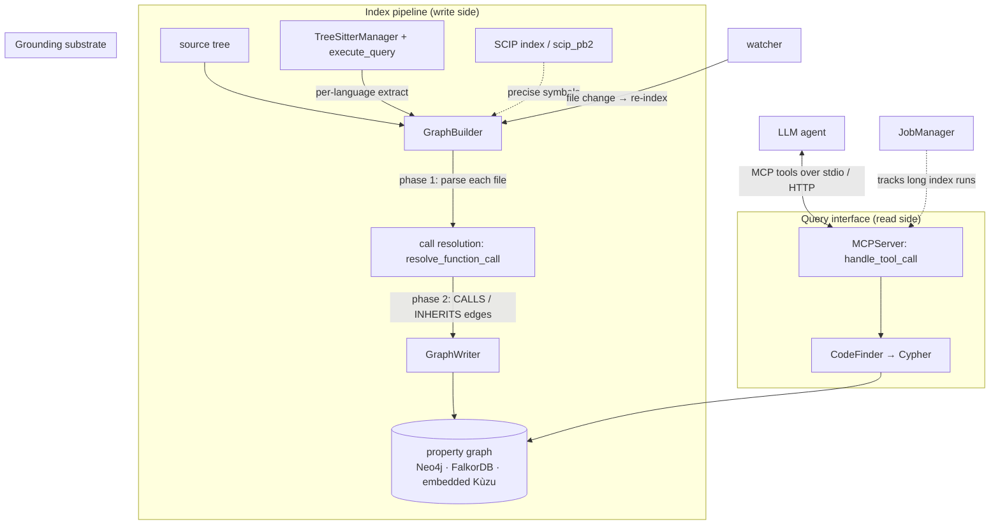
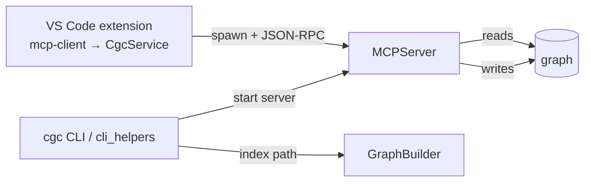

# CodeGraphContext — what it is and how it fits together

## In one paragraph
CodeGraphContext (CGC) turns a codebase into a **property graph** — `Function`, `Class`, `File`,
`Module`, `Repository` nodes joined by `CALLS`, `IMPORTS`, `INHERITS`, `IMPLEMENTS`, `DECORATED_BY`
and a dozen more edge types — and then exposes that graph to an LLM agent as a menu of **MCP tools**,
so the model asks structured questions ("who calls this?", "what's the blast radius of this change?",
"what's dead?") instead of grepping raw text. The central design idea is a **two-phase indexing
pipeline**: every file is parsed *independently and concurrently* by Tree-sitter into a
language-neutral bag of symbols, then a **whole-repo resolution pass** stitches those isolated facts
into cross-file `CALLS`/`INHERITS` edges — because a call's target can only be resolved once every
file's symbols are known. Because CGC has **no compiler and no type checker**, those edges are
recovered by heuristics and stamped with a confidence tier. The graph is the durable state; the MCP
server is a stateless-per-call router in front of it, and the same tool surface serves both an editor's
stdio client and an HTTP API. The whole system is written against a **Neo4j-shaped driver API**, which
lets the store be a real server (Neo4j / FalkorDB) or an in-process embedded engine (KùzuDB) behind one
adapter.

## Core architecture

## Main concepts

**GraphBuilder — the ingestion facade.** The thin orchestrator that owns a database driver and a
writer but delegates the heavy lifting to the `indexing/` package: parse files concurrently, then run
the whole-repo resolution pass. This is the answer to "how does CGC represent a codebase."
→ [graph_builder](concepts/codegraphcontext-tools-graph_builder.md)

**Multi-language extraction via Tree-sitter.** A singleton `TreeSitterManager` normalizes language
names and lazily loads compiled grammars; a single `execute_query` free function is the one place a
Tree-sitter query runs, and nearly every per-language extractor funnels through it (Emacs Lisp is the
exception — it walks the parse tree directly rather than via `execute_query`). Adding a language is an
alias entry plus a parser class. Per-language modules (Kotlin, TypeScript, Emacs Lisp, …) map each
language's syntax onto the shared node/edge model.
→ [tree_sitter_manager](concepts/codegraphcontext-utils-tree_sitter_manager.md) ·
[kotlin](concepts/codegraphcontext-tools-languages-kotlin.md) ·
[typescript](concepts/codegraphcontext-tools-languages-typescript.md) ·
[elisp](concepts/codegraphcontext-tools-languages-elisp.md)

**Call resolution — the accuracy crux.** Turning the syntactic call `foo.bar(x)` into a `CALLS` edge
to the one definition it reaches, with no compiler: infer the receiver's type, walk the class
hierarchy, disambiguate overloads by arity/args, and stamp every edge with a confidence tier.
→ [resolution-calls](concepts/codegraphcontext-tools-indexing-resolution-calls.md)

**SCIP as a precise grounding substrate.** Where a Tree-sitter heuristic is not enough, CGC can ingest
a SCIP index (the `scip_pb2` schema — Documents, SymbolInformation, Occurrences, monikers) for
compiler-grade cross-language symbol identity.
→ [scip_pb2](concepts/codegraphcontext-tools-scip_pb2.md)

**Persistence — writer + backend seam.** `GraphWriter` turns resolved relationships into graph
records; a persistence-utils seam detects the backend type and dispatches each write, so the same
writer targets a server DB or the embedded engine.
→ [persistence-writer](concepts/codegraphcontext-tools-indexing-persistence-writer.md) ·
[persistence-utils](concepts/codegraphcontext-tools-indexing-persistence-utils.md)

**The store: one contract, two substrates.** Everything is written against a Neo4j-shaped
`driver.session().run(cypher)` API. The embedded backend keeps that contract but swaps the server for
an in-process KùzuDB engine, using wrapper shims plus a runtime Cypher translator — one pipeline, two
interchangeable stores, reconciled by an adapter rather than by branching every caller.
→ [database_embedded_kuzu](concepts/codegraphcontext-core-database_embedded_kuzu.md)

**CodeFinder — the read side.** Every question an agent can ask is answered here as a parameterized
Cypher query against the graph; there is no in-process traversal engine — *the graph database is the
query engine* — unified behind one string-keyed dispatcher.
→ [code_finder](concepts/codegraphcontext-tools-code_finder.md)

**The MCP server — the query interface.** `MCPServer` owns the long-lived db-manager, graph-builder,
code-finder and watcher, and presents them to the model as a flat menu of MCP tools; one dispatcher
maps a tool name to a thin wrapper and delegates to a handler. The graph is durable state; the server
is a stateless-per-call router serving both stdio and HTTP.
→ [server](concepts/codegraphcontext-server.md)

**Keeping the graph current.** Long indexing runs are tracked as background jobs so an agent can kick
off indexing without blocking; a watcher re-indexes on file changes.
→ [jobs](concepts/codegraphcontext-core-jobs.md)

**Driving it all — the CLI + config.** The `cgc` command surface routes to indexing, server-start and
setup; helper flows wire services together and run indexing with a progress bar; a config manager
resolves DB credentials, backend selection and the active repo context.
→ [cli-main](concepts/codegraphcontext-cli-main.md) ·
[cli_helpers](concepts/codegraphcontext-cli-cli_helpers.md) ·
[config_manager](concepts/codegraphcontext-cli-config_manager.md) ·
[debug_log](concepts/codegraphcontext-utils-debug_log.md)

**Consumers: the VS Code extension and the website.** The extension is the client end of the query
interface — it spawns the Python MCP server and calls its tools through a low-level client wrapped by a
`CgcService` facade, over a typed wire contract. The marketing website renders a graph in the browser
(`CodeGraphViewer`) and demos a graph-powered PR review — the latter runs on **baked-in mock data**, a
useful reminder that a citable symbol is not proof a feature ships live.
→ [mcp-client](concepts/extensions-vscode-src-mcp-client.ts.md) ·
[mcp-service](concepts/extensions-vscode-src-mcp-service.ts.md) ·
[types-cgc](concepts/extensions-vscode-src-types-cgc.ts.md) ·
[CodeGraphViewer](concepts/website-src-components-CodeGraphViewer.tsx.md) ·
[PRReviewer](concepts/website-src-components-PRReviewer.tsx.md) ·
[pr-mock-data](concepts/website-src-lib-pr-mock-data.ts.md) ·
[repo-provider](concepts/website-src-lib-repo-provider.ts.md)

## How a request flows
**Indexing:** `cgc` (or an MCP `index` tool) → `GraphBuilder.build_graph_from_path_async` fans files
out to Tree-sitter extractors (grammars from `TreeSitterManager`) → phase-2 `resolve_function_call`
stitches cross-file edges → `GraphWriter` persists nodes/edges through the backend seam into the graph
store; a `JobManager` tracks the run. **Querying:** the agent calls an MCP tool → `handle_tool_call`
routes to a `CodeFinder` method → one Cypher query against the graph → normalized rows back to the
agent. **Staying current:** the watcher re-triggers indexing for changed files.

## Map of the wiki
- *"How is a codebase represented / how is the graph built?"* → [graph_builder](concepts/codegraphcontext-tools-graph_builder.md)
- *"How are 20+ languages handled?"* → [tree_sitter_manager](concepts/codegraphcontext-utils-tree_sitter_manager.md) and the `languages-*` pages
- *"How accurate is the call graph / how are edges resolved?"* → [resolution-calls](concepts/codegraphcontext-tools-indexing-resolution-calls.md)
- *"Where does the graph live / what store?"* → [database_embedded_kuzu](concepts/codegraphcontext-core-database_embedded_kuzu.md) + [persistence-writer](concepts/codegraphcontext-tools-indexing-persistence-writer.md)
- *"How does an agent query it?"* → [server](concepts/codegraphcontext-server.md) + [code_finder](concepts/codegraphcontext-tools-code_finder.md)
- *"How does the editor connect?"* → [mcp-client](concepts/extensions-vscode-src-mcp-client.ts.md) + [mcp-service](concepts/extensions-vscode-src-mcp-service.ts.md)
- **Exhaustive per-module index** → [`catalog/`](catalog/) · **concept table** → [`index.md`](index.md)
