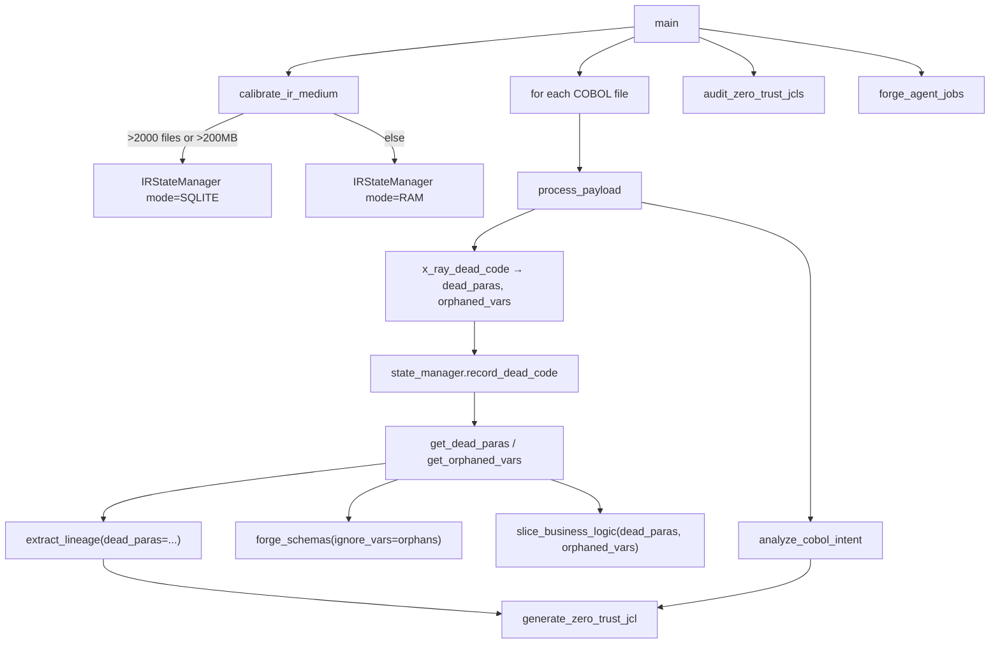

# COBOL Refractor Controller — a shared-IR pipeline for code generation, not comprehension

## Overview
`cobol_refractor_controller.py` ("The Legacy Forge") orchestrates a suite of COBOL/JCL-specific
regex tools that turn a legacy mainframe repository into a parallel "clean room" of generated
artifacts: zero-trust JCL, cloud SQL/JSON schemas, dead-code audit reports, and (optionally)
extracted business-logic slices. Its output is *generated code and reports*, not a comprehension
graph — this is gitgalaxy used as a migration compiler front end, not a wiki-builder. The one
architectural idea worth understanding is [`IRStateManager`](../catalog/gitgalaxy/cobol_refractor_controller.md#IRStateManager):
a single abstraction over "is dead-code state kept in RAM or SQLite," which lets a chain of
otherwise-independent regex tools (dead-code finder, lineage extractor, schema forge, business
slicer) share findings about one COBOL program without any of them knowing or caring how that
state is actually stored.

> [!inferred]
> This controller does **not** import from `gitgalaxy.core` (no `ApertureFilter`, no
> `StructuralExtractor`/detector, no `Prism`) — it does not consume the polyglot "blAST" engine's
> structural signatures as input. It is a separate, COBOL/JCL-specific regex pipeline that
> applies the *same design philosophy* (heuristic pattern matching over raw text, no AST, no
> LLM) independently, purpose-built for COBOL syntax the general engine's language definitions
> don't model. See Open questions.

## Diagram

## Design rationale (why it's built this way)
**A hybrid RAM/SQLite state layer, chosen once up front.** [`calibrate_ir_medium`](../catalog/gitgalaxy/cobol_refractor_controller.md#calibrate_ir_medium)'s
own docstring is "Scouts the repository to determine the safest IR storage medium," and it does
this *before* any file is analyzed, by counting `.cbl`/`.cob` files and summing their size —
over 2000 files or 200MB switches to SQLite, otherwise a plain RAM dict. Every downstream call
site then goes through the same [`IRStateManager`](../catalog/gitgalaxy/cobol_refractor_controller.md#IRStateManager)
methods ([`record_dead_code`](../catalog/gitgalaxy/cobol_refractor_controller.md#IRStateManager.record_dead_code),
[`get_dead_paras`](../catalog/gitgalaxy/cobol_refractor_controller.md#IRStateManager.get_dead_paras),
[`get_orphaned_vars`](../catalog/gitgalaxy/cobol_refractor_controller.md#IRStateManager.get_orphaned_vars))
regardless of which medium was picked — the class's own docstring states the intent plainly:
"Abstracts the IR storage so the spoke tools don't have to care if it's RAM or SQL." This is
what lets `test_ir_state_manager_parity` assert both backends return *identical* results for
the same inputs on the same test.

**Dead-code findings deliberately flow forward to prevent hallucinated dependencies.** A
comment inline in [`process_payload`](../catalog/gitgalaxy/cobol_refractor_controller.md#process_payload)
spells out the reasoning for the DAG step: "Utilizing Deprecated Trails RAM to deflect
Hallucinated Dependencies!" Concretely, `dead_paras`/`orphans` retrieved from
[`get_dead_paras`](../catalog/gitgalaxy/cobol_refractor_controller.md#IRStateManager.get_dead_paras)/[`get_orphaned_vars`](../catalog/gitgalaxy/cobol_refractor_controller.md#IRStateManager.get_orphaned_vars)
are threaded into [`extract_lineage`](../catalog/gitgalaxy/tools/cobol_to_cobol/cobol_dag_architect.md#extract_lineage)
(so lineage mapping doesn't chase I/O through code that can never execute),
[`forge_schemas`](../catalog/gitgalaxy/tools/cobol_to_cobol/cobol_schema_forge.md#forge_schemas)
(`ignore_vars=orphans`, dropping unused fields from generated schemas), and
[`slice_business_logic`](../catalog/gitgalaxy/tools/cobol_to_cobol/cobol_microservice_slicer.md#slice_business_logic)
(so a variable slice doesn't extract unreachable branches). This is the controller's real
"structural signature" analog: not the general engine's hit-vectors, but a per-program dead-code
fact table that several otherwise-unrelated single-purpose regex tools all consult.

**Uncertain cases become tickets, not guesses.** Rather than silently emitting possibly-wrong
generated code, unresolved cases are collected into `master_honesty_flags` and handed to
[`forge_agent_jobs`](../catalog/gitgalaxy/tools/cobol_to_cobol/cobol_agent_task_forge.md#forge_agent_jobs),
which turns each architectural anomaly (e.g. an unresolved dynamic `CALL`) into a discrete JSON
task ticket for a human or autonomous agent to resolve by hand — the "honesty" naming that
recurs throughout this tool (`honesty_flags`, `scan_system_limits`) is a design commitment to
flagging what the heuristics can't confidently resolve rather than fabricating an answer.

## Entry points
- [`main`](../catalog/gitgalaxy/cobol_refractor_controller.md#main) — the CLI entry point:
  gated by [`enforce_licensing_guard`](../catalog/gitgalaxy/licensing.md#enforce_licensing_guard),
  it creates a timestamped `{target}_gitgalaxy_clean_{timestamp}` clean-room directory tree,
  picks the IR medium via [`calibrate_ir_medium`](../catalog/gitgalaxy/cobol_refractor_controller.md#calibrate_ir_medium),
  and drives the per-file loop.
- [`process_payload`](../catalog/gitgalaxy/cobol_refractor_controller.md#process_payload) —
  the per-file pipeline `main` calls once per discovered COBOL file, threading a shared
  [`IRStateManager`](../catalog/gitgalaxy/cobol_refractor_controller.md#IRStateManager) instance
  through every sub-tool call.
- [`IRStateManager`](../catalog/gitgalaxy/cobol_refractor_controller.md#IRStateManager) —
  constructed once per run; its [`conn`](../catalog/gitgalaxy/cobol_refractor_controller.md#IRStateManager.conn)
  field is the live SQLite connection when in `SQLITE` mode and `None` otherwise, checked by
  every method that branches on `self.mode`.

## Mechanism (step-by-step)
1. [`main`](../catalog/gitgalaxy/cobol_refractor_controller.md#main) resolves the target path,
   builds the five-part clean-room directory structure (`01_zero_trust_jcls`,
   `02_cloud_schemas`, `03_audit_reports`, `04_ir_state_dumps`, and — only if `--var` was
   passed — `05_microservice_slices`), then calls
   [`calibrate_ir_medium`](../catalog/gitgalaxy/cobol_refractor_controller.md#calibrate_ir_medium)
   to decide RAM vs. SQLite before constructing the shared
   [`IRStateManager`](../catalog/gitgalaxy/cobol_refractor_controller.md#IRStateManager).
2. For each COBOL file, [`process_payload`](../catalog/gitgalaxy/cobol_refractor_controller.md#process_payload)
   first calls [`patch_lexical_traps`](../catalog/gitgalaxy/tools/cobol_to_cobol/cobol_lexical_patcher.md#patch_lexical_traps),
   which rewrites `NEXT SENTENCE` to a modern `CONTINUE` on COBOL-85 dialect files (detected via
   [`detect_cobol_dialect`](../catalog/gitgalaxy/tools/cobol_to_cobol/cobol_lexical_patcher.md#detect_cobol_dialect)),
   while on COBOL-74 files it avoids injecting `CONTINUE` (to prevent breaking compilation) but
   still rewrites the file — the source comment says it "rewrite[s] it cleanly to ensure standard
   spacing for the extraction slicer" — so a COBOL-74 file can still be modified on disk, just
   without the modern keyword substitution. Either branch makes this the only step in this
   pipeline that mutates the *original* source file in place, rather than writing into the
   clean room.
3. [`x_ray_dead_code`](../catalog/gitgalaxy/tools/cobol_to_cobol/cobol_graveyard_finder.md#x_ray_dead_code)
   (which itself resolves `COPY` statements via
   [`resolve_copybooks`](../catalog/gitgalaxy/tools/cobol_to_cobol/cobol_graveyard_finder.md#resolve_copybooks)
   before scanning) runs next, and its findings are recorded into the shared state manager via
   [`record_dead_code`](../catalog/gitgalaxy/cobol_refractor_controller.md#IRStateManager.record_dead_code),
   then retrieved back out via
   [`get_orphaned_vars`](../catalog/gitgalaxy/cobol_refractor_controller.md#IRStateManager.get_orphaned_vars)/[`get_dead_paras`](../catalog/gitgalaxy/cobol_refractor_controller.md#IRStateManager.get_dead_paras) —
   this is the step every later generation phase in the same file's processing depends on
   (Design rationale).
4. [`extract_lineage`](../catalog/gitgalaxy/tools/cobol_to_cobol/cobol_dag_architect.md#extract_lineage)
   and [`analyze_cobol_intent`](../catalog/gitgalaxy/tools/cobol_to_cobol/cobol_jcl_forge.md#analyze_cobol_intent)
   together feed
   [`generate_zero_trust_jcl`](../catalog/gitgalaxy/tools/cobol_to_cobol/cobol_jcl_forge.md#generate_zero_trust_jcl):
   a JCL script generator whose "zero-trust" naming reflects that it derives dataset access from
   what the program's extracted intent/lineage actually uses, rather than carrying over the
   original program's (typically far broader) dataset permissions.
5. [`forge_schemas`](../catalog/gitgalaxy/tools/cobol_to_cobol/cobol_schema_forge.md#forge_schemas)
   and (optionally, when `--var` is given)
   [`slice_business_logic`](../catalog/gitgalaxy/tools/cobol_to_cobol/cobol_microservice_slicer.md#slice_business_logic)
   both consume the same dead-code state, so unused fields and unreachable branches are pruned from
   generated artifacts rather than mechanically translated.
6. After every file is processed, [`main`](../catalog/gitgalaxy/cobol_refractor_controller.md#main)
   closes the state manager, runs
   [`audit_zero_trust_jcls`](../catalog/gitgalaxy/tools/cobol_to_cobol/cobol_jcl_auditor.md#audit_zero_trust_jcls)
   to compute aggregate bloat/permission-reduction metrics across every generated JCL versus the
   originals, and calls
   [`forge_agent_jobs`](../catalog/gitgalaxy/tools/cobol_to_cobol/cobol_agent_task_forge.md#forge_agent_jobs)
   to turn every collected anomaly into an individual actionable ticket before writing the final
   master audit report.

## Key data structures
- [`IRStateManager`](../catalog/gitgalaxy/cobol_refractor_controller.md#IRStateManager) — fields:
  [`mode`](../catalog/gitgalaxy/cobol_refractor_controller.md#IRStateManager.mode) (`"RAM"` or
  `"SQLITE"`), [`ram_ir`](../catalog/gitgalaxy/cobol_refractor_controller.md#IRStateManager.ram_ir)
  (an in-memory dict keyed by `program_id`), and
  [`conn`](../catalog/gitgalaxy/cobol_refractor_controller.md#IRStateManager.conn)/[`db_file`](../catalog/gitgalaxy/cobol_refractor_controller.md#IRStateManager.db_file)
  (the SQLite connection and its path on disk, `gitgalaxy_ir.db`, when SQLite-backed).
- The `Graveyard` SQLite table (created by [`_init_sql_schema`](../catalog/gitgalaxy/cobol_refractor_controller.md#IRStateManager._init_sql_schema)) —
  `(program_id, entity_type, entity_name)`, storing both `'PARAGRAPH'` and `'VARIABLE'` dead
  entities under one schema; the docstring notes it "Maintains legacy schema names for
  downstream compatibility."
- The per-file `ir` dict built inside `process_payload` — `metadata`/`analysis`/`generation`
  sub-dicts that get JSON-dumped verbatim into `04_ir_state_dumps/` for downstream visualizers.

## Dynamics (design intent)
[`test_ir_state_manager_parity`](../catalog/tests/cobol_mainframe/test_cobol_refractor_controller.md#test_ir_state_manager_parity)
constructs both a RAM-backed and a SQLite-backed `IRStateManager` against the same inputs and
asserts `get_dead_paras`/`get_orphaned_vars` return equal results from both, plus confirms the
SQLite file was actually written to disk — the parity guarantee is a tested invariant, not an
incidental property. [`test_process_payload_integration`](../catalog/tests/cobol_mainframe/test_cobol_refractor_controller.md#test_process_payload_integration)
exercises the full `process_payload` → `get_orphaned_vars` round trip end to end.
[`test_main_empty_target`](../catalog/tests/cobol_mainframe/test_cobol_refractor_controller.md#test_main_empty_target)
confirms `main` exits cleanly (code 0) rather than erroring when no COBOL files are found, and
[`test_process_payload_corporate_header_and_exception`](../catalog/tests/cobol_mainframe/test_cobol_refractor_controller.md#test_process_payload_corporate_header_and_exception)
proves the corporate-header injection path survives a locked/unreadable file without aborting
the whole run.

> [!inferred]
> `main`'s per-file loop (`for file_path in cobol_files: ...`) is a plain sequential loop with no
> multiprocessing, unlike the parallel worker-pool design used elsewhere in gitgalaxy's general
> polyglot scan — consistent with this being a narrower, COBOL-specific batch tool rather than
> the whole-repository engine.

## Edge cases
- **The lexical patcher mutates the original file in place.**
  [`patch_lexical_traps`](../catalog/gitgalaxy/tools/cobol_to_cobol/cobol_lexical_patcher.md#patch_lexical_traps)
  (using [`detect_cobol_dialect`](../catalog/gitgalaxy/tools/cobol_to_cobol/cobol_lexical_patcher.md#detect_cobol_dialect)
  to decide whether the rewrite is safe) writes the sanitized content straight back to the
  original filepath, while every other stage writes only into the timestamped clean room — an
  asymmetry a reader could easily miss, since the rest of the pipeline treats the source tree
  as read-only.
- **Corporate header injection** reads an optional `corporate_header.txt` sibling file next to
  each COBOL source file and, when present, stamps it into every generated artifact.
- **No COBOL files found** exits with code 0 and a warning rather than an error — an empty
  legacy tree is not treated as a failure.
- **`--var` gates an entire optional output directory** (`05_microservice_slices`) — omitting it
  skips business-logic slicing entirely rather than slicing with a default/empty target.

## Open questions
- Whether any part of this controller ultimately reuses output from the general polyglot engine
  (`gitgalaxy.core.detector`/`StructuralExtractor`, `ApertureFilter`, `Prism`) is not settled by
  this subgraph — `cobol_refractor_controller.py`'s own top-level imports draw only from
  `gitgalaxy.tools.cobol_to_cobol.*` and `gitgalaxy.licensing`, suggesting it is
  architecturally independent of the general engine rather than downstream of it, but this
  subgraph only carries each sub-tool's signature and a short source excerpt
  ([`x_ray_dead_code`](../catalog/gitgalaxy/tools/cobol_to_cobol/cobol_graveyard_finder.md#x_ray_dead_code),
  [`analyze_cobol_intent`](../catalog/gitgalaxy/tools/cobol_to_cobol/cobol_jcl_forge.md#analyze_cobol_intent),
  etc.) — not their full bodies or their own internal imports — so a deeper shared dependency on
  the general engine's helpers can't be fully ruled out from what's grounded here.
- A separate `cobol_to_java_controller.py` (seen only via its `main` signature, which takes a
  `clean_room` path argument) appears to consume the same `{target}_gitgalaxy_clean_{timestamp}`
  directory this controller produces, implying a two-stage COBOL→clean-room→Java pipeline — but
  that second stage's `main` is not in this packet's subgraph, so the handoff itself isn't
  grounded here.

## See also
- [Licensing guard](gitgalaxy-licensing.md) — the `enforce_licensing_guard` call this
  controller's `main` starts with.
- [SecurityAuditor](gitgalaxy-security-security_auditor.md) /
  [SecurityLens](gitgalaxy-security-security_lens.md) — the general engine's own heuristic
  layers, for contrast with this controller's separate, COBOL-specific regex tools.
