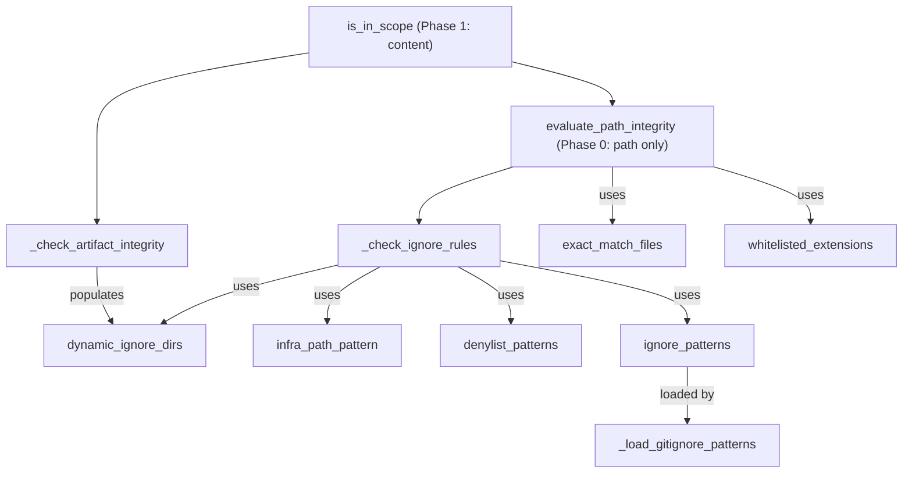
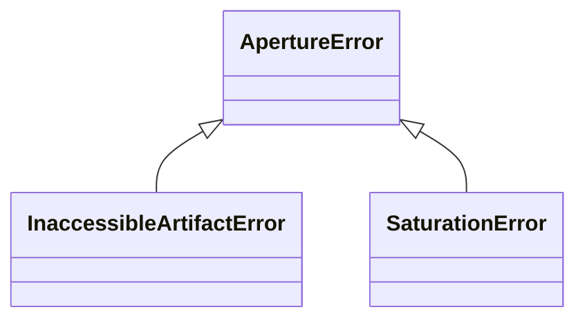

# The Aperture Filter — zero-trust scope gating before any parsing

## Overview
`ApertureFilter` is GitGalaxy's perimeter gate: its job is to decide which files are even worth handing
to the Prism/Detector at all, using only character-counting and OS metadata — never a parser, never a
model. Its own docstring calls it "Primary ingestion filter … performs perimeter gating to ensure only
valid, maintainable source code reaches the CPU-bound Structural Signature extractors." The design splits
cleanly into two phases with two different cost profiles:
[`evaluate_path_integrity`](../catalog/gitgalaxy/core/aperture.md#ApertureFilter.evaluate_path_integrity)
judges a file from its path/extension/size alone, before any file content is read, and
[`is_in_scope`](../catalog/gitgalaxy/core/aperture.md#ApertureFilter.is_in_scope) judges the file's actual
bytes once they are already in memory. Everything in between —
[`_check_ignore_rules`](../catalog/gitgalaxy/core/aperture.md#ApertureFilter._check_ignore_rules) and
[`_check_artifact_integrity`](../catalog/gitgalaxy/core/aperture.md#ApertureFilter._check_artifact_integrity)
— is a battery of independent, cheap statistical tests (null bytes, line-length, indentation-frequency,
comma/hex density) that each catch a different way a file can be noise rather than source: binary,
vendored, generated, minified, or simply too large to parse safely.

## Diagram

## Design rationale (why it's built this way)
The two-phase split exists purely for cost ordering: [`evaluate_path_integrity`](../catalog/gitgalaxy/core/aperture.md#ApertureFilter.evaluate_path_integrity)'s
own docstring is explicit that it runs "*before* any disk I/O (file opening/reading) occurs. This prevents
OS-level locks and drastically reduces Memory/CPU overhead on large monolithic repositories" — the vast
majority of noise (build output, vendored binaries, disallowed extensions) can be rejected from the
filename and extension alone, without reading a single byte of content. `evaluate_path_integrity` computes
`size_bytes` but never uses it to reject anything; the one byte-size check on this page — the 10MB
ceiling — belongs to Phase 1 instead (`is_in_scope`, see Mechanism step 5), via a single cheap `os.stat()`
call that still runs before the far more expensive content read.

Within `evaluate_path_integrity`, ordering is itself a design decision: the secrets check runs before the
extension whitelist, the AI-model-weight check, or anything else, so that a credential file is never
silently swallowed just because its extension happens to be unrecognized. The source clearly *intends* a
further, more subtle move: a file flagged as a secret is reported invalid by `evaluate_path_integrity`
(`is_valid=False`), and [`is_in_scope`](../catalog/gitgalaxy/core/aperture.md#ApertureFilter.is_in_scope)
carries a "THE SHUNT: SECRETS BYPASS" block whose intent is exactly this: "blocked from normal parsing" and
"should be hidden from the operator" are different questions — a leaked credential is exactly the kind of
file the pipeline wants to surface, not silently drop. But as `is_in_scope` is actually written, that block
never runs: the `if not is_valid: return result` line immediately above it returns first for every secrets
match, because a "CRITICAL LEAK" reason is only ever produced together with `is_valid=False`. See Mechanism
step 6 for the exact control-flow that makes this bypass dead code.

The GuideStar Protocol's `has_intent` signal is threaded through both
[`evaluate_path_integrity`](../catalog/gitgalaxy/core/aperture.md#ApertureFilter.evaluate_path_integrity)
and [`_check_ignore_rules`](../catalog/gitgalaxy/core/aperture.md#ApertureFilter._check_ignore_rules) as an
override, cached per-path in [`_intent_cache`](../catalog/gitgalaxy/core/aperture.md#ApertureFilter._intent_cache)
once granted. This lets an externally computed "this file matters" signal (see the GuideStar Lens page)
bypass the hidden-directory and semantic-infrastructure-path exclusions that would otherwise silently drop
a file the developer clearly intended to include — but, notably, intent does *not* buy back exemption from
the hard file-size ceiling or the binary/null-byte check in
[`_check_artifact_integrity`](../catalog/gitgalaxy/core/aperture.md#ApertureFilter._check_artifact_integrity):
intent overrides *semantic* exclusions, not physical-corruption or resource-exhaustion protections.

Every content-level test in `_check_artifact_integrity` is deliberately AST-free and language-agnostic:
null-byte presence for binaries, a flat line-count ceiling for amalgamated files (its own comment cites
`sqlite3.c`-style single-file amalgamations as the motivating case), an indentation-frequency histogram
for statistically "too uniform to be handwritten" generated code, and comma/hex-token density for embedded
arrays or hex blobs masquerading as source. None of these require knowing what language the file is in —
they only require counting characters, which is the same trade the Detector and Prism make, applied one
stage earlier.

## Entry points
- [`evaluate_path_integrity`](../catalog/gitgalaxy/core/aperture.md#ApertureFilter.evaluate_path_integrity)
  — the Phase 0 entry point, reached for every discovered file during the main file census (its callers in
  this subgraph include [`_fallback_filesystem_walk`](../catalog/gitgalaxy/galaxyscope.md#Orchestrator._fallback_filesystem_walk)
  and [`_inspect_path`](../catalog/gitgalaxy/galaxyscope.md#Orchestrator._inspect_path) on the
  `galaxyscope.py` Orchestrator). It is also called directly, independent of the main pipeline, by
  [`main`](../catalog/gitgalaxy/tools/supply_chain_security/vault_sentinel.md#main) in `vault_sentinel.py`,
  as its Tier-0 secrets pre-check. `binary_anomaly_detector.py`'s
  [`main`](../catalog/gitgalaxy/tools/supply_chain_security/binary_anomaly_detector.md#main) and
  [`run_xray_audit`](../catalog/gitgalaxy/tools/supply_chain_security/binary_anomaly_detector.md#run_xray_audit)
  reuse only [`_check_ignore_rules`](../catalog/gitgalaxy/core/aperture.md#ApertureFilter._check_ignore_rules)
  (for directory pruning) — both explicitly bypass `evaluate_path_integrity` itself, per that file's own
  code comment, because this detector must scan actual binaries (`.png`, `.zip`, `.dll`) that standard
  Aperture filtering would otherwise drop.
- [`is_in_scope`](../catalog/gitgalaxy/core/aperture.md#ApertureFilter.is_in_scope) — the Phase 1 entry
  point, reached once a candidate file's content has already been read into memory; its own docstring
  labels it "[PHASE 1 ENTRY POINT] The final Content Gate."

## Mechanism (step-by-step)
1. **Secrets radar (Tier 0.1).** [`evaluate_path_integrity`](../catalog/gitgalaxy/core/aperture.md#ApertureFilter.evaluate_path_integrity)
   first checks the filename/extension against a configured secrets registry; a match immediately returns
   a `"CRITICAL LEAK"` reason ahead of every other tier.
2. **AI model shunt (Tier 0.2) and extension shield (Tier 0.5).** Files with a recognized model-weight
   extension (`.safetensors`, `.gguf`, `.onnx`, `.pt`, `.pth`, `.bin`, `.tflite`, `.pb`, `.h5`) are routed
   away from the regex engines entirely; anything else on an explicitly denied extension not also on
   [`whitelisted_extensions`](../catalog/gitgalaxy/core/aperture.md#ApertureFilter.whitelisted_extensions)
   is blocked next.
3. **Ignore-rule cascade.** [`_check_ignore_rules`](../catalog/gitgalaxy/core/aperture.md#ApertureFilter._check_ignore_rules)
   runs five independent checks in order: static
   [`ignored_directories`](../catalog/gitgalaxy/core/aperture.md#ApertureFilter.ignored_directories) (an
   unconditional block that intent does **not** bypass) and hidden dot-directories (which, unlike the
   static list, *are* bypassable by intent); directories dynamically flagged in
   [`dynamic_ignore_dirs`](../catalog/gitgalaxy/core/aperture.md#ApertureFilter.dynamic_ignore_dirs); the
   semantic [`infra_path_pattern`](../catalog/gitgalaxy/core/aperture.md#ApertureFilter.infra_path_pattern)
   (matches `gen`, `build`, `vendor`, `test`, `docs`, `node_modules`, and similar segments, also
   intent-bypassable); the [`denylist_patterns`](../catalog/gitgalaxy/core/aperture.md#ApertureFilter.denylist_patterns)
   vendor-blob glob list; and finally the standard
   [`ignore_patterns`](../catalog/gitgalaxy/core/aperture.md#ApertureFilter.ignore_patterns) loaded once
   from `.gitignore` by [`_load_gitignore_patterns`](../catalog/gitgalaxy/core/aperture.md#ApertureFilter._load_gitignore_patterns).
4. **Registry validation.** If none of the above blocked the file, an active intent lock passes it
   through unconditionally; an extensionless file passes through for later shebang-based resolution; and
   otherwise the file must match [`exact_match_files`](../catalog/gitgalaxy/core/aperture.md#ApertureFilter.exact_match_files)
   or `whitelisted_extensions` (both derived once, at construction, from the injected language registry)
   to be accepted.
5. **Resource guarding (Tier 0 of Phase 1).** [`is_in_scope`](../catalog/gitgalaxy/core/aperture.md#ApertureFilter.is_in_scope)
   rejects anything over a configurable hard size ceiling (10MB by default) before doing anything else
   with the buffered content, to keep a single oversized log or SQL dump from exhausting memory.
6. **The secrets shunt (unreachable as written).** [`is_in_scope`](../catalog/gitgalaxy/core/aperture.md#ApertureFilter.is_in_scope)
   re-invokes [`evaluate_path_integrity`](../catalog/gitgalaxy/core/aperture.md#ApertureFilter.evaluate_path_integrity)
   and contains a later block that checks whether its reason string names a critical leak, intending to
   override the path result and force `is_in_scope=True` — the "invisible unless dangerous" inversion
   described in Design rationale. In the method as written, that block can never execute: the `if not
   is_valid: return result` check immediately above it always fires first for a secrets match, because
   `evaluate_path_integrity` only ever produces a "CRITICAL LEAK" reason paired with `is_valid=False`. A
   secret-flagged file is therefore rejected the same as any other Phase 0 block
   (`classification="generated_noise"`), not surfaced.
7. **Content integrity gauntlet.** For everything else, [`_check_artifact_integrity`](../catalog/gitgalaxy/core/aperture.md#ApertureFilter._check_artifact_integrity)
   runs its ordered tests: null-byte binary detection; a 30,000-line amalgamation ceiling; an
   auto-generated-documentation-generator signature check (via
   [`doc_generator_pattern`](../catalog/gitgalaxy/core/aperture.md#ApertureFilter.doc_generator_pattern))
   that, on a match, also adds the file's parent directory to `dynamic_ignore_dirs` for every later file
   in that directory; a machine-generated-source signature check (via
   [`machine_gen_pattern`](../catalog/gitgalaxy/core/aperture.md#ApertureFilter.machine_gen_pattern));
   an indentation-frequency "lexical monotony" statistical test; declarative/vector-data line-count
   ceilings for `yml`/`json`/`xml`/`svg`/`sql`/`csv`; hex-token and comma-density tests for embedded
   binary arrays; and a final line-length saturation/minification check.
8. **Exception surface.** [`is_in_scope`](../catalog/gitgalaxy/core/aperture.md#ApertureFilter.is_in_scope)
   raises [`InaccessibleArtifactError`](../catalog/gitgalaxy/core/aperture.md#InaccessibleArtifactError) —
   a dedicated [`ApertureError`](../catalog/gitgalaxy/core/aperture.md#ApertureError) subclass — the
   moment it finds the path missing on disk, but that `raise` sits inside the very same method's own
   broad `except Exception` block, so the error never actually escapes to a caller: it is caught, logged
   as a "Filter Collision," and converted into the same non-fatal `reason` string as any other unexpected
   failure. The end-to-end posture is therefore swallow-and-report, the same as the Detector's `splice` —
   the dedicated exception type exists in the class hierarchy without ever propagating past this one
   method in the code as written (see Open questions).

## Key data structures
- `FilterResult` (referenced in `is_in_scope`'s signature) — the structured telemetry returned per file:
  `is_in_scope`, `classification` (`source_code`/`binary_payload`/`generated_noise`/`oversized_minified`),
  `reason`, `path`, `size_bytes`, `total_loc`.
- [`ApertureError`](../catalog/gitgalaxy/core/aperture.md#ApertureError) /
  [`InaccessibleArtifactError`](../catalog/gitgalaxy/core/aperture.md#InaccessibleArtifactError) /
  [`SaturationError`](../catalog/gitgalaxy/core/aperture.md#SaturationError) — a small exception
  hierarchy (see class diagram above); `InaccessibleArtifactError` is raised (and, per the Mechanism
  section above, immediately re-caught) for a vanished/unreadable path. `SaturationError`'s docstring
  describes it as being for signals "too dense or minified to be safely evaluated," but no `raise
  SaturationError` appears anywhere in `aperture.py` — as far as this file goes, it is defined but unused
  (see Open questions).
- [`_intent_cache`](../catalog/gitgalaxy/core/aperture.md#ApertureFilter._intent_cache) — a per-instance
  set of paths already granted an intent lock, so a lock computed once (typically by GuideStar) does not
  need to be re-derived on every subsequent call for the same path.
- [`dynamic_ignore_dirs`](../catalog/gitgalaxy/core/aperture.md#ApertureFilter.dynamic_ignore_dirs) — the
  mutable set of directories discovered mid-scan to contain auto-generated documentation; this is the one
  piece of state that makes the filter's decisions order-dependent (see Dynamics).
- [`whitelisted_extensions`](../catalog/gitgalaxy/core/aperture.md#ApertureFilter.whitelisted_extensions) /
  [`exact_match_files`](../catalog/gitgalaxy/core/aperture.md#ApertureFilter.exact_match_files) — built
  once at construction by folding every language's `extensions`/`exact_matches` out of the injected
  [`registry`](../catalog/gitgalaxy/core/aperture.md#ApertureFilter.registry).

## Dynamics (design intent)
`ApertureFilter` is not a pure per-file function: [`dynamic_ignore_dirs`](../catalog/gitgalaxy/core/aperture.md#ApertureFilter.dynamic_ignore_dirs)
is populated as a *side effect* of `_check_artifact_integrity` scanning one file's content, and consulted
by `_check_ignore_rules` when evaluating every subsequent file's path. That means the filter's verdict on
a given file depends on scan order — a directory is only excluded starting from the point a
documentation-generator signature is actually observed inside it; files in that same directory processed
earlier in the scan are unaffected retroactively. [`_intent_cache`](../catalog/gitgalaxy/core/aperture.md#ApertureFilter._intent_cache)
is the same shape of statefulness applied to intent rather than exclusion: once granted for a path, it is
remembered for the rest of the instance's lifetime.

## Edge cases
- A secret-flagged file is *intended* to be the one case where the Phase 0 "invalid path" verdict is
  overridden back into scope by Phase 1, but the override block in `is_in_scope` is unreachable as written
  (see Mechanism step 6) — in practice `evaluate_path_integrity` returning `False` is final for every file,
  secrets included.
- Extensionless files are never rejected outright at Phase 0; they are explicitly deferred for a later
  shebang-based (or GuideStar-derived) language resolution.
- Intent overrides the hidden-directory, dot-directory, and semantic-infrastructure-path exclusions in
  `_check_ignore_rules`, but does **not** override the hard 10MB size ceiling, the null-byte binary check,
  or the 30,000-line amalgamation ceiling in `is_in_scope`/`_check_artifact_integrity` — intent buys back
  semantic exclusion, not physical/resource protection.
- The lexical-monotony statistical test explicitly exempts COBOL-family extensions (`.cpy`, `.cbl`,
  `.cob`) from its otherwise-applicable "too uniform to be handwritten" heuristic, since legacy fixed-form
  COBOL is naturally repetitive in ways that would otherwise false-positive as generated code.

## Open questions
- `SaturationError` is declared as part of the `ApertureError` hierarchy and documented as covering
  signals "too dense or minified to be safely evaluated," but no call site in `aperture.py` raises it —
  whether it is raised from code outside this packet's subgraph, or is simply unused, cannot be settled
  from this packet alone.
- `InaccessibleArtifactError` is raised inside `is_in_scope`'s own try block and caught by that same
  method's broad exception handler, so it never propagates to a caller in the code as written; whether any
  other caller relies on it being raisable is not visible in this subgraph.
- The exact contents of the injected `aperture_config` dict (`SECRETS_EXACT`, `SECRETS_EXTENSIONS`,
  `IGNORED_DIRECTORIES`, `IGNORED_EXTENSIONS`, `CONTRABAND_PATTERNS`, `MAX_FILE_SIZE_MB`,
  `MAX_LINE_LENGTH`) are read via `self.config.get(...)` throughout this file, but the configuration
  module that defines their actual values is not part of this packet's subgraph, so only the *keys* and
  their observed defaults are described here, not their full standards-wide values.
- Whether `has_intent` is always sourced from the GuideStar Lens's intent-lock lookup, or can also be set
  by some other caller, cannot be confirmed from this packet alone — the orchestrator wiring that supplies
  it is out of scope here.

## See also
- [The GuideStar Protocol](gitgalaxy-core-guidestar_lens.md) — computes the intent signal this page's
  `has_intent` parameter consumes.
- [The Prism](gitgalaxy-core-prism.md) — the next pipeline stage a file reaches only after clearing this
  filter.
- [The Detector](gitgalaxy-core-detector.md) — the heaviest-weight stage this filter exists to protect
  from noise.
