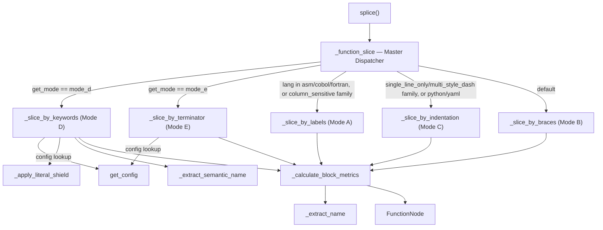

# The Detector — StructuralExtractor and the five AST-free "integration modes"

## Overview
[`StructuralExtractor`](../catalog/gitgalaxy/core/detector.md#StructuralExtractor) is the piece of
GitGalaxy that turns a language-tagged, already-split code/comment text stream into a list of
function-level records (`FunctionNode`) and file-level signal counts — without ever building a parse
tree. Its one idea: every language's block-scoping convention falls into a small number of families
(braces, indentation, keywords, bare labels, statement terminators), so rather than writing a universal
parser, [`splice`](../catalog/gitgalaxy/core/detector.md#StructuralExtractor.splice) hands each segment
to [`_function_slice`](../catalog/gitgalaxy/core/detector.md#StructuralExtractor._function_slice), a
dispatcher that routes it to one of five purpose-built regex/state-machine "integration modes" —
[`_slice_by_labels`](../catalog/gitgalaxy/core/detector.md#StructuralExtractor._slice_by_labels),
[`_slice_by_braces`](../catalog/gitgalaxy/core/detector.md#StructuralExtractor._slice_by_braces),
[`_slice_by_indentation`](../catalog/gitgalaxy/core/detector.md#StructuralExtractor._slice_by_indentation),
[`_slice_by_keywords`](../catalog/gitgalaxy/core/detector.md#StructuralExtractor._slice_by_keywords), and
[`_slice_by_terminator`](../catalog/gitgalaxy/core/detector.md#StructuralExtractor._slice_by_terminator).
Every mode ultimately funnels into the same metrics engine,
[`_calculate_block_metrics`](../catalog/gitgalaxy/core/detector.md#StructuralExtractor._calculate_block_metrics),
so a downstream consumer sees one uniform [`FunctionNode`](../catalog/gitgalaxy/core/detector.md#FunctionNode)
regardless of which mode produced it. This is the module the survey's "no grounding substrate" framing is
really about: no compiler, no LLM — five different ways of counting how a stream of text nests, chosen by
looking up the language, not by understanding it.

## Diagram

## Design rationale (why it's built this way)
[`StructuralExtractor`](../catalog/gitgalaxy/core/detector.md#StructuralExtractor)'s own docstring states
the trade directly: "AST parsers often fail when encountering non-standard syntax, legacy dialects, or
partially-broken codebases," so the class "utilizes Fluid State Counters and O(1) lexical masking to
achieve high-fidelity node extraction at ~100,000 LOC/sec … without requiring fully-compilable source
code." Five modes exist, not one, because the underlying assumption a slicer must make about "where does
a block end" is fundamentally different per language family: C-family and Lisp nest with a single
balanced-delimiter pair (Mode B), Python/YAML nest by whitespace column (Mode C), Ruby/Shell/Lua/Elixir
nest by paired keywords with no delimiter at all (Mode D), SQL/Erlang/Prolog have no nesting, only flat
statements ended by a terminator token (Mode E), and legacy Assembly/COBOL have no scope construct
whatsoever — only labels and a return instruction (Mode A). Trying to cover all five with one regex would
require the regex to encode a different grammar for each, which is exactly the AST it is trying to avoid.

Routing itself is two-tiered by design: [`_function_slice`](../catalog/gitgalaxy/core/detector.md#StructuralExtractor._function_slice)
first asks a per-language configuration lookup (resolved through
[`get_config`](../catalog/gitgalaxy/core/detector.md#ScopeParsingRegistry.get_config)) whether the
language is explicitly registered for Mode D or Mode E; only if it is not does it fall back to a generic
`lexical_family` tag (assembly/cobol/fortran or a `column_sensitive` family → Mode A;
`single_line_only`/`multi_style_dash` family or `python`/`yaml` → Mode C; everything else → Mode B, the
default). Concretely, this means adding a new keyword-scoped or terminator-scoped language is a
declarative registry entry (an `openers`/`closers` or `terminator`/`igniter` regex list), not new slicing
code — while every other language gets a reasonable default from a family tag with zero code change.
> [!inferred]
> This two-tier design (explicit override, generic family fallback) mirrors the same "precision path,
> guaranteed floor" shape the survey's [multi-language-extraction](../../../concepts/multi-language-extraction.md)
> axis compares across tools, except here both the "precision" and the "floor" are still regex — there is
> no AST fallback anywhere in this pipeline.

Mode B's brace-balance scanner is the one that invests the most defensive engineering, because it is also
the one most exposed to false positives: a stray brace inside a string, a comment, or a `#else {` inside a
dead preprocessor branch will desynchronize a naive depth counter. [`_slice_by_braces`](../catalog/gitgalaxy/core/detector.md#StructuralExtractor._slice_by_braces)
shields string/char/backtick literals and both comment styles with one combined regex before scanning,
and — strictly for C-family languages — runs a small line-by-line state machine that tracks
`#if`/`#elif`/`#else`/`#endif` nesting and blanks out dead branches and multi-line `#define` macros
(backslash continuations) so their raw braces never reach the balance counter.
[`test_detector_mode_b_multiline_macros`](../catalog/tests/core_engine/test_detector.md#test_detector_mode_b_multiline_macros)
and [`test_detector_c_macro_dead_branch_shield`](../catalog/tests/core_engine/test_detector.md#test_detector_c_macro_dead_branch_shield)
pin exactly this behavior.

Mode D's "Ruby/Elixir Inline Modifier Guard" is the sharpest example of how much language-specific
nuance a keyword-based (rather than delimiter-based) scanner needs: `if`, `unless`, `while`, and `until`
are block openers in Ruby *unless* they appear as a trailing statement modifier (`return true if x`), in
which case they open nothing. [`_slice_by_keywords`](../catalog/gitgalaxy/core/detector.md#StructuralExtractor._slice_by_keywords)
resolves this by checking whether the line's safe (literal/comment-shielded) text actually *starts* with
the keyword; if it does not, every modifier match on that line is subtracted back out of the opener count
so it can never falsely deepen the scope stack —
[`test_detector_mode_d_ruby_inline_modifier`](../catalog/tests/core_engine/test_detector.md#test_detector_mode_d_ruby_inline_modifier)
exists specifically to pin this.

Several metrics are explicit, acknowledged approximations rather than ground truth, which matters for the
survey's framing of what this control group gives up: [`_calculate_block_metrics`](../catalog/gitgalaxy/core/detector.md#StructuralExtractor._calculate_block_metrics)'s
own docstring calls its Big-O estimate "a 95% accurate proxy" for cyclomatic nesting depth, computed from
indentation rather than from a real AST; recursion is detected by counting whether a function's own name
occurs more than once inside its own body (no argument-binding or call-graph check); and
[`_classify_function`](../catalog/gitgalaxy/core/detector.md#StructuralExtractor.splice) (invoked from
`_calculate_block_metrics`, itself reached from every mode underneath `splice`; the classifier itself is
not in this packet's subgraph — see Open questions) falls back
to naming-convention substring matches (`get`/`fetch` → `io`, `set`/`save` → `mutation`, …) whenever no
explicit `@type:`/`@gal_type:` annotation is present, as
[`test_detector_function_classification`](../catalog/tests/core_engine/test_detector.md#test_detector_function_classification)
and [`test_detector_explicit_type_override`](../catalog/tests/core_engine/test_detector.md#test_detector_explicit_type_override)
demonstrate.

## Entry points
- [`splice`](../catalog/gitgalaxy/core/detector.md#StructuralExtractor.splice) — the single per-file
  entry point. It receives the already-separated `code_stream`/`comment_stream` (produced upstream by the
  Prism), a confidence score, and — when available — the file's `raw_content`, which it snapshots into
  [`raw_content_lines`](../catalog/gitgalaxy/core/detector.md#StructuralExtractor.raw_content_lines) for
  later docstring harvesting. Everything else on this page executes underneath a single `splice` call.
- [`_init_worker`](../catalog/gitgalaxy/galaxyscope.md#_init_worker) — how a `StructuralExtractor`
  instance comes to exist at all. Because "Python's Global Interpreter Lock (GIL) prevents true
  multi-threading for CPU-bound tasks," GitGalaxy spawns separate OS worker processes and this
  boot-loader instantiates one extractor per active language *inside* the child's own memory — explicitly
  to avoid having to pickle compiled regex objects across the multiprocessing IPC boundary. `splice` is
  therefore always called on a warm, per-language, per-process singleton, never freshly constructed per
  file.

## Mechanism (step-by-step)
1. **Confidence and format gate.** [`splice`](../catalog/gitgalaxy/core/detector.md#StructuralExtractor.splice)
   first applies an "Ecosystem Gravity Override": if the primary language is `c`, `cpp`, or `objective-c`,
   confidence is forced to `1.0` regardless of what was passed in, because pure-macro C/C++ headers often
   contain no braces/loops/branches and would otherwise fall below the `0.42` confidence floor and be
   silently dropped. Any file that still lands below `0.42`, or whose language is `plaintext`,
   `markdown`, `json`, `yaml`, or `csv`, returns an empty, zeroed-out result immediately — a deliberate
   bypass rather than an attempt to force a parse.
2. **ReDoS neutralization.** Still inside `splice`, every line longer than 1500 characters (hex arrays,
   `.depend` files, minified blobs) is blanked to a single safe character while its exact length and
   leading indentation are preserved, so line count and column geometry survive but the regex engine
   never has to backtrack across a pathological line.
   [`test_detector_anti_redos_line_limiter`](../catalog/tests/core_engine/test_detector.md#test_detector_anti_redos_line_limiter)
   pins this.
3. **Segment partition and signal pass.** `splice` then partitions the shielded stream into per-language
   segments (so an embedded ``) is
  allowed to search for its closing token, bounding worst-case scan cost on a pathological or unterminated
  embed.

> [!inferred]
> The repo's own `core/README.md` describes a downstream module, `network_risk_sensor.py` (not in this
> packet), that wires files together into a dependency graph using each file's raw imports and the
> `calls_out_to` this page's `FunctionNode` records produce. If that description is accurate, this
> module's per-file class/function linkage and `calls_out_to` lists are the raw node/edge material a
> cross-file call graph is later built from — which is why `symbol-graph` is tagged on this page even
> though the graph itself is assembled elsewhere.

## Dynamics (design intent)
There is no concurrency inside `StructuralExtractor` itself — every mode is a single sequential pass over
its segment. The concurrency story lives one layer up, in
[`_init_worker`](../catalog/gitgalaxy/galaxyscope.md#_init_worker): because the GIL rules out real
multi-threading for this CPU-bound work, GitGalaxy runs one OS process per worker and warms a
`StructuralExtractor` per active language *inside that process's own memory*, specifically so compiled
regex objects never have to cross a multiprocessing pickle boundary. `splice` is consequently always
invoked against a long-lived, per-process, per-language instance — the `MAX_SATELLITES` (250) and
`MAX_DEPTH` (50) clamps that appear across every mode exist because a single pathological file must not be
allowed to balloon the memory or recursion-equivalent cost of that shared worker.

## Edge cases
- Files below the `0.42` confidence floor, or tagged `plaintext`/`markdown`/`json`/`yaml`/`csv`, never
  reach any integration mode at all — they return a fully empty payload from
  [`splice`](../catalog/gitgalaxy/core/detector.md#StructuralExtractor.splice)'s early bypass.
- A regex rule that raises during the signal pass or the comment pass is caught, logged, and zeroed rather
  than aborting the file — [`test_detector_regex_execution_catch_block`](../catalog/tests/core_engine/test_detector.md#test_detector_regex_execution_catch_block)
  and [`test_detector_defensive_catch_blocks`](../catalog/tests/core_engine/test_detector.md#test_detector_defensive_catch_blocks)
  both pin "the engine survives a catastrophic regex execution failure" without dropping the rest of the
  file's functions.
- Mode D's trailing, still-open block at end-of-file is emitted as `<name>_[Truncated]`, and Mode E's
  unterminated trailing statement is emitted as `<name>_[Unterminated]` — both are kept rather than
  silently discarded.
- A rule whose hit count exceeds the segment's own character length is treated as a runaway match and
  zeroed defensively rather than trusted, inside the (out-of-subgraph) signal-counting pass — see
  `test_detector_empty_pattern_continuations` for the adjacent "empty/malformed pattern is skipped safely"
  guarantee.
- [`get_token_mass`](../catalog/gitgalaxy/core/detector.md#get_token_mass) returns `None`, not `0`, when
  `tiktoken` is missing, so downstream cost math can distinguish "unmeasured" from "measured as free."

## Open questions
- [`_function_slice`](../catalog/gitgalaxy/core/detector.md#StructuralExtractor._function_slice) resolves
  its per-language mode/opener/closer/terminator/igniter configuration through
  [`get_config`](../catalog/gitgalaxy/core/detector.md#ScopeParsingRegistry.get_config), but the
  containing registry class, its `DEFINITIONS` matrix, and its `_ALIASES` map are not themselves separate
  entries in this packet's subgraph, so their exact per-language regex lists are described from reading
  `detector.py` directly rather than cited here.
- The segment partitioner, the whole-segment signal-counting pass, the comment-stream analyzer, the
  metadata/docstring decoder, the security-signal spatial-correlation pass, and this file's own copy of
  the balanced-bracket scanner are all called from `splice`/`_calculate_block_metrics` per source, but
  none are separate symbols in this packet's subgraph — their behavior above is described from source and
  from the tests that exercise them (e.g. `test_detector_advanced_appsec_sensors`,
  `test_detector_ghost_tether_and_metadata`), not linked directly.
- Whether `calls_out_to` and the class/inheritance linkage this page's `splice` builds are actually
  consumed by `network_risk_sensor.py` to build a cross-file graph is inferred from the repo's own
  `core/README.md`; that module is out of this packet's scope so the claim cannot be cited to a symbol
  here.

## See also
- [The Prism](gitgalaxy-core-prism.md) — produces the `code_stream`/`comment_stream` pair this page's
  `splice` consumes.
- [The Aperture Filter](gitgalaxy-core-aperture.md) — decides which files ever reach the Detector.
- [The GuideStar Protocol](gitgalaxy-core-guidestar_lens.md) — the upstream intent signal that can push a
  file's confidence past the Detector's `0.42` floor.
