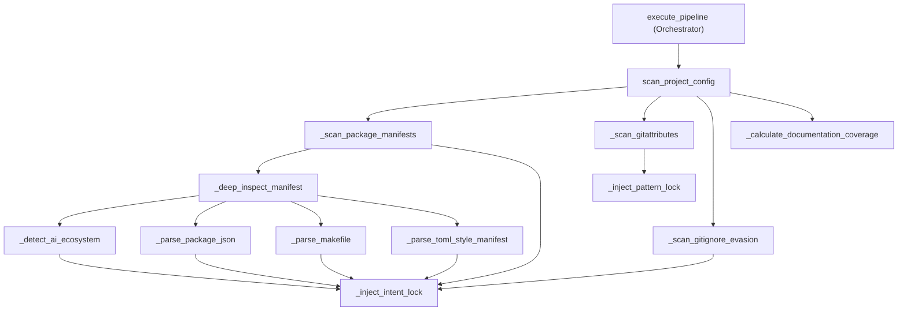

# The GuideStar Protocol — calibrating heuristics from a project's own manifests

## Overview
`GuideStarLens` answers a narrower question than the Aperture Filter or the Detector: not "is this file
noise" and not "what does this function do," but "did the *developer themselves* already tell us this file
matters, and if so, how strongly?" [`scan_project_config`](../catalog/gitgalaxy/core/guidestar_lens.md#GuideStarLens.scan_project_config)
reads a project's own roadmap — `package.json`, `Makefile`, `pyproject.toml`/`Cargo.toml`,
`.gitattributes`, `.gitignore` — and turns each piece of evidence into an **Intent Lock**: a filename or
glob pattern tagged with a predicted language and a confidence score. Every other module on this page's
sibling pages either consumes that lock (the Aperture Filter lets a locked file bypass exclusions it would
otherwise fail; the Detector's confidence floor can be crossed by it) or is calibrated by the same
evidence-hierarchy idea. The one design invariant everything here obeys: a lock can only be *strengthened*
by new evidence, never weakened by it.

## Diagram

## Design rationale (why it's built this way)
The repo's own documentation frames the split cleanly: GuideStar identifies **Intent** ("why this file
exists" — "I found this file referenced in a Makefile … I predict it is a C-target with 0.90
confidence"), while a downstream Language Lens (not in this packet) identifies **Identity** ("what this
file is") by performing the actual atomic scan. Separating the two lets the pipeline keep a "Scan Once"
efficiency: cheap, manifest-derived evidence is gathered first, so the expensive per-file identity work
downstream can trust a pre-computed prior instead of guessing from scratch for every file.

The evidence-hierarchy design is enforced by one small, load-bearing guard inside
[`_inject_intent_lock`](../catalog/gitgalaxy/core/guidestar_lens.md#GuideStarLens._inject_intent_lock):
`if existing and existing["intensity"] >= confidence: return`. This single line is what turns four
independently-ordered scouts —
[`_scan_package_manifests`](../catalog/gitgalaxy/core/guidestar_lens.md#GuideStarLens._scan_package_manifests),
[`_scan_gitattributes`](../catalog/gitgalaxy/core/guidestar_lens.md#GuideStarLens._scan_gitattributes),
[`_scan_gitignore_evasion`](../catalog/gitgalaxy/core/guidestar_lens.md#GuideStarLens._scan_gitignore_evasion),
[`_calculate_documentation_coverage`](../catalog/gitgalaxy/core/guidestar_lens.md#GuideStarLens._calculate_documentation_coverage)
— into a coherent, three-tier "Quality Tier" system without needing them to run in any particular order:
whichever scout finds the *strongest* proof for a file wins, regardless of which one ran first. A
`.gitattributes` `linguist-language=` override is injected through the sibling
[`_inject_pattern_lock`](../catalog/gitgalaxy/core/guidestar_lens.md#GuideStarLens._inject_pattern_lock)
at confidence `0.99` — effectively unbeatable by anything else on this page — because it represents an
explicit human declaration, the "God Tier" of evidence per the project's own framing. Manifest entries
(`package.json:main`/`bin`) sit at `0.95`, manifest-derived scripts/sources at `0.85`, and sector-bias or
generic Makefile targets at `0.75`/`0.70` — each successive tier is proof of a file being *referenced*
rather than *declared*, and the confidence values encode exactly that decreasing directness.

The whitelist trust bonus in [`_inject_intent_lock`](../catalog/gitgalaxy/core/guidestar_lens.md#GuideStarLens._inject_intent_lock)
(+0.10, capped at `0.99`) numerically ties, rather than exceeds, the authoritative `.gitattributes` tier —
but that numeric tie is not actually what decides precedence between the two. The lookup a consumer does
checks [`intent_locks`](../catalog/gitgalaxy/core/guidestar_lens.md#GuideStarLens.intent_locks) (exact
filename, then relative path) first and only falls through to
[`pattern_locks`](../catalog/gitgalaxy/core/guidestar_lens.md#GuideStarLens.pattern_locks) (where
`.gitattributes` overrides live) if neither matched; a whitelist-boosted filename lock is therefore
returned ahead of a matching `.gitattributes` pattern lock unconditionally, by lookup order, whatever
either one's confidence number happens to be — the two ceilings tying at `0.99` is never actually compared
at read time.

[`_detect_ai_ecosystem`](../catalog/gitgalaxy/core/guidestar_lens.md#GuideStarLens._detect_ai_ecosystem)
is a small but telling reuse of the same mechanism for a different purpose: when it finds an AI/LLM
keyword (`langchain`, `openai`, `anthropic`, `torch`, `transformers`, …) inside a manifest, it injects an
intent lock not on a real file but on a fabricated key, `"__gitgalaxy_meta__.json"` — repurposing the
per-file lock map to carry a repository-*level* fact (this project touches an AI ecosystem) rather than a
file-level one, because that was the cheapest existing channel to carry the signal forward.

[`_scan_gitignore_evasion`](../catalog/gitgalaxy/core/guidestar_lens.md#GuideStarLens._scan_gitignore_evasion)
is the one scout that is adversarial rather than cooperative: a `!`-prefixed force-include line in
`.gitignore` is a documented technique for smuggling a compiled binary past a blanket exclusion (like
`node_modules/`), so this scout does not compute a helpful lock — it computes a maximum-confidence (`1.0`)
warning flag for a downstream binary/threat sensor, and logs at `critical` rather than `debug`, unlike
every other scout on this page.

[`_calculate_documentation_coverage`](../catalog/gitgalaxy/core/guidestar_lens.md#GuideStarLens._calculate_documentation_coverage)
applies the same "avoid I/O when a cheaper proxy exists" instinct visible on the Aperture Filter page, just
aimed at a documentation-quality signal instead of a scope decision: its own docstring explains it uses
`os.stat()` byte sizes rather than opening and reading file contents, on the explicit (and admittedly
rough) assumption that "larger doc files have more information in them," normalizing 3000 accumulated
bytes per folder to a full `1.0` "shield strength."

## Entry points
- [`scan_project_config`](../catalog/gitgalaxy/core/guidestar_lens.md#GuideStarLens.scan_project_config)
  — the orchestration entry point. Its own docstring labels it "Phase 0.5: Main orchestration method that
  dispatches scouts," and it is reached from
  [`execute_pipeline`](../catalog/gitgalaxy/galaxyscope.md#Orchestrator.execute_pipeline), the
  Orchestrator's top-level pipeline runner, as its own Phase 0 step — run before the Aperture-Filter-driven
  file census (`_build_file_census`). It is *not*, however, run only once: `galaxyscope.py`'s
  `_init_worker` calls it again inside every spawned worker process, on that worker's own freshly
  constructed `GuideStarLens` instance (mirroring the per-process warm-up pattern documented on the
  Detector page) — so the same manifests, `.gitattributes`, `.gitignore`, and doc tree are independently
  re-scanned once by the Orchestrator and again by every worker.

## Mechanism (step-by-step)
1. **Fixed-order dispatch.** [`scan_project_config`](../catalog/gitgalaxy/core/guidestar_lens.md#GuideStarLens.scan_project_config)
   calls its four scouts in a set sequence — package manifests, `.gitattributes`, `.gitignore` evasion,
   documentation coverage — though, as described in Design rationale, the confidence-gated lock map makes
   that order immaterial to the final result.
2. **Manifest presence and deep inspection.** [`_scan_package_manifests`](../catalog/gitgalaxy/core/guidestar_lens.md#GuideStarLens._scan_package_manifests)
   walks a configured `MANIFEST_MAP` (with `requirements.txt` → `python` injected if absent), locks each
   manifest file itself at `0.90` confidence the moment it is found on disk, and hands it to
   [`_deep_inspect_manifest`](../catalog/gitgalaxy/core/guidestar_lens.md#GuideStarLens._deep_inspect_manifest)
   for content-level parsing.
3. **AI ecosystem detection.** Before any format-specific parsing, `_deep_inspect_manifest` always runs
   [`_detect_ai_ecosystem`](../catalog/gitgalaxy/core/guidestar_lens.md#GuideStarLens._detect_ai_ecosystem)
   over the raw manifest text, injecting the repository-level synthetic lock described above whenever an
   AI/LLM keyword is present.
4. **Format-specific extraction.** `_deep_inspect_manifest` then dispatches by filename:
   [`_parse_package_json`](../catalog/gitgalaxy/core/guidestar_lens.md#GuideStarLens._parse_package_json)
   pulls `main`/`bin`/`scripts` entries out of Node manifests;
   [`_parse_makefile`](../catalog/gitgalaxy/core/guidestar_lens.md#GuideStarLens._parse_makefile) extracts
   `SRCS`/`SOURCES`/`FILES`/`TARGET` variable assignments and non-reserved build targets; and
   [`_parse_toml_style_manifest`](../catalog/gitgalaxy/core/guidestar_lens.md#GuideStarLens._parse_toml_style_manifest)
   regex-extracts `path =` entries (Cargo.toml) and colon-delimited entry points (pyproject.toml). Each
   parser is wrapped in its own broad exception guard so a malformed manifest degrades to "no extra
   evidence" rather than aborting the scan.
5. **Authoritative override.** [`_scan_gitattributes`](../catalog/gitgalaxy/core/guidestar_lens.md#GuideStarLens._scan_gitattributes)
   parses `linguist-language=` attributes, normalizes a handful of human-written language names (`c++` →
   `cpp`, `objective-c++` → `objective-c`, …) into the engine's internal vocabulary, and locks the
   *pattern* (not a specific filename) at `0.99` via
   [`_inject_pattern_lock`](../catalog/gitgalaxy/core/guidestar_lens.md#GuideStarLens._inject_pattern_lock).
6. **Evasion detection.** [`_scan_gitignore_evasion`](../catalog/gitgalaxy/core/guidestar_lens.md#GuideStarLens._scan_gitignore_evasion)
   scans `.gitignore` for `!`-prefixed force-includes whose extension matches a hostile-binary set
   (`.so`/`.dll`/`.exe`/`.dylib`/`.bin`/`.xz`/`.gz`/`.zip`), logging at `critical` and injecting a `1.0`
   confidence lock tagged `"Hostile Gitignore Force-Include"` when found.
7. **Documentation density.** [`_calculate_documentation_coverage`](../catalog/gitgalaxy/core/guidestar_lens.md#GuideStarLens._calculate_documentation_coverage)
   walks the tree once, summing byte sizes of README/architecture/spec-style files and Markdown files per
   directory (ignoring stub files under 150 bytes), and stores a normalized `0.0`–`1.0` score per relative
   directory in [`documentation_coverage`](../catalog/gitgalaxy/core/guidestar_lens.md#GuideStarLens.documentation_coverage).
8. **The shared evidence gate.** Every path above that injects a filename lock funnels through
   [`_inject_intent_lock`](../catalog/gitgalaxy/core/guidestar_lens.md#GuideStarLens._inject_intent_lock),
   which cleans the filename, refuses to downgrade an existing higher-confidence lock, and applies the
   whitelist bonus; pattern-based locks from `.gitattributes` instead funnel through
   [`_inject_pattern_lock`](../catalog/gitgalaxy/core/guidestar_lens.md#GuideStarLens._inject_pattern_lock),
   which applies the same only-upgrade rule without the whitelist bonus.

## Key data structures
- [`intent_locks`](../catalog/gitgalaxy/core/guidestar_lens.md#GuideStarLens.intent_locks) — the
  filename-keyed lock map: `{lang_id, intensity, source_proof}` per file, the primary output the rest of
  the pipeline consumes.
- [`pattern_locks`](../catalog/gitgalaxy/core/guidestar_lens.md#GuideStarLens.pattern_locks) — the same
  shape keyed by glob pattern instead of exact filename, populated only by `.gitattributes` overrides.
- [`documentation_coverage`](../catalog/gitgalaxy/core/guidestar_lens.md#GuideStarLens.documentation_coverage)
  — a directory-keyed `0.0`–`1.0` density score, independent of the two lock maps above.
- [`MANIFEST_MAP`](../catalog/gitgalaxy/core/guidestar_lens.md#GuideStarLens.MANIFEST_MAP) /
  [`GUIDESTAR_CONFIG`](../catalog/gitgalaxy/standards/gitgalaxy_config.md#GUIDESTAR_CONFIG) — the
  class-level configuration this instance's `_gs_config` and manifest scouting are calibrated from.
- [`whitelist`](../catalog/gitgalaxy/core/guidestar_lens.md#GuideStarLens.whitelist) — the user-supplied
  set of filenames eligible for the confidence bonus in `_inject_intent_lock`.

## Dynamics (design intent)
Unlike the Aperture Filter's `dynamic_ignore_dirs` (order-dependent — a directory is only excluded from
the point a triggering file is observed onward) or the Prism's inside-out comment-peeling loop
(order-dependent by construction), GuideStar's lock map is explicitly designed to be **order-independent**:
because [`_inject_intent_lock`](../catalog/gitgalaxy/core/guidestar_lens.md#GuideStarLens._inject_intent_lock)
and [`_inject_pattern_lock`](../catalog/gitgalaxy/core/guidestar_lens.md#GuideStarLens._inject_pattern_lock)
only ever upgrade a lock, never downgrade it, `scan_project_config`'s four scouts could in principle run in
any order (or in parallel) and still converge on the same final lock map — only the *strength* of evidence
found matters, not the sequence in which it was found.

## Edge cases
- A rescan that finds only weaker evidence for an already-locked file is a silent no-op: the existing,
  stronger lock is left untouched.
- The whitelist bonus is capped at `0.99`, the same ceiling as a `.gitattributes` override, so a
  whitelisted file can tie an authoritative declaration but never exceed it.
- `_detect_ai_ecosystem`'s synthetic lock target, `"__gitgalaxy_meta__.json"`, is not a real path on disk —
  it is a fabricated key used purely to smuggle a repository-level fact through the same per-file lock
  data structure.
- [`_scan_gitignore_evasion`](../catalog/gitgalaxy/core/guidestar_lens.md#GuideStarLens._scan_gitignore_evasion)
  only detects the *evasion pattern* itself (a `!`-prefixed force-include with a hostile extension); a
  binary that was simply never `.gitignore`-excluded in the first place is not this scout's concern.
- [`_extract_execution_triggers`](../catalog/gitgalaxy/core/guidestar_lens.md#GuideStarLens._extract_execution_triggers)
  is defined and would inject execution-derived locks for extensionless files referenced in shell-style
  invocation examples (`./foo`, `python3 foo.py`, …), but it is not called anywhere inside
  `scan_project_config` in this version of the file — from `guidestar_lens.py`'s own perspective it is
  currently unreachable.

## Open questions
- The read-side lookup that later consumers use to resolve a file's final intent status (checking exact
  filename, then relative path, then pattern match, then sector bias, per the repo's own documentation) is
  not itself a symbol in this packet's subgraph, so its exact precedence logic is described from the
  project's own docs rather than cited to a method here.
- Whether `_extract_execution_triggers` is invoked from some other module outside this packet, or is
  genuinely dead code in the current version, cannot be settled from this subgraph alone.
- The full contents of [`GUIDESTAR_CONFIG`](../catalog/gitgalaxy/standards/gitgalaxy_config.md#GUIDESTAR_CONFIG)
  (beyond the `MANIFEST_MAP`/`INTENT_BIASED_SECTORS`/`EXEC_PREFIX_MAP`/`IGNORED_DIRECTORIES` keys read via
  `.get(...)` in this file) are outside this packet's subgraph.

## See also
- [The Aperture Filter](gitgalaxy-core-aperture.md) — the direct consumer of the intent signal this page
  computes, via its `has_intent` parameter.
- [The Detector](gitgalaxy-core-detector.md) — whose confidence floor an intent-locked file can cross via
  the Aperture Filter's ecosystem-gravity-style overrides.
- [The Prism](gitgalaxy-core-prism.md) — another stage whose per-language routing depends on the same
  language predictions GuideStar's manifest evidence feeds into.
