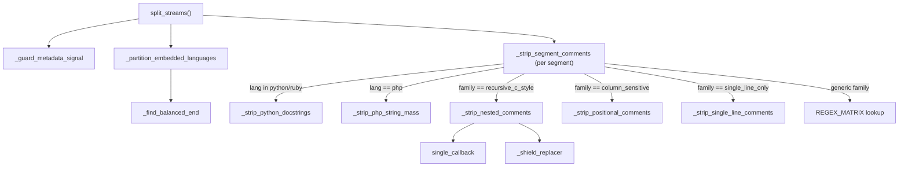

# The Prism — splitting code from comments without an AST

## Overview
`Prism` is the stage that stands between raw file text and the Detector: its whole job is to decouple a
unified file into two mutually exclusive streams — an executable payload and a documentation surface —
before any structural regex ever runs. The name is literal: just as a physical prism splits one beam into
distinct spectrums, [`split_streams`](../catalog/gitgalaxy/core/prism.md#Prism.split_streams) splits one
string into `code_stream` and `comment_stream`. The one hard problem this solves is that "strip the
comments" is not one algorithm — Python docstrings must be *extracted*, not merely deleted; PHP heredocs
must be replaced with a syntactically valid stand-in, not removed outright; nested block comments
(Rust/Swift/Scala) cannot be stripped by a single non-recursive regex at all — so
[`_strip_segment_comments`](../catalog/gitgalaxy/core/prism.md#Prism._strip_segment_comments) routes each
segment to one of several specialized strippers before falling back to one generic, per-family compiled
pattern.

## Diagram

## Design rationale (why it's built this way)
`Prism`'s own docstring frames the trade the same way the Detector's does: "Standard Abstract Syntax
Trees (ASTs) are brittle, language-specific, and require compilable code. To achieve polyglot velocity …
across 50+ languages, the Prism utilizes highly bounded, ReDoS-proof regular expressions." The separation
from the Detector exists specifically so that structural counting never sees comment text and comment
analysis never sees executable text — a single unified pass would let a commented-out `if` inflate a
file's branching metrics.

Three languages get bespoke handling *before* generic family routing, and each is a different failure
mode of "just delete the comment": [`_strip_python_docstrings`](../catalog/gitgalaxy/core/prism.md#Prism._strip_python_docstrings)
extracts triple-quoted strings into the documentation stream (because in Python a docstring is not a
comment — it is a string literal in statement position, and it is exactly the text later modules want as
human-authored documentation) while collapsing it to a single newline in the code stream so line counts
survive. [`_strip_php_string_mass`](../catalog/gitgalaxy/core/prism.md#Prism._strip_php_string_mass)
replaces PHP heredoc/nowdoc blocks with a bare `""` rather than deleting them outright, because a heredoc
sits in expression position (e.g. as a function argument) and deleting it would leave the surrounding PHP
syntactically broken — the placeholder keeps the code stream parseable-by-regex downstream. Neither
substitution is optional: skipping them and falling through to the generic stripper would either lose the
docstring's text (`comment_stream` would omit it) or corrupt the code stream's brace/paren balance for
Mode B slicing.

[`_strip_nested_comments`](../catalog/gitgalaxy/core/prism.md#Prism._strip_nested_comments) exists because
languages using the `recursive_c_style` family (Rust, Swift, Scala) permit `/* /* */ */`-style nested block
comments, and a non-recursive regex cannot match balanced nesting by construction. Rather than reach for a
recursive-regex extension, the method peels the innermost closed block comment (the first `*/` found,
matched backward to its nearest preceding `/*`) and repeats until no opener remains — an iterative,
inside-out strategy bounded by [`NESTED_PEEL_LIMIT`](../catalog/gitgalaxy/core/prism.md#Prism.NESTED_PEEL_LIMIT)
(500 iterations) so adversarial or malformed input cannot loop indefinitely. It masks string contents
first via `LITERAL_MASK_PATTERN`, specifically so a `/*` or `*/` sitting inside a string literal cannot be
mistaken for a real delimiter by the `.rfind`-based scan.

[`_compile_regex_matrix`](../catalog/gitgalaxy/core/prism.md#Prism._compile_regex_matrix) is a small regex
factory keyed by `lexical_family` (`c_style_comment`, `single_line_only`, `embedded_syntax`,
`multi_style_dash`), each shape built from that family's configured delimiter list. Its `single_line_only`
branch carries an explicit historical warning worth preserving verbatim: an earlier version of the pattern
began with a leading, un-anchored `|` alternative, which "told Python's `re.sub` engine that matching an
'empty string' was a valid success state," causing the callback to fire "at EVERY SINGLE CHARACTER
BOUNDARY" and freezing the pipeline on a 1MB assembly file — a concrete, source-documented ReDoS
regression, not a hypothetical one, and the reason the code now explicitly forbids a leading or trailing
`|` in that capture group.

[`_partition_embedded_languages`](../catalog/gitgalaxy/core/prism.md#Prism._partition_embedded_languages)
guards its own expensive case-insensitive trigger scan behind a cheap literal-substring pre-check (lower-
casing the content once and testing whether the trigger's hint text, e.g. `script`, even appears) —
because the overwhelming majority of files contain no embedded `<script>`/`<style>`/`asm!` block at all,
this "Universal Web Tax Shield" avoids paying a full regex scan for a feature that almost never fires.

Finally, [`split_streams`](../catalog/gitgalaxy/core/prism.md#Prism.split_streams) derives `doc_loc` by
*subtracting* the reassembled code stream's active line count from the original file's total active line
count, rather than summing `code_parts`/`comment_parts` line counts independently — the code's own comment
calls this "THE FIX: Prevent the 'Inline Comment Double-Dip'." A line that carries both code and a
trailing comment must count as exactly one active line, split between the two totals only by this
subtraction, not double-counted by two independent tallies.

## Entry points
- [`split_streams`](../catalog/gitgalaxy/core/prism.md#Prism.split_streams) — the sole per-file entry
  point. It short-circuits on empty content, routes `undeterminable`/`unknown` languages entirely into
  `code_stream` (an "Unparsable Bypass" that keeps the raw signal available to the Detector rather than
  discarding it) and `markdown`/`plaintext`/`xml` entirely into `comment_stream` (a "Prose Bypass"), and
  only for everything else runs the full guard → partition → per-segment strip → reassemble pipeline
  described below.

## Mechanism (step-by-step)
1. **Metadata guard.** [`_guard_metadata_signal`](../catalog/gitgalaxy/core/prism.md#Prism._guard_metadata_signal)
   peels off a leading shebang (`#!`) or PHP/XML opening declaration line before anything else touches the
   content, so the stripping engine downstream can never mistake it for a comment or accidentally mangle
   it.
2. **Embedded-language partition.** [`_partition_embedded_languages`](../catalog/gitgalaxy/core/prism.md#Prism._partition_embedded_languages)
   splits the body into `(lang_id, segment_text)` tuples using the pre-check described in Design
   rationale, resolving paired-delimiter embeds (like an inline `asm!()` block) through
   [`_find_balanced_end`](../catalog/gitgalaxy/core/prism.md#Prism._find_balanced_end), which tracks
   bracket depth while explicitly counting preceding backslashes to decide whether a quote character is
   escaped (an even count means the quote is real).
3. **Per-segment dispatch.** For each segment, [`_strip_segment_comments`](../catalog/gitgalaxy/core/prism.md#Prism._strip_segment_comments)
   first runs Python/Ruby docstring extraction or PHP heredoc extraction unconditionally when the
   language matches, regardless of which lexical family the segment will route to next — this ordering
   matters because those extractions must happen on the raw text before any family-generic masking
   touches it.
4. **Family-specific routing.** The (already docstring/heredoc-stripped) text is then routed by
   `lexical_family`: `recursive_c_style` goes to
   [`_strip_nested_comments`](../catalog/gitgalaxy/core/prism.md#Prism._strip_nested_comments),
   `column_sensitive` goes to [`_strip_positional_comments`](../catalog/gitgalaxy/core/prism.md#Prism._strip_positional_comments)
   (column-1/column-7 anchored comments for fixed-form COBOL/Fortran), and `single_line_only` goes to
   [`_strip_single_line_comments`](../catalog/gitgalaxy/core/prism.md#Prism._strip_single_line_comments).
5. **Generic fallback.** Any other family masks its literals first (via
   [`shield_callback`](../catalog/gitgalaxy/core/prism.md#Prism.shield_callback), keyed against
   [`LITERAL_MASK_PATTERN`](../catalog/gitgalaxy/core/prism.md#Prism.LITERAL_MASK_PATTERN)), looks up its
   compiled pattern in [`REGEX_MATRIX`](../catalog/gitgalaxy/core/prism.md#Prism.REGEX_MATRIX) (built once
   at construction time by [`_compile_regex_matrix`](../catalog/gitgalaxy/core/prism.md#Prism._compile_regex_matrix)),
   strips matches via [`strip_callback`](../catalog/gitgalaxy/core/prism.md#Prism.strip_callback) while
   capturing their text into the documentation stream, and then restores the masked literals into the
   surviving code text. A family with no registered pattern simply
   restores its masked literals and returns the text unchanged as code — a graceful no-op floor rather
   than a crash.
6. **Reassembly and mutual-exclusivity accounting.** [`split_streams`](../catalog/gitgalaxy/core/prism.md#Prism.split_streams)
   concatenates the guarded header back onto the joined code parts, joins the comment parts, and computes
   `doc_loc` by subtraction from the original total active-line count as described above.
7. **Failure mode.** Unlike the Detector's `splice` (which catches and returns an empty payload), a
   catastrophic exception inside `split_streams` is logged and then re-raised as a
   [`PrismError`](../catalog/gitgalaxy/core/prism.md#PrismError) — this stage fails loudly rather than
   silently degrading, since a broken split would poison both streams the Detector depends on.

## Key data structures
- [`PrismResult`](../catalog/gitgalaxy/core/prism.md#PrismResult) — the dual output: `code_stream`,
  `comment_stream`, `coding_loc`, `doc_loc`. Its own docstring is explicit that these two streams are the
  "Executable Payload" and "Documentation Surface" respectively.
- [`REGEX_MATRIX`](../catalog/gitgalaxy/core/prism.md#Prism.REGEX_MATRIX) — the per-`lexical_family`
  compiled pattern table built once per `Prism` instance by
  [`_compile_regex_matrix`](../catalog/gitgalaxy/core/prism.md#Prism._compile_regex_matrix); this is the
  "grounding floor" every family without bespoke handling falls back to.
- [`LITERAL_MASK_PATTERN`](../catalog/gitgalaxy/core/prism.md#Prism.LITERAL_MASK_PATTERN) — the shared
  string-literal shield reused by the generic stripper, `_strip_nested_comments`, and elsewhere, so a
  `#`/`//`/`/*` sitting inside a string is never mistaken for a real comment start.
- [`EMBEDDED_TRIGGERS`](../catalog/gitgalaxy/core/prism.md#Prism.EMBEDDED_TRIGGERS) /
  [`EMBEDDED_LOOKAHEAD_LIMIT`](../catalog/gitgalaxy/core/prism.md#Prism.EMBEDDED_LOOKAHEAD_LIMIT) — the
  registry and 50,000-character search bound for polyglot handshakes (`<script>`, `<style>`, inline
  assembly), synchronized from the same central language-standards configuration the Detector's own
  handshake registry draws from.
- [`POSITIONAL_ANCHORS`](../catalog/gitgalaxy/core/prism.md#Prism.POSITIONAL_ANCHORS) /
  [`NESTED_PEEL_LIMIT`](../catalog/gitgalaxy/core/prism.md#Prism.NESTED_PEEL_LIMIT) — the fixed-form
  column set for `column_sensitive` languages, and the iteration cap on nested-comment peeling.

## Dynamics (design intent)
Ordering, not concurrency, is the load-bearing property here: docstring/heredoc extraction always runs
*before* family-generic masking within [`_strip_segment_comments`](../catalog/gitgalaxy/core/prism.md#Prism._strip_segment_comments),
because the generic path's literal-masking regex has no language-specific awareness that a Python triple
quote or a PHP heredoc opener is not an ordinary string. `_strip_nested_comments`'s peel loop is similarly
order-dependent — it always resolves the innermost (rightmost-closing) block comment first and works
outward, which is the only order that terminates correctly for arbitrarily nested delimiters without a
true recursive-descent parser.

## Edge cases
- A file with no content, or a language tagged `undeterminable`/`unknown`/`markdown`/`plaintext`/`xml`,
  never reaches the strip pipeline at all — it is bypassed wholesale into one stream or the other.
- [`_find_balanced_end`](../catalog/gitgalaxy/core/prism.md#Prism._find_balanced_end) can fail to find a
  closing delimiter within its lookahead window; when that happens it logs a "Scanner Scope Guard" warning
  and forces closure at the window boundary rather than scanning unboundedly.
- [`_strip_nested_comments`](../catalog/gitgalaxy/core/prism.md#Prism._strip_nested_comments) can hit its
  500-iteration [`NESTED_PEEL_LIMIT`](../catalog/gitgalaxy/core/prism.md#Prism.NESTED_PEEL_LIMIT) on
  pathologically deep nesting; it logs a warning and stops peeling rather than looping forever, which
  means an adversarial file could leave some nested comment text unpeeled into the code stream.
- A family absent from [`REGEX_MATRIX`](../catalog/gitgalaxy/core/prism.md#Prism.REGEX_MATRIX) is not an
  error: the generic path simply restores masked literals and returns the text as-is, so an
  under-configured language degrades to "no comments stripped" rather than crashing.
- Any other exception during [`split_streams`](../catalog/gitgalaxy/core/prism.md#Prism.split_streams)
  propagates as [`PrismError`](../catalog/gitgalaxy/core/prism.md#PrismError) — the opposite failure
  posture from the Detector's `splice`, which swallows exceptions and returns an empty result.

## Open questions
- [`_strip_segment_comments`](../catalog/gitgalaxy/core/prism.md#Prism._strip_segment_comments) reads
  `PRISM_CONFIG`/`LENS_CONFIG` indirectly through several cited constants, but the underlying
  language-standards configuration module itself (beyond the two constants
  [`PRISM_CONFIG`](../catalog/gitgalaxy/standards/language_standards.md#PRISM_CONFIG) and
  [`LENS_CONFIG`](../catalog/gitgalaxy/standards/language_standards.md#LENS_CONFIG)) is outside this
  packet's subgraph, so the exact per-language delimiter lists are described from reading `prism.py`
  directly rather than cited symbol-by-symbol.
- Whether `Prism.split_streams` is always called immediately before the Detector's `splice` on the same
  file (as the repo's own `core/README.md` pipeline description implies) cannot be confirmed from this
  packet alone, since the orchestrator call site is not in this subgraph.

## See also
- [The Detector](gitgalaxy-core-detector.md) — the consumer of `code_stream`/`comment_stream`, and the
  reason the two streams must stay mutually exclusive.
- [The Aperture Filter](gitgalaxy-core-aperture.md) — decides which files are read at all before the
  Prism ever runs.
- [The GuideStar Protocol](gitgalaxy-core-guidestar_lens.md) — supplies the language prediction that
  determines which bypass or family path `split_streams` takes.
