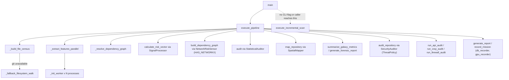

# GalaxyScope orchestrator — the blAST pipeline entry point

## Overview
`galaxyscope.py` is where GitGalaxy's "blAST" philosophy (its own README: "Bypassing LLMs
and ASTs") becomes an executable pipeline. The `Orchestrator` class is a pure sequencer —
its own docstring calls it "strictly a traffic cop" — that delegates every phase (file
census, regex extraction, dependency resolution, risk scoring, network topology, ML threat
inference, and four independent output recorders) to specialized engines documented across
this survey's other GitGalaxy pages. The interesting finding on this page is not the happy
path, which is a straightforward 12-phase waterfall driven by [`execute_pipeline`](../catalog/gitgalaxy/galaxyscope.md#Orchestrator.execute_pipeline);
it is that the pipeline's only *other* execution mode,
[`execute_incremental_scan`](../catalog/gitgalaxy/galaxyscope.md#Orchestrator.execute_incremental_scan),
is unreachable code — a fully written "Continuous Delta" scan with no caller anywhere in
the repository.

## Diagram

## Design rationale (why it's built this way)
**Hub-and-spoke, not a monolith.** The `Orchestrator` docstring is explicit that it holds
no domain logic itself: "This class operates as the Hub in GitGalaxy's Hub-and-Spoke
architecture. It is strictly a traffic cop—it delegates all heavy lifting to specialized
computational engines." Every phase in [`execute_pipeline`](../catalog/gitgalaxy/galaxyscope.md#Orchestrator.execute_pipeline)
is one or two lines that hand off to a named engine ([`SignalProcessor`](../catalog/gitgalaxy/metrics/signal_processor.md#SignalProcessor),
[`Chronometer`](../catalog/gitgalaxy/metrics/chronometer.md#Chronometer),
[`SecurityAuditor`](../catalog/gitgalaxy/security/security_auditor.md#SecurityAuditor),
[`SecurityLens`](../catalog/gitgalaxy/security/security_lens.md#SecurityLens)) rather than
doing the work inline.

**The phase order is a dependency chain, not a convenience.** The
[`execute_pipeline`](../catalog/gitgalaxy/galaxyscope.md#Orchestrator.execute_pipeline)
docstring states the ordering is load-bearing: "Workers (Phase 1) must run before
Relational Analysis (Phase 3) so that we have exact code tokens in RAM before mapping the
API Downstream Exposure. Likewise, Network Topology (Phase 4) is required before XGBoost
Inference (Phase 9) since a file's centrality influences its logic bomb threat weighting."
This is why [`build_dependency_graph`](../catalog/gitgalaxy/core/network_risk_sensor.md#NetworkRiskSensor.build_dependency_graph)
runs before [`audit_repository`](../catalog/gitgalaxy/security/security_auditor.md#SecurityAuditor.audit_repository):
the ML classifier's feature matrix depends on graph centrality that only exists after Phase 4.

**Separate OS processes, not threads, for the regex engine.** [`_init_worker`](../catalog/gitgalaxy/galaxyscope.md#_init_worker)'s
docstring gives the reason bluntly: "Python's Global Interpreter Lock (GIL) prevents true
multi-threading for CPU-bound tasks... This boot-loader instantiates the heavy regex
matrices entirely within the child's isolated RAM. This prevents the OS from attempting to
pickle/serialize massive compiled regex objects across the IPC (Inter-Process
Communication) boundary." Each worker pre-warms its own `plaintext`/`markdown` detector and
then the detectors for whatever extensions [`ext_tally`](../catalog/gitgalaxy/galaxyscope.md#Orchestrator.ext_tally)
saw during the census, rather than compiling every one of the 50+ language regex tables in
every process.

**Zero-Dependency Mode: degrade, don't crash.** If [`HAS_NETWORKX`](../catalog/gitgalaxy/core/network_risk_sensor.md#HAS_NETWORKX),
tiktoken ([`HAS_TIKTOKEN`](../catalog/gitgalaxy/core/detector.md#HAS_TIKTOKEN)), or
[`ML_AVAILABLE`](../catalog/gitgalaxy/security/security_auditor.md#ML_AVAILABLE) are
missing, [`execute_pipeline`](../catalog/gitgalaxy/galaxyscope.md#Orchestrator.execute_pipeline)
logs a boxed warning and keeps going with those metrics set to null rather than raising —
consistent with the "zero-dependency, air-gapped" pitch this survey lens calls out: the
heuristic core has no hard dependency on the graph/tokenizer/ML libraries, only a soft one.

> [!inferred]
> The `execute_incremental_scan` docstring promises a CI/CD-friendly delta path, and the
> method body genuinely implements one — see Open questions. Whether that design was ever
> wired to a caller (a git-diff step feeding `added`/`modified`/`deleted`) is not visible
> anywhere in this codebase.

## Entry points
- [`main`](../catalog/gitgalaxy/galaxyscope.md#main) — the CLI entry point. Parses
  `target`/`--output`/`--debug`/`--paranoid` (which selects [`ThreatPolicy`](../catalog/gitgalaxy/standards/analysis_lens.md#ThreatPolicy)'s
  paranoid profile) plus exclusive-recorder flags (`--llm-only`, `--gpu-only`,
  `--audit-only`, `--db-only`) and profiling flags (`--splicing-speed`, `--file-speed`),
  then constructs an `Orchestrator` and calls [`execute_pipeline`](../catalog/gitgalaxy/galaxyscope.md#Orchestrator.execute_pipeline).
  It never parses a flag that would route to `execute_incremental_scan`.
- [`execute_pipeline`](../catalog/gitgalaxy/galaxyscope.md#Orchestrator.execute_pipeline) —
  the only production entry point into the full scan. Everything downstream in this page
  hangs off it.
- [`_init_worker`](../catalog/gitgalaxy/galaxyscope.md#_init_worker) — the real entry point
  for CPU-bound work: it is the `ProcessPoolExecutor` initializer, so it runs once per
  spawned worker process before any file is handed to it.
- [`execute_incremental_scan`](../catalog/gitgalaxy/galaxyscope.md#Orchestrator.execute_incremental_scan) —
  defined and fully implemented, but per the Dynamics section below it has no reachable
  caller in this repository; control never arrives here in practice.

## Mechanism (step-by-step)
1. **Phase 0 — Census.** [`_build_file_census`](../catalog/gitgalaxy/galaxyscope.md#Orchestrator._build_file_census)
   shells out to `git ls-files` to enumerate tracked paths, fanning file-integrity checks
   across a thread pool; the resulting valid paths populate [`stem_map`](../catalog/gitgalaxy/galaxyscope.md#Orchestrator.stem_map)
   and [`ext_tally`](../catalog/gitgalaxy/galaxyscope.md#Orchestrator.ext_tally), and rejected
   ones become part of [`unparsable_files`](../catalog/gitgalaxy/galaxyscope.md#Orchestrator.unparsable_files).
   If git is unavailable, [`_fallback_filesystem_walk`](../catalog/gitgalaxy/galaxyscope.md#Orchestrator._fallback_filesystem_walk)
   does the equivalent walk with `os.walk`, so a bare ZIP extraction or non-git directory
   still gets a census — this is the whole of GitGalaxy's git integration for the full-scan
   path; there is no diffing here, only enumeration.
2. **Phase 1 — Parallel extraction.** [`_extract_features_parallel`](../catalog/gitgalaxy/galaxyscope.md#Orchestrator._extract_features_parallel)
   spins up a `ProcessPoolExecutor` sized to `cpu_count - 1`, initialized once per process by
   [`_init_worker`](../catalog/gitgalaxy/galaxyscope.md#_init_worker), which is where the
   per-language regex detectors documented on the language-lens and language-standards pages
   actually get instantiated and warmed. Futures are drained via `as_completed` rather than
   polled, so a slow file (ReDoS-guarded per-file, separately from this packet's subgraph)
   cannot stall collection of the files that already finished.
3. **Phase 2 — Dependency resolution.** [`_resolve_dependency_graph`](../catalog/gitgalaxy/galaxyscope.md#Orchestrator._resolve_dependency_graph)
   builds suffix-hash maps over [`ram_cache`](../catalog/gitgalaxy/galaxyscope.md#Orchestrator.ram_cache)
   to resolve each file's raw import strings to concrete repo paths before any risk scoring
   happens — this has to run before Phase 3 because exposure/centrality metrics need to know
   which files import which.
4. **Phase 3 — Risk vectors.** For each file, [`calculate_risk_vector`](../catalog/gitgalaxy/metrics/signal_processor.md#SignalProcessor.calculate_risk_vector)
   turns the worker's raw regex hit counts into the ordered [`RISK_SCHEMA`](../catalog/gitgalaxy/metrics/signal_processor.md#SignalProcessor.RISK_SCHEMA)
   vector, folding in temporal signal from [`get_file_history_metrics`](../catalog/gitgalaxy/metrics/chronometer.md#Chronometer.get_file_history_metrics)
   (itself backed by [`repo_max_time`](../catalog/gitgalaxy/metrics/chronometer.md#Chronometer.repo_max_time),
   computed once at boot by [`_initialize_history_scan`](../catalog/gitgalaxy/metrics/chronometer.md#Chronometer._initialize_history_scan)
   so the per-file lookup stays a zero-I/O RAM read even inside the worker pool). It also
   runs an "extension spoofing" check that penalizes a file claiming an inert extension
   (`.txt`, `.json`, …) but scored as executable.
5. **Phase 4 — Network topology.** [`build_dependency_graph`](../catalog/gitgalaxy/core/network_risk_sensor.md#NetworkRiskSensor.build_dependency_graph)
   builds the directed import graph (guarded by [`HAS_NETWORKX`](../catalog/gitgalaxy/core/network_risk_sensor.md#HAS_NETWORKX))
   whose centrality later weights the malware classifier's confidence in Phase 9 — the
   ordering the design-rationale docstring calls out explicitly.
6. **Phase 6 — Spectral audit.** [`audit`](../catalog/gitgalaxy/metrics/statistical_auditor.md#StatisticalAuditor.audit)
   applies a log-scaled orphan threshold to drop data-dumps and structural outliers before
   they poison repository-wide averages.
7. **Phase 7 — Spatial layout.** [`map_repository`](../catalog/gitgalaxy/core/spatial_mapper.md#SpatialMapper.map_repository)
   assigns each surviving file 3D coordinates for the WebGL frontend via ray-casting
   placement, sectorized by directory.
8. **Phase 8 — Synthesis.** [`summarize_galaxy_metrics`](../catalog/gitgalaxy/metrics/signal_processor.md#SignalProcessor.summarize_galaxy_metrics)
   and [`generate_forensic_report`](../catalog/gitgalaxy/metrics/signal_processor.md#SignalProcessor.generate_forensic_report)
   aggregate per-file risk vectors into repo-level rankings (top/bottom exposures,
   bottleneck detection).
9. **Phase 9 — ML threat inference.** [`audit_repository`](../catalog/gitgalaxy/security/security_auditor.md#SecurityAuditor.audit_repository)
   builds a feature matrix reindexed against the trained model's [`feature_names`](../catalog/gitgalaxy/security/security_auditor.md#SecurityAuditor.feature_names)
   and runs the multiclass XGBoost classifier — the one place in this pipeline where a
   trained statistical model, rather than a hand-authored regex table, makes the call; its
   decision threshold (`ai_threshold`, seeded from `AI_THREAT_THRESHOLD = 90.0` in
   `analysis_lens.py`) is a fixed constant set once in `SecurityAuditor.__init__` — unlike
   the density thresholds below, it is **not** gated by
   [`ThreatPolicy`](../catalog/gitgalaxy/standards/analysis_lens.md#ThreatPolicy) or
   `--paranoid`; the `Orchestrator` constructs `model_auditor = SecurityAuditor(...)` with no
   policy/config argument at all.
10. **Phase 10 — Ecosystem security audits.** [`run_api_audit`](../catalog/gitgalaxy/tools/network_auditing/full_api_network_map.md#run_api_audit),
    [`run_xray_audit`](../catalog/gitgalaxy/tools/supply_chain_security/binary_anomaly_detector.md#run_xray_audit),
    and [`run_firewall_audit`](../catalog/gitgalaxy/tools/supply_chain_security/supply_chain_firewall.md#run_firewall_audit)
    are each independently importable security tools (they ship their own `main()` CLIs)
    that `execute_pipeline` calls as plain library functions, passing `run_api_audit` and
    `run_xray_audit` nothing but `self.root`; only `run_firewall_audit` receives the alias map
    from [`build_resolution_map`](../catalog/gitgalaxy/security/manifest_parser.md#ManifestParser.build_resolution_map) —
    the other two tools never reference it, so aliases are resolved for one of the three, not
    all three.
11. **Phase 12 — Archival and export.** Four recorders run, each individually toggleable by
    the CLI's exclusive-mode flags: [`generate_report`](../catalog/gitgalaxy/recorders/audit_recorder.md#AuditRecorder.generate_report)
    (`--audit-only`), [`record_mission`](../catalog/gitgalaxy/recorders/record_keeper.md#RecordKeeper.record_mission)
    on [`db_recorder`](../catalog/gitgalaxy/galaxyscope.md#Orchestrator.db_recorder)
    (`--db-only`, native SQLite), and [`record_mission`](../catalog/gitgalaxy/recorders/gpu_recorder.md#GPURecorder.record_mission)
    on [`gpu_recorder`](../catalog/gitgalaxy/galaxyscope.md#Orchestrator.gpu_recorder)
    (`--gpu-only`, a destructive columnar pivot that frees the `parsed_files` list as it
    builds the WebGL payload).

## Key data structures
- [`ram_cache`](../catalog/gitgalaxy/galaxyscope.md#Orchestrator.ram_cache) — the per-file
  state dict keyed by relative path; the one piece of state `execute_incremental_scan`
  would need injected from a previous run to avoid a cold start.
- [`parsed_files`](../catalog/gitgalaxy/galaxyscope.md#Orchestrator.parsed_files) /
  [`unparsable_files`](../catalog/gitgalaxy/galaxyscope.md#Orchestrator.unparsable_files) —
  the Phase-1 partition between files that got a full structural extraction and files that
  were filtered, phantom, or over the 15-second ReDoS timeout.
- [`stem_map`](../catalog/gitgalaxy/galaxyscope.md#Orchestrator.stem_map) /
  [`ext_tally`](../catalog/gitgalaxy/galaxyscope.md#Orchestrator.ext_tally) — the Phase-0
  census outputs; `ext_tally` in particular is what [`_init_worker`](../catalog/gitgalaxy/galaxyscope.md#_init_worker)
  uses to decide which language detectors to pre-warm instead of compiling all of
  [`LANGUAGE_DEFINITIONS`](../catalog/gitgalaxy/standards/language_standards.md#LANGUAGE_DEFINITIONS)
  (including its shared multilingual debt markers, [`GLOBAL_PLANNED_DEBT`](../catalog/gitgalaxy/standards/language_standards.md#GLOBAL_PLANNED_DEBT)
  and [`GLOBAL_FRAGILE_DEBT`](../catalog/gitgalaxy/standards/language_standards.md#GLOBAL_FRAGILE_DEBT))
  in every worker.
- [`config`](../catalog/gitgalaxy/galaxyscope.md#Orchestrator.config) — the dict threaded
  through every phase and into every worker process; it carries both the static language
  tables and the CLI's runtime flags (`PARANOID_MODE`, `LLM_ONLY`, `GPU_ONLY`, …).
- [`splicing_telemetry`](../catalog/gitgalaxy/galaxyscope.md#Orchestrator.splicing_telemetry) —
  per-regex timing totals collected only when `--splicing-speed` is set.

## Dynamics (design intent)
The [`execute_pipeline`](../catalog/gitgalaxy/galaxyscope.md#Orchestrator.execute_pipeline)
docstring is explicit that phase order encodes real data dependencies (Workers before
Relational Analysis, Network Topology before ML Inference), so the phases are not safely
reorderable even though each one delegates to an independent engine class.

[`_extract_features_parallel`](../catalog/gitgalaxy/galaxyscope.md#Orchestrator._extract_features_parallel)'s
own docstring states it "consumes the futures dynamically to prevent O(N^2) polling wait
states" — an explicit performance design choice, not an incidental one — and that it
"catches structural saturations (ReDoS)."

## Edge cases
- **No git, or a ZIP target.** [`_build_file_census`](../catalog/gitgalaxy/galaxyscope.md#Orchestrator._build_file_census)
  catches `subprocess.CalledProcessError`/`FileNotFoundError` from `git ls-files` and falls
  through to [`_fallback_filesystem_walk`](../catalog/gitgalaxy/galaxyscope.md#Orchestrator._fallback_filesystem_walk).
- **Missing optional dependencies.** [`HAS_NETWORKX`](../catalog/gitgalaxy/core/network_risk_sensor.md#HAS_NETWORKX),
  [`HAS_TIKTOKEN`](../catalog/gitgalaxy/core/detector.md#HAS_TIKTOKEN), and
  [`ML_AVAILABLE`](../catalog/gitgalaxy/security/security_auditor.md#ML_AVAILABLE) each gate
  a different phase (network topology, token-cost metrics, ML inference); the pipeline logs
  a boxed warning and proceeds with those metrics null instead of failing.
- **`--paranoid` changes SecurityLens's density thresholds, not the ML gate or the regex
  extraction tables.** It selects [`ThreatPolicy`](../catalog/gitgalaxy/standards/analysis_lens.md#ThreatPolicy)'s
  `"paranoid"` profile (tighter density thresholds) for both the worker-local
  [`SecurityLens`](../catalog/gitgalaxy/security/security_lens.md#SecurityLens) and the
  main-thread one; it does not alter which languages or rules are loaded, and it does not
  touch the Phase 9 XGBoost classifier's fixed `ai_threshold` gate either.

## Open questions
- **`execute_incremental_scan` appears to be dead code.** A repo-wide search (production
  source and tests) finds no call site for [`execute_incremental_scan`](../catalog/gitgalaxy/galaxyscope.md#Orchestrator.execute_incremental_scan)
  anywhere — no CLI flag in [`main`](../catalog/gitgalaxy/galaxyscope.md#main) routes to it,
  and no test exercises it. Reading its body confirms it does *not* itself compute a git
  diff: it receives `ram_cache`/`added`/`modified`/`deleted` as plain arguments from an
  external caller that does not exist in this codebase. It evicts deleted/modified entries
  from [`ram_cache`](../catalog/gitgalaxy/galaxyscope.md#Orchestrator.ram_cache), re-runs
  [`_extract_features_parallel`](../catalog/gitgalaxy/galaxyscope.md#Orchestrator._extract_features_parallel)
  only on the added/modified set, then still re-runs [`_resolve_dependency_graph`](../catalog/gitgalaxy/galaxyscope.md#Orchestrator._resolve_dependency_graph),
  [`build_dependency_graph`](../catalog/gitgalaxy/core/network_risk_sensor.md#NetworkRiskSensor.build_dependency_graph),
  and the risk/network recompute over the *entire* surviving `ram_cache` (its own docstring
  calls this the "Ripple Effect"). So even on paper this is a hybrid — surgical re-parsing,
  but whole-repo re-aggregation — and in practice it is unreachable scaffolding rather than
  a working incremental-reconcile path. This is the reason this page does **not** carry an
  `incremental-reconcile` concept tag: unlike wikify-repo's ref-driven diff or graphify's
  content-addressed cache, there is no wired mechanism here that actually decides "what
  changed" — that determination is assumed to happen entirely outside this repository.
- [`used_tokens`](../catalog/gitgalaxy/galaxyscope.md#Orchestrator.used_tokens) is populated
  (a global census of named import tokens gathered across every file) inside the risk-
  exposure phase, but is not read again anywhere else in this file after being written —
  its consumer, if any, is outside this packet's subgraph.

## See also
- [GalaxyScope language lens](gitgalaxy-standards-language_lens.md) — the classifier every
  worker instantiates during Phase 1.
- [GalaxyScope language standards](gitgalaxy-standards-language_standards.md) — the 50+
  per-language rule tables `LANGUAGE_DEFINITIONS` referenced above.
- [GalaxyScope analysis lens](gitgalaxy-standards-analysis_lens.md) — `ThreatPolicy` and the
  risk/signal schemas consumed throughout this pipeline.
