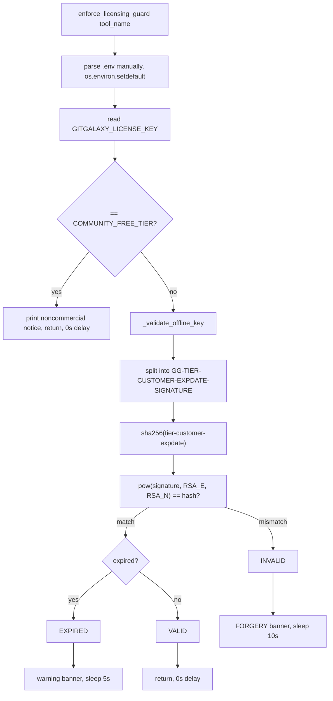

# Licensing guard — a pure-Python RSA license gate, not a comprehension mechanism

## Overview
`gitgalaxy/licensing.py` has nothing to do with code comprehension — it's the commercial
licensing checkpoint every gitgalaxy CLI tool calls at the top of its own `main()`. It verifies
an offline license key with textbook RSA signature verification implemented in pure Python
(no `cryptography` dependency), and never actually blocks execution: an unlicensed or forged
key just gets a warning banner and a real `time.sleep()` penalty before the tool proceeds
anyway. It's included in this survey only because [`enforce_licensing_guard`](../catalog/gitgalaxy/licensing.md#enforce_licensing_guard)
is called from essentially every entry point in the repository, making it the one piece of
code every other concept page's `main()` shares.

## Diagram

## Design rationale (why it's built this way)
**Verification needs no cryptography library.** [`_validate_offline_key`](../catalog/gitgalaxy/licensing.md#_validate_offline_key)
implements RSA signature verification with nothing but `hashlib` and Python's built-in
arbitrary-precision `pow()`: `pow(signature_int, RSA_E, RSA_N)` is the RSA public-key operation
applied directly to the integer form of the key's signature segment, compared against the
SHA-256 hash of the reconstructed payload. [`RSA_N`](../catalog/gitgalaxy/licensing.md#RSA_N)
and [`RSA_E`](../catalog/gitgalaxy/licensing.md#RSA_E) are a public modulus/exponent pair only —
the source comment is explicit that this is one-directional: "It is mathematically impossible
to use them to generate a new valid license." Keeping the whole check dependency-free matches
the rest of gitgalaxy's "zero-dependency" posture (the same file even hand-rolls its own `.env`
parser rather than requiring `python-dotenv`).

**Friction, not enforcement.** [`enforce_licensing_guard`](../catalog/gitgalaxy/licensing.md#enforce_licensing_guard)
never raises or calls `sys.exit`. Every branch — community tier, valid, expired, missing,
forged — eventually returns and lets the calling tool run. What differs is only the stderr
messaging and a `time.sleep()` penalty: 0 seconds for a valid key or the honor-system
`COMMUNITY_FREE_TIER` string, 5 seconds for an expired-or-missing key, 10 seconds for a
cryptographically invalid (forged/tampered) one. The asymmetry — forgery costs twice what
merely having no key costs — reads as a deliberate deterrent gradient: an honest noncommercial
user pays nothing, a lapsed/missing-key user pays a mild annoyance, and someone who tried to
fabricate a key pays the most.

## Entry points
- [`enforce_licensing_guard`](../catalog/gitgalaxy/licensing.md#enforce_licensing_guard) —
  called with a tool-specific display name at the very top of essentially every CLI `main()` in
  the repository: the COBOL refractor
  ([`main`](../catalog/gitgalaxy/cobol_refractor_controller.md#main)), the COBOL-to-Java
  controller ([`main`](../catalog/gitgalaxy/cobol_to_java_controller.md#main)), GalaxyScope
  itself ([`main`](../catalog/gitgalaxy/galaxyscope.md#main)), the secrets scanner
  ([`main`](../catalog/gitgalaxy/tools/supply_chain_security/vault_sentinel.md#main)), the
  binary anomaly detector
  ([`main`](../catalog/gitgalaxy/tools/supply_chain_security/binary_anomaly_detector.md#main)),
  the SBOM generator
  ([`main`](../catalog/gitgalaxy/tools/compliance/sbom_generator.md#main)), the supply-chain
  firewall ([`main`](../catalog/gitgalaxy/tools/supply_chain_security/supply_chain_firewall.md#main)),
  the API network mapper
  ([`main`](../catalog/gitgalaxy/tools/network_auditing/full_api_network_map.md#main)), the
  PII leak hunter
  ([`main`](../catalog/gitgalaxy/tools/terabyte_log_scanning/pii_leak_hunter.md#main)), and
  every COBOL-to-COBOL/COBOL-to-Java forge tool (JCL, schema, DAG, ETL, microservice-slicer,
  compiler, test, API-contract, service, and Spring forges — each with its own `main` in the
  subgraph). The sheer count of call sites is itself the finding: this is a single, uniformly
  applied choke point rather than a per-tool policy.
- [`_validate_offline_key`](../catalog/gitgalaxy/licensing.md#_validate_offline_key) — the pure
  function the guard delegates cryptographic verification to; it never has side effects
  (no printing, no sleeping), which is what makes it independently testable.

## Mechanism (step-by-step)
1. [`enforce_licensing_guard`](../catalog/gitgalaxy/licensing.md#enforce_licensing_guard)
   manually parses a `.env` file in the current working directory line-by-line (skipping
   comments/blank lines), injecting each `KEY=value` pair via `os.environ.setdefault` so it
   never overrides a value already set in the real environment — any I/O failure (e.g. a
   permissions-locked file) is swallowed silently rather than aborting startup.
2. [`enforce_licensing_guard`](../catalog/gitgalaxy/licensing.md#enforce_licensing_guard) reads
   `GITGALAXY_LICENSE_KEY` from the environment. The literal string `"COMMUNITY_FREE_TIER"` is a
   distinct honor-system branch: it prints a PolyForm Noncommercial License notice to stderr and
   returns immediately with no delay — there is no cryptographic check on this path at all.
3. Any other value is handed to [`_validate_offline_key`](../catalog/gitgalaxy/licensing.md#_validate_offline_key),
   which splits the key on `-` and requires exactly five segments with a literal `"GG"` prefix;
   anything else short-circuits to `"INVALID"` before any hashing happens.
4. [`_validate_offline_key`](../catalog/gitgalaxy/licensing.md#_validate_offline_key) reconstructs
   the exact `"{tier}-{customer}-{exp_date_str}"` payload the (external, not-in-this-repo) key
   minter would have signed, SHA-256 hashes it, and compares that hash against
   `pow(signature_int, `[`RSA_E`](../catalog/gitgalaxy/licensing.md#RSA_E)`, `[`RSA_N`](../catalog/gitgalaxy/licensing.md#RSA_N)`)` —
   the RSA public-key operation applied to the signature segment. A mismatch, or a non-hex
   signature, resolves to `"INVALID"`.
5. Only a cryptographically authentic signature lets
   [`_validate_offline_key`](../catalog/gitgalaxy/licensing.md#_validate_offline_key) proceed to
   the expiration check (`exp_date_str` parsed as `%Y%m%d`); an unparseable date is `"INVALID"`, a
   past date is `"EXPIRED"`, otherwise `"VALID"`.
6. Back in [`enforce_licensing_guard`](../catalog/gitgalaxy/licensing.md#enforce_licensing_guard),
   `"VALID"` returns silently with zero delay; `"EXPIRED"`/`"MISSING"` prints a warning banner and
   sleeps 5 seconds; anything else (`"INVALID"`) prints a stronger "FORGERY DETECTED" banner and
   sleeps 10 seconds. All four outcomes return normally — the tool always runs.

## Key data structures
- [`RSA_N`](../catalog/gitgalaxy/licensing.md#RSA_N) / [`RSA_E`](../catalog/gitgalaxy/licensing.md#RSA_E) —
  the hardcoded public modulus and exponent; verification-only, per the source comment.
- The five-segment key format `GG-TIER-CUSTOMER-EXPDATE-SIGNATURE`, where `TIER-CUSTOMER-EXPDATE`
  is exactly the string that gets re-hashed and checked against the signature.
- The four-way status returned by `_validate_offline_key`: `"MISSING"`, `"INVALID"`, `"EXPIRED"`,
  `"VALID"` — the only channel between the pure crypto check and the friction logic.

## Dynamics (design intent)
[`test_licensing_pytest_bypass`](../catalog/tests/core_engine/test_licensing.md#test_licensing_pytest_bypass)'s
own docstring — "Proves the Pytest bypass was successfully removed and strict compliance is
enforced" — is a direct signal that an earlier version of this guard special-cased test runs,
and that shortcut was deliberately removed so the guard's behavior under test is identical to
production. [`test_routing_community_tier`](../catalog/tests/core_engine/test_licensing.md#test_routing_community_tier)
and [`test_routing_valid_enterprise_tier`](../catalog/tests/core_engine/test_licensing.md#test_routing_valid_enterprise_tier)
both assert "NO sleep penalty," while
[`test_routing_forgery_hammer`](../catalog/tests/core_engine/test_licensing.md#test_routing_forgery_hammer)
asserts "the maximum 10-second penalty" — together they pin the exact three-tier friction
schedule (0s / 5s / 10s) as intentional, tested behavior rather than an incidental side effect.
[`test_validate_key_cryptographic_authenticity`](../catalog/tests/core_engine/test_licensing.md#test_validate_key_cryptographic_authenticity)
and [`test_validate_key_missing_or_malformed`](../catalog/tests/core_engine/test_licensing.md#test_validate_key_missing_or_malformed)
isolate the pure crypto/parsing logic from the friction/printing logic, matching the function
split in the source itself.

## Edge cases
- **Malformed segment count or prefix** short-circuits to `"INVALID"` before any hashing —
  a key with the wrong shape never reaches the RSA math at all.
- **Non-hexadecimal signature** raises `ValueError` internally, caught and mapped to
  `"INVALID"` rather than propagating.
- **Unparseable expiration date** is likewise caught and mapped to `"INVALID"`, not treated as
  `"EXPIRED"`.
- **Any other exception anywhere in `_validate_offline_key`** falls through a catch-all to
  `"INVALID"` — the function is designed to never raise out to its caller.
- **A locked or unreadable `.env` file** is swallowed silently by `enforce_licensing_guard`'s
  own `except Exception: pass`, so a permissions issue on that file never blocks startup.

## Open questions
- The private-key minting side (`gg_key_minter.py`, referenced only in a source comment) is not
  part of this repository or subgraph.
- Whether `GITGALAXY_LICENSE_KEY` is re-read (and the sleep re-paid) on every single CLI
  invocation, or cached somewhere for long-running orchestrations, isn't resolved by this
  subgraph — `enforce_licensing_guard` is called once per `main()`, and each `main()` in the
  subgraph is a separate process entry point.

## See also
- [GalaxyScope orchestrator](gitgalaxy-galaxyscope.md) — one of the many entry points this
  guard gates.
- [COBOL Refractor Controller](gitgalaxy-cobol_refractor_controller.md) — another consumer,
  representative of how uniformly this gate is applied across unrelated tool families.
