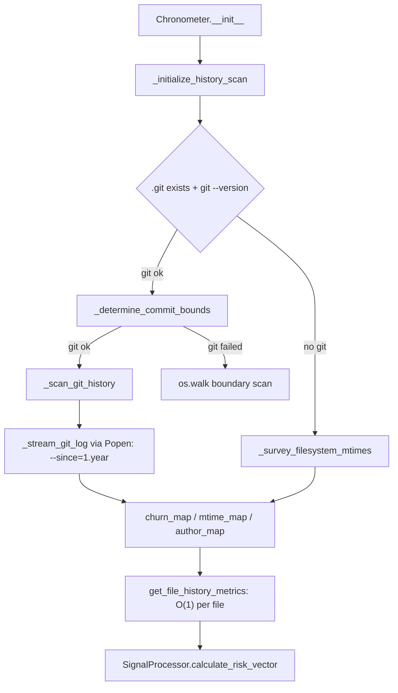

# Chronometer — a bounded, fresh-every-run VCS churn and stability survey

## Overview
`Chronometer` is Phase 3 of GitGalaxy's
pipeline — the "Time-Series Analyzer" that feeds
[`SignalProcessor`](gitgalaxy-metrics-signal_processor.md)'s churn, stability, and ownership-entropy
math. Its design is a **survey-then-lookup** split: at construction it does one bulk pass over `git
log` (or, if Git is unavailable, an `os.walk` mtime scan) to populate three in-memory maps, so that
the extremely hot per-file lookup
[`get_file_history_metrics`](../catalog/gitgalaxy/metrics/chronometer.md#Chronometer.get_file_history_metrics),
called from inside the parallel worker pool, is guaranteed a zero-I/O RAM read. It is not, however, an
incremental engine in the sense the rest of this survey uses the term: it does not diff against a
prior scan or a persisted cursor — every run re-walks a **time-boxed** slice of git history from
scratch, bounded by a coverage/time kill switch rather than by "what changed since last time."

## Diagram

## Design rationale (why it's built this way)
**Survey-first so the hot path never touches disk or a subprocess.**
[`get_file_history_metrics`](../catalog/gitgalaxy/metrics/chronometer.md#Chronometer.get_file_history_metrics)'s
own docstring is explicit about why: "This method is called thousands of times per second by the
isolated Multi-Processing worker pool during Phase 1. If it triggered disk reads or Git CLI commands,
it would cause an IPC deadlock. All lookups here are guaranteed to be O(1) RAM dictionary accesses."
Every expensive operation (subprocess `git log`, `os.walk`) is therefore front-loaded into
[`_initialize_history_scan`](../catalog/gitgalaxy/metrics/chronometer.md#Chronometer._initialize_history_scan),
called once from `__init__`, never from the per-file path.

**A time-boxed and volume-boxed scan, not a full or incremental one.**
[`_scan_git_history`](../catalog/gitgalaxy/metrics/chronometer.md#Chronometer._scan_git_history)'s
own comment names the risk directly: "Parsing a decade-long Git log for a monolithic repository will
crash the CI/CD runner by exhausting available RAM and stalling the CPU." Its fix is a dual-axis kill
switch — stop once `required_files` (50% of tracked files, capped at 5000) are covered, or once
`timeout_limit` seconds have elapsed — applied to a command already limited to `--since=1.year`. This
bounds the *cost* of the scan, but every run still restarts the walk from the present commit backward;
there is no persisted "last scanned commit" the way this survey's incremental-reconcile axis (a
build-time commit pin, or a content-hash cache) uses elsewhere. Constructing a `Chronometer` always
resets [`churn_map`](../catalog/gitgalaxy/metrics/chronometer.md#Chronometer.churn_map),
[`mtime_map`](../catalog/gitgalaxy/metrics/chronometer.md#Chronometer.mtime_map), and
[`author_map`](../catalog/gitgalaxy/metrics/chronometer.md#Chronometer.author_map) to empty dicts, and
[`_initialize_history_scan`](../catalog/gitgalaxy/metrics/chronometer.md#Chronometer._initialize_history_scan)
re-derives [`repo_min_time`](../catalog/gitgalaxy/metrics/chronometer.md#Chronometer.repo_min_time)/
[`repo_max_time`](../catalog/gitgalaxy/metrics/chronometer.md#Chronometer.repo_max_time) from a live
`git rev-list`/`git log` call rather than reading them back from a prior run's output.
> [!inferred] This is a deliberate reading of the design, not a documented claim: the module's own
> comments frame the 1-year window and dual-axis guard as a *performance* safeguard ("Dynamic
> Windowing"), not as a staleness/reconcile mechanism — but the effect is the same either way, a
> bounded recompute rather than a diff against previous state.

**Streaming, not buffering, the log.**
[`_stream_git_log`](../catalog/gitgalaxy/metrics/chronometer.md#Chronometer._stream_git_log) reads
`git log`'s output via `subprocess.Popen` line-by-line rather than `subprocess.run` (which would
buffer an entire year of history into memory before returning), so the timeout/coverage guards can
actually interrupt mid-stream. The `finally` block explicitly kills and drains the process — the
comment calls this out as preventing "Zombie Processes" and file-descriptor leaks, since the compute
guards routinely break the loop before `git` itself has finished writing.

## Entry points
- [`_initialize_history_scan`](../catalog/gitgalaxy/metrics/chronometer.md#Chronometer._initialize_history_scan) —
  "Dispatches the survey engines to establish boundaries and churn cache," called once from
  `Chronometer.__init__`; this is where every expensive operation in the class happens.
- [`get_file_history_metrics`](../catalog/gitgalaxy/metrics/chronometer.md#Chronometer.get_file_history_metrics) —
  the per-file hot-path entry point that `SignalProcessor.calculate_risk_vector` (see
  [gitgalaxy-metrics-signal_processor](gitgalaxy-metrics-signal_processor.md)) reads its
  `temporal_telemetry`/`authors` input from; called once per file from the Orchestrator's per-file
  loop in `galaxyscope.py`, the same method that also tracks
  [`used_tokens`](../catalog/gitgalaxy/galaxyscope.md#Orchestrator.used_tokens) for unrelated
  relational-token bookkeeping.

## Mechanism (step-by-step)
1. **Git-binary verification gates everything downstream.**
   [`_initialize_history_scan`](../catalog/gitgalaxy/metrics/chronometer.md#Chronometer._initialize_history_scan)
   only trusts Git if `.git` exists *and* `git --version` succeeds; on any failure it logs a warning
   and leaves [`is_git_enabled`](../catalog/gitgalaxy/metrics/chronometer.md#Chronometer.is_git_enabled)
   `False`, routing every later step to the OS-walk fallback instead of Git.
2. **Absolute boundaries are established first, independent of the churn scan.**
   [`_determine_commit_bounds`](../catalog/gitgalaxy/metrics/chronometer.md#Chronometer._determine_commit_bounds)
   runs `git log -1 --format=%ct` for the most recent commit and `git rev-list --max-parents=0
   HEAD` (then a second `git log` on that hash) for the first commit, setting
   [`repo_max_time`](../catalog/gitgalaxy/metrics/chronometer.md#Chronometer.repo_max_time)/
   [`repo_min_time`](../catalog/gitgalaxy/metrics/chronometer.md#Chronometer.repo_min_time); if Git
   isn't enabled, or any of those calls raises, it instead walks the tree with `os.walk`, respecting
   [`aperture_config`](../catalog/gitgalaxy/metrics/chronometer.md#Chronometer.aperture_config)'s
   ignored-directory set and a scan-limit ceiling from
   [`chrono_config`](../catalog/gitgalaxy/metrics/chronometer.md#Chronometer.chrono_config).
3. **The churn/mtime/author scan is deliberately bounded, not exhaustive.**
   [`_scan_git_history`](../catalog/gitgalaxy/metrics/chronometer.md#Chronometer._scan_git_history)
   first establishes the tracked-file denominator via `git ls-files`, computes a coverage target
   (`required_files`) and a wall-clock budget (`timeout_limit` from `chrono_config`), loads
   cosmetic-commit exclusions via
   [`_load_ignored_revs`](../catalog/gitgalaxy/metrics/chronometer.md#Chronometer._load_ignored_revs)
   (a `.git-blame-ignore-revs` file), then streams `git log --since=1.year --name-only
   --pretty=format:%H|%at|%an --no-merges` through
   [`_stream_git_log`](../catalog/gitgalaxy/metrics/chronometer.md#Chronometer._stream_git_log).
4. **The stream builds all three maps from one pass, honoring ignored commits.**
   [`_stream_git_log`](../catalog/gitgalaxy/metrics/chronometer.md#Chronometer._stream_git_log)
   parses each commit header (`hash|timestamp|author`), skips every file line belonging to an
   ignored hash, strips quoted paths, and for every surviving file line increments
   [`churn_map`](../catalog/gitgalaxy/metrics/chronometer.md#Chronometer.churn_map), records the
   author in [`author_map`](../catalog/gitgalaxy/metrics/chronometer.md#Chronometer.author_map), and
   keeps only the *most recent* touch in
   [`mtime_map`](../catalog/gitgalaxy/metrics/chronometer.md#Chronometer.mtime_map) — while checking
   the timeout and coverage-target guards on every line before doing any of that work.
5. **No-Git repositories degrade to a pure filesystem survey.**
   [`_survey_filesystem_mtimes`](../catalog/gitgalaxy/metrics/chronometer.md#Chronometer._survey_filesystem_mtimes)
   walks the tree populating only
   [`mtime_map`](../catalog/gitgalaxy/metrics/chronometer.md#Chronometer.mtime_map) (churn and
   authorship are simply unavailable without Git history), silently skipping any path that raises
   `OSError`/`ValueError`.
6. **The per-file lookup layers three fallbacks and is always O(1) or a single stat call.**
   [`get_file_history_metrics`](../catalog/gitgalaxy/metrics/chronometer.md#Chronometer.get_file_history_metrics)
   first checks [`mtime_map`](../catalog/gitgalaxy/metrics/chronometer.md#Chronometer.mtime_map); on a
   miss (a file the bounded scan never reached, or a scan-timeout truncation) it falls back to a live
   `os.path.getmtime`, and if even that raises `OSError` (the file no longer exists) it falls back
   again to [`repo_max_time`](../catalog/gitgalaxy/metrics/chronometer.md#Chronometer.repo_max_time) —
   returning `commit_count`, `mtime`, both repo time bounds,
   [`is_git_enabled`](../catalog/gitgalaxy/metrics/chronometer.md#Chronometer.is_git_enabled), and the
   file's [`author_map`](../catalog/gitgalaxy/metrics/chronometer.md#Chronometer.author_map) entry in
   one dict for [`SignalProcessor`](gitgalaxy-metrics-signal_processor.md) to consume directly.

## Key data structures
- [`churn_map`](../catalog/gitgalaxy/metrics/chronometer.md#Chronometer.churn_map) — path → commit
  count within the scanned window; the raw input to `SignalProcessor`'s churn/stability math.
- [`mtime_map`](../catalog/gitgalaxy/metrics/chronometer.md#Chronometer.mtime_map) — path → most
  recent touch timestamp seen during the scan (or a live `os.path.getmtime` fallback).
- [`author_map`](../catalog/gitgalaxy/metrics/chronometer.md#Chronometer.author_map) — path → `{author:
  commit_count}` histogram, the direct input to `SignalProcessor`'s ownership-entropy and
  authorship-centralization ("silo risk") formulas.
- [`repo_min_time`](../catalog/gitgalaxy/metrics/chronometer.md#Chronometer.repo_min_time) /
  [`repo_max_time`](../catalog/gitgalaxy/metrics/chronometer.md#Chronometer.repo_max_time) — the
  project's absolute commit-time (or mtime) bounds, used to normalize every file's stability score
  relative to the whole repository's lifespan.

## Dynamics (design intent)
All writes to the three maps happen once, synchronously, during
[`_initialize_history_scan`](../catalog/gitgalaxy/metrics/chronometer.md#Chronometer._initialize_history_scan);
every subsequent call to
[`get_file_history_metrics`](../catalog/gitgalaxy/metrics/chronometer.md#Chronometer.get_file_history_metrics)
is a read-only dict lookup, which is what makes it safe to call from the parallel worker pool without
locking — the "Zero-I/O Thread Safety" design intent is stated directly in that method's own
docstring. [`_stream_git_log`](../catalog/gitgalaxy/metrics/chronometer.md#Chronometer._stream_git_log)'s
`finally` block unconditionally kills and drains the `Popen` process even when the loop exits early
via the timeout or coverage guard, so an interrupted scan cannot leak a running `git log` subprocess.

## Edge cases
- No `.git` directory, or a missing `git` binary, degrades cleanly to the OS-walk path —
  [`is_git_enabled`](../catalog/gitgalaxy/metrics/chronometer.md#Chronometer.is_git_enabled) stays
  `False` and [`_survey_filesystem_mtimes`](../catalog/gitgalaxy/metrics/chronometer.md#Chronometer._survey_filesystem_mtimes)
  runs instead of [`_scan_git_history`](../catalog/gitgalaxy/metrics/chronometer.md#Chronometer._scan_git_history).
- Quoted paths (from filenames with spaces/special characters) and lines belonging to an ignored
  commit hash are both handled inside
  [`_stream_git_log`](../catalog/gitgalaxy/metrics/chronometer.md#Chronometer._stream_git_log) —
  covered directly by
  [`test_scan_git_history_and_stream`](../catalog/tests/core_engine/test_chronometer.md#test_scan_git_history_and_stream),
  which feeds a quoted path and a commit hash marked ignored through the stream and asserts the
  quoted file is still mapped while the ignored commit's file is skipped entirely.
- A file present on disk but never seen by the bounded scan (renamed in, or simply outside the
  1-year/coverage window) still gets a usable `mtime` via
  [`get_file_history_metrics`](../catalog/gitgalaxy/metrics/chronometer.md#Chronometer.get_file_history_metrics)'s
  live-stat fallback, and a deterministic `repo_max_time` if even that stat fails — exercised by
  [`test_get_file_history_metrics`](../catalog/tests/core_engine/test_chronometer.md#test_get_file_history_metrics).

## Open questions
- Whether any *other* part of the GitGalaxy pipeline persists a "last scanned commit" cursor across
  invocations (the way this survey's incremental-reconcile tools do) isn't shown anywhere in this
  packet's subgraph — based on what's cited here, `Chronometer` itself keeps no such state, so this
  page treats the module as **not** an instance of that shared concept.
- The dynamic-windowing language in the class docstring ("Calculates a rolling window based on 10%
  of the project's total lifespan") describes a fallback mode this packet's subgraph doesn't surface
  a corresponding method for — `_scan_git_history` as read here always uses a fixed `--since=1.year`.

## See also
- [gitgalaxy-metrics-signal_processor](gitgalaxy-metrics-signal_processor.md) — the consumer of
  `get_file_history_metrics`'s output.
