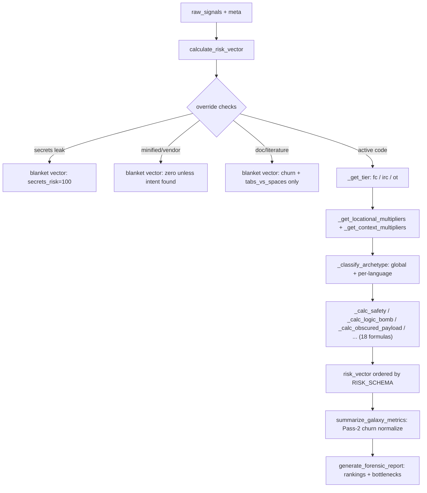

# Signal Processor — counting heuristic hits into risk exposure scores

## Overview
[`SignalProcessor`](../catalog/gitgalaxy/metrics/signal_processor.md#SignalProcessor) is Phase 4 of
GitGalaxy's blAST pipeline — the module that turns the purely lexical evidence the earlier
regex/heuristic stages collected (a per-file counter of how many times each of the ~60
[`SIGNAL_SCHEMA`](../catalog/gitgalaxy/metrics/signal_processor.md#SignalProcessor.SIGNAL_SCHEMA)
categories fired) into the 18-dimension
[`RISK_SCHEMA`](../catalog/gitgalaxy/metrics/signal_processor.md#SignalProcessor.RISK_SCHEMA) of
"exposure" scores the product actually surfaces. Its own docstring states the job plainly:
"Converts raw logic counts and temporal telemetry into 'Exposure Vectors' and generates
high-fidelity forensic reports identifying structural risks." There is no dataflow analysis, no
type inference, and no AST underneath any of it — every risk score is a hand-tuned formula over
signal *counts*, density-normalized by lines of code, squeezed through a sigmoid, and adjusted by
path/ecosystem/archetype multipliers. This is the concrete answer to "what do you do with a
heuristic-only graph": you don't infer meaning, you count keyword-shaped evidence and calibrate
the arithmetic until it correlates with real risk well enough in aggregate — the tradeoff the
survey's blAST control-group axis is built to expose.

## Diagram

## Design rationale (why it's built this way)
**Dynamic schema binding, not hardcoded offsets.** Both
[`SIGNAL_SCHEMA`](../catalog/gitgalaxy/metrics/signal_processor.md#SignalProcessor.SIGNAL_SCHEMA)
and [`RISK_SCHEMA`](../catalog/gitgalaxy/metrics/signal_processor.md#SignalProcessor.RISK_SCHEMA)
are pulled at class-definition time from
[`RECORDING_SCHEMAS`](../catalog/gitgalaxy/standards/analysis_lens.md#RECORDING_SCHEMAS), and every
vector write in [`calculate_risk_vector`](../catalog/gitgalaxy/metrics/signal_processor.md#SignalProcessor.calculate_risk_vector)
looks up its index with `self.RISK_SCHEMA.index(name)` rather than a literal integer — the class
docstring calls this out directly: "Flexible Risk Schema: Vector indexing is dynamic, preventing
offset bugs." Adding or reordering a risk dimension in config never silently shifts an existing
score into the wrong slot.

**Sigmoid armor.** Nearly every `_calc_*` formula (e.g.
[`_calc_safety`](../catalog/gitgalaxy/metrics/signal_processor.md#SignalProcessor._calc_safety),
[`_calc_logic_bomb`](../catalog/gitgalaxy/metrics/signal_processor.md#SignalProcessor._calc_logic_bomb),
[`_calc_injection_surface`](../catalog/gitgalaxy/metrics/signal_processor.md#SignalProcessor._calc_injection_surface))
wraps its final `100/(1+e^-slope*(density-threshold))` squash in `try/except OverflowError`,
returning a hard 0/100 instead of crashing when a pathological file (huge signal count, tiny LOC)
overflows `math.exp`. The class docstring names this "Sigmoid Armor... guarantees survival on
extreme file densities" — a defensive necessity precisely because the inputs are raw counts with
no upper bound, unlike a bounded ML confidence score.

**Co-occurrence gating as false-positive suppression.** A pure regex/keyword counter over-fires on
legitimate code: reflection in ordinary metaprogramming, high entropy in cryptography, dynamic
execution in agent frameworks. Rather than trust each signal alone,
[`_calc_obscured_payload`](../catalog/gitgalaxy/metrics/signal_processor.md#SignalProcessor._calc_obscured_payload)
splits its inputs into an "obfuscation" bucket and an "intent" bucket and *dampens the score by
95%/90%* when only one bucket has hits and mode isn't paranoid — the heuristic effectively demands
two independent kinds of evidence agree before it trusts a threat is real.
[`_calc_logic_bomb`](../catalog/gitgalaxy/metrics/signal_processor.md#SignalProcessor._calc_logic_bomb)
and [`_calc_injection_surface`](../catalog/gitgalaxy/metrics/signal_processor.md#SignalProcessor._calc_injection_surface)
apply a related but simpler single-sided gate instead: absent a smaller corroborating "explicit
threats" signal (dead-code/reflection hits for the former, IO/high-risk-execution hits for the
latter) and with no confirmed taint, each cuts its own already-computed mass by a flat factor — 95%
for `_calc_logic_bomb`, 90% for `_calc_injection_surface` — rather than comparing two named buckets
against each other. On top of that,
`_calc_obscured_payload` divides by a `science_dampener` when `scientific` signals are present, and
`_calc_logic_bomb` divides by an `agent_dampener` that grows with `scientific`/`llm_orchestrator`/
`llm_local_compute` hits and a `hardware_dampener` for `hardware_bridge` hits — named "shields" that
forgive domains known to look suspicious to a keyword scanner without actually being so.

**Three override lanes bypass the math entirely.** Before any density/sigmoid computation runs,
[`calculate_risk_vector`](../catalog/gitgalaxy/metrics/signal_processor.md#SignalProcessor.calculate_risk_vector)
short-circuits for (1) a confirmed secrets leak — spiking `secrets_risk` to 100, filling in churn
from the file's raw churn frequency, and zeroing every other dimension, (2) a minified/vendor asset —
zeroing risk (including churn) unless malicious *intent* signals
(`sec_high_risk_execution`/`sec_io`/`sec_safety_bypasses`) are present in the obfuscated blob, and
(3) pure documentation/plaintext — filling in churn the same way as the secrets lane, setting a
neutral 50 for `tabs_vs_spaces`, and zeroing everything else. These asset classes don't behave
like source code, so running the weighted-density math on them would just add noise.

**Per-language "trust tiers" instead of understanding a type system.** Rather than reasoning about
whether a language is actually statically checked,
[`_get_tier`](../catalog/gitgalaxy/metrics/signal_processor.md#SignalProcessor._get_tier)
sorts languages into three flat buckets and
[`TIER_VARS`](../catalog/gitgalaxy/metrics/signal_processor.md#SignalProcessor.TIER_VARS) hands each
tier a defense credit (`fc`) and a flat implicit-risk baseline (`irc`) — tier3 (everything not
explicitly listed as tier1/tier2) starts every safety/cognitive-load/tech-debt calculation with an
`irc` penalty baked directly into the formula, a blunt mistrust-by-default proxy for "we don't have
a heuristic profile for this language" rather than any real semantic judgment.

**Archetype "classification" is nearest-centroid distance, not learned inference at runtime.**
[`_classify_archetype`](../catalog/gitgalaxy/metrics/signal_processor.md#SignalProcessor._classify_archetype)
computes plain Euclidean distance between a z-scored, log-transformed signal-density vector and a
dictionary of named centroids
([`GLOBAL_ARCHETYPES`](../catalog/gitgalaxy/metrics/signal_processor.md#SignalProcessor.GLOBAL_ARCHETYPES),
or a per-language one from
[`LANGUAGE_INFERENCE_MODELS`](../catalog/gitgalaxy/metrics/signal_processor.md#SignalProcessor.LANGUAGE_INFERENCE_MODELS)),
scaled with
[`SCALER_MEDIANS`](../catalog/gitgalaxy/metrics/signal_processor.md#SignalProcessor.SCALER_MEDIANS)/
[`SCALER_IQRS`](../catalog/gitgalaxy/metrics/signal_processor.md#SignalProcessor.SCALER_IQRS). The
`__init__` comment block literally reads "🧠 FETCH PRE-TRAINED INFERENCE MODELS (Global & Local)" —
these are static lookup tables baked into config, not something computed from this run's data.
Labels like "God Function" or "Data Router" sound semantic but are just nearest-neighbor matches
against precomputed centroids.
> [!inferred] The naming (`SCALER_MEDIANS`/`SCALER_IQRS`/keys like `ARCHETYPES_K9`) strongly
> suggests these centroids were produced offline by a scikit-learn-style K-Means + robust-scaler
> pipeline, but the training code itself is not in this packet's subgraph, so that's an inference
> from naming convention, not a cited fact.
> [!inferred] The same Euclidean nearest-centroid math is re-implemented inline inside
> [`calculate_risk_vector`](../catalog/gitgalaxy/metrics/signal_processor.md#SignalProcessor.calculate_risk_vector)
> for per-*function* archetype classification, rather than calling
> [`_classify_archetype`](../catalog/gitgalaxy/metrics/signal_processor.md#SignalProcessor._classify_archetype)
> a second time — a duplication a reader tracing the file-level path would not expect.

## Entry points
- [`calculate_risk_vector`](../catalog/gitgalaxy/metrics/signal_processor.md#SignalProcessor.calculate_risk_vector) —
  the per-file entry point; called once per parsed file with that file's `meta` dict and its raw
  heuristic hit counts, returning the file's `risk_vector`, `hit_vector`, `file_impact`, and
  `telemetry` payload.
- [`processor`](../catalog/gitgalaxy/galaxyscope.md#Orchestrator.processor) — where the Orchestrator
  constructs the single `SignalProcessor` instance (`self.processor = SignalProcessor(...)`) used
  for the whole run.
- [`_init_worker`](../catalog/gitgalaxy/galaxyscope.md#_init_worker) /
  [`_process_file_worker`](../catalog/gitgalaxy/galaxyscope.md#_process_file_worker) — each
  multiprocessing worker warms its own detector/`SignalProcessor` state inside isolated process
  memory (the worker docstring explains this avoids pickling compiled regex objects across the IPC
  boundary), then reaches signal processing per file from that isolated state.
- [`summarize_galaxy_metrics`](../catalog/gitgalaxy/metrics/signal_processor.md#SignalProcessor.summarize_galaxy_metrics) —
  the whole-repository Pass-2 synthesis, invoked once after every file has been scored.
- [`generate_forensic_report`](../catalog/gitgalaxy/metrics/signal_processor.md#SignalProcessor.generate_forensic_report) —
  a post-hoc ranking/reporting pass over the already-scored file set.

## Mechanism (step-by-step)
1. **Three bypass lanes short-circuit before any math runs.** Inside
   [`calculate_risk_vector`](../catalog/gitgalaxy/metrics/signal_processor.md#SignalProcessor.calculate_risk_vector),
   a confirmed secrets leak, a minified/vendor blob, or a file whose `lang_id` is in
   [`asset_masks`](../catalog/gitgalaxy/metrics/signal_processor.md#SignalProcessor.asset_masks)'s
   documentation-language set each return a hand-built "blanket" risk vector instead of falling
   through to the density math — the secrets and documentation lanes still compute
   [`_calc_raw_temporal_signals`](../catalog/gitgalaxy/metrics/signal_processor.md#SignalProcessor._calc_raw_temporal_signals)
   for churn, so a leaked-and-still-being-edited secret (or a changelog still being updated) is
   visibly "hot"; the minified/vendor lane does not call it at all and leaves churn at 0.0 along
   with every other dimension unless malicious-intent signals are found in the obfuscated blob.
2. **Per-language tier and contextual multipliers are resolved before scoring.**
   [`_get_tier`](../catalog/gitgalaxy/metrics/signal_processor.md#SignalProcessor._get_tier) picks the
   file's `fc`/`irc`/`ot` profile from
   [`TIER_VARS`](../catalog/gitgalaxy/metrics/signal_processor.md#SignalProcessor.TIER_VARS);
   [`_get_locational_multipliers`](../catalog/gitgalaxy/metrics/signal_processor.md#SignalProcessor._get_locational_multipliers)
   matches the file's path against
   [`path_modifiers`](../catalog/gitgalaxy/metrics/signal_processor.md#SignalProcessor.path_modifiers)
   regex/multiplier pairs (e.g. tests get a different testing-exposure weight); and
   [`_get_context_multipliers`](../catalog/gitgalaxy/metrics/signal_processor.md#SignalProcessor._get_context_multipliers)
   compares the file's language ecosystem to its containing folder's dominant language, using
   [`ECOSYSTEMS`](../catalog/gitgalaxy/metrics/signal_processor.md#SignalProcessor.ECOSYSTEMS)/
   [`NATIVE_WEIGHTS`](../catalog/gitgalaxy/metrics/signal_processor.md#SignalProcessor.NATIVE_WEIGHTS)/
   [`ECOSYSTEM_MISMATCH_WEIGHTS`](../catalog/gitgalaxy/metrics/signal_processor.md#SignalProcessor.ECOSYSTEM_MISMATCH_WEIGHTS)
   to penalize an "alien" file embedded in a foreign directory (its debug log literally reads "🚨
   CONTEXTUAL MISMATCH DETECTED").
3. **The file is matched against precomputed archetype centroids twice** — once globally via
   [`_classify_archetype`](../catalog/gitgalaxy/metrics/signal_processor.md#SignalProcessor._classify_archetype)
   against [`GLOBAL_ARCHETYPES`](../catalog/gitgalaxy/metrics/signal_processor.md#SignalProcessor.GLOBAL_ARCHETYPES),
   and again against a per-language centroid set from
   [`LANGUAGE_INFERENCE_MODELS`](../catalog/gitgalaxy/metrics/signal_processor.md#SignalProcessor.LANGUAGE_INFERENCE_MODELS)
   when one exists for the file's `lang_id` — producing an archetype label and a "drift" distance
   used later as a contextual-anomaly multiplier.
4. **Eighteen independent `_calc_*` formulas produce the ordered exposure vector.** Each follows the
   same attack-minus-defense shape: weighted raw-signal counts feed a density (normalized by LOC,
   usually with a fixed padding constant to keep small files stable), squashed through
   [`_sigmoid`](../catalog/gitgalaxy/metrics/signal_processor.md#SignalProcessor._sigmoid) with a
   threshold/slope pulled from
   [`risk_tuning`](../catalog/gitgalaxy/metrics/signal_processor.md#SignalProcessor.risk_tuning)
   (`RISK_EQUATION_TUNING` in config — this is the "300+ tunable variables" surface), then multiplied
   by the path/ecosystem/archetype multipliers from steps 2–3. Representative examples:
   [`_calc_safety`](../catalog/gitgalaxy/metrics/signal_processor.md#SignalProcessor._calc_safety)
   (danger vs. guard-clause signals, with a hard "breach floor" once danger density crosses a
   threshold and still exceeds defense), and
   [`_calc_concurrency`](../catalog/gitgalaxy/metrics/signal_processor.md#SignalProcessor._calc_concurrency)
   (thread/async signals net of `sync_locks`, spiked by a `starvation_multiplier` when a
   concurrency-touching function is also recursive or high Big-O).
5. **Ownership and stability come from Chronometer's telemetry, not this module's own counting.**
   [`_calc_ownership_entropy`](../catalog/gitgalaxy/metrics/signal_processor.md#SignalProcessor._calc_ownership_entropy)
   (Shannon entropy over the per-file author-commit histogram) and
   [`_calculate_silo_risk`](../catalog/gitgalaxy/metrics/signal_processor.md#SignalProcessor._calculate_silo_risk)
   (the dominant author's share of commits) both consume the `authors` map that
   [`calculate_risk_vector`](../catalog/gitgalaxy/metrics/signal_processor.md#SignalProcessor.calculate_risk_vector)
   receives via `meta`, sourced from Chronometer's git-history scan (see
   [gitgalaxy-metrics-chronometer](gitgalaxy-metrics-chronometer.md)).
6. **Pass 2 rescales churn globally before it is trustworthy per-file.**
   [`_normalize_temporal_metrics`](../catalog/gitgalaxy/metrics/signal_processor.md#SignalProcessor._normalize_temporal_metrics)
   (invoked from
   [`summarize_galaxy_metrics`](../catalog/gitgalaxy/metrics/signal_processor.md#SignalProcessor.summarize_galaxy_metrics))
   first finds the batch's maximum raw churn frequency, then rescales every file's churn against a
   `log1p` curve of that maximum and injects the result directly into
   [`RISK_SCHEMA`](../catalog/gitgalaxy/metrics/signal_processor.md#SignalProcessor.RISK_SCHEMA)'s
   `churn` slot — this is why `calculate_risk_vector` leaves `"churn": 0.0` as a placeholder in its
   own `exposure_vector` and defers the real value to this second, whole-repo pass.
7. **`generate_forensic_report` ranks, but does not itself compute, systemic risk.** It sorts files
   by a cumulative-risk sum (every `RISK_SCHEMA` dimension except `tabs_vs_spaces`, via
   [`RISK_SCHEMA`](../catalog/gitgalaxy/metrics/signal_processor.md#SignalProcessor.RISK_SCHEMA)) and
   multiplies each file's network-centrality metrics (betweenness/closeness/PageRank-style scores,
   computed upstream and outside this packet's subgraph) by a risk dimension — e.g. betweenness ×
   `state_flux` risk for a "cascading state mutation" bottleneck score — combining a topology signal
   with a heuristic risk signal rather than deriving either from scratch.

## Key data structures
- **`raw_signals`** — the input counter dict of heuristic hits per
  [`SIGNAL_SCHEMA`](../catalog/gitgalaxy/metrics/signal_processor.md#SignalProcessor.SIGNAL_SCHEMA)
  key; the sole evidence every risk formula operates on.
- **[`RISK_SCHEMA`](../catalog/gitgalaxy/metrics/signal_processor.md#SignalProcessor.RISK_SCHEMA) /
  [`SIGNAL_SCHEMA`](../catalog/gitgalaxy/metrics/signal_processor.md#SignalProcessor.SIGNAL_SCHEMA)** —
  ordered key lists whose *position* is the vector index everywhere else in the pipeline; both come
  from [`RECORDING_SCHEMAS`](../catalog/gitgalaxy/standards/analysis_lens.md#RECORDING_SCHEMAS).
- **[`risk_tuning`](../catalog/gitgalaxy/metrics/signal_processor.md#SignalProcessor.risk_tuning)** —
  the per-formula threshold/slope/weight dictionary; every `_calc_*` method reads its own named
  sub-dict from it with safe `.get(key, default)` fallbacks, so config can override any single
  formula's calibration without touching code.
- **[`GLOBAL_ARCHETYPES`](../catalog/gitgalaxy/metrics/signal_processor.md#SignalProcessor.GLOBAL_ARCHETYPES) /
  [`LANGUAGE_INFERENCE_MODELS`](../catalog/gitgalaxy/metrics/signal_processor.md#SignalProcessor.LANGUAGE_INFERENCE_MODELS) /
  [`CONTEXT_VIOLATION_MATRIX`](../catalog/gitgalaxy/metrics/signal_processor.md#SignalProcessor.CONTEXT_VIOLATION_MATRIX)** —
  the offline-computed lookup tables that stand in for "ML" and "context-aware" risk: nearest-centroid
  distance and per-archetype multiplier lookups, never live model inference.
- **`exposure_vector` / `risk_vector_ordered`** — the intermediate dict and final list of 18 floats
  (0–100) that [`calculate_risk_vector`](../catalog/gitgalaxy/metrics/signal_processor.md#SignalProcessor.calculate_risk_vector)
  returns per file.

## Dynamics (design intent)
Each multiprocessing worker warms its own `SignalProcessor`-adjacent state inside isolated process
memory rather than sharing one instance across processes — the docstring on
[`_init_worker`](../catalog/gitgalaxy/galaxyscope.md#_init_worker) explains this is deliberate: the
GIL prevents true multi-threading for this CPU-bound work, so GitGalaxy spawns separate OS processes,
and doing the heavy setup inside each child's own memory avoids trying to pickle compiled regex
matrices across the IPC boundary. Per-file scoring inside
[`calculate_risk_vector`](../catalog/gitgalaxy/metrics/signal_processor.md#SignalProcessor.calculate_risk_vector)
is wrapped in a blanket `try/except Exception` that logs a "Catastrophic structural failure" and
returns a zeroed vector rather than aborting the whole run — one malformed file's `meta` cannot take
down the batch. [`test_fallback_does_not_crash_signal_processor`](../catalog/tests/core_engine/test_zero_dependency.md#TestZeroDependencyMode.test_fallback_does_not_crash_signal_processor)
further proves that
[`summarize_galaxy_metrics`](../catalog/gitgalaxy/metrics/signal_processor.md#SignalProcessor.summarize_galaxy_metrics)
and [`generate_forensic_report`](../catalog/gitgalaxy/metrics/signal_processor.md#SignalProcessor.generate_forensic_report)
both survive `None`-valued network metrics when the optional `networkx` dependency is absent
("Zero-Dependency Mode"), a design intent consistent with the blAST engine's zero-dependency pitch.

## Edge cases
- [`test_signal_processor_standalone_init_and_silo`](../catalog/tests/core_engine/test_signal_processor.md#test_signal_processor_standalone_init_and_silo)
  proves the processor initializes cleanly with no `parent_logger`, and that
  [`_calculate_silo_risk`](../catalog/gitgalaxy/metrics/signal_processor.md#SignalProcessor._calculate_silo_risk)
  returns `0.0` rather than dividing by zero when every author has 0 commits.
- Every sigmoid call site is guarded against `OverflowError` (e.g.
  [`_calc_state_flux`](../catalog/gitgalaxy/metrics/signal_processor.md#SignalProcessor._calc_state_flux)
  via [`_sigmoid`](../catalog/gitgalaxy/metrics/signal_processor.md#SignalProcessor._sigmoid)), so an
  extreme signal density degrades to a hard 0/100 instead of crashing the worker.
- A confirmed `sec_tainted_injection` hit inside
  [`_calc_logic_bomb`](../catalog/gitgalaxy/metrics/signal_processor.md#SignalProcessor._calc_logic_bomb)
  and [`_calc_injection_surface`](../catalog/gitgalaxy/metrics/signal_processor.md#SignalProcessor._calc_injection_surface)
  adds a flat `+500` mass spike that overwhelms every other dampener, including the paranoid-mode
  gate — a confirmed taint signal from upstream is treated as absolute, unlike every other soft signal.
  > [!inferred] Where that taint-confirmation signal itself comes from (a comment elsewhere in the
  > codebase references an "LHS Slicer") is not in this packet's subgraph, so it cannot be cited here.
- Reading the pinned commit directly: `calculate_risk_vector`'s critical-secrets override calls
  `getattr(config, "APERTURE_CONFIG", {})` where `config` is the imported
  `gitgalaxy.standards.analysis_lens` module — and `analysis_lens.py` defines no top-level
  `APERTURE_CONFIG` of its own. That `getattr` therefore always resolves to the empty-dict fallback,
  so the extension/exact-filename branch of that override can never fire from this module; only the
  `aperture_reason` marker already stamped onto `meta` by an earlier phase (which does read the real
  `APERTURE_CONFIG` defined in `gitgalaxy_config.py` — see
  [gitgalaxy-standards-gitgalaxy_config](gitgalaxy-standards-gitgalaxy_config.md), whose own
  `APERTURE_CONFIG` symbol is not part of this packet's subgraph) can trigger it in practice.

## Open questions
- The exact contents of
  [`CONTEXT_VIOLATION_MATRIX`](../catalog/gitgalaxy/metrics/signal_processor.md#SignalProcessor.CONTEXT_VIOLATION_MATRIX)
  (the per-archetype multiplier table) aren't shown in this packet's source excerpts — only that it's
  looked up per-formula.
- Where [`GLOBAL_ARCHETYPES`](../catalog/gitgalaxy/metrics/signal_processor.md#SignalProcessor.GLOBAL_ARCHETYPES),
  the per-language models, and the repo-level clustering model referenced in
  [`summarize_galaxy_metrics`](../catalog/gitgalaxy/metrics/signal_processor.md#SignalProcessor.summarize_galaxy_metrics)
  are actually trained/computed is outside this packet (likely inside the much larger
  `standards/analysis_lens.py`, not in this subgraph).

## See also
- [gitgalaxy-metrics-chronometer](gitgalaxy-metrics-chronometer.md) — the source of the
  `temporal_telemetry`/`authors` data this module's stability, churn, and ownership formulas consume.
- [gitgalaxy-standards-gitgalaxy_config](gitgalaxy-standards-gitgalaxy_config.md) — the tunable-config
  module whose `APERTURE_CONFIG` this module's own secrets-override lookup does *not* actually reach.
