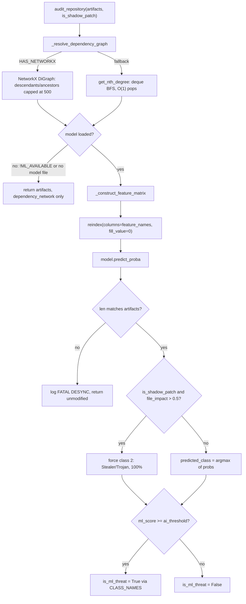

# SecurityAuditor — the one ML classifier in an otherwise AST-free, LLM-free engine

## Overview
Everywhere else in gitgalaxy, "no AST, no LLM" is a hard architectural line — structure comes
from regex sequencing over raw text. [`SecurityAuditor`](../catalog/gitgalaxy/security/security_auditor.md#SecurityAuditor)
is the one place that line is deliberately crossed: its own docstring calls it a
"Machine Learning Threat Inference Engine," and [`audit_repository`](../catalog/gitgalaxy/security/security_auditor.md#SecurityAuditor.audit_repository)
feeds a multi-class **XGBoost** classifier with features built primarily from the heuristic
signal counts the rest of the engine already produced, fused with dependency-graph topology
computed in this same class and per-file telemetry (ownership/authorship entropy, complexity,
ecosystem-cluster distance) the earlier pipeline phases produced — the class's own docstring
calls this "fused structural and topological context." So it isn't a second, independent
detector — it's a supervised model bolted *on top of* the regex/heuristic output, trained to
recognize the combined shape of "malware-like" structural and topological signatures rather
than any single regex hit. Two design habits carry over from the rest of gitgalaxy even here:
every dependency on an external library is optional and gracefully degrades
([`ML_AVAILABLE`](../catalog/gitgalaxy/security/security_auditor.md#ML_AVAILABLE),
[`HAS_NETWORKX`](../catalog/gitgalaxy/security/security_auditor.md#HAS_NETWORKX)), and the model
is never trusted unconditionally — a hard-coded override can still out-vote it.

## Diagram

## Design rationale (why it's built this way)
**The dependency graph always runs; the model is optional.** [`audit_repository`](../catalog/gitgalaxy/security/security_auditor.md#SecurityAuditor.audit_repository)
calls [`_resolve_dependency_graph`](../catalog/gitgalaxy/security/security_auditor.md#SecurityAuditor._resolve_dependency_graph)
unconditionally, before ever checking whether a model is loaded — "Downstream Exposure" is
useful on its own (it's a topology fact, not an inference), so it's computed even in
zero-dependency mode. Only after that does the method check `if not self.model`, and if there
is none it logs and returns the artifacts already enriched with `dependency_network` but
untouched by ML. This means the same call always returns *something* usable, with graceful
feature loss rather than an exception, whether xgboost is installed, whether a model file
exists, or whether the repo has zero artifacts.

**Two graph engines for one calculation.** [`_resolve_dependency_graph`](../catalog/gitgalaxy/security/security_auditor.md#SecurityAuditor._resolve_dependency_graph)
builds an `nx.DiGraph` from each artifact's `raw_imports` when [`HAS_NETWORKX`](../catalog/gitgalaxy/security/security_auditor.md#HAS_NETWORKX)
is true, capping `nx.descendants`/`nx.ancestors` at 500 nodes "to prevent OOM/Stalls on massive
circular monoliths" (comment in source); when NetworkX is absent it falls back to
[`get_nth_degree`](../catalog/gitgalaxy/security/security_auditor.md#SecurityAuditor.get_nth_degree),
a hand-rolled BFS whose docstring is explicit about the optimization: "BFS using
collections.deque for O(1) popping" — a plain list-based queue would be O(n) per pop from the
front, which matters once a monolith has tens of thousands of files. Both paths are tuned to
the same 500-node ceiling and the same tests
(`test_dependency_graph_networkx`, `test_dependency_graph_pure_python`) assert they agree on a
circular-loop fixture, so "NetworkX installed or not" is an implementation detail invisible to
callers.

**Feature engineering has to exactly replay training-time feature engineering.**
[`_construct_feature_matrix`](../catalog/gitgalaxy/security/security_auditor.md#SecurityAuditor._construct_feature_matrix)'s
docstring says it plainly: "Reconstructs the Pandas DataFrame exactly as train_threat_model.py
did." It takes the raw `hit_vector` (a [`SIGNAL_SCHEMA`](../catalog/gitgalaxy/security/security_auditor.md#SecurityAuditor.SIGNAL_SCHEMA)-ordered
count array — the same heuristic hits the regex layer produced), reconstitutes it into named
counts, applies `log1p` transforms and per-LOC density ratios, and one-hot encodes `language`.
Immediately after `_construct_feature_matrix` returns, `audit_repository` applies the actual
safety net itself: `reindex(columns=self.feature_names, fill_value=0)` against
[`feature_names`](../catalog/gitgalaxy/security/security_auditor.md#SecurityAuditor.feature_names)
(the model's own `feature_names_in_`, captured at load time). That reindex is what lets the
live schema drift (a new hit type added upstream, or a language never seen in training) without
ever handing XGBoost a column it wasn't trained on, or missing one it expects.

**The model doesn't get the last word.** Even after a confident prediction,
`audit_repository` can override it: if `is_shadow_patch` is set and an artifact's
`file_impact` exceeds 0.5, the predicted class is forced to 2 ("Stealer / Trojan") at 100%
confidence regardless of what the classifier said, and a `"SHADOW PATCH: Hash mutated without
version bump!"` alert is stamped into the artifact's telemetry. A file whose content hash
changed without its declared version changing is a much stronger tamper signal than any
learned structural pattern, so the code hard-gates on it rather than trusting the model to
have learned that signal implicitly — `test_audit_repository_ml_inference` exercises exactly
this override path.

## Entry points
- [`audit_repository`](../catalog/gitgalaxy/security/security_auditor.md#SecurityAuditor.audit_repository) —
  the sole public surface. Every caller hands it the full artifact list (each a dict carrying
  `telemetry`, `raw_imports`, `hit_vector`, etc.) and gets it back enriched with
  `dependency_network` and, when a model is available, `is_ml_threat`/`AI Threat Class`.
- [`execute_pipeline`](../catalog/gitgalaxy/galaxyscope.md#Orchestrator.execute_pipeline) —
  the full-repository path. Its own docstring lays out why phase order matters here: "Network
  Topology (Phase 4) is required before XGBoost Inference (Phase 9) since a file's centrality
  influences its logic bomb threat weighting" — by the time `audit_repository` runs, the
  artifacts already carry the centrality metrics the feature matrix reads.
- [`execute_incremental_scan`](../catalog/gitgalaxy/galaxyscope.md#Orchestrator.execute_incremental_scan) —
  the CI/CD delta path: "Instead of re-scanning a 10,000-file repository for a 2-file PR," it
  reloads prior state from `ram_cache`/SQLite, evicts deleted/modified entries, and re-runs
  `audit_repository` only after recomputing the affected slice — the auditor itself is
  identical in both call sites; only how much surrounding state gets rebuilt differs.
- [`model_auditor`](../catalog/gitgalaxy/galaxyscope.md#Orchestrator.model_auditor) — the
  Orchestrator's owned `SecurityAuditor` instance, constructed once with
  `model_path="gitgalaxy_malware_xgb_multiclass.json"` and shared across both entry points
  above.

## Mechanism (step-by-step)
1. [`audit_repository`](../catalog/gitgalaxy/security/security_auditor.md#SecurityAuditor.audit_repository)
   short-circuits on an empty artifact list, then unconditionally resolves the transitive
   dependency graph via [`_resolve_dependency_graph`](../catalog/gitgalaxy/security/security_auditor.md#SecurityAuditor._resolve_dependency_graph),
   wrapping it in a try/except so a "Catastrophic failure during dependency graph resolution"
   never aborts the whole audit — it just logs and continues with whatever graph state exists.
2. If no model was loaded (checked directly against the
   [`model`](../catalog/gitgalaxy/security/security_auditor.md#SecurityAuditor.model) field), the
   method logs "Skipping ML Threat Inference (Model not loaded)" and returns immediately — the
   `dependency_network` enrichment from step 1 is still present, so downstream consumers never
   see a partially-shaped artifact.
3. [`_construct_feature_matrix`](../catalog/gitgalaxy/security/security_auditor.md#SecurityAuditor._construct_feature_matrix)
   turns every artifact into one row keyed off `self.SIGNAL_SCHEMA` (loaded once from
   [`RECORDING_SCHEMAS`](../catalog/gitgalaxy/standards/analysis_lens.md#RECORDING_SCHEMAS) at
   construction time) — density ratios are computed against a `safe_denom` floor of 1 to avoid
   division-by-zero on trivial files, and a fixed `exclusion_list` strips signals the training
   pipeline deliberately excluded (e.g. `hit_structural_tab_indentations`) as noise. Any
   per-artifact exception falls back to a single safe `{"language": "unknown", "structural_mass":
   0.0}` row rather than dropping the artifact from the matrix entirely.
4. The matrix is reindexed to [`feature_names`](../catalog/gitgalaxy/security/security_auditor.md#SecurityAuditor.feature_names)
   and sanitized (`inf`/`NaN` → 0) before `predict_proba` runs; a row-count mismatch between the
   model's output and the input artifacts is treated as fatal and aborts injection with a
   logged error rather than silently misaligning predictions to the wrong files.
5. For each artifact, the class with the highest probability is compared against
   [`ai_threshold`](../catalog/gitgalaxy/security/security_auditor.md#SecurityAuditor.ai_threshold)
   (seeded from `AI_THREAT_THRESHOLD`, 90.0) — only a confident, non-"Safe Code" prediction sets
   `is_ml_threat = True` and records the human-readable label from
   [`CLASS_NAMES`](../catalog/gitgalaxy/security/security_auditor.md#SecurityAuditor.CLASS_NAMES).
   The Shadow Patch override (Design rationale) is applied just before this threshold check, so
   it always wins regardless of the model's own confidence.

## Key data structures
- **`artifact` dict (in place).** Not owned by this class, but mutated by it: gains
  `dependency_network` (`direct_upstream`/`direct_downstream`/`total_upstream`/`total_downstream`
  plus ratios) from every call, and `is_ml_threat` plus a `telemetry.domain_context` entry
  (`AI Threat Class`, `AI Threat Confidence`, or the shadow-patch `alert`) only when a model
  ran.
- [`SIGNAL_SCHEMA`](../catalog/gitgalaxy/security/security_auditor.md#SecurityAuditor.SIGNAL_SCHEMA) —
  the ordered name list that turns a positional `hit_vector` back into named heuristic counts;
  it is the join key between the regex layer's output and the ML layer's input.
- [`CLASS_NAMES`](../catalog/gitgalaxy/security/security_auditor.md#SecurityAuditor.CLASS_NAMES) —
  the fixed 5-way taxonomy (`Safe Code`, `Botnet / DDoS`, `Stealer / Trojan`, `Dropper /
  Webshell`, `Native Infector`) the multiclass model was trained against.
- [`feature_names`](../catalog/gitgalaxy/security/security_auditor.md#SecurityAuditor.feature_names) —
  captured from the loaded model's `feature_names_in_`; the single source of truth for what
  columns `_construct_feature_matrix`'s output must be reindexed to.

## Dynamics (design intent)
`test_audit_repository_empty_state` proves an empty repository returns `[]` immediately,
without touching the model or the graph resolver. `test_fallback_does_not_crash_security_auditor`
patches `ML_AVAILABLE` to `False` and asserts the dependency-graph half of the pipeline "STILL
worked" while ML is silently skipped — confirming the two halves of `audit_repository` are
independently resilient. `test_audit_repository_fatal_desync` proves a model that returns the
wrong number of prediction rows is treated as a hard abort (`"is_ml_threat" not in
audited_artifacts[0]`) rather than a best-effort partial injection — the code accepts "no
answer" over a misaligned one.

## Edge cases
- **Model file missing or corrupted.** `SecurityAuditor.__init__` checks a local path then a
  shared `utilities/` path; if neither resolves, or `feature_names_in_` comes back empty, it
  logs and leaves `model = None` rather than raising — `test_audit_repository_no_model` and the
  "feature names are empty" branch both exercise this.
- **Empty feature matrix.** If `_construct_feature_matrix` returns an empty DataFrame (e.g. all
  artifacts hit the exception fallback), inference is skipped with a warning rather than calling
  `predict_proba` on nothing.
- **Threshold gating is strict, not "best guess."** `test_audit_repository_threshold_gating`
  shows an 85%-confidence Botnet prediction is *not* flagged when `ai_threshold` is 90 — a
  near-miss is treated identically to "Safe Code."
- **`SIGNAL_SCHEMA` empty at construction.** Logged as critical ("ML feature extraction will
  fail") but does not raise — the auditor still constructs and still runs the dependency-graph
  half.

## Open questions
- The exact mechanism that computes `is_shadow_patch`/the hash-mutation signal
  `execute_pipeline` passes in (`SHADOW_PATCH_DETECTED`) lives outside this packet's subgraph;
  only its consumption inside `audit_repository` is grounded here.
- Why the dependency graph is recomputed here via `_resolve_dependency_graph` rather than reusing
  the Orchestrator's own network-topology pass (Phase 4, ahead of this Phase 9 call in
  `execute_pipeline`) isn't answered by anything in this subgraph — the two graphs are built
  from the same `raw_imports` data independently.
- Provenance of the trained `gitgalaxy_malware_xgb_multiclass.json` model (training corpus,
  label sourcing) is outside this packet.

## See also
- [SecurityLens](gitgalaxy-security-security_lens.md) — the regex/entropy layer whose
  `sec_*`-prefixed hit counts are among the inputs this auditor's feature matrix reconstructs.
- [GalaxyScope orchestrator](gitgalaxy-galaxyscope.md) — owns `model_auditor` and sequences
  `execute_pipeline`'s phases so network topology precedes ML inference.
