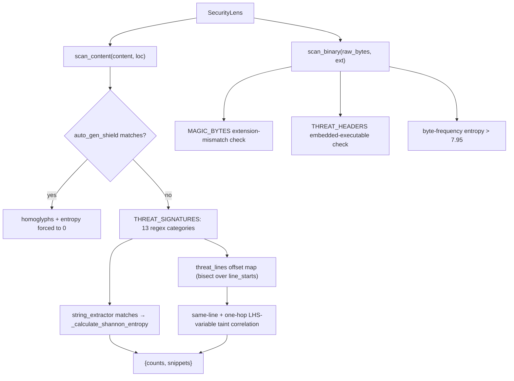

# SecurityLens — regex/entropy SAST, the security half of the same no-AST bet

## Overview
[`SecurityLens`](../catalog/gitgalaxy/security/security_lens.md#SecurityLens) is gitgalaxy's
Static Application Security Testing engine, and it makes the exact same architectural bet the
rest of the project's comprehension layer makes: no parser, no model, just regexes over raw
text, correlated by line proximity. Its docstring names the three techniques directly —
"Regex Signatures, Shannon Entropy, and Data Flow Taint" — and all three are textual heuristics,
not static-analysis primitives. [`scan_content`](../catalog/gitgalaxy/security/security_lens.md#SecurityLens.scan_content)
runs [`THREAT_SIGNATURES`](../catalog/gitgalaxy/security/security_lens.md#SecurityLens.THREAT_SIGNATURES)
(13 named regex categories) against a file's source text, flags high-entropy string literals as
likely-encoded payloads, and does a best-effort single-file "taint" correlation by watching which
threat categories land on the same or a shared-variable line — no dataflow graph, just line
adjacency and naive left-hand-side variable extraction. [`scan_binary`](../catalog/gitgalaxy/security/security_lens.md#SecurityLens.scan_binary)
is a second, unrelated code path for files that never get decoded as text at all: magic-byte and
embedded-header checks plus raw byte-frequency entropy.

## Diagram

## Design rationale (why it's built this way)
**ReDoS defense is layered, not a single guard.** [`string_extractor`](../catalog/gitgalaxy/security/security_lens.md#SecurityLens.string_extractor)
is compiled as `r'(["\'])([^\n]{64,1024}?)\1'` — a bounded, non-greedy pattern — with a comment
explaining exactly why: "to prevent catastrophic backtracking on minified files." `scan_content`
adds a second layer on top: it pre-filters to `safe_lines` (lines under 250 characters) before
building `safe_content`, the string most of the signature scan and all of the entropy scan run
against — so the raw `content` is only used for the initial `regex.findall` count, while snippet
extraction and taint correlation run against a version that already excludes the pathological
long lines a minified or generated file would contain.

**Machine-generated files get a carve-out, not a skip.** [`auto_gen_shield`](../catalog/gitgalaxy/security/security_lens.md#SecurityLens.auto_gen_shield)
matches markers like `@generated`, `DO NOT EDIT`, or "generated by swagger" in just the first
2000 characters. When it matches, `scan_content` doesn't turn off scanning entirely — it
specifically zeroes the `homoglyphs` category (the only one of the 13
[`THREAT_SIGNATURES`](../catalog/gitgalaxy/security/security_lens.md#SecurityLens.THREAT_SIGNATURES)
entries it skips, leaving the other twelve active) and the separate entropy pass — the two
checks that produce the most false positives on generated code: non-ASCII identifiers in
generated bindings, and high-entropy encoded blobs in generated fixtures. The same flag also
disables taint-line tracking, since a generated file's control flow isn't attacker-authored.

**The "taint" pass is a performance-conscious approximation, not a dataflow analysis.**
`scan_content` only records a match's exact line index (via `bisect.bisect_right` over a
precomputed `line_starts` offset table — an O(1)-per-match lookup) for four specifically
dangerous categories: `io`, `high_risk_execution`, `llm_hooks`, `db_hooks`. Everything else is
just counted. The correlation step then only walks lines that already triggered one of those
four categories, and gates the whole exercise behind a cheap boolean check
(`has_global_io or has_global_llm`, and one of `has_global_danger`/`has_global_llm`/`has_global_db`)
before doing any per-line work — a file with no I/O and no LLM calls never pays for the taint
loop at all. The variable-extraction step itself is a plain regex over the line's left-hand side
with a hardcoded stopword set (`const`, `let`, `var`, `def`, …) — it will both over- and
under-match compared to a real dataflow graph, but it needs no parser for any of the 50+
languages this scans.

**Callers specialize the engine by narrowing its signature set, not by subclassing it.**
Every `main` in the subgraph constructs a full [`SecurityLens`](../catalog/gitgalaxy/security/security_lens.md#SecurityLens)
and then reassigns `security.THREAT_SIGNATURES` to a curated subset before scanning — the
secrets scanner's `main` (`vault_sentinel.py`) keeps only `hardcoded_secrets` and `dead_code`;
the binary-anomaly detector's `main` keeps only `reflection_metaprogramming` and `bitwise_ops`,
with the comment spelling out why: "disabling the heavy AST and regex processors used for
source code... minimize CPU overhead and prevent Catastrophic Backtracking on dense binary
data." One general-purpose engine, several narrow call sites, each paying only for the regex
compilation and matching it actually needs.

## Entry points
- [`SecurityLens`](../catalog/gitgalaxy/security/security_lens.md#SecurityLens) — constructed
  with an optional `policy` dict of density thresholds; every call site below builds its own
  instance (sometimes with `ThreatPolicy.get_policy("paranoid")`, sometimes with defaults).
- [`_init_worker`](../catalog/gitgalaxy/galaxyscope.md#_init_worker) — constructs a `SecurityLens`
  inside each isolated CPU-bound worker process. Its own docstring explains why isolation
  matters here at all: spawning separate OS processes "prevents the OS from attempting to
  pickle/serialize massive compiled regex objects across the IPC boundary" — `SecurityLens`'s
  compiled `THREAT_SIGNATURES` are exactly the kind of object that would be expensive or
  unsafe to pickle across a process boundary, so each worker builds its own.
- [`security_analyzer`](../catalog/gitgalaxy/galaxyscope.md#Orchestrator.security_analyzer) —
  the Orchestrator's own top-level instance, constructed with whichever `ThreatPolicy` profile
  (`paranoid` vs. `baseline`) the run was configured with.
- [`main`](../catalog/gitgalaxy/tools/supply_chain_security/vault_sentinel.md#main) (Secrets
  Scanner) — narrows `THREAT_SIGNATURES` to `hardcoded_secrets` + `dead_code` and walks the
  target tree calling into the lens per file.
- [`main`](../catalog/gitgalaxy/tools/supply_chain_security/binary_anomaly_detector.md#main) /
  [`run_xray_audit`](../catalog/gitgalaxy/tools/supply_chain_security/binary_anomaly_detector.md#run_xray_audit) —
  the CLI and programmatic (orchestrator-callable) forms of the same binary/entropy scan,
  narrowing signatures to `reflection_metaprogramming` + `bitwise_ops` and calling
  [`scan_binary`](../catalog/gitgalaxy/security/security_lens.md#SecurityLens.scan_binary) on
  file headers before falling through to `scan_content` on the decoded text.
- [`main`](../catalog/gitgalaxy/tools/compliance/sbom_generator.md#main) (SBOM Generator) — uses
  the full `paranoid` policy and `scan_content` while walking discovered package manifests.
- [`run_firewall_audit`](../catalog/gitgalaxy/tools/supply_chain_security/supply_chain_firewall.md#run_firewall_audit) —
  a "Zero-Disk I/O" entry point: its docstring says it "Operates exclusively on the
  pre-tokenized, anomaly-checked RAM graph from Phase 1," so it constructs a paranoid-policy
  `SecurityLens` to evaluate already-parsed import data rather than re-reading files from disk.

## Mechanism (step-by-step)
1. On construction, [`SecurityLens`](../catalog/gitgalaxy/security/security_lens.md#SecurityLens)
   compiles the [`THREAT_SIGNATURES`](../catalog/gitgalaxy/security/security_lens.md#SecurityLens.THREAT_SIGNATURES)
   dict once — 13 categories spanning obfuscation/encoding, SSL/safety bypasses, network I/O,
   dynamic-execution (RCE) vectors, prototype-pollution/global-state mutation, commented-out
   dangerous code, low-level bitwise/crypto math, steganographic imports, Unicode homoglyphs,
   hardcoded secrets/credentials, memory-corruption calls, LLM-hook usage, and raw DB sinks —
   plus the binary-only [`MAGIC_BYTES`](../catalog/gitgalaxy/security/security_lens.md#SecurityLens.MAGIC_BYTES)
   and [`THREAT_HEADERS`](../catalog/gitgalaxy/security/security_lens.md#SecurityLens.THREAT_HEADERS)
   tables used only by `scan_binary`.
2. [`scan_content`](../catalog/gitgalaxy/security/security_lens.md#SecurityLens.scan_content)
   first tests [`auto_gen_shield`](../catalog/gitgalaxy/security/security_lens.md#SecurityLens.auto_gen_shield)
   against the first 2000 characters, then runs every signature over the raw content for a
   count, and over the line-filtered `safe_content` for up to three example snippets each —
   while building the `threat_lines` offset index for the four taint-relevant categories in the
   same pass.
3. Entropy scanning (skipped entirely when auto-generated) extracts candidate string literals
   via [`string_extractor`](../catalog/gitgalaxy/security/security_lens.md#SecurityLens.string_extractor),
   filters to dense strings (fewer than 3 spaces — a cheap proxy for "not prose"), and runs
   [`_calculate_shannon_entropy`](../catalog/gitgalaxy/security/security_lens.md#SecurityLens._calculate_shannon_entropy)
   on each; anything above 4.8 bits/char counts as a likely base64/encrypted blob. The method's
   own comment documents a micro-optimization: the entropy formula's division is pulled outside
   the summation loop.
4. The taint pass, the last stage inside
   [`scan_content`](../catalog/gitgalaxy/security/security_lens.md#SecurityLens.scan_content),
   only engages if the file already has at least one `io`/`llm_hooks` hit *and* at least one of
   `high_risk_execution`/`llm_hooks`/`db_hooks` — then, for every line that triggered one of the
   four tracked categories, it checks same-line combinations (I/O next to exec/DB, I/O next to an
   LLM call, LLM next to exec) and does one hop of variable tracking: naive LHS-of-assignment
   extraction on an I/O or LLM line, then a later scan for that identifier reappearing on a line
   that already triggered a dangerous category.
5. [`scan_binary`](../catalog/gitgalaxy/security/security_lens.md#SecurityLens.scan_binary) is
   a wholly separate path invoked on files that never make it to text scanning (blacklisted or
   unrecognized extensions): it checks the file's leading bytes against
   `MAGIC_BYTES[ext]` (an extension/content mismatch is itself a signal), scans for embedded
   executable headers (`THREAT_HEADERS`: ELF, Windows PE `MZ`, a shell shebang, WASM, Mach-O)
   anywhere in the buffer, and — only if no magic-byte table exists for the extension —
   computes a raw byte-frequency Shannon entropy, flagging anything above 7.95 (out of a
   theoretical max of 8) as likely packed or encrypted.

## Key data structures
- [`THREAT_SIGNATURES`](../catalog/gitgalaxy/security/security_lens.md#SecurityLens.THREAT_SIGNATURES) —
  a per-instance (not class-level) dict of compiled patterns, which is exactly what makes the
  "narrow the dict before scanning" specialization pattern above possible: callers mutate their
  own instance's dict without touching any shared state.
- `{"counts": {...}, "snippets": {...}}` — `scan_content`'s return shape; `counts` are raw
  per-category integers (plus derived `entropy`/`tainted_injection`/`prompt_injection`/
  `agentic_rce` counts), `snippets` are up to three example matches per category for human
  review.
- [`MAGIC_BYTES`](../catalog/gitgalaxy/security/security_lens.md#SecurityLens.MAGIC_BYTES) /
  [`THREAT_HEADERS`](../catalog/gitgalaxy/security/security_lens.md#SecurityLens.THREAT_HEADERS) —
  the binary-only constants keyed by extension and raw byte prefix respectively.

## Dynamics (design intent)
The [`lens`](../catalog/tests/security_auditing/test_security_lens.md#lens) fixture
("Initializes the Security Lens with default policy thresholds") is the shared setup every
`SecurityLens` test builds on, implying the suite exercises `scan_content`/`scan_binary`
against a single shared-default configuration rather than re-deriving policy per test.
`test_xray_shebang_shield` (over `run_xray_audit`) specifically distinguishes a `.sh`/`.bash`/
`.zsh` file whose only "threat" is its own legitimate shebang from a genuinely embedded
execution header — confirming the shebang check in `THREAT_HEADERS` is deliberately
context-sensitive at the call-site level, not just a raw byte match. `test_zero_trust_import_verification`
and `test_alias_spoofing_detection` (over `run_firewall_audit`) show the firewall path treats
manifest aliasing as a first-class attack surface (dependency confusion via a spoofed internal
alias), independent of anything `scan_content`/`scan_binary` themselves check.

## Edge cases
- **Shebang false positives.** A `.sh` file's own `#!/bin/...` line matches `THREAT_HEADERS`;
  `run_xray_audit`'s caller-side logic explicitly excludes this combination rather than
  `scan_binary` special-casing it internally.
- **Auto-generated files suppress only one of the 13 `THREAT_SIGNATURES` categories** (homoglyphs)
  plus the separate entropy pass — everything else (secrets, RCE vectors, memory corruption, …)
  still scans generated code.
- **Short, sparse binaries never get entropy-scored.** `scan_binary` only computes byte-frequency
  entropy above 256 bytes, and only when no extension-specific `MAGIC_BYTES` check already
  applies to that file.
- **Taint tracking degrades to a no-op cheaply.** Files with no I/O and no LLM-hook signatures
  skip the entire line-indexing and correlation machinery via the early boolean gate, so the
  taint pass costs nothing on the vast majority of ordinary files.

## Open questions
- How `scan_content`'s per-category counts are subsequently weighed into a named,
  threshold-gated risk verdict (the policy dict passed to `__init__`) is implemented by a method
  not present in this packet's subgraph — only the raw signal production documented here is
  grounded.
- `run_firewall_audit`'s visible source constructs a paranoid-policy `SecurityLens` but the
  packet's truncated snippet doesn't show it calling `scan_content`/`scan_binary` directly;
  whether it uses the lens only for policy thresholds or also for content scanning further down
  isn't resolved by this subgraph.

## See also
- [SecurityAuditor](gitgalaxy-security-security_auditor.md) — consumes this lens's `sec_*`
  hit counts (merged into the same per-file signal vector the ML feature matrix is built from)
  alongside the structural detector's own heuristic hits.
- [GalaxyScope orchestrator](gitgalaxy-galaxyscope.md) — owns `security_analyzer` and boots a
  per-worker `SecurityLens` via `_init_worker`.
