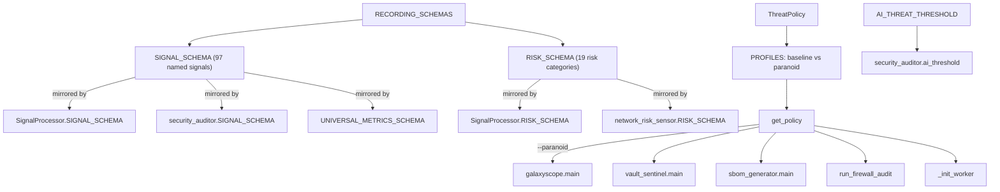

# Analysis lens — calibrating heuristic hit-counts into a risk verdict

## Overview
Every other GitGalaxy module in this survey turns source text into raw counts: how many
times a regex for `high_risk_execution` or `bitwise_ops` fired in a file. This module is
where those counts stop being neutral telemetry and start being a verdict. It holds two
distinct kinds of calibration — [`ThreatPolicy`](../catalog/gitgalaxy/standards/analysis_lens.md#ThreatPolicy)'s
hand-chosen density thresholds for the pure-heuristic security scan, and
[`AI_THREAT_THRESHOLD`](../catalog/gitgalaxy/standards/analysis_lens.md#AI_THREAT_THRESHOLD),
a single number gating the one place in this codebase where a trained statistical model (a
multiclass classifier, not an LLM) makes the call instead of a regex table — plus
[`RECORDING_SCHEMAS`](../catalog/gitgalaxy/standards/analysis_lens.md#RECORDING_SCHEMAS),
the fixed-position vector layout every consuming module copies rather than imports live.

## Diagram

## Design rationale (why it's built this way)
**Two named profiles, not a sliding scale.** [`ThreatPolicy`](../catalog/gitgalaxy/standards/analysis_lens.md#ThreatPolicy)'s
docstring: "Defines the threshold at which a structural anomaly becomes a critical threat."
Its [`PROFILES`](../catalog/gitgalaxy/standards/analysis_lens.md#ThreatPolicy.PROFILES) dict
carries exactly two named contexts — the source comments call `"baseline"` the profile "For
standard, internal development where some low-level logic is expected," and `"paranoid"`
"The Hazmat Suit: For scanning unknown PyPI/npm packages in a quarantine sandbox." The
thresholds between them are not close: `secrets_risk_threshold` tightens 10x (0.001 → 0.0001,
"Any trace is critical"), `memory_corruption_threshold` tightens 6x (0.60 → 0.10), and
`hidden_malware_threshold` tightens 4x (0.60 → 0.15) and `logic_bomb_threshold` tightens
2.5x (0.50 → 0.20). The same
regex-hit density that is unremarkable in a codebase you trust is presented as intolerable in
one you don't — the policy layer encodes *trust context*, not just a better-tuned constant.

**The policy engine itself is trivial; the numbers are the design.** [`get_policy`](../catalog/gitgalaxy/standards/analysis_lens.md#ThreatPolicy.get_policy)
is a single static method — a dict lookup with a baseline fallback. There is no learned
calibration at this layer; the five thresholds per profile are author-chosen percentages,
consistent with the rest of this heuristic engine's philosophy of hand-tuned constants over
inferred ones.

**One threshold breaks that pattern: it is presented as statistically derived.** [`AI_THREAT_THRESHOLD`](../catalog/gitgalaxy/standards/analysis_lens.md#AI_THREAT_THRESHOLD)'s
own comment reads "Tuned to 90.0% based on the 1.4M global probability distribution
analysis" — a different justification in kind from `ThreatPolicy`'s hand-picked density
percentages. It gates [`ai_threshold`](../catalog/gitgalaxy/security/security_auditor.md#SecurityAuditor.ai_threshold)
on the module that runs a trained multiclass gradient-boosted classifier over the *same*
structural signals this survey's other GitGalaxy pages extract by regex — meaning this file
straddles both halves of the "no AST, no LLM" claim: `ThreatPolicy` calibrates the pure
heuristic layer, while `AI_THREAT_THRESHOLD` calibrates the one classical (non-LLM,
non-parsing) statistical model this heuristic engine actually trains and ships.

**A single schema, mirrored everywhere rather than imported live.** [`RECORDING_SCHEMAS`](../catalog/gitgalaxy/standards/analysis_lens.md#RECORDING_SCHEMAS)
holds `SIGNAL_SCHEMA` (97 named signal slots — the same vocabulary documented on the
language-standards page: `branch`, `args`, `func_start`, `high_risk_execution`, …) and
`RISK_SCHEMA` (19 risk categories: `cognitive_load`, `tech_debt`, `logic_bomb`,
`memory_corruption`, `secrets_risk`, …). Every consumer copies these into its own attribute
rather than importing the dict live — as a class attribute fixed at import time for
[`SIGNAL_SCHEMA`](../catalog/gitgalaxy/metrics/signal_processor.md#SignalProcessor.SIGNAL_SCHEMA)
and [`RISK_SCHEMA`](../catalog/gitgalaxy/metrics/signal_processor.md#SignalProcessor.RISK_SCHEMA)
on the signal processor and [`UNIVERSAL_METRICS_SCHEMA`](../catalog/gitgalaxy/core/detector.md#StructuralExtractor.UNIVERSAL_METRICS_SCHEMA)
on the structural extractor, and as an instance attribute re-copied on every construction for
[`SIGNAL_SCHEMA`](../catalog/gitgalaxy/security/security_auditor.md#SecurityAuditor.SIGNAL_SCHEMA)
on the security auditor and [`RISK_SCHEMA`](../catalog/gitgalaxy/core/network_risk_sensor.md#NetworkRiskSensor.RISK_SCHEMA)
on the network risk sensor. This is GitGalaxy's closest equivalent to a fixed intermediate
representation: not a parse tree, but a positionally-stable numeric vector every language and
every module agrees on, so index `i` means the same risk category no matter which of the 56
languages produced the underlying file.

## Entry points
- [`get_policy`](../catalog/gitgalaxy/standards/analysis_lens.md#ThreatPolicy.get_policy) —
  the single lookup every caller uses to obtain a threshold profile; reached from
  [`main`](../catalog/gitgalaxy/galaxyscope.md#main) (via `--paranoid`),
  [`main`](../catalog/gitgalaxy/tools/supply_chain_security/vault_sentinel.md#main) and
  [`main`](../catalog/gitgalaxy/tools/compliance/sbom_generator.md#main) (both standalone
  security tools always request `"paranoid"`), [`run_firewall_audit`](../catalog/gitgalaxy/tools/supply_chain_security/supply_chain_firewall.md#run_firewall_audit),
  and [`_init_worker`](../catalog/gitgalaxy/galaxyscope.md#_init_worker) (each worker process
  independently re-derives the same policy from the shared `config`).
- [`RECORDING_SCHEMAS`](../catalog/gitgalaxy/standards/analysis_lens.md#RECORDING_SCHEMAS) —
  imported once by every module that needs to interpret a signal or risk vector positionally;
  not itself a function, but the schema every other entry point in this survey's GitGalaxy
  pages ultimately depends on to make its counts meaningful.

## Mechanism (step-by-step)
1. **The standalone security tools always run paranoid.** Both [`main`](../catalog/gitgalaxy/tools/supply_chain_security/vault_sentinel.md#main)
   (the secrets scanner) and [`main`](../catalog/gitgalaxy/tools/compliance/sbom_generator.md#main)
   (the SBOM generator) call [`get_policy`](../catalog/gitgalaxy/standards/analysis_lens.md#ThreatPolicy.get_policy)`("paranoid")`
   unconditionally rather than exposing a flag — these tools are built for scanning
   third-party/untrusted dependency trees, so the "Hazmat Suit" profile is their only mode.
2. **The full pipeline lets the operator choose.** [`main`](../catalog/gitgalaxy/galaxyscope.md#main)
   threads `args.paranoid` into `config["PARANOID_MODE"]`, and both the main-thread
   orchestrator and every [`_init_worker`](../catalog/gitgalaxy/galaxyscope.md#_init_worker)-booted
   worker process independently call [`get_policy`](../catalog/gitgalaxy/standards/analysis_lens.md#ThreatPolicy.get_policy)
   against that same flag — so a single CLI switch changes the [`PROFILES`](../catalog/gitgalaxy/standards/analysis_lens.md#ThreatPolicy.PROFILES)
   entry read in every process, without needing to serialize the resolved threshold dict
   itself across the process-pool boundary.
3. **`run_firewall_audit` fixes its policy regardless of caller mode.** [`run_firewall_audit`](../catalog/gitgalaxy/tools/supply_chain_security/supply_chain_firewall.md#run_firewall_audit)
   always requests the `"paranoid"` profile internally for its zero-trust import
   verification, independent of whatever profile the rest of the pipeline is using — supply
   chain checks get the tightest thresholds unconditionally.
4. **The recorder persists the schema's own shape as its database columns.** [`db_recorder`](../catalog/gitgalaxy/galaxyscope.md#Orchestrator.db_recorder)
   is constructed with its own [`logger`](../catalog/gitgalaxy/recorders/record_keeper.md#RecordKeeper.logger)
   and, at record time, generates its SQLite schema dynamically from
   [`RISK_SCHEMA`](../catalog/gitgalaxy/metrics/signal_processor.md#SignalProcessor.RISK_SCHEMA)/[`SIGNAL_SCHEMA`](../catalog/gitgalaxy/metrics/signal_processor.md#SignalProcessor.SIGNAL_SCHEMA)
   (one SQL column per schema entry) — so a change to
   [`RECORDING_SCHEMAS`](../catalog/gitgalaxy/standards/analysis_lens.md#RECORDING_SCHEMAS)
   changes the on-disk table shape for every future scan, not just the in-memory vectors.
5. **A structural signal and a statistical model share the same features but different
   gates.** The heuristic layer's [`PROFILES`](../catalog/gitgalaxy/standards/analysis_lens.md#ThreatPolicy.PROFILES)
   thresholds apply to raw density ratios computed from
   [`SIGNAL_SCHEMA`](../catalog/gitgalaxy/metrics/signal_processor.md#SignalProcessor.SIGNAL_SCHEMA)/[`UNIVERSAL_METRICS_SCHEMA`](../catalog/gitgalaxy/core/detector.md#StructuralExtractor.UNIVERSAL_METRICS_SCHEMA)
   counts directly; separately, [`ai_threshold`](../catalog/gitgalaxy/security/security_auditor.md#SecurityAuditor.ai_threshold)
   (set from [`AI_THREAT_THRESHOLD`](../catalog/gitgalaxy/standards/analysis_lens.md#AI_THREAT_THRESHOLD))
   gates the confidence output of a classifier trained on
   [`SIGNAL_SCHEMA`](../catalog/gitgalaxy/security/security_auditor.md#SecurityAuditor.SIGNAL_SCHEMA)
   features fused with network-centrality features — two independent decision layers reading
   the same underlying schema.

## Key data structures
- [`PROFILES`](../catalog/gitgalaxy/standards/analysis_lens.md#ThreatPolicy.PROFILES) —
  two named dicts (`baseline`, `paranoid`), five float thresholds each
  (`secrets_risk_threshold`, `hidden_malware_threshold`, `logic_bomb_threshold`,
  `injection_surface_threshold`, `memory_corruption_threshold`).
- [`RECORDING_SCHEMAS`](../catalog/gitgalaxy/standards/analysis_lens.md#RECORDING_SCHEMAS) —
  a dict of named schema lists; `SIGNAL_SCHEMA` (the 97-entry raw structural-signal
  vocabulary) and `RISK_SCHEMA` (the 19-entry derived risk-category vocabulary) are the two
  load-bearing ones for this page, each re-exported under an attribute of the same name
  by every consuming module cited above.
- [`AI_THREAT_THRESHOLD`](../catalog/gitgalaxy/standards/analysis_lens.md#AI_THREAT_THRESHOLD) —
  a single float (90.0), the only constant in this module presented as derived from a large
  external probability-distribution analysis rather than chosen by inspection.

## Dynamics (design intent)
[`_init_worker`](../catalog/gitgalaxy/galaxyscope.md#_init_worker) resolves
[`get_policy`](../catalog/gitgalaxy/standards/analysis_lens.md#ThreatPolicy.get_policy)
independently inside each spawned process rather than receiving an already-resolved
threshold dict over the multiprocessing boundary — consistent with the isolated-worker-memory
design documented on the orchestrator page, where compiled/derived state is rebuilt locally
in each process instead of being pickled across it.

## Edge cases
- **Standalone tools have no baseline mode.** [`main`](../catalog/gitgalaxy/tools/supply_chain_security/vault_sentinel.md#main)
  and [`main`](../catalog/gitgalaxy/tools/compliance/sbom_generator.md#main) never call
  [`get_policy`](../catalog/gitgalaxy/standards/analysis_lens.md#ThreatPolicy.get_policy)
  with `"baseline"` — there is no CLI flag on either tool to loosen their thresholds.
- **An unrecognized profile name silently falls back.** [`get_policy`](../catalog/gitgalaxy/standards/analysis_lens.md#ThreatPolicy.get_policy)'s
  `.get(mode, PROFILES["baseline"])` means a typo'd or future mode string degrades quietly
  to `"baseline"` rather than raising.

## Open questions
- The exact multiclass classifier that [`ai_threshold`](../catalog/gitgalaxy/security/security_auditor.md#SecurityAuditor.ai_threshold)
  gates, and the "1.4M global probability distribution analysis" [`AI_THREAT_THRESHOLD`](../catalog/gitgalaxy/standards/analysis_lens.md#AI_THREAT_THRESHOLD)'s
  comment references, are outside this packet's subgraph — this page documents the threshold
  and its stated provenance, not the training process behind it.
- [`db_recorder`](../catalog/gitgalaxy/galaxyscope.md#Orchestrator.db_recorder)'s presence in
  this packet traces to shared scope with the `ThreatPolicy` branch inside the orchestrator's
  constructor rather than a direct call relationship; its schema-driven table generation is
  described here from the source read for the orchestrator page, not from a citation internal
  to this one.

## See also
- [GalaxyScope language standards](gitgalaxy-standards-language_standards.md) — where the
  `SIGNAL_SCHEMA` names (`branch`, `high_risk_execution`, `bitwise_ops`, …) are produced as
  per-language regex rules.
- [GalaxyScope language lens](gitgalaxy-standards-language_lens.md) — the classifier whose
  output language feeds the same worker pipeline these thresholds gate.
- [GalaxyScope orchestrator](gitgalaxy-galaxyscope.md) — Phase 9, where `ai_threshold` and
  `ThreatPolicy` are actually applied to a repository's files.
