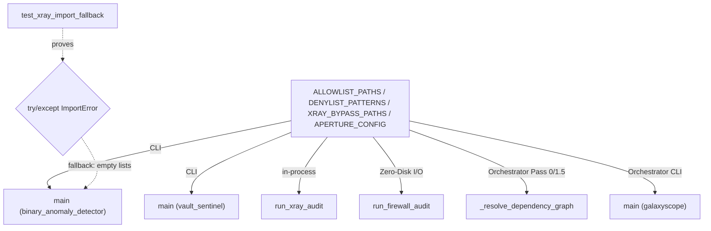

# gitgalaxy_config.py — the tunable allow/deny surface behind the aperture filter

## Overview
`gitgalaxy_config.py` is the human-editable dial pad behind GitGalaxy's Phase 0/1 ingestion — the
module the README's "300+ tunable variables" claim is grounded in. Its own module docstring frames
its scope precisely: "Phase 0 & 1: Repository Ingestion, Filtering, and Pre-Flight Context... the
global security exceptions and the lightweight ingestion rules used to filter out noise before the
heavy static analysis engines are loaded into memory." Unlike `signal_processor.py` or
`chronometer.py`, this module contains no functions of its own — every symbol in this packet's
subgraph ([`ALLOWLIST_PATHS`](../catalog/gitgalaxy/standards/gitgalaxy_config.md#ALLOWLIST_PATHS),
[`DENYLIST_PATTERNS`](../catalog/gitgalaxy/standards/gitgalaxy_config.md#DENYLIST_PATTERNS),
[`XRAY_BYPASS_PATHS`](../catalog/gitgalaxy/standards/gitgalaxy_config.md#XRAY_BYPASS_PATHS),
[`APERTURE_CONFIG`](../catalog/gitgalaxy/standards/gitgalaxy_config.md#APERTURE_CONFIG)) is a plain
list or dict literal, read by roughly half a dozen independent CLI tools and the main orchestrator
rather than computed by anything in this file itself.

## Diagram

## Design rationale (why it's built this way)
**Config as pure data, deliberately separated from scanning logic.** Every symbol in this packet is
a literal — [`ALLOWLIST_PATHS`](../catalog/gitgalaxy/standards/gitgalaxy_config.md#ALLOWLIST_PATHS)
and [`DENYLIST_PATTERNS`](../catalog/gitgalaxy/standards/gitgalaxy_config.md#DENYLIST_PATTERNS) are
plain lists of path substrings and `fnmatch`-style glob patterns,
[`XRAY_BYPASS_PATHS`](../catalog/gitgalaxy/standards/gitgalaxy_config.md#XRAY_BYPASS_PATHS) is a list
of exact bypass paths, and
[`APERTURE_CONFIG`](../catalog/gitgalaxy/standards/gitgalaxy_config.md#APERTURE_CONFIG) is a nested
dict of ignore-sets and thresholds. Putting all of it in one file with no logic means the five-plus
independent consumers below all read from a single source of truth rather than each hardcoding their
own exceptions.

**Defensive imports let scanners ship ahead of config, or vice versa.**
[`test_xray_import_fallback`](../catalog/tests/security_auditing/test_binary_anomaly_detector.md#test_xray_import_fallback)
proves that when a mocked config module exposes only
[`APERTURE_CONFIG`](../catalog/gitgalaxy/standards/gitgalaxy_config.md#APERTURE_CONFIG) (simulating a
fresh install that predates a newer variable), the consumer degrades to empty
[`ALLOWLIST_PATHS`](../catalog/gitgalaxy/standards/gitgalaxy_config.md#ALLOWLIST_PATHS)/
[`DENYLIST_PATTERNS`](../catalog/gitgalaxy/standards/gitgalaxy_config.md#DENYLIST_PATTERNS) rather than
crashing at import time. Reading the consumer directly confirms the mechanism: it wraps its
`from gitgalaxy.standards.gitgalaxy_config import (...)` in a `try/except ImportError` that
re-imports only `APERTURE_CONFIG` and hand-sets every newer name to `[]` on failure — so a config
file that predates a bypass list being added doesn't break the tool that expects it.

**A pre-populated allowlist trades false-negative risk for less CI noise.**
[`ALLOWLIST_PATHS`](../catalog/gitgalaxy/standards/gitgalaxy_config.md#ALLOWLIST_PATHS) ships with
`"tests/"` already present out of the box, while
[`DENYLIST_PATTERNS`](../catalog/gitgalaxy/standards/gitgalaxy_config.md#DENYLIST_PATTERNS) ships
completely empty (only commented-out examples). The default posture is therefore "don't flag
anything extra, and don't scrutinize fixtures under `tests/`" — a bias toward a quiet first run, at
the cost of also muting a genuine secret someone accidentally commits under a `tests/` path.
[`run_xray_audit`](../catalog/gitgalaxy/tools/supply_chain_security/binary_anomaly_detector.md#run_xray_audit)
reinforces the same bias with a hardcoded `/test/`/`/tests/` substring check independent of the
allowlist itself.

**`XRAY_BYPASS_PATHS` is partly a self-referential guard.** Reading its literal contents: it lists
GitGalaxy's own security-tool source files (`binary_anomaly_detector.py`,
`supply_chain_firewall.py`, `aperture.py`, `security_lens.py`, `language_standards.py`) alongside
lockfiles (`package-lock.json`, `yarn.lock`, `composer.lock`) and `site/css/styles.css` — all
high-entropy or otherwise-noisy text that would trip the entropy-based X-Ray scanner
([`run_xray_audit`](../catalog/gitgalaxy/tools/supply_chain_security/binary_anomaly_detector.md#run_xray_audit))
on itself if not exempted.

## Entry points
- [`main`](../catalog/gitgalaxy/tools/supply_chain_security/vault_sentinel.md#main) (Secrets
  Scanner CLI) — builds an `ApertureFilter` from
  [`APERTURE_CONFIG`](../catalog/gitgalaxy/standards/gitgalaxy_config.md#APERTURE_CONFIG) and walks
  the target tree, consulting
  [`ALLOWLIST_PATHS`](../catalog/gitgalaxy/standards/gitgalaxy_config.md#ALLOWLIST_PATHS)/
  [`DENYLIST_PATTERNS`](../catalog/gitgalaxy/standards/gitgalaxy_config.md#DENYLIST_PATTERNS) to
  decide what to flag versus silently allow.
- [`main`](../catalog/gitgalaxy/tools/supply_chain_security/binary_anomaly_detector.md#main) (Binary
  Anomaly Detector CLI) — the standalone entry point for entropy/magic-byte scanning, wired to the
  same four config symbols.
- [`run_xray_audit`](../catalog/gitgalaxy/tools/supply_chain_security/binary_anomaly_detector.md#run_xray_audit) —
  "Programmatic entry point for GalaxyScope (orchestrator execution)": the in-process equivalent of
  the CLI `main` above, so an interactive scan and a pipeline-invoked scan share one allow/deny
  surface rather than diverging.
- [`run_firewall_audit`](../catalog/gitgalaxy/tools/supply_chain_security/supply_chain_firewall.md#run_firewall_audit) —
  "Programmatic entry point for GalaxyScope (Zero-Disk I/O)": the Supply Chain Firewall's import
  auditor, which of this page's four tracked config symbols reads only
  [`ALLOWLIST_PATHS`](../catalog/gitgalaxy/standards/gitgalaxy_config.md#ALLOWLIST_PATHS) (it also
  imports the out-of-subgraph `STRICT_IMPORT_MODE`/`APPROVED_IMPORTS`/`BLACKLISTED_IMPORTS` from the
  same module for its own Zero-Trust import policy) — it operates on already-parsed import tokens,
  not the filesystem, so it needs no path-denylist or aperture rules.
- [`main`](../catalog/gitgalaxy/galaxyscope.md#main) (top-level GalaxyScope CLI) and
  [`_resolve_dependency_graph`](../catalog/gitgalaxy/galaxyscope.md#Orchestrator._resolve_dependency_graph)
  (Orchestrator Pass 1.5) — both read
  [`APERTURE_CONFIG`](../catalog/gitgalaxy/standards/gitgalaxy_config.md#APERTURE_CONFIG) directly, so
  the same dict configures both the initial filesystem walk and the later relational-token
  aggregation pass.

## Mechanism (step-by-step)
1. **The allow/deny decision in the binary scanner layers three independent checks.** Reading
   [`run_xray_audit`](../catalog/gitgalaxy/tools/supply_chain_security/binary_anomaly_detector.md#run_xray_audit)
   directly: a file counts as whitelisted if its relative path substring-matches
   [`ALLOWLIST_PATHS`](../catalog/gitgalaxy/standards/gitgalaxy_config.md#ALLOWLIST_PATHS), *or* its
   extension is in the (out-of-subgraph) X-Ray bypass extension list, *or* it substring-matches
   [`XRAY_BYPASS_PATHS`](../catalog/gitgalaxy/standards/gitgalaxy_config.md#XRAY_BYPASS_PATHS), *or*
   it lives under a `test`/`tests` directory — and only a
   [`DENYLIST_PATTERNS`](../catalog/gitgalaxy/standards/gitgalaxy_config.md#DENYLIST_PATTERNS)
   `fnmatch` hit on a *non*-whitelisted path increments the anomaly count; reading the guard directly
   (`if is_forbidden and not is_whitelisted:`), a whitelisted file that also matches the denylist
   produces no output at all — it is silently skipped, not logged, and not counted as a finding.
2. **Consumers guard their own imports rather than this module guaranteeing every name exists.** The
   `main`/`run_xray_audit` pair in `binary_anomaly_detector.py` wraps its import of
   [`ALLOWLIST_PATHS`](../catalog/gitgalaxy/standards/gitgalaxy_config.md#ALLOWLIST_PATHS)/
   [`DENYLIST_PATTERNS`](../catalog/gitgalaxy/standards/gitgalaxy_config.md#DENYLIST_PATTERNS)/
   [`XRAY_BYPASS_PATHS`](../catalog/gitgalaxy/standards/gitgalaxy_config.md#XRAY_BYPASS_PATHS) in a
   `try/except ImportError` that falls back to empty lists on failure, a behavior
   [`test_xray_import_fallback`](../catalog/tests/security_auditing/test_binary_anomaly_detector.md#test_xray_import_fallback)
   exercises directly by mocking a stripped-down config module and asserting the fallback empties.
3. **`run_firewall_audit` deliberately needs less of this page's config surface than the binary
   scanners.**
   [`run_firewall_audit`](../catalog/gitgalaxy/tools/supply_chain_security/supply_chain_firewall.md#run_firewall_audit)
   reads only
   [`ALLOWLIST_PATHS`](../catalog/gitgalaxy/standards/gitgalaxy_config.md#ALLOWLIST_PATHS) of the four
   symbols tracked here — it
   audits import tokens already extracted into RAM during Phase 1 rather than walking the
   filesystem, so it has no use for
   [`APERTURE_CONFIG`](../catalog/gitgalaxy/standards/gitgalaxy_config.md#APERTURE_CONFIG)'s
   ignore-directory/extension sets or the denylist.
4. **The Orchestrator reuses the same `APERTURE_CONFIG` across two different pipeline phases.**
   [`main`](../catalog/gitgalaxy/galaxyscope.md#main) reads
   [`APERTURE_CONFIG`](../catalog/gitgalaxy/standards/gitgalaxy_config.md#APERTURE_CONFIG) at CLI
   startup, and
   [`_resolve_dependency_graph`](../catalog/gitgalaxy/galaxyscope.md#Orchestrator._resolve_dependency_graph)
   ("Pass 1.5: Optimized relational token aggregation & Fuzzy Suffix Matching") reads it again during
   import-graph resolution — one config surface tunes both the initial ingestion filter and the
   later dependency-graph pass.

## Key data structures
- [`APERTURE_CONFIG`](../catalog/gitgalaxy/standards/gitgalaxy_config.md#APERTURE_CONFIG) — a nested
  dict; reading its literal contents directly it holds, among other keys, `SECRETS_EXTENSIONS`/
  `SECRETS_EXACT` (the exact extensions/filenames that trigger `SignalProcessor`'s critical-secrets
  override — see [gitgalaxy-metrics-signal_processor](gitgalaxy-metrics-signal_processor.md)),
  `IGNORED_DIRECTORIES`/`IGNORED_EXTENSIONS` (the Phase-0 ingestion denylist), `CONTRABAND_PATTERNS`,
  and size/line-length thresholds (`MAX_LINE_LENGTH`, `MAX_FILE_SIZE_MB`,
  `MINIFICATION_SCAN_LIMIT`).
- [`ALLOWLIST_PATHS`](../catalog/gitgalaxy/standards/gitgalaxy_config.md#ALLOWLIST_PATHS) /
  [`DENYLIST_PATTERNS`](../catalog/gitgalaxy/standards/gitgalaxy_config.md#DENYLIST_PATTERNS) — flat
  lists of path substrings and `fnmatch` globs respectively; the former is an override that mutes a
  finding, the latter is what creates one.
- [`XRAY_BYPASS_PATHS`](../catalog/gitgalaxy/standards/gitgalaxy_config.md#XRAY_BYPASS_PATHS) — exact
  or substring paths exempted specifically from the entropy/magic-byte scanner, narrower in scope
  than the general allowlist.

## Dynamics (design intent)
Because these are ordinary module-level Python names, every consumer that does
`from gitgalaxy.standards.gitgalaxy_config import ALLOWLIST_PATHS` binds its own reference at import
time.
[`test_xray_import_fallback`](../catalog/tests/security_auditing/test_binary_anomaly_detector.md#test_xray_import_fallback)'s
technique of swapping `sys.modules["gitgalaxy.standards.gitgalaxy_config"]` for a mock and then
`importlib.reload`-ing the consumer module demonstrates this directly: the fallback branch only
executes on that forced reload, matching ordinary Python import semantics rather than any custom
config-loading indirection in this module itself.

## Edge cases
- [`DENYLIST_PATTERNS`](../catalog/gitgalaxy/standards/gitgalaxy_config.md#DENYLIST_PATTERNS) ships
  empty by default (only commented-out example patterns) — the denylist is inert until a user
  explicitly opts a pattern in.
- A path can simultaneously match
  [`DENYLIST_PATTERNS`](../catalog/gitgalaxy/standards/gitgalaxy_config.md#DENYLIST_PATTERNS) and
  [`ALLOWLIST_PATHS`](../catalog/gitgalaxy/standards/gitgalaxy_config.md#ALLOWLIST_PATHS); reading
  [`run_xray_audit`](../catalog/gitgalaxy/tools/supply_chain_security/binary_anomaly_detector.md#run_xray_audit)
  directly, the allowlist wins — both `run_xray_audit` and the CLI `main` gate the denylist branch on
  `not is_whitelisted`, so the match produces no output at all (neither a log line nor a counted
  anomaly), not merely a logged-but-uncounted one.
- A consumer missing a name entirely (older config, newer scanner) degrades to an empty list rather
  than raising `ImportError` at process start, per
  [`test_xray_import_fallback`](../catalog/tests/security_auditing/test_binary_anomaly_detector.md#test_xray_import_fallback).

## Open questions
- Reading the sibling module directly: `gitgalaxy/standards/analysis_lens.py` (imported as `config`
  inside `signal_processor.py`) defines no top-level `APERTURE_CONFIG` of its own, even though
  `SignalProcessor.calculate_risk_vector` performs a `getattr(config, "APERTURE_CONFIG", {})` lookup
  against it — that lookup can never actually reach *this* module's
  [`APERTURE_CONFIG`](../catalog/gitgalaxy/standards/gitgalaxy_config.md#APERTURE_CONFIG). See the
  Edge cases section of [gitgalaxy-metrics-signal_processor](gitgalaxy-metrics-signal_processor.md)
  for the consequence. Whether that's a latent bug or deliberate (the same marker is set upstream by
  the real aperture filter, which does import from this module) isn't resolvable from this packet's
  subgraph alone.
- The much larger sibling config sections in this same file (`GUIDESTAR_CONFIG`, `CHRONOMETER_CONFIG`,
  `STATIC_ARCHETYPES`, `ORCHESTRATOR_RULES`, `LEXICAL_FAMILY_HEURISTICS`, `EXACT_FILE_MATCH`,
  `PRIORITY_WHITELIST`) are not in this packet's subgraph and so aren't covered here.

## See also
- [gitgalaxy-metrics-signal_processor](gitgalaxy-metrics-signal_processor.md) — a consumer of
  `APERTURE_CONFIG`'s sibling `SECRETS_EXTENSIONS`/`SECRETS_EXACT` keys via a different, non-resolving
  import path.
- [gitgalaxy-metrics-chronometer](gitgalaxy-metrics-chronometer.md) — correctly resolves its own
  `APERTURE_CONFIG`/`CHRONOMETER_CONFIG` lookups against this module.
