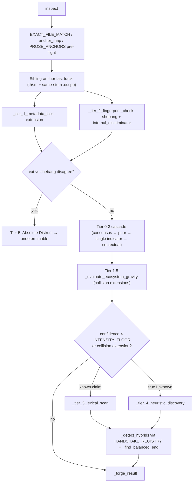

# Language lens — the AST-free confidence-tier language classifier

## Overview
`LanguageDetector` answers "what language is this file?" without parsing it, using a
five-tier confidence cascade that runs cheap, spoofable signals (filename, extension,
shebang) first and only falls back to expensive lexical regex scanning when those signals
are absent or hit a known-ambiguous extension — a disagreement between signals is never
escalated to lexical scanning at all; it is dropped straight to Tier 5 "Absolute Distrust"
as `undeterminable` (see Design rationale below). Its central discipline is not
classification accuracy in the abstract — it is knowing *when to refuse to guess*, because
a wrong language label corrupts every one of the ~90 regex rules the wrong per-language
table would apply downstream (see [language standards](gitgalaxy-standards-language_standards.md)).
[`inspect`](../catalog/gitgalaxy/standards/language_lens.md#LanguageDetector.inspect) is the
single orchestrator method every other function in this file feeds into.

## Diagram

## Design rationale (why it's built this way)
**The tiers are the model.** The class docstring lays out the hierarchy directly: "Tier 0:
Absolute Consensus (Dual Evidence: Ext+Shebang, or Ext+Manifest) ... Tier 4: Heuristic
Discovery (Requires high lexical density threshold)." Confidence is not a single blended
score; it is a discrete rung, and which rung a file lands on is itself recorded in the
result (`lock_tier`) so downstream consumers can tell a certain classification from a
merely-plausible one.

**Fail closed rather than guess.** [`_tier_3_lexical_scan`](../catalog/gitgalaxy/standards/language_lens.md#LanguageDetector._tier_3_lexical_scan)'s
docstring states the rule plainly: "If a file has an extension, it MUST be claimed by one
of the known languages for that extension; it is not allowed to randomly match an unrelated
schema" — its own debug log calls this "Strict Boundary Lock ... to prevent regex
hallucination." The same instinct drives the identity-conflict path inside
[`inspect`](../catalog/gitgalaxy/standards/language_lens.md#LanguageDetector.inspect): when
an extension-based guess and a shebang-based guess disagree, the code does not average or
prefer one — it drops the file to "Tier 5: Absolute Distrust," returns `undeterminable`,
and records the contradiction in `anomaly_flags` for the security layer, treating disagreement
itself as signal.

**Heuristic discovery is margin-gated, not top-1.** [`_tier_4_heuristic_discovery`](../catalog/gitgalaxy/standards/language_lens.md#LanguageDetector._tier_4_heuristic_discovery)'s
docstring: "Prioritizes graceful failure over blind guessing by enforcing a strict 1.5x
margin between the leading language candidate and the runner-up." Picking the single
highest-scoring language among ambiguous candidates would be an AST-free engine's most
obvious failure mode (two languages sharing a comment style and similar keyword density);
requiring a decisive lead — and additionally cross-checking regex execution time as a
"friction" tie-breaker for suspiciously slow matches — is the guard against it.

**Bounded I/O as a defensive guard, not an optimization.** [`_capture_raw_signal`](../catalog/gitgalaxy/standards/language_lens.md#LanguageDetector._capture_raw_signal)'s
docstring: "Restricts I/O memory allocation to 50KB. Prevents Out-Of-Memory (OOM) crashes if
the user accidentally points the analyzer at massive log dumps or multi-gigabyte
auto-generated monoliths" — consistent with the survey lens's "linear-time, zero-dependency"
framing: every expensive operation in this file has an explicit upper bound.

**Designed to be tested without the live language tables.** The [`isolated_detector`](../catalog/tests/core_engine/test_language_lens.md#isolated_detector)
fixture's docstring explains why: it "Creates a fully isolated LanguageDetector that does
NOT rely on your live `LENS_CONFIG`. By injecting a perfect microcosm of languages, we can
test the complex Bayesian logic gates without the tests randomly failing when you update
the central dictionaries" — an acknowledgment that the real [`languages`](../catalog/gitgalaxy/standards/language_lens.md#LanguageDetector.languages)
table (documented on the language-standards page) is large and actively edited, and the tier
logic needs to be verifiable independent of it.

## Entry points
- [`inspect`](../catalog/gitgalaxy/standards/language_lens.md#LanguageDetector.inspect) — the
  primary classification orchestrator; every worker process calls this once per file with
  the raw content sample, any GuideStar intent prior, and the repo-wide extension tally.
- [`focus`](../catalog/gitgalaxy/standards/language_lens.md#LanguageDetector.focus) — a
  "Legacy Support Gateway" (its own docstring) wrapping [`inspect`](../catalog/gitgalaxy/standards/language_lens.md#LanguageDetector.inspect)
  for callers expecting the older `(lang_id, intensity, family)` tuple shape, additionally
  collapsing any result under 0.25 intensity to `"undeterminable"`.
- [`main`](../catalog/gitgalaxy/tools/compliance/sbom_generator.md#main) — the standalone SBOM
  generator tool constructs a `LanguageDetector` directly (paired with a manifest slicer and
  a paranoid-policy security lens), showing this classifier is used as a shared library
  outside the full GalaxyScope pipeline, not only inside it.

## Mechanism (step-by-step)
1. **Normalize the name defensively.** [`inspect`](../catalog/gitgalaxy/standards/language_lens.md#LanguageDetector.inspect)
   treats dotfiles (`.bashrc`) as extensionless, and only unwraps a hidden true extension
   from a "safe wrapper" suffix (`.bak`, `.template`, …) — explicitly to avoid an
   extension-spoofing trick like `malware.exe.txt` being reclassified by a naive
   double-extension strip.
2. **Pre-flight anchors short-circuit regex entirely.** Known doc filenames
   ([`EXACT_FILE_MATCH`](../catalog/gitgalaxy/standards/gitgalaxy_config.md#EXACT_FILE_MATCH)),
   the [`anchor_map`](../catalog/gitgalaxy/standards/language_lens.md#LanguageDetector.anchor_map),
   and [`PROSE_ANCHORS`](../catalog/gitgalaxy/standards/language_lens.md#LanguageDetector.PROSE_ANCHORS)
   (README, LICENSE, CHANGELOG-style names) return a high-confidence `markdown`/`plaintext`
   result before any lexical work happens — the cheapest possible signal wins first.
3. **Sibling-anchor fast track resolves the common header collision.** For `.h`/`.m` files
   with [`COLLISION_FREQUENCIES`](../catalog/gitgalaxy/standards/language_lens.md#LanguageDetector.COLLISION_FREQUENCIES)
   extensions, [`inspect`](../catalog/gitgalaxy/standards/language_lens.md#LanguageDetector.inspect)
   checks whether a same-stem `.c`/`.cpp`/`.m` file exists in the same tally and, if so,
   locks the language at 0.99 confidence immediately — resolving the single most common
   ambiguity in this heuristic's domain (C vs. C++ vs. Objective-C headers) for free.
4. **Gather two independent physical signals.** [`_tier_1_metadata_lock`](../catalog/gitgalaxy/standards/language_lens.md#LanguageDetector._tier_1_metadata_lock)
   reads the extension map (refusing to answer at all for collision extensions), while
   [`_tier_2_fingerprint_check`](../catalog/gitgalaxy/standards/language_lens.md#LanguageDetector._tier_2_fingerprint_check)
   checks the shebang line and any language's `internal_discriminator` regex. If both exist
   and disagree, [`inspect`](../catalog/gitgalaxy/standards/language_lens.md#LanguageDetector.inspect)
   raises an identity-conflict flag and forces `undeterminable` rather than picking a side.
5. **Cascade through Tiers 0-3.** [`inspect`](../catalog/gitgalaxy/standards/language_lens.md#LanguageDetector.inspect)
   assigns `best_lang`/`best_conf`/`lock_tier` from the strongest available agreement
   (extension+shebang, or either signal agreeing with a high-confidence GuideStar prior)
   down through a single unconfirmed indicator.
6. **Tier 1.5 resolves collisions by neighborhood voting.** [`_evaluate_ecosystem_gravity`](../catalog/gitgalaxy/standards/language_lens.md#LanguageDetector._evaluate_ecosystem_gravity)
   runs a two-pass (local directory, then whole-repo) tally of sibling/discriminator
   extensions to break `.h`-style ties by which implementation language dominates the
   surrounding folder, only overriding the cascade if one candidate clears a dominance
   threshold.
7. **Mandatory lexical verification is the expensive fallback, not the default.** Whenever
   confidence sits below the configured floor, or the extension is a known collision,
   [`inspect`](../catalog/gitgalaxy/standards/language_lens.md#LanguageDetector.inspect)
   engages [`_tier_3_lexical_scan`](../catalog/gitgalaxy/standards/language_lens.md#LanguageDetector._tier_3_lexical_scan)
   (verify a claimed language against its own rule density) for files with a known
   extension, or [`_tier_4_heuristic_discovery`](../catalog/gitgalaxy/standards/language_lens.md#LanguageDetector._tier_4_heuristic_discovery)
   (isolate a comment family, prune disqualified candidates, then score by regex-hit
   density with a 1.5x margin requirement) for genuinely unknown or extensionless files.
8. **Check for embedded languages, then forge the result.** If the winning language is not
   degenerate, [`_detect_hybrids`](../catalog/gitgalaxy/standards/language_lens.md#LanguageDetector._detect_hybrids)
   walks the compiled [`HANDSHAKE_REGISTRY`](../catalog/gitgalaxy/standards/language_lens.md#LanguageDetector.HANDSHAKE_REGISTRY)
   (script/style/inline-asm triggers) and, for paired delimiters, uses
   [`_find_balanced_end`](../catalog/gitgalaxy/standards/language_lens.md#LanguageDetector._find_balanced_end)
   (a string-aware bracket matcher, bounded by the same lookahead limit as unpaired
   handshakes) to measure how much of the file is a secondary embedded language, like HTML
   inside PHP — only after that does [`_forge_result`](../catalog/gitgalaxy/standards/language_lens.md#LanguageDetector._forge_result)
   pack the final [`DetectorResult`](../catalog/gitgalaxy/standards/language_lens.md#DetectorResult), which already carries
   the `lang_mix` computed above.

## Key data structures
- [`DetectorResult`](../catalog/gitgalaxy/standards/language_lens.md#DetectorResult) — the
  TypedDict every tier ultimately fills in: `lang_id`, `intensity`, `lock_tier`,
  `source_proof` (a human-readable audit trail of *why* this language was chosen), and
  `anomaly_flags` for the security layer.
- [`HANDSHAKE_REGISTRY`](../catalog/gitgalaxy/standards/language_lens.md#LanguageDetector.HANDSHAKE_REGISTRY) —
  compiled at construction from [`LENS_CONFIG`](../catalog/gitgalaxy/standards/language_standards.md#LENS_CONFIG)
  (defined on the language-standards page); each entry is a `trigger`/`end`/`target`/`pair`
  tuple used only by [`_detect_hybrids`](../catalog/gitgalaxy/standards/language_lens.md#LanguageDetector._detect_hybrids).
- [`extension_map`](../catalog/gitgalaxy/standards/language_lens.md#LanguageDetector.extension_map) /
  [`anchor_map`](../catalog/gitgalaxy/standards/language_lens.md#LanguageDetector.anchor_map) —
  the O(1) lookup tables [`_calibrate_lookup_maps`](../catalog/gitgalaxy/standards/language_lens.md#LanguageDetector._calibrate_lookup_maps)
  builds once at construction from [`languages`](../catalog/gitgalaxy/standards/language_lens.md#LanguageDetector.languages),
  which is also where any string-form regex rules from an externally supplied language
  definition get lazily `re.compile`d (malformed ones are silently skipped, not raised).
- [`thresholds`](../catalog/gitgalaxy/standards/language_lens.md#LanguageDetector.thresholds),
  [`COLLISION_FREQUENCIES`](../catalog/gitgalaxy/standards/language_lens.md#LanguageDetector.COLLISION_FREQUENCIES),
  [`PROSE_ANCHORS`](../catalog/gitgalaxy/standards/language_lens.md#LanguageDetector.PROSE_ANCHORS),
  [`DISQUALIFIERS`](../catalog/gitgalaxy/standards/language_lens.md#LanguageDetector.DISQUALIFIERS) —
  all sourced from [`LENS_CONFIG`](../catalog/gitgalaxy/standards/language_standards.md#LENS_CONFIG);
  this file is the dispatcher, the language-standards page is where these tables' actual
  content lives.

## Dynamics (design intent)
The [`isolated_detector`](../catalog/tests/core_engine/test_language_lens.md#isolated_detector)
fixture builds a `LanguageDetector` from a hand-written eight-language microcosm and directly
overwrites its [`extension_map`](../catalog/gitgalaxy/standards/language_lens.md#LanguageDetector.extension_map)/[`anchor_map`](../catalog/gitgalaxy/standards/language_lens.md#LanguageDetector.anchor_map)/[`thresholds`](../catalog/gitgalaxy/standards/language_lens.md#LanguageDetector.thresholds),
so the tier-cascade tests exercise the *logic* of the confidence hierarchy in isolation from
the size and churn of the production language table (documented on the
[language standards](gitgalaxy-standards-language_standards.md) page).

## Edge cases
- **Truncated reads on huge files.** [`_capture_raw_signal`](../catalog/gitgalaxy/standards/language_lens.md#LanguageDetector._capture_raw_signal)
  only ever reads the first 50KB; a [`FocusingError`](../catalog/gitgalaxy/standards/language_lens.md#FocusingError)
  is raised (not swallowed) on genuine I/O failure, but a multi-gigabyte file is
  intentionally classified from a prefix, not its whole content.
- **Extensionless files need real mass.** [`_tier_4_heuristic_discovery`](../catalog/gitgalaxy/standards/language_lens.md#LanguageDetector._tier_4_heuristic_discovery)
  refuses to run its density scan below a minimum coding-line count, returning a low-
  confidence `plaintext` guess instead — a short extensionless file has too little signal
  to safely classify.
- **An entirely unknown extension aborts the lexical scan outright.** [`_tier_3_lexical_scan`](../catalog/gitgalaxy/standards/language_lens.md#LanguageDetector._tier_3_lexical_scan)
  only falls back to scanning every registered language when the file has *no* extension at
  all; an unrecognized extension is never treated as license to guess across the whole
  registry.

## Open questions
- [`languages`](../catalog/gitgalaxy/standards/language_lens.md#LanguageDetector.languages)
  and [`lexical_heuristics`](../catalog/gitgalaxy/standards/language_lens.md#LanguageDetector.lexical_heuristics)
  are constructor-injected rather than owned by this file; their actual content (the 50+
  language rule tables and lexical-family definitions) is documented on
  [language standards](gitgalaxy-standards-language_standards.md), not here.

## See also
- [GalaxyScope language standards](gitgalaxy-standards-language_standards.md) — the
  `LANGUAGE_DEFINITIONS`/`LENS_CONFIG` tables this dispatcher consumes.
- [GalaxyScope orchestrator](gitgalaxy-galaxyscope.md) — where `_init_worker` instantiates
  one `LanguageDetector` per worker process.
- [GalaxyScope analysis lens](gitgalaxy-standards-analysis_lens.md) — the risk thresholds
  applied once a file's language (and structural signature) is known.
