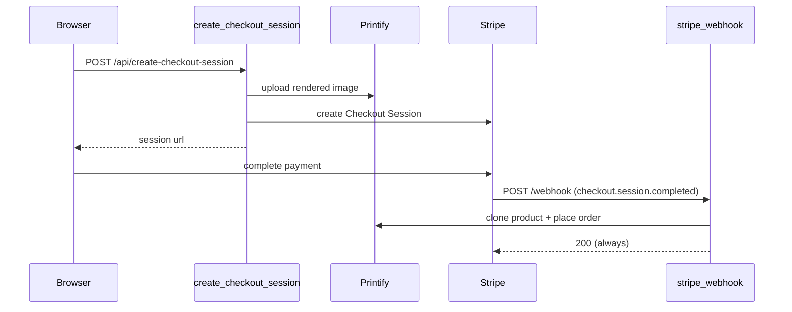

# site/app.py — GitGalaxy's marketing site and merch checkout backend

## Overview
This is a small Flask application that serves GitGalaxy's own website and handles a physical
"poster" merchandise checkout — it is **not part of the blAST heuristic-sequencing engine** and has
no relationship to `SignalProcessor`, `Chronometer`, or the aperture/detector pipeline documented
elsewhere in this wiki. It exists in this survey only because it ships in the same repository. The
[`app`](../catalog/site/app.md#app) Flask instance serves the static marketing frontend and a
"museum" of past scans, while
[`create_checkout_session`](../catalog/site/app.md#create_checkout_session) and
[`stripe_webhook`](../catalog/site/app.md#stripe_webhook) run a Stripe Checkout + Printify
print-on-demand integration for selling posters of a repository's rendered galaxy visualization.

## Diagram

## Design rationale (why it's built this way)
**A dead-letter log, not a retry queue, backstops the Stripe → Printify handoff.** Reading
[`stripe_webhook`](../catalog/site/app.md#stripe_webhook) directly: if the Printify calls fail after
Stripe has already charged the customer, the handler logs a `"CRITICAL DROP"` message through
[`logger`](../catalog/site/app.md#logger) — which has a dedicated
[`file_handler`](../catalog/site/app.md#file_handler) writing to
`gitgalaxy_dropped_orders.log` at `ERROR` level — and still returns HTTP 200 to Stripe regardless of
whether the Printify order succeeded. This is deliberate: Stripe pauses/retries a webhook that
doesn't return 2xx, and retrying a Printify call whose failure has already been logged would just
duplicate the order attempt; a paid-but-unfulfilled order is caught by a human reading the log file,
not by the webhook protocol itself.
> [!inferred] No test in this repository exercises this file (see Open questions), so this rationale
> is read directly from the route bodies, not verified by any assertion.

## Entry points
- [`app`](../catalog/site/app.md#app) — the module-level Flask instance
  (`Flask(__name__, static_folder=".", static_url_path="")`) every route below is registered on; hit
  by any HTTP request to the site.
- [`create_checkout_session`](../catalog/site/app.md#create_checkout_session) — `POST
  /api/create-checkout-session`; hit when a visitor clicks "buy a poster" on the frontend.
- [`stripe_webhook`](../catalog/site/app.md#stripe_webhook) — `POST /webhook`; Stripe's asynchronous
  callback once a checkout session actually completes, the only path that triggers a real Printify
  print order.
- [`capture_enterprise_lead`](../catalog/site/app.md#capture_enterprise_lead) — `POST
  /api/enterprise-lead`; the commercial-licensing lead-capture form, unrelated to the checkout flow.
- [`list_galaxies`](../catalog/site/app.md#list_galaxies), [`serve_index`](../catalog/site/app.md#serve_index),
  [`serve_museum_data`](../catalog/site/app.md#serve_museum_data),
  [`serve_data`](../catalog/site/app.md#serve_data), [`serve_assets`](../catalog/site/app.md#serve_assets) —
  static-file and manifest-serving routes for the frontend and its "museum" of past scans.

## Mechanism (step-by-step)
1. **`create_checkout_session` uploads the image before it ever talks to Stripe.** It maps the
   requested poster size through [`PRINTIFY_MAP`](../catalog/site/app.md#PRINTIFY_MAP) (product ID,
   variant ID, price), uploads the client's rendered image to Printify via a session from
   [`get_printify_session`](../catalog/site/app.md#get_printify_session), then only creates the
   Stripe Checkout Session — using the mapped price — once the upload has succeeded.
2. **`get_printify_session` is a shared retry-hardened HTTP client.** Its own docstring: "Creates an
   HTTP session that automatically retries failed Printify requests. It will try 3 times, waiting
   1s, 2s, and 4s between attempts to absorb API hiccups." Both
   [`create_checkout_session`](../catalog/site/app.md#create_checkout_session) and
   [`stripe_webhook`](../catalog/site/app.md#stripe_webhook) build a fresh session from it rather
   than sharing one long-lived object.
3. **`stripe_webhook` verifies the signature before trusting the payload, then only acts on one
   event type.** It calls `stripe.Webhook.construct_event` against
   [`STRIPE_WEBHOOK_SECRET`](../catalog/site/app.md#STRIPE_WEBHOOK_SECRET), rejecting an invalid
   payload or signature with a 400; only a `checkout.session.completed` event proceeds to clone a
   Printify product for the buyer's image (again via
   [`PRINTIFY_MAP`](../catalog/site/app.md#PRINTIFY_MAP)/[`PRINTIFY_SHOP_ID`](../catalog/site/app.md#PRINTIFY_SHOP_ID))
   and place the real print order.
4. **`capture_enterprise_lead` is an entirely separate funnel with no Stripe/Printify involvement.**
   It rejects a fixed set of generic email domains, sanitizes every submitted field against
   CRLF log injection before folding them into one
   [`logger`](../catalog/site/app.md#logger) `.critical(...)` line, and returns a generic
   success/failure JSON payload — a lead-capture gate for commercial licensing inquiries, not a
   commerce transaction.

## Key data structures
- [`PRINTIFY_MAP`](../catalog/site/app.md#PRINTIFY_MAP) — poster size → `{name, product_id,
  variant_id, price}`; the single mapping both checkout-creation and the webhook's fulfillment path
  read from, so a size sold in Stripe always resolves to the same Printify product/variant.
- [`app`](../catalog/site/app.md#app) — the Flask singleton every route in the module decorates onto.
- [`STRIPE_WEBHOOK_SECRET`](../catalog/site/app.md#STRIPE_WEBHOOK_SECRET),
  [`PRINTIFY_TOKEN`](../catalog/site/app.md#PRINTIFY_TOKEN),
  [`PRINTIFY_SHOP_ID`](../catalog/site/app.md#PRINTIFY_SHOP_ID) — environment-sourced credentials
  read once at module load.
- [`file_handler`](../catalog/site/app.md#file_handler) — the dedicated `ERROR`-level log handler
  attached to [`logger`](../catalog/site/app.md#logger) that gives dropped orders their own
  `gitgalaxy_dropped_orders.log` file, separate from normal console logging.

## Dynamics (design intent)
At the bottom of the module, [`host`](../catalog/site/app.md#host) is derived from the `FLASK_HOST`
environment variable, defaulting to `0.0.0.0` only when `FLASK_ENV=development`, otherwise
`127.0.0.1` — a narrower default bind address unless a developer explicitly opts into the wider one.
The app is then run directly via `app.run(...)`, i.e. Flask's own development server, not a
production WSGI server.

## Edge cases
- [`stripe_webhook`](../catalog/site/app.md#stripe_webhook) returns HTTP 200 even when the internal
  Printify order fails after the customer has already been charged — the failure is only visible in
  `gitgalaxy_dropped_orders.log`, not in the HTTP response to Stripe.
- [`create_checkout_session`](../catalog/site/app.md#create_checkout_session) silently defaults an
  unrecognized `size` value to `PRINTIFY_MAP["5400x3600"]` rather than rejecting the request.
- [`capture_enterprise_lead`](../catalog/site/app.md#capture_enterprise_lead) blocklists exactly four
  generic mail domains (`gmail.com`, `yahoo.com`, `hotmail.com`, `outlook.com`); any other free
  provider passes through as if it were a corporate address.

## Open questions
- No tests in this repository's configured test paths reference any symbol in this packet's
  subgraph, so none of the behavior above is verified by an automated assertion — it is read
  directly from the route bodies at the pinned commit.
- How (or whether) this Flask app is deployed alongside the GalaxyScope scanning engine — same host,
  same process, same repository checkout — isn't shown anywhere in this packet.

## See also
- [gitgalaxy-metrics-signal_processor](gitgalaxy-metrics-signal_processor.md) and
  [gitgalaxy-metrics-chronometer](gitgalaxy-metrics-chronometer.md) — the actual blAST engine this
  page's commerce/marketing surface has no runtime dependency on.
