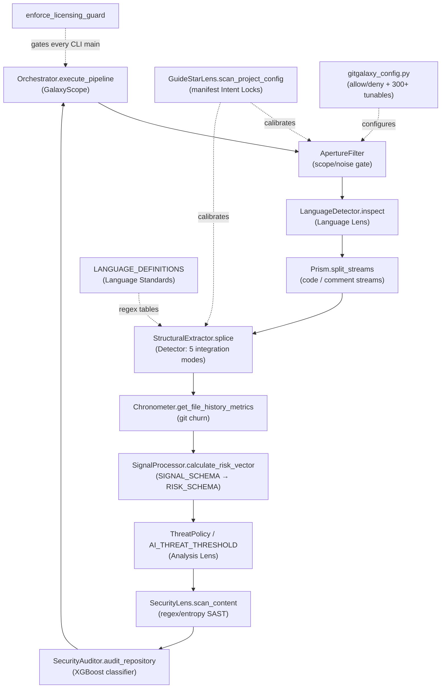

# gitgalaxy — what it is and how it fits together

## In one paragraph
gitgalaxy is a whole-repository static-analysis engine whose defining bet, in its own words, is
**"Bypassing LLMs and ASTs"** (the "blAST" engine). Where the other tools in this survey ground
their comprehension in a compiler-grade index (SCIP) or a model, gitgalaxy grounds in neither: it
sequences raw source text with hand-authored, per-language regex tables — the same search
philosophy, its README says, as genomic BLAST scanning DNA for protein domains without
"executing" the organism. A pipeline of independent optical-metaphor stages (Aperture → Prism →
Detector, calibrated by a GuideStar manifest scan and a Language Lens classifier) turns raw text
into uniform `FunctionNode` records in linear time, without requiring the code to compile or a
model to run. Downstream, those records are reduced to counts, and the counts are turned into
~300 tunable "risk exposure" metrics by hand-tuned arithmetic — with exactly one place, a bolted-on
XGBoost classifier in `SecurityAuditor`, where a trained model (not an LLM) gets a vote. This
survey's interest in gitgalaxy is precisely what that substitution costs and buys: zero
compilation requirement, 50+ languages, and 100k LOC/s throughput, in exchange for a "grounding"
that is entirely heuristic — a regex hit, not a resolved symbol.

## Core architecture

The organizing invariant, visible in the diagram: **every stage before `SecurityAuditor` is pure
text processing** — path metadata, byte statistics, and compiled regexes, never a parse tree and
never a model call. Structure is *counted*, not *resolved*: there is no cross-file symbol
resolution, no call graph, no type information — only per-file, per-language pattern hits that
downstream stages aggregate into scores.

## Main concepts

**The optical pipeline (Aperture → Prism → Detector).** Three independent, single-purpose gates
run in sequence over every file before any "understanding" happens: the
[Aperture Filter](concepts/gitgalaxy-core-aperture.md) decides whether a file is even worth
parsing using only path metadata and byte-level noise statistics; the
[Prism](concepts/gitgalaxy-core-prism.md) then splits its text into a code stream and a comment
stream (a genuinely hard problem for docstrings, heredocs, and nestable block comments); and the
[Detector](concepts/gitgalaxy-core-detector.md) — `StructuralExtractor` — slices the code stream
into function-level records using one of five regex/state-machine "integration modes" chosen by
looking up the language, never by understanding it.

**Calibration inputs (GuideStar + Language Lens/Standards).** The
[GuideStar Protocol](concepts/gitgalaxy-core-guidestar_lens.md) reads a project's own manifests
(`package.json`, `.gitattributes`, `.gitignore`, …) into "Intent Locks" that let the pipeline
trust the developer's own signals over its own heuristics. The
[Language Lens](concepts/gitgalaxy-standards-language_lens.md) is the confidence-tiered classifier
that decides *which* language a file is (refusing to guess when signals disagree), and
[Language Standards](concepts/gitgalaxy-standards-language_standards.md) is the actual "grammar" —
56 hand-authored per-language regex dictionaries — that substitutes for a parser once the
language is known.

**GalaxyScope — the pipeline entry point.** [`Orchestrator.execute_pipeline`](concepts/gitgalaxy-galaxyscope.md)
is a 12-phase sequencer, deliberately "strictly a traffic cop," that wires every other subsystem
together across a multiprocessing worker pool. Notably, its only other execution path,
`execute_incremental_scan`, is dead code with zero callers — gitgalaxy has no working
incremental-reconcile story despite shipping the code for one (see
[incremental-reconcile](../../concepts/incremental-reconcile.md) for how the other surveyed tools
compare on this axis).

**From heuristic counts to risk scores (Chronometer, SignalProcessor, Analysis Lens).** Once the
Detector has produced per-file signal counts, [Chronometer](concepts/gitgalaxy-metrics-chronometer.md)
adds a fresh-every-run git-churn survey, and
[SignalProcessor](concepts/gitgalaxy-metrics-signal_processor.md) turns both into an 18-dimension
`RISK_SCHEMA` via hand-tuned, sigmoid-squashed formulas — no dataflow analysis, no inference, just
calibrated arithmetic over keyword-shaped evidence. The
[Analysis Lens](concepts/gitgalaxy-standards-analysis_lens.md) holds the thresholds that turn those
scores into a verdict, including the one number, `AI_THREAT_THRESHOLD`, that hands the decision to
a trained classifier instead of a regex table.

**The one crossing of the "no AST, no LLM" line (SecurityLens + SecurityAuditor).**
[SecurityLens](concepts/gitgalaxy-security-security_lens.md) is regex/entropy SAST — the security
analogue of the Detector, same architectural bet. [SecurityAuditor](concepts/gitgalaxy-security-security_auditor.md)
is the exception: a supervised XGBoost classifier trained on the heuristic signal counts, gated by
`AI_THREAT_THRESHOLD` and still overridable by a hard-coded rule — the one place gitgalaxy
deliberately trades pure heuristics for a model, and the model is never fully trusted even then.

**Peripheral infrastructure (config, licensing, COBOL forge, marketing site).**
[`gitgalaxy_config.py`](concepts/gitgalaxy-standards-gitgalaxy_config.md) holds the allow/deny
literals and the "300+ tunable variables" the README advertises. The
[licensing guard](concepts/gitgalaxy-licensing.md) is a pure-Python RSA check called from nearly
every CLI entry point (never blocking, only adding friction). The
[COBOL Refractor Controller](concepts/gitgalaxy-cobol_refractor_controller.md) is a separate,
COBOL-specific regex pipeline for legacy-code migration that shares gitgalaxy's design philosophy
but does not consume the core engine's output. [`site/app.py`](concepts/site-app.md) is gitgalaxy's
own marketing site and merchandise checkout — unrelated to comprehension.

## How a request flows
A `galaxyscope` CLI invocation: `enforce_licensing_guard` gates entry → `Orchestrator.execute_pipeline`
walks the repo, applying `ApertureFilter` per file → surviving files go through `LanguageDetector.inspect`
→ `Prism.split_streams` → `StructuralExtractor.splice` (using the language's `LANGUAGE_DEFINITIONS`
table, adjusted by any `GuideStarLens` Intent Lock) → per-file signal counts feed `Chronometer` +
`SignalProcessor.calculate_risk_vector` → `ThreatPolicy`/`AI_THREAT_THRESHOLD` calibrate the verdict →
`SecurityLens` and `SecurityAuditor` layer on SAST/ML threat scoring → four recorder modules persist
the forensic JSON/SQLite output the orchestrator returns.

## Map of the wiki
- **"How does the heuristic parser actually work?"** → [Detector](concepts/gitgalaxy-core-detector.md),
  [Prism](concepts/gitgalaxy-core-prism.md), [Language Standards](concepts/gitgalaxy-standards-language_standards.md).
- **"How does it decide what to scan / what language a file is?"** → [Aperture](concepts/gitgalaxy-core-aperture.md),
  [Language Lens](concepts/gitgalaxy-standards-language_lens.md), [GuideStar](concepts/gitgalaxy-core-guidestar_lens.md).
- **"How do heuristic counts become a risk score?"** → [SignalProcessor](concepts/gitgalaxy-metrics-signal_processor.md),
  [Analysis Lens](concepts/gitgalaxy-standards-analysis_lens.md), [Chronometer](concepts/gitgalaxy-metrics-chronometer.md).
- **"Where does it use a real model, and how much?"** → [SecurityAuditor](concepts/gitgalaxy-security-security_auditor.md)
  (the one XGBoost classifier) vs. [SecurityLens](concepts/gitgalaxy-security-security_lens.md) (pure regex).
- **"Does it reconcile incrementally?"** → [GalaxyScope](concepts/gitgalaxy-galaxyscope.md) (short
  answer: not really — the incremental path is dead code) and [Chronometer](concepts/gitgalaxy-metrics-chronometer.md)
  (re-walks history fresh every run).
- **What is `<symbol>` — signature, def, callers?** → `catalog/<module>.md` (per-module index, every
  page here links into it).
- The exhaustive concept table lives in `index.md`; project docs are synthesized separately under
  `doc-concepts/`.
