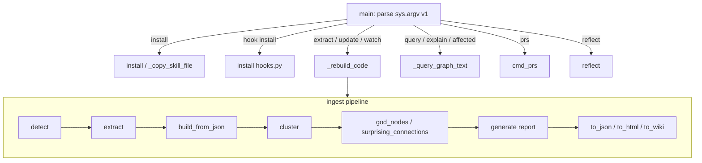

# CLI entry point & command dispatch

## Overview
`graphify` is a single-binary CLI, and almost everything it does flows through one
enormous function — [`main`](../catalog/graphify/__main__.md#main). There is no argparse
sub-parser tree: `main` reads `sys.argv[1]` as a verb and hand-dispatches to the right
subsystem with an `if/elif` ladder. The verbs cluster into a few families — **build a
graph** (`extract`/`update`/`watch`), **query a graph** (`query`/`explain`/`path`/`affected`),
**install the skill** into ~25 agent platforms, **wire up git hooks**, and **triage PRs**.
The mental model that matters for code comprehension: `main` is the conductor of the
ingest pipeline `detect → extract → build → cluster → analyze → report → export`, and
every other command is a smaller entry into that same graph artifact under
[`GRAPHIFY_OUT`](../catalog/graphify/paths.md#GRAPHIFY_OUT) (`graphify-out/`).

## Diagram

## Design rationale (why it's built this way)
The dispatch is deliberately *not* an argparse tree. Several commands
(`query "…"`, `explain "X"`, `path "A" "B"`, `save-result`) take **free text** that can
itself contain flag-like tokens, so `main` special-cases them in a `_FREE_TEXT_CMDS` set
before applying the universal `-h/--help` guard — a fix (#821) after "`cursor install
--help`" silently *installed* into Cursor instead of printing help. The verb ladder also
lets each of the many agent platforms carry its own `install`/`uninstall` subcommand
pair without a combinatorial parser.

> [!inferred]
> The single-function design trades navigability for a flat, greppable command surface:
> every verb, its flags, and its help text live in one place, which is why the help block
> inside `main` is hundreds of `print` lines rather than generated from metadata.

A second non-obvious decision: `main` runs a **skill-version staleness check** on every
invocation *except* the silent commands (`install`, `uninstall`, `hook-check`), because
`hook-check` fires on every editor tool-use and must stay silent. This is why the
top-level `_PLATFORM_CONFIG` table ([`_PLATFORM_CONFIG`](../catalog/graphify/__main__.md#_PLATFORM_CONFIG._PLATFORM_CONFIG))
is consulted even when you only asked to build a graph.

## Entry points
- [`main`](../catalog/graphify/__main__.md#main) — the process entry point. It
  reconfigures stdio to UTF-8, runs the skill-version check across every platform in
  [`_PLATFORM_CONFIG`](../catalog/graphify/__main__.md#_PLATFORM_CONFIG._PLATFORM_CONFIG),
  short-circuits `--version`/`--help`, then dispatches on `sys.argv[1]`.
- [`install`](../catalog/graphify/__main__.md#install) and its per-platform siblings
  [`gemini_install`](../catalog/graphify/__main__.md#gemini_install),
  [`claude_install`](../catalog/graphify/__main__.md#claude_install),
  [`codebuddy_install`](../catalog/graphify/__main__.md#codebuddy_install) — reached by the
  `install` / `<platform> install` verbs; they copy the packaged skill via
  [`_copy_skill_file`](../catalog/graphify/__main__.md#_copy_skill_file) and register it in
  the platform's config file.
- [`cmd_prs`](../catalog/graphify/prs.md#cmd_prs) — reached by the `prs` verb; the PR
  review dashboard (see the graphify-prs page).

## Mechanism (step-by-step)
1. **Dispatch.** [`main`](../catalog/graphify/__main__.md#main) normalizes streams, runs the
   version check, then treats `sys.argv[1]` as the command. Build verbs (`extract`,
   `update`, `watch`) route into the pipeline; the incremental verbs share the watcher's
   rebuild path [`_rebuild_code`](../catalog/graphify/watch.md#_rebuild_code).
2. **Detect the corpus.** [`detect`](../catalog/graphify/detect.md#detect) walks the root,
   classifies each file with [`classify_file`](../catalog/graphify/detect.md#classify_file)
   into a [`FileType`](../catalog/graphify/detect.md#FileType), and skips anything matched by
   [`_is_ignored`](../catalog/graphify/detect.md#_is_ignored) (`.graphifyignore`). This is
   how one graph can span code, docs, papers, and images — the file type decides which
   extractor runs.
3. **Extract structure.** [`extract`](../catalog/graphify/extract.md#extract) is the AST pass:
   [`_get_extractor`](../catalog/graphify/extract.md#_get_extractor) looks up the right
   language extractor in [`_DISPATCH`](../catalog/graphify/extract.md#_DISPATCH._DISPATCH)
   (e.g. [`extract_js`](../catalog/graphify/extract.md#extract_js),
   [`extract_xaml`](../catalog/graphify/extract.md#extract_xaml)), and node IDs are minted
   with [`_make_id`](../catalog/graphify/extractors/base.md#_make_id) /
   [`_file_stem`](../catalog/graphify/extractors/base.md#_file_stem) so a file and its symbols
   share a stable prefix. A cross-file pass
   ([`_apply_symbol_resolution_facts`](../catalog/graphify/extract.md#_apply_symbol_resolution_facts),
   [`_collect_js_symbol_resolution_facts`](../catalog/graphify/extract.md#_collect_js_symbol_resolution_facts))
   turns file-level imports into symbol-level edges — the seam a naive call-graph misses.
4. **Optional LLM extraction.** For prose/deep mode, `extract` (the corpus command) drives
   [`extract_corpus_parallel`](../catalog/graphify/llm.md#extract_corpus_parallel), chunking
   files into [`FileSlice`](../catalog/graphify/file_slice.md#FileSlice) ranges against one of
   the registered [`BACKENDS`](../catalog/graphify/llm.md#BACKENDS.BACKENDS).
5. **Build the graph.** [`build_from_json`](../catalog/graphify/build.md#build_from_json) turns
   the extraction dict into a NetworkX graph; [`edge_data`](../catalog/graphify/build.md#edge_data)
   normalizes edge attributes. `update --global` also folds the result into the cross-repo
   graph via [`global_add`](../catalog/graphify/global_graph.md#global_add).
6. **Cluster & analyze.** [`cluster`](../catalog/graphify/cluster.md#cluster) runs Leiden
   community detection; [`god_nodes`](../catalog/graphify/analyze.md#god_nodes) surfaces the
   most-connected core abstractions and
   [`surprising_connections`](../catalog/graphify/analyze.md#surprising_connections) finds
   non-obvious cross-file edges. This is the structural summary that makes the graph
   navigable rather than a flat symbol dump.
7. **Report & export.** [`generate`](../catalog/graphify/report.md#generate) writes the
   Markdown report; the graph is serialized by
   [`to_json`](../catalog/graphify/export.md#to_json) and rendered by
   [`to_html`](../catalog/graphify/export.md#to_html),
   [`to_wiki`](../catalog/graphify/wiki.md#to_wiki),
   [`to_obsidian`](../catalog/graphify/export.md#to_obsidian), and
   [`write_callflow_html`](../catalog/graphify/callflow_html.md#write_callflow_html) (which
   localizes copy via [`pick_text`](../catalog/graphify/callflow_html.md#pick_text)). Before
   overwriting, [`backup_if_protected`](../catalog/graphify/export.md#backup_if_protected)
   snapshots the prior artifacts and
   [`check_graph_file_size_cap`](../catalog/graphify/security.md#check_graph_file_size_cap)
   guards against oversized files; labels are cleaned by
   [`sanitize_label`](../catalog/graphify/security.md#sanitize_label).
8. **Query the graph.** The `query`/`explain`/`affected` verbs load `graph.json` and call
   [`_query_graph_text`](../catalog/graphify/serve.md#_query_graph_text), which scores nodes
   against the question with [`_score_nodes`](../catalog/graphify/serve.md#_score_nodes) and
   walks a token-budgeted neighborhood — the "answer from the graph, not from grep"
   interface. `save-result` files the Q&A back with
   [`save_query_result`](../catalog/graphify/ingest.md#save_query_result) so it re-enters the
   graph on the next update.
9. **Reflect.** The `reflect` verb aggregates saved outcomes:
   [`reflect`](../catalog/graphify/reflect.md#reflect) scans the memory dir and
   [`aggregate_lessons`](../catalog/graphify/reflect.md#aggregate_lessons) produces a
   deterministic, time-decayed lessons doc — the feedback loop that lets past answers
   inform future ones.
10. **Install & hooks.** Platform verbs call [`install`](../catalog/graphify/__main__.md#install)
    (or [`_project_install`](../catalog/graphify/__main__.md#_project_install) for project
    scope), copying the skill with
    [`_copy_skill_file`](../catalog/graphify/__main__.md#_copy_skill_file). `uninstall`
    fans out through [`uninstall_all`](../catalog/graphify/__main__.md#uninstall_all) /
    [`_project_uninstall`](../catalog/graphify/__main__.md#_project_uninstall) /
    [`codebuddy_uninstall`](../catalog/graphify/__main__.md#codebuddy_uninstall). The `hook`
    verb wires the git hooks via [`install`](../catalog/graphify/hooks.md#install) /
    [`uninstall`](../catalog/graphify/hooks.md#uninstall).

## Key data structures
- **`graphify-out/`** — every command reads and writes under
  [`GRAPHIFY_OUT`](../catalog/graphify/paths.md#GRAPHIFY_OUT); the graph
  (`graph.json`), report, HTML, cache, and memory all live there. It is the single
  persistent artifact the CLI exists to maintain.
- **`_PLATFORM_CONFIG`** — the table
  ([`_PLATFORM_CONFIG`](../catalog/graphify/__main__.md#_PLATFORM_CONFIG._PLATFORM_CONFIG))
  mapping each supported agent platform to its skill destination and config markers;
  drives both install/uninstall and the version-staleness check.
- **`FileType`** — the classification enum
  ([`FileType`](../catalog/graphify/detect.md#FileType)) that steers a path to the correct
  extractor, encoding "one graph, many source kinds."

## Dynamics (design intent)
The build pipeline is a strict linear order — detect, extract, build, cluster, analyze,
report, export — with the graph as the hand-off between stages. Incremental verbs
(`update`, `watch`, hook-triggered rebuilds) deliberately re-enter at
[`_rebuild_code`](../catalog/graphify/watch.md#_rebuild_code) so they reuse the same
extract→build→cluster→report path but preserve unchanged nodes rather than rebuilding
from scratch. The `--global` path additionally merges into a shared cross-repo graph via
[`global_add`](../catalog/graphify/global_graph.md#global_add).

## Edge cases
- **Silent commands.** The version check is skipped for `install`/`uninstall`/`hook-check`
  inside [`main`](../catalog/graphify/__main__.md#main) so hook-triggered invocations don't
  emit noise on every editor action.
- **Free-text vs. flags.** `query`/`explain`/`path`/`save-result` bypass the universal help
  guard in [`main`](../catalog/graphify/__main__.md#main); a `--help` inside a question is
  data, not a request for usage.
- **Duplicate `install` symbols.** There are two `install` functions — the platform
  installer [`install`](../catalog/graphify/__main__.md#install) and the git-hook installer
  [`install`](../catalog/graphify/hooks.md#install); the verb (`install` vs `hook install`)
  selects between them.

## Open questions
- The exact `query`/`explain`/`path` dispatch bodies (BFS vs DFS, budget handling) live in
  `serve` beyond this packet's subgraph; only
  [`_query_graph_text`](../catalog/graphify/serve.md#_query_graph_text) and
  [`_score_nodes`](../catalog/graphify/serve.md#_score_nodes) are cited here.
- [`deduplicate_entities`](../catalog/graphify/dedup.md#deduplicate_entities),
  [`build_merge`](../catalog/graphify/build.md#build_merge),
  [`render_dashboard`](../catalog/graphify/prs.md#render_dashboard),
  [`render_pr_detail`](../catalog/graphify/prs.md#render_pr_detail),
  [`file_hash`](../catalog/graphify/cache.md#file_hash), and
  [`_read_text`](../catalog/graphify/extractors/base.md#_read_text) appear in this packet's
  subgraph as pipeline collaborators but are documented in depth on their own concept
  pages (graphify-prs, graphify-cache).

## See also
- graphify-cache — content-addressed incremental extraction the pipeline sits on.
- graphify-watch — the `watch`/`update` rebuild path.
- graphify-hooks — git hooks that trigger rebuilds.
- graphify-prs — the `prs` dashboard.
