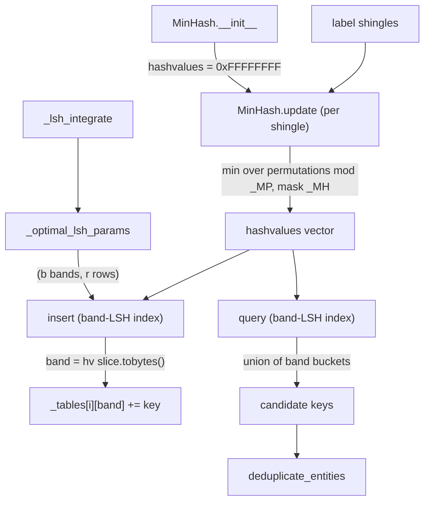

# graphify-_minhash — MinHash + band-LSH, a scipy-free datasketch clone

## Overview
This module is the *blocking* engine underneath entity deduplication: it answers "which labels
are similar enough to be worth a full Jaro-Winkler comparison" without comparing every pair. The
single design idea is **approximate set similarity via MinHash sketches, made sub-quadratic by
LSH banding**, reimplemented as a drop-in for `datasketch` so graphify can avoid that library's
scipy dependency. [`MinHash`](../catalog/graphify/_minhash.md#MinHash) reduces a label's shingle
set to a short vector of min-hashes whose collision probability equals Jaccard similarity; the
band-LSH index buckets those vectors so [`query`](../catalog/graphify/_minhash.md#MinHashLSH.query)
returns only the near neighbours of a sketch. Dedup uses exactly this
[`insert`](../catalog/graphify/_minhash.md#MinHashLSH.insert)/`query` surface — see
[`_make_minhash`](../catalog/graphify/dedup.md#_make_minhash) and
[`deduplicate_entities`](../catalog/graphify/dedup.md#deduplicate_entities).

## Diagram

## Design rationale (why it's built this way)
The module docstring is unusually explicit about *why it exists at all*: datasketch's LSH imports
`scipy.integrate.quad`, and scipy's array-API compat layer lazily loads `numpy.testing`, which
"calls platform.machine() at import time … [spawning] cmd.exe via subprocess, hanging for minutes
under EDR software in corporate Windows environments." So graphify reimplements only the exact
`MinHash`/LSH surface dedup needs, keeping "hash family (Mersenne-prime permutations) and LSH band
structure … equivalent to datasketch so dedup quality is unchanged." This is a portability
decision that directly serves the tool's "runs anywhere" goal.

The MinHash math is a **universal-hash permutation family**. Each sketch mixes an incoming
value with per-permutation coefficients modulo the Mersenne prime
[`_MP`](../catalog/graphify/_minhash.md#_MP) and masks to 32 bits with
[`_MH`](../catalog/graphify/_minhash.md#_MH), then keeps the elementwise minimum.
[`update`](../catalog/graphify/_minhash.md#MinHash.update) does this for one shingle; over a whole
label the vector of per-permutation minima has the MinHash property that two sets agree in a slot
with probability equal to their Jaccard similarity. The coefficients are seeded once
(`RandomState(1)`) and shared across instances, so identical texts always produce identical
sketches — the reproducibility the dedup pipeline relies on.

**Banding is what makes it scale, and it is tunable.** Instead of comparing sketches pairwise,
the index splits each sketch into `b` bands of `r` rows and hashes each band; two sketches are
candidates if they collide in *any* band. The band/row split isn't hard-coded —
[`_optimal_lsh_params`](../catalog/graphify/_minhash.md#_optimal_lsh_params) searches
`(b, r)` to minimise the weighted false-positive + false-negative error of the LSH S-curve for a
given threshold, integrating the curve with a homegrown
[`_lsh_integrate`](../catalog/graphify/_minhash.md#_lsh_integrate) (the replacement for the
scipy `quad` that caused the hang), and caches the result in
[`_LSH_PARAMS_CACHE`](../catalog/graphify/_minhash.md#_LSH_PARAMS_CACHE._LSH_PARAMS_CACHE). This is
the classic LSH tradeoff: more bands raise recall (more candidates) at the cost of precision, and
graphify picks the split that best matches its `0.7` dedup threshold.

## Entry points
- [`MinHash`](../catalog/graphify/_minhash.md#MinHash) — constructed per label by dedup's
  [`_make_minhash`](../catalog/graphify/dedup.md#_make_minhash);
  [`__init__`](../catalog/graphify/_minhash.md#MinHash.__init__) allocates the all-ones
  hashvalues vector and grabs the shared permutation coefficients.
- [`update`](../catalog/graphify/_minhash.md#MinHash.update) — fed one shingle's bytes at a time;
  folds it into the running per-permutation minima.
- [`insert`](../catalog/graphify/_minhash.md#MinHashLSH.insert) — indexes a finished sketch under
  a key; reached once per candidate node from
  [`deduplicate_entities`](../catalog/graphify/dedup.md#deduplicate_entities).
- [`query`](../catalog/graphify/_minhash.md#MinHashLSH.query) — returns the candidate keys sharing
  at least one band with a sketch; the blocking step dedup iterates over.

## Mechanism (step-by-step)
1. **Sketch init.** [`MinHash.__init__`](../catalog/graphify/_minhash.md#MinHash.__init__) sets
   `hashvalues` to all-ones (the mask [`_MH`](../catalog/graphify/_minhash.md#_MH)) so the first
   `update` for any permutation replaces the sentinel with a real minimum.
2. **Fold shingles.** [`update`](../catalog/graphify/_minhash.md#MinHash.update) hashes the
   shingle to a 32-bit value, applies each permutation `(a·h + b) mod _MP` masked by
   [`_MH`](../catalog/graphify/_minhash.md#_MH), and takes the elementwise minimum against the
   current vector — modulo the Mersenne prime [`_MP`](../catalog/graphify/_minhash.md#_MP).
3. **Choose the band geometry.** When the index is created,
   [`_optimal_lsh_params`](../catalog/graphify/_minhash.md#_optimal_lsh_params) (via
   [`_lsh_integrate`](../catalog/graphify/_minhash.md#_lsh_integrate)) picks `(b, r)` for the
   configured threshold, exposing the band width as
   [`r`](../catalog/graphify/_minhash.md#MinHashLSH.r) and band count as
   [`b`](../catalog/graphify/_minhash.md#MinHashLSH.b).
4. **Insert into band tables.** [`insert`](../catalog/graphify/_minhash.md#MinHashLSH.insert)
   slices the sketch into `b` bands of [`r`](../catalog/graphify/_minhash.md#MinHashLSH.r) rows,
   uses each band's raw bytes as a bucket key in the corresponding
   [`_tables`](../catalog/graphify/_minhash.md#MinHashLSH._tables) dict, and records the key in
   [`_keys`](../catalog/graphify/_minhash.md#MinHashLSH._keys) so a duplicate insert raises.
5. **Query for candidates.** [`query`](../catalog/graphify/_minhash.md#MinHashLSH.query) re-derives
   the same band bytes and unions every bucket's members — the set of keys that collided in at
   least one band, which always includes the sketch's own key.

## Key data structures
- `MinHash.hashvalues` — a `numpy.uint64` vector (default 128 permutations); the sketch. Its
  slots collide across two labels with probability ≈ their Jaccard similarity
  ([`MinHash`](../catalog/graphify/_minhash.md#MinHash)).
- Band tables — [`_tables`](../catalog/graphify/_minhash.md#MinHashLSH._tables), one
  `band-bytes → [keys]` dict per band, plus [`_keys`](../catalog/graphify/_minhash.md#MinHashLSH._keys)
  for duplicate detection; band width [`r`](../catalog/graphify/_minhash.md#MinHashLSH.r) and count
  [`b`](../catalog/graphify/_minhash.md#MinHashLSH.b).
- The parameter cache [`_LSH_PARAMS_CACHE`](../catalog/graphify/_minhash.md#_LSH_PARAMS_CACHE._LSH_PARAMS_CACHE)
  and the hash constants [`_MP`](../catalog/graphify/_minhash.md#_MP) /
  [`_MH`](../catalog/graphify/_minhash.md#_MH) — the shared, deterministic state.

## Dynamics (design intent)
The tests characterize the probabilistic behavior as invariants:
`test_identical_texts_produce_identical_hashvalues` and `test_update_mutates_hashvalues` pin
[`update`](../catalog/graphify/_minhash.md#MinHash.update)'s determinism;
`test_similar_texts_share_most_hashvalues` and `test_unrelated_texts_share_few_hashvalues` confirm
the Jaccard-collision property; and `test_near_duplicates_are_candidates`,
`test_unrelated_strings_not_candidates`, and `test_query_always_returns_self` fix the blocking
contract of [`query`](../catalog/graphify/_minhash.md#MinHashLSH.query) (with the helper
[`_minhash_for`](../catalog/tests/test_minhash.md#_minhash_for)).

## Edge cases
- [`insert`](../catalog/graphify/_minhash.md#MinHashLSH.insert) raises `ValueError` on a duplicate
  key (pinned by `test_duplicate_insert_raises`); dedup's caller catches this and treats it as
  "already inserted."
- A sketch always shares all bands with itself, so
  [`query`](../catalog/graphify/_minhash.md#MinHashLSH.query) always returns the querying key —
  callers must filter out `self` (`test_query_always_returns_self`).

## Open questions
- LSH is a *probabilistic* filter: near-duplicates can miss a band and be dropped before
  Jaro-Winkler ever sees them. The exact recall at graphify's `0.7` threshold and 128 permutations
  is set by [`_optimal_lsh_params`](../catalog/graphify/_minhash.md#_optimal_lsh_params) but is not
  asserted numerically in the cited tests.

## See also
- [graphify-dedup](graphify-dedup.md) — the sole consumer; wraps this in the guarded merge
  pipeline.
- [graphify-build](graphify-build.md) — where dedup (and thus this blocking) runs during graph
  assembly.
