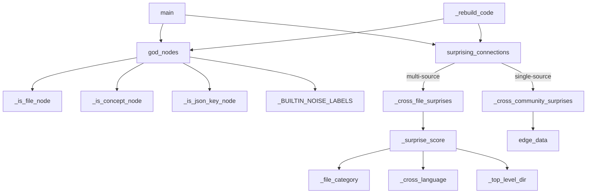

# Graph analysis — god nodes and surprising connections

## Overview
Once a corpus has been extracted, built into a NetworkX graph and clustered into
communities, this layer answers the two questions a reader actually opens a
codebase to ask: *what are the core abstractions?* and *what non-obvious links
should I look at?* The first is [`god_nodes`](../catalog/graphify/analyze.md#god_nodes)
— the highest-degree real entities, with mechanical hubs and noise filtered out.
The second is [`surprising_connections`](../catalog/graphify/analyze.md#surprising_connections)
— cross-boundary edges ranked by a composite [`_surprise_score`](../catalog/graphify/analyze.md#_surprise_score).
The design idea running through both is **separating architectural signal from
extraction artefacts**: raw degree and raw edges are polluted by file-hub nodes,
JSON keys, builtin types and resolver false-positives, so most of the code here is
principled *suppression* rather than ranking.

## Diagram

## Design rationale (why it's built this way)
**Degree alone lies.** A file-level hub node like `client` or `models` accumulates
`import`/`contains` edges mechanically, so it would top a naive degree ranking
without being a meaningful abstraction. [`god_nodes`](../catalog/graphify/analyze.md#god_nodes)
therefore sorts by degree but *skips* file hubs, injected concept nodes, generic
JSON keys and stdlib/builtin type names before taking the top N. Each exclusion is
a named predicate so the intent is legible, and the filters are label-driven so they
catch noise even in a pre-existing graph that wasn't cleaned at extraction time (the
JSON-key filter folds case; the builtin-noise list matches labels exactly).

**"Surprising" is a scored composite, not just low confidence.**
[`_surprise_score`](../catalog/graphify/analyze.md#_surprise_score) sums several
orthogonal signals — confidence tier, crossing file *types* (code↔paper),
crossing repos/directories, bridging Leiden communities, and a peripheral→hub
reach — and multiplies for genuine semantic-similarity links. The author's key
insight, encoded directly in the scorer, is that some structurally-surprising edges
are actually **resolver pollution**: an `INFERRED` `calls`/`uses` edge that crosses
language families or connects code to a doc file is almost always a label-match
false positive, not real architecture. Those get their confidence weight and every
cross-boundary bonus (file-type, repo, community) zeroed — only the peripheral→hub
degree bonus is left ungated.
The suppression carefully *excludes* `semantically_similar_to` (a real cross-boundary
insight) and all `AMBIGUOUS`/`EXTRACTED` edges (not from the resolver path) — a
distinction pinned down by a dense test matrix (see Dynamics).

**Two corpora, two strategies.** [`surprising_connections`](../catalog/graphify/analyze.md#surprising_connections)
branches on whether the corpus spans multiple source files. Multi-file corpora have
real cross-file edges worth ranking; a single-file (or single-source) corpus has
none, so it falls back to community-bridging edges — or, with no community info,
raw edge-betweenness. This is why a one-file input still yields non-empty,
meaningful surprises instead of an empty list.

## Entry points
- [`main`](../catalog/graphify/__main__.md#main) — the CLI report path calls
  [`god_nodes`](../catalog/graphify/analyze.md#god_nodes) and
  [`surprising_connections`](../catalog/graphify/analyze.md#surprising_connections)
  (alongside [`edge_data`](../catalog/graphify/build.md#edge_data)) to render the
  human-facing analysis section.
- [`_rebuild_code`](../catalog/graphify/watch.md#_rebuild_code) — the watcher/
  post-commit incremental path re-runs the same two analyses after an AST-only
  rebuild, so the report stays current with no LLM call.
- [`read_resource`](../catalog/graphify/serve.md#_build_server.read_resource) and
  [`_tool_god_nodes`](../catalog/graphify/serve.md#_build_server._tool_god_nodes) —
  the MCP server exposes [`god_nodes`](../catalog/graphify/analyze.md#god_nodes) and
  [`surprising_connections`](../catalog/graphify/analyze.md#surprising_connections)
  as an agent-queryable read surface over the same graph.

## Mechanism (step-by-step)
1. **Rank the core abstractions.** [`god_nodes`](../catalog/graphify/analyze.md#god_nodes)
   sorts all nodes by NetworkX degree, then walks that order skipping any node that
   [`_is_file_node`](../catalog/graphify/analyze.md#_is_file_node),
   [`_is_concept_node`](../catalog/graphify/analyze.md#_is_concept_node) or
   [`_is_json_key_node`](../catalog/graphify/analyze.md#_is_json_key_node) flags, or
   whose label sits in [`_BUILTIN_NOISE_LABELS`](../catalog/graphify/analyze.md#_BUILTIN_NOISE_LABELS),
   accumulating `{id, label, degree}` until it has `top_n`. The result is the
   architectural spine of the corpus.

2. **Classify the noise.** [`_is_file_node`](../catalog/graphify/analyze.md#_is_file_node)
   recognises file-name hubs and AST method/function stubs (labels like `.foo()` or a
   degree-≤1 `foo()`); [`_is_concept_node`](../catalog/graphify/analyze.md#_is_concept_node)
   recognises manually-injected semantic nodes by an empty or extensionless
   `source_file`; and [`_is_json_key_node`](../catalog/graphify/analyze.md#_is_json_key_node)
   drops generic keys (`name`, `id`, npm dep-block keys) that only appear because a
   `.json` file was parsed, checked against [`_JSON_NOISE_LABELS`](../catalog/graphify/analyze.md#_JSON_NOISE_LABELS._JSON_NOISE_LABELS).
   These predicates are shared by both analyses.

3. **Choose a surprise strategy.** [`surprising_connections`](../catalog/graphify/analyze.md#surprising_connections)
   counts distinct non-empty `source_file` values; more than one routes to
   [`_cross_file_surprises`](../catalog/graphify/analyze.md#_cross_file_surprises),
   otherwise to [`_cross_community_surprises`](../catalog/graphify/analyze.md#_cross_community_surprises).
   Concept nodes are excluded throughout because they are intentional annotations,
   not discovered links.

4. **Rank cross-file edges.** [`_cross_file_surprises`](../catalog/graphify/analyze.md#_cross_file_surprises)
   iterates real edges (dropping `imports`/`contains`/`method` structural edges and
   file/concept endpoints), computes a score per edge with
   [`_surprise_score`](../catalog/graphify/analyze.md#_surprise_score) over a
   precomputed degree map and the community map from
   [`_node_community_map`](../catalog/graphify/analyze.md#_node_community_map), sorts
   descending and returns the top N — each carrying a human `why` string assembled
   from the scorer's reasons. If nothing survives, it too falls back to community
   bridges.

5. **Compute the composite score.** [`_surprise_score`](../catalog/graphify/analyze.md#_surprise_score)
   adds a confidence bonus (`AMBIGUOUS` 3 > `INFERRED` 2 > `EXTRACTED` 1), a
   file-type-crossing bonus using [`_file_category`](../catalog/graphify/analyze.md#_file_category),
   a cross-repo bonus using [`_top_level_dir`](../catalog/graphify/analyze.md#_top_level_dir),
   a cross-community bonus, a 1.5× multiplier for `semantically_similar_to`, and a
   peripheral→hub bonus. Crucially, when the edge is an `INFERRED` `calls`/`uses`
   that either [`_cross_language`](../catalog/graphify/analyze.md#_cross_language)
   flags or bridges `{code, doc}`, the confidence weight and the cross-boundary
   bonuses (file-type, repo, community) are zeroed to avoid surfacing resolver
   false-positives (the peripheral→hub degree bonus is not gated).

6. **Categorise files and languages.** [`_file_category`](../catalog/graphify/analyze.md#_file_category)
   maps an extension to `code`/`paper`/`image`/`doc` using the shared sets
   [`CODE_EXTENSIONS`](../catalog/graphify/detect.md#CODE_EXTENSIONS),
   [`PAPER_EXTENSIONS`](../catalog/graphify/detect.md#PAPER_EXTENSIONS) and
   [`IMAGE_EXTENSIONS`](../catalog/graphify/detect.md#IMAGE_EXTENSIONS) (unknown
   extensions fall back to `doc`), while [`_cross_language`](../catalog/graphify/analyze.md#_cross_language)
   groups extensions into runtime families via [`_LANG_FAMILY`](../catalog/graphify/analyze.md#_LANG_FAMILY._LANG_FAMILY)
   — two files in different families can't legitimately `call` each
   other, which is what powers the suppression.

7. **Fall back to structural bridges.** For single-source corpora,
   [`_cross_community_surprises`](../catalog/graphify/analyze.md#_cross_community_surprises)
   surfaces edges whose endpoints sit in different communities (reading each edge's
   attributes through [`edge_data`](../catalog/graphify/build.md#edge_data), which
   tolerates a MultiGraph), or — with no community info and a small enough graph —
   ranks by `nx.edge_betweenness_centrality`. Either way the reader gets the edges
   that cut across the graph's natural structure.

## Key data structures
- **The community map** — `communities: dict[int, list[str]]` inverted by
  [`_node_community_map`](../catalog/graphify/analyze.md#_node_community_map) into
  `node → community_id`, the lookup that drives every cross-community judgement.
- **The scored candidate dict** — `{source, target, source_files, confidence,
  relation, why}` produced by [`_cross_file_surprises`](../catalog/graphify/analyze.md#_cross_file_surprises);
  the internal `_score` is stripped before return so the output is presentation-ready.
- **Noise sets** — [`_BUILTIN_NOISE_LABELS`](../catalog/graphify/analyze.md#_BUILTIN_NOISE_LABELS)
  and [`_JSON_NOISE_LABELS`](../catalog/graphify/analyze.md#_JSON_NOISE_LABELS._JSON_NOISE_LABELS)
  are the static blocklists that keep generic names out of the god-node ranking.

## Dynamics (design intent)
The suppression logic is defined by tests, not by prose alone. A tight matrix
asserts the exact boundary: cross-language *EXTRACTED* calls are kept
([`test_cross_language_extracted_calls_not_suppressed`](../catalog/tests/test_analyze.md#test_cross_language_extracted_calls_not_suppressed))
while cross-language *INFERRED* calls/uses are suppressed
([`test_cross_language_inferred_uses_suppressed`](../catalog/tests/test_analyze.md#test_cross_language_inferred_uses_suppressed)),
`semantically_similar_to` is never suppressed
([`test_cross_language_semantically_similar_not_suppressed`](../catalog/tests/test_analyze.md#test_cross_language_semantically_similar_not_suppressed)),
code↔doc inferred calls are penalised
([`test_code_doc_inferred_calls_suppressed`](../catalog/tests/test_analyze.md#test_code_doc_inferred_calls_suppressed))
but code↔paper inferred calls stay
([`test_code_paper_inferred_calls_not_suppressed`](../catalog/tests/test_analyze.md#test_code_paper_inferred_calls_not_suppressed)),
and an AMBIGUOUS edge outscores an otherwise-identical EXTRACTED one
([`test_surprising_connections_ambiguous_scores_higher_than_extracted`](../catalog/tests/test_analyze.md#test_surprising_connections_ambiguous_scores_higher_than_extracted)).
[`god_nodes`](../catalog/graphify/analyze.md#god_nodes) is likewise pinned to
degree-sorted output ([`test_god_nodes_sorted_by_degree`](../catalog/tests/test_analyze.md#test_god_nodes_sorted_by_degree))
with JSON/npm noise excluded ([`test_god_nodes_excludes_json_noise`](../catalog/tests/test_analyze.md#test_god_nodes_excludes_json_noise)).

## Edge cases
- **Single-file corpus.** Returns community bridges, never an empty list —
  [`test_surprising_connections_single_file_uses_community_bridges`](../catalog/tests/test_analyze.md#test_surprising_connections_single_file_uses_community_bridges).
- **Unknown extension.** [`_file_category`](../catalog/graphify/analyze.md#_file_category)
  treats it as `doc`, so an unknown-extension inferred call is suppressed like a
  code↔doc edge — [`test_code_unknown_extension_inferred_calls_suppressed`](../catalog/tests/test_analyze.md#test_code_unknown_extension_inferred_calls_suppressed).
- **Very large single-source graph.** [`_cross_community_surprises`](../catalog/graphify/analyze.md#_cross_community_surprises)
  skips the O(V·E) betweenness computation above 5000 nodes and returns empty rather
  than hang.
- **MultiGraph parallel edges.** [`edge_data`](../catalog/graphify/build.md#edge_data)
  returns the first parallel edge's attributes so rendering never crashes on a
  MultiGraph.

## Open questions
- Community detection itself (the Leiden clustering that produces the
  `communities` argument) lives outside this packet; the analysis consumes it but
  the clustering algorithm and its parameters aren't citable here.
- The `_src`/`_tgt` edge attributes used to recover directional endpoint labels in
  [`_cross_file_surprises`](../catalog/graphify/analyze.md#_cross_file_surprises) are
  populated by the build/resolution layer, not visible in this subgraph.

## See also
- [graphify-llm](graphify-llm.md) — produces the nodes/edges (and confidence tiers)
  this layer ranks.
- [graphify-reflect](graphify-reflect.md) — uses the same community map to group
  learned lessons by topic.
- [graphify-security](graphify-security.md) — sanitises the labels these analyses
  emit into reports and HTML.
