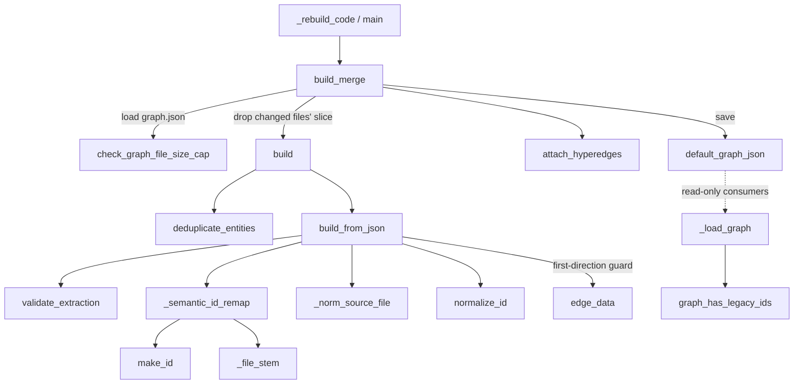

# graphify-build — extraction dicts to a persistent NetworkX graph

<!-- connect:up:begin -->
> **Cross-repo concept:** part of [symbol-graph](../../../concepts/symbol-graph.md) across this wiki's repos.
<!-- connect:up:end -->
## Overview
`build` is the seam where graphify's heterogeneous *extractions* — AST facts for code,
LLM-produced facts for docs/papers/images/video — become one in-memory NetworkX graph that
every later stage (cluster, analyze, export, serve) reads. The single design idea is that
**the graph is assembled from untrusted, drifting node/edge dicts and must reconcile them onto
one canonical identity per real-world entity**, so the bulk of the code is not "add node, add
edge" but *ID canonicalization, ghost-merging, and edge repair* that make a re-run converge
instead of accumulating duplicates. [`build_from_json`](../catalog/graphify/build.md#build_from_json)
turns one extraction dict into a graph; [`build`](../catalog/graphify/build.md#build) merges
several (running dedup first); [`build_merge`](../catalog/graphify/build.md#build_merge) is the
incremental path that loads the persisted `graph.json`, replaces the changed files' slice, and
saves back — the mechanism that makes the knowledge graph *persistent* rather than rebuilt from
scratch each time.

## Diagram

## Design rationale (why it's built this way)
The hard problem build solves is that the same real entity arrives under several IDs. AST
extraction qualifies a symbol by its full path stem, while a cached or LLM fragment may carry a
pre-migration short id or slightly different casing. Rather than trust the fragment's `id`
string, [`_semantic_id_remap`](../catalog/graphify/build.md#_semantic_id_remap) **re-derives**
every non-AST node's id from its own `source_file` in code — the docstring calls this
"drift-proof by construction … the new id is computed from `source_file` in code, never trusted
from the fragment's own `id`." AST-origin nodes are skipped because the extractor's post-pass
already made them canonical. This is why graphify does not spawn a ghost node for every slightly
misremembered LLM id: identity is recomputed, not accepted.

A second, subtler decision is that **edge direction is preserved even in an undirected graph**.
`build_from_json` defaults to `directed=False` for backward compatibility, but a plain
`nx.Graph` would lose caller→callee direction. The code stores the original endpoints in `_src`
/ `_tgt` attributes and, when a node pair appears twice with opposite directions, keeps the
first-seen one (regression #1061). [`edge_data`](../catalog/graphify/build.md#edge_data) exists
precisely so this direction check "tolerat[es] MultiGraph" — returning one attribute dict even
when parallel edges exist. `test_build_from_json_preserves_first_direction_on_bidirectional_pair`
and `test_build_merge_preserves_call_edge_direction` (regression #760) pin this.

The persistence path deliberately reads `graph.json` as raw JSON rather than through
`node_link_graph()`. [`build_merge`](../catalog/graphify/build.md#build_merge)'s docstring
explains why: the NetworkX round-trip "rebuilds an undirected nx.Graph and then enumerating
edges() yields endpoints based on node insertion order, which silently flips directional edges …
so going through the NetworkX round-trip loses direction permanently (#760)." Reading the JSON
directly keeps the `_src`/`_tgt` attributes intact.

## Entry points
- [`build_from_json`](../catalog/graphify/build.md#build_from_json) — the core builder;
  control reaches it from every path that has a single extraction dict (a fresh extract, a test
  fixture, a reload). It validates via [`validate_extraction`](../catalog/graphify/validate.md#validate_extraction),
  canonicalizes IDs, and returns the `nx.Graph`/`nx.DiGraph`.
- [`build`](../catalog/graphify/build.md#build) — called when several extractions must become
  one graph. It concatenates their nodes/edges/hyperedges, runs
  [`deduplicate_entities`](../catalog/graphify/dedup.md#deduplicate_entities) (when `dedup=True`),
  then delegates to `build_from_json`.
- [`build_merge`](../catalog/graphify/build.md#build_merge) — the incremental persistence entry.
  Reached from [`_rebuild_code`](../catalog/graphify/watch.md#_rebuild_code) and the CLI
  [`main`](../catalog/graphify/__main__.md#main); loads the existing graph, replaces the slice
  for re-extracted `source_file`s, prunes deleted files, and saves.
- [`_load_graph`](../catalog/graphify/serve.md#_load_graph) — a read-only consumer (the MCP
  server) that loads `graph.json` and calls
  [`graph_has_legacy_ids`](../catalog/graphify/build.md#graph_has_legacy_ids) to nudge a rebuild
  when the stored IDs predate the full-path scheme.

## Mechanism (step-by-step)
1. **Schema canonicalization.** [`build_from_json`](../catalog/graphify/build.md#build_from_json)
   first repairs legacy shapes: `links`→`edges`, a node's `source`→`source_file`, missing
   `file_type`→`concept`, and unknown file types folded through a synonym map. It then runs
   [`validate_extraction`](../catalog/graphify/validate.md#validate_extraction), demoting the
   expected "dangling edge to stdlib/external" warnings so only real schema errors print.
2. **Deterministic semantic re-key.** [`_semantic_id_remap`](../catalog/graphify/build.md#_semantic_id_remap)
   builds a remap from every non-AST node's `source_file`, using
   [`_file_stem`](../catalog/graphify/extractors/base.md#_file_stem) plus
   [`make_id`](../catalog/graphify/ids.md#make_id) to compute the canonical stem, and rewrites
   node ids, edge endpoints, and hyperedge member lists so a drifted fragment reconciles with
   its AST twin instead of spawning a duplicate.
3. **Node insertion with path relativization.** Each node is added to the graph; its
   `source_file` is passed through [`_norm_source_file`](../catalog/graphify/build.md#_norm_source_file)
   so an absolute path from a semantic subagent becomes repo-relative and shares a key with the
   AST node (#932). Non-hashable or id-less nodes are skipped defensively.
4. **Ghost merge against AST canonicals.** A `(basename, label)` index over
   [`normalize_id`](../catalog/graphify/ids.md#normalize_id)-keyed nodes identifies non-AST
   "ghost" nodes that duplicate an AST node; ambiguous collisions are left intact, unambiguous
   ghosts are removed and their edges re-pointed to the canonical id.
5. **Edge repair and direction preservation.** Edges are iterated in a deterministic sort so
   last-write outcomes are stable; mismatched endpoints are remapped through the normalized-id
   alias table; cross-language phantom `INFERRED calls` edges are dropped; `_src`/`_tgt` are
   stamped and the first-seen direction wins, checked via
   [`edge_data`](../catalog/graphify/build.md#edge_data).
6. **Multi-extraction merge.** [`build`](../catalog/graphify/build.md#build) concatenates all
   extractions, optionally runs [`deduplicate_entities`](../catalog/graphify/dedup.md#deduplicate_entities),
   and calls `build_from_json` once on the combined dict.
7. **Incremental persistence.** [`build_merge`](../catalog/graphify/build.md#build_merge) size-checks
   the file via [`check_graph_file_size_cap`](../catalog/graphify/security.md#check_graph_file_size_cap),
   reads it as raw JSON, drops every node/edge whose `source_file` is in the new chunks (so a
   changed file *replaces* its prior contribution), rebuilds via `build`, carries forward and
   id-dedups surviving hyperedges with [`attach_hyperedges`](../catalog/graphify/export.md#attach_hyperedges),
   prunes deleted sources, refuses to silently shrink the graph, and writes back to
   [`default_graph_json`](../catalog/graphify/paths.md#default_graph_json).

## Key data structures
- The graph itself: an `nx.Graph` (or `nx.DiGraph` when `directed=True`). Direction for
  undirected graphs lives in each edge's `_src`/`_tgt` attributes; hyperedges live in
  `G.graph["hyperedges"]`. [`edge_data`](../catalog/graphify/build.md#edge_data) is the accessor
  that hides simple-vs-Multi graph differences from callers that only need relation/confidence.
- The remap table from [`_semantic_id_remap`](../catalog/graphify/build.md#_semantic_id_remap):
  `{old_id: canonical_id}`, plus the in-`build_from_json` `norm_to_id` alias index that lets a
  stale edge endpoint resolve to a migrated node.
- The persisted `graph.json` at [`default_graph_json`](../catalog/graphify/paths.md#default_graph_json)
  under [`GRAPHIFY_OUT`](../catalog/graphify/paths.md#GRAPHIFY_OUT) — the durable artifact that
  makes the knowledge graph outlive a single command.

## Dynamics (design intent)
Determinism is a stated invariant: edges are sorted before insertion so "the last write wins"
is reproducible, and `run_pipeline` (tests/test_pipeline.py) exercises the whole
extract→build→cluster→export chain, asserting the built graph has nodes and edges.
`test_confidence_score_round_trip` and `test_hyperedges_roundtrip_via_json_file` confirm that
attributes and hyperedges survive the `build_from_json`→JSON→reload cycle
[`build_from_json`](../catalog/graphify/build.md#build_from_json). `build_merge`'s
"Safe to call repeatedly" contract is the persistence guarantee the survey cares about: an
ingest is idempotent because a re-run replaces per-source slices rather than appending.

## Edge cases
- A `source_file` equal to the scan root relativizes to `Path('.')` with no stem;
  [`_semantic_id_remap`](../catalog/graphify/build.md#_semantic_id_remap) and
  [`graph_has_legacy_ids`](../catalog/graphify/build.md#graph_has_legacy_ids) both guard this to
  avoid `_file_stem`'s empty-name crash (#1618).
- [`build_merge`](../catalog/graphify/build.md#build_merge) refuses to shrink the node count
  unless `dedup` or `prune_sources` is active, raising rather than silently losing nodes (#479);
  a corrupt/unreadable `graph.json` raises a `RuntimeError` telling the user to rebuild.
- Read-only consumers such as [`_load_graph`](../catalog/graphify/serve.md#_load_graph) cannot
  re-extract, so [`graph_has_legacy_ids`](../catalog/graphify/build.md#graph_has_legacy_ids)
  only *detects* stale IDs (sampling file-level `L1` nodes) and nudges a rebuild.
- [`diagnose_extraction`](../catalog/graphify/diagnostics.md#diagnose_extraction) reuses
  `build_from_json` to report same-endpoint edge-collapse risk before a user commits to a graph
  shape.

## Open questions
- The subgraph does not include `to_json` / `_normalize_hyperedge_members` / `_old_file_stems`,
  which `build_from_json` and `build_merge` call directly; the serialization and old-stem-alias
  details are described from source but cannot be cited here.
- The `main` CLI dispatch also references [`to_obsidian`](../catalog/graphify/export.md#to_obsidian)
  as an export target of the built graph, but the export mechanism itself is out of this
  packet's scope.

## See also
- [graphify-dedup](graphify-dedup.md) — the entity-merge pass `build` runs before assembling.
- [graphify-cluster](graphify-cluster.md) — community detection over the built graph.
- [graphify-multigraph_compat](graphify-multigraph_compat.md) — the capability probe behind the
  MultiGraph tolerance `edge_data` exists for.
- [graphify-symbol_resolution](graphify-symbol_resolution.md) — how cross-file call edges are
  produced before build ingests them.
