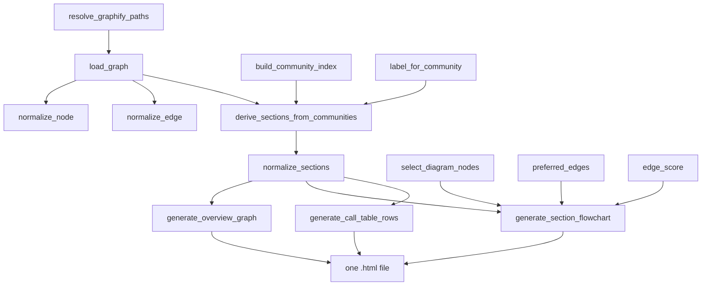

# graphify-callflow_html — rendering the graph as a static architecture doc

## Overview
`callflow_html` is graphify's *report* surface: it reads the persistent `graph.json` and emits a single
self-contained HTML page — a human-readable "call flow & architecture" document with Mermaid diagrams
and call tables — without ever touching the corpus source again. Where `serve` answers ad-hoc questions,
this module answers "give me the whole map at a glance." Its key design problem is **legibility under a
node budget**: a real graph has thousands of nodes and edges, but a diagram a person can read has a
dozen. So the module is a pipeline of *readability filters* — derive a handful of architecture
**sections** from the graph's communities, then for each section select a compact connected node subset
and only the edges worth drawing. The whole thing is driven by
[`write_callflow_html`](../catalog/graphify/callflow_html.md#write_callflow_html).

## Diagram

## Design rationale (why it's built this way)
Every non-trivial function here exists to make a large graph *readable*, and the choices compound.

- **Sections come from communities, keyword-matched to archetypes.** With no hand-authored sections file,
  [`derive_sections_from_communities`](../catalog/graphify/callflow_html.md#derive_sections_from_communities)
  indexes nodes by community ([`build_community_index`](../catalog/graphify/callflow_html.md#build_community_index)),
  names each with [`label_for_community`](../catalog/graphify/callflow_html.md#label_for_community), and
  scores each community's text against fixed architecture archetypes (entry, core, data, …), assigning it
  to the best-scoring section only when the score clears a threshold of 2. This is what turns raw
  community IDs into an *architecture-oriented* table of contents;
  [`test_derive_sections_groups_by_architecture_keywords`](../catalog/tests/test_callflow_html.md#test_derive_sections_groups_by_architecture_keywords)
  pins that the keyword grouping actually fires.

- **Diagram node selection is a connectivity heuristic, not top-degree.**
  [`select_diagram_nodes`](../catalog/graphify/callflow_html.md#select_diagram_nodes) doesn't just take the
  highest-degree nodes; it *starts from likely entry points* (nodes that call out more than they are
  called), then pulls in the most useful neighbors along the strongest edges
  ([`edge_score`](../catalog/graphify/callflow_html.md#edge_score),
  [`node_degree_scores`](../catalog/graphify/callflow_html.md#node_degree_scores)), and caps `concept`
  nodes at a third of the budget via [`add_node`](../catalog/graphify/callflow_html.md#select_diagram_nodes.add_node)
  so a diagram stays a *call flow* and not a tag cloud. A deterministic
  [`fallback_key`](../catalog/graphify/callflow_html.md#select_diagram_nodes.fallback_key) fills any
  remaining slots so output is stable run-to-run.

- **Edges are filtered twice, by usefulness then by budget.**
  [`preferred_edges`](../catalog/graphify/callflow_html.md#preferred_edges) (built on
  [`should_include_edge`](../catalog/graphify/callflow_html.md#should_include_edge)) keeps only edges that
  make a readable flow, preferring true call edges and only allowing structural edges as a fallback when
  no call edges survive; the remaining edges are drawn highest-[`edge_score`](../catalog/graphify/callflow_html.md#edge_score)-first
  up to `max_edges`. The result is a diagram biased toward *behavior* over *containment*.

- **The graph schema is treated as untrusted/variant.** [`load_graph`](../catalog/graphify/callflow_html.md#load_graph)
  normalizes every node and edge ([`normalize_node`](../catalog/graphify/callflow_html.md#normalize_node),
  [`normalize_edge`](../catalog/graphify/callflow_html.md#normalize_edge)) across schema variants using
  tolerant accessors [`first_present`](../catalog/graphify/callflow_html.md#first_present) /
  [`first_list`](../catalog/graphify/callflow_html.md#first_list) /
  [`to_float`](../catalog/graphify/callflow_html.md#to_float) /
  [`endpoint_id`](../catalog/graphify/callflow_html.md#endpoint_id), so a graph produced by any graphify
  version (or `--no-cluster` raw extraction) still renders.

- **Every string that reaches Mermaid or HTML is sanitised.** IDs go through
  [`node_mermaid_id`](../catalog/graphify/callflow_html.md#node_mermaid_id) /
  [`mermaid_section_id`](../catalog/graphify/callflow_html.md#mermaid_section_id), labels through
  [`safe_mermaid_text`](../catalog/graphify/callflow_html.md#safe_mermaid_text) /
  [`humanize_label`](../catalog/graphify/callflow_html.md#humanize_label) /
  [`safe_file_path`](../catalog/graphify/callflow_html.md#safe_file_path) — because a corpus-derived label
  is embedded directly into diagram syntax and would otherwise break the render or inject markup.

## Entry points
- [`write_callflow_html`](../catalog/graphify/callflow_html.md#write_callflow_html) — the one public
  function; takes project/graph/output paths and knobs (`max_sections`, `max_diagram_nodes`,
  `max_diagram_edges`, `diagram_scale`) and returns the written `Path`. Reached from the CLI and from the
  watcher's incremental rebuild [`_rebuild_code`](../catalog/graphify/watch.md#_rebuild_code), so a code
  edit refreshes the doc with no LLM call;
  [`test_write_callflow_html_creates_file_and_uses_report`](../catalog/tests/test_callflow_html.md#test_write_callflow_html_creates_file_and_uses_report)
  is the end-to-end pin.
- [`main`](../catalog/graphify/callflow_html.md#main) — the module's own CLI wrapper that parses args and
  calls [`write_callflow_html`](../catalog/graphify/callflow_html.md#write_callflow_html); the package CLI
  [`main`](../catalog/graphify/__main__.md#main) reaches the same generator.
- [`resolve_graphify_paths`](../catalog/graphify/callflow_html.md#resolve_graphify_paths) — resolves the
  project root and output dir (honoring [`GRAPHIFY_OUT`](../catalog/graphify/paths.md#GRAPHIFY_OUT) /
  [`GRAPHIFY_OUT_NAME`](../catalog/graphify/paths.md#GRAPHIFY_OUT_NAME)); control passes through it before
  any graph is read.

## Mechanism (step-by-step)
1. **Resolve inputs and load the graph.**
   [`write_callflow_html`](../catalog/graphify/callflow_html.md#write_callflow_html) calls
   [`resolve_graphify_paths`](../catalog/graphify/callflow_html.md#resolve_graphify_paths) then
   [`load_graph`](../catalog/graphify/callflow_html.md#load_graph), which runs
   [`check_graph_file_size_cap`](../catalog/graphify/security.md#check_graph_file_size_cap) and returns
   normalized `(nodes, edges, hyperedges, meta)`. Labels load via
   [`load_labels`](../catalog/graphify/callflow_html.md#load_labels).
2. **Build the section table of contents.** If a sections JSON is supplied,
   [`load_sections`](../catalog/graphify/callflow_html.md#load_sections) reads it; otherwise
   [`derive_sections_from_communities`](../catalog/graphify/callflow_html.md#derive_sections_from_communities)
   invents architecture sections from the community structure. Either way
   [`normalize_sections`](../catalog/graphify/callflow_html.md#normalize_sections) guarantees unique IDs
   and an "overview" section first.
3. **Emit the overview.** [`generate_header`](../catalog/graphify/callflow_html.md#generate_header) writes
   the title/nav; [`generate_overview_graph`](../catalog/graphify/callflow_html.md#generate_overview_graph)
   draws a section-level Mermaid map whose inter-section edges come from
   [`section_edge_summary`](../catalog/graphify/callflow_html.md#section_edge_summary), and
   [`generate_overview_cards`](../catalog/graphify/callflow_html.md#generate_overview_cards) (with
   [`derive_flow_chain`](../catalog/graphify/callflow_html.md#derive_flow_chain)) plus
   [`_report_highlights`](../catalog/graphify/callflow_html.md#_report_highlights) add the prose cards.
4. **Per section, draw a compact flowchart.**
   [`generate_section_flowchart`](../catalog/graphify/callflow_html.md#generate_section_flowchart) calls
   [`select_diagram_nodes`](../catalog/graphify/callflow_html.md#select_diagram_nodes) for the budgeted
   node set, keeps only edges among them via
   [`preferred_edges`](../catalog/graphify/callflow_html.md#preferred_edges), groups nodes by file with
   [`group_nodes_by_file`](../catalog/graphify/callflow_html.md#group_nodes_by_file) into Mermaid
   subgraphs, styles each by [`node_kind`](../catalog/graphify/callflow_html.md#node_kind), labels via
   [`node_label`](../catalog/graphify/callflow_html.md#node_label), and draws edges labelled by
   [`relation_label`](../catalog/graphify/callflow_html.md#relation_label). Scale/prelude come from
   [`mermaid_init`](../catalog/graphify/callflow_html.md#mermaid_init) and
   [`mermaid_class_defs`](../catalog/graphify/callflow_html.md#mermaid_class_defs).
5. **Per section, render the call table.**
   [`generate_call_table_rows`](../catalog/graphify/callflow_html.md#generate_call_table_rows) builds
   caller/callee sets from the section edges and renders up to 30 rows, describing each node with
   [`_describe_node`](../catalog/graphify/callflow_html.md#_describe_node), tagging it via
   [`_suggest_tag`](../catalog/graphify/callflow_html.md#_suggest_tag), and rendering references as
   readable labels through [`format_node_refs`](../catalog/graphify/callflow_html.md#format_node_refs) /
   [`node_display_name`](../catalog/graphify/callflow_html.md#node_display_name) rather than raw IDs.
   [`generate_section_cards`](../catalog/graphify/callflow_html.md#generate_section_cards) and
   [`generate_section_intro`](../catalog/graphify/callflow_html.md#generate_section_intro) frame it.
6. **Localise and finish.** Copy strings pick language via
   [`pick_text`](../catalog/graphify/callflow_html.md#pick_text) /
   [`is_zh`](../catalog/graphify/callflow_html.md#is_zh); the project display name comes from
   [`infer_project_name`](../catalog/graphify/callflow_html.md#infer_project_name), and the assembled HTML
   is written to the output path.

## Key data structures
- **Sections** — a list of `{id, name, communities}` dicts produced by
  [`derive_sections_from_communities`](../catalog/graphify/callflow_html.md#derive_sections_from_communities)
  and cleaned by [`normalize_sections`](../catalog/graphify/callflow_html.md#normalize_sections). This is
  the document's spine: it maps the graph's community partition onto human chapters.
- **The community index** — `community_id -> [nodes]` from
  [`build_community_index`](../catalog/graphify/callflow_html.md#build_community_index); the raw material
  section derivation groups.
- **`CallflowOptions`** — the knob bundle carrying
  [`diagram_scale`](../catalog/graphify/callflow_html.md#CallflowOptions.diagram_scale) and
  [`output`](../catalog/graphify/callflow_html.md#CallflowOptions.output) among others, constructed by
  [`write_callflow_html`](../catalog/graphify/callflow_html.md#write_callflow_html) from its arguments.

## Dynamics (design intent)
This is a pure, deterministic transform: same `graph.json` in, same HTML out — no model call, which is
why [`_rebuild_code`](../catalog/graphify/watch.md#_rebuild_code) can regenerate it on every code change.
Determinism is engineered, not incidental: the stable tie-break in
[`select_diagram_nodes`](../catalog/graphify/callflow_html.md#select_diagram_nodes)'s
[`fallback_key`](../catalog/graphify/callflow_html.md#select_diagram_nodes.fallback_key) and the sorted
community iteration in
[`derive_sections_from_communities`](../catalog/graphify/callflow_html.md#derive_sections_from_communities)
mean two runs on an unchanged graph produce byte-identical diagrams.

## Edge cases
- **Empty section.** [`generate_section_flowchart`](../catalog/graphify/callflow_html.md#generate_section_flowchart)
  emits a single "no nodes" placeholder node so a barren community still renders valid Mermaid.
- **No call edges survive filtering.** Both
  [`generate_section_flowchart`](../catalog/graphify/callflow_html.md#generate_section_flowchart) and
  [`select_diagram_nodes`](../catalog/graphify/callflow_html.md#select_diagram_nodes) fall back to
  `preferred_edges(..., allow_structure=True)` so a section with only structural edges still gets a
  diagram.
- **Missing/oversized graph.** [`write_callflow_html`](../catalog/graphify/callflow_html.md#write_callflow_html)
  raises a clear `FileNotFoundError` when the graph is absent, and
  [`load_graph`](../catalog/graphify/callflow_html.md#load_graph) exits on an over-cap file via
  [`check_graph_file_size_cap`](../catalog/graphify/security.md#check_graph_file_size_cap).
- **Edges referencing absent nodes.** In verbose mode
  [`write_callflow_html`](../catalog/graphify/callflow_html.md#write_callflow_html) warns about edges whose
  endpoints aren't in the node set rather than crashing.

## Open questions
- The exact archetype keyword lists and thresholds live in module-level constants
  (`SECTION_ARCHETYPES`) not present in this Subgraph, so the precise section taxonomy isn't grounded
  from the cited symbols alone.
- `classify_edges` / `build_section_node_map` (used to split intra- vs inter-section edges) are called by
  [`write_callflow_html`](../catalog/graphify/callflow_html.md#write_callflow_html) but are not in the
  Subgraph, so their partitioning rule is only inferable here.

## See also
- [graphify-export](graphify-export.md) — produces the `graph.json` (and the vis.js HTML) this reads.
- [graphify-serve](graphify-serve.md) — the interactive query surface over the same graph.
- [graphify-paths](graphify-paths.md) — the `GRAPHIFY_OUT` resolution `resolve_graphify_paths` builds on.
