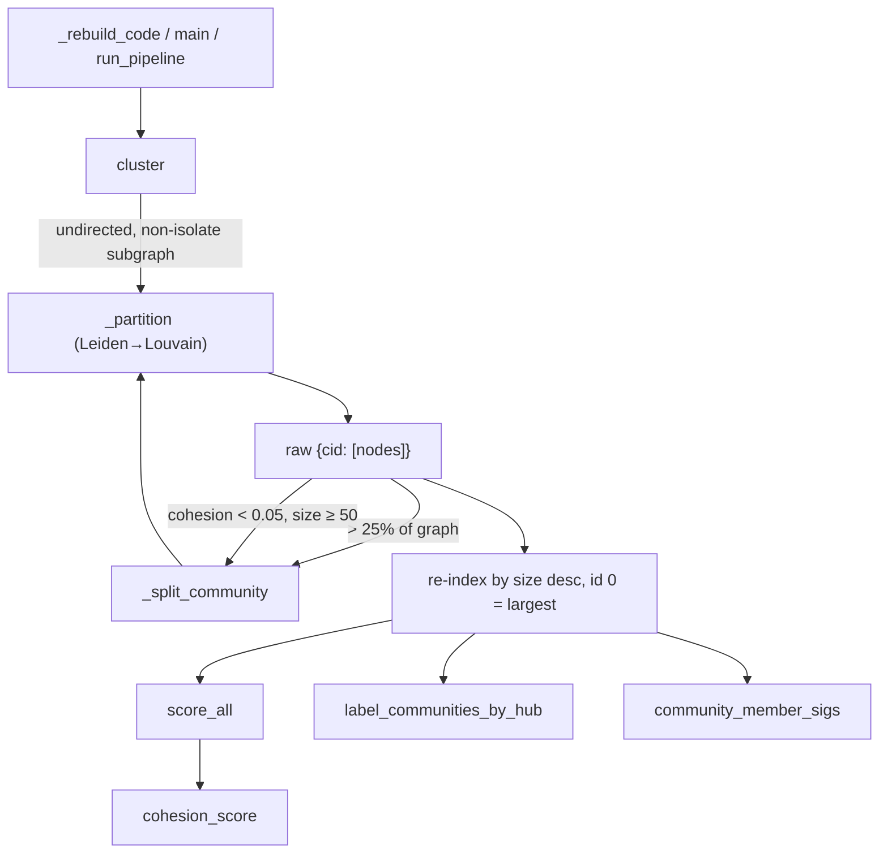

# graphify-cluster — Leiden community detection and the god-node structure

## Overview
Clustering is what turns graphify's flat node/edge graph into a *navigable* knowledge structure:
it partitions the graph into communities (subsystems) so a report can say "here are the 12
themes in this corpus and how tightly each holds together" instead of dumping thousands of
nodes. The single design idea is **a deterministic, seed-stable partition with structural
labels and cohesion scores** — no LLM needed for the baseline — so that the same corpus always
produces the same communities with the same integer IDs.
[`cluster`](../catalog/graphify/cluster.md#cluster) runs Leiden (falling back to Louvain),
splits oversized and incoherent communities, and re-indexes by size;
[`score_all`](../catalog/graphify/cluster.md#score_all) attaches a cohesion number to each;
[`label_communities_by_hub`](../catalog/graphify/cluster.md#label_communities_by_hub) names each
after its highest-degree member — the "god node" of that subsystem.

## Diagram

## Design rationale (why it's built this way)
The dominant concern is **reproducibility**, and it drives nearly every non-obvious choice.
[`cluster`](../catalog/graphify/cluster.md#cluster)'s docstring states the contract up front:
"Community IDs are stable across runs: 0 = largest community after splitting." To honour it,
[`_partition`](../catalog/graphify/cluster.md#_partition) first rebuilds the graph into a fresh
`nx.Graph` whose nodes and edges are added in a fully sorted order, passes a fixed
`random_seed=42`/`trials=1` to Leiden, and the final re-index sorts communities by
`(-len, tuple(sorted(members)))`. That tuple tiebreak is the load-bearing detail: without a
*total* order, the "hundreds of equal-sized small communities" would permute run-to-run and read
as massive churn in a per-node diff even though the grouping is identical (#1090 follow-up).

The second idea is that **a single hub node can wreck a partition**, so clustering fights hubs on
two fronts. Oversized communities (> 25% of the graph, min 10 nodes) are re-partitioned by
[`_split_community`](../catalog/graphify/cluster.md#_split_community); and a second pass
re-splits low-cohesion communities (cohesion < 0.05, size ≥ 50) that a "doc-hub node that
bridges otherwise-unrelated subsystems (e.g. CLAUDE.md connected to everything)" glued together.
The optional `exclude_hubs_percentile` knob goes further, pulling super-hubs out of partitioning
entirely and re-attaching them by majority-vote of their neighbours' communities — useful because
staging/utility hubs "inflate god-node rankings (#919)."

Labeling is deliberately LLM-free by default.
[`label_communities_by_hub`](../catalog/graphify/cluster.md#label_communities_by_hub) names a
community after its highest-degree member "so a report reads `auth` / `log_action` instead of
`Community 70`", with ties broken by node id for determinism. This *is* the god-node concept: the
structural hub of a community is both its name and its most important node. An LLM naming pass,
when configured, overrides these richer.

## Entry points
- [`cluster`](../catalog/graphify/cluster.md#cluster) — the entry; reached from
  [`_rebuild_code`](../catalog/graphify/watch.md#_rebuild_code), the CLI
  [`main`](../catalog/graphify/__main__.md#main), and the full pipeline test
  `run_pipeline`. Takes the built graph, returns `{community_id: [node_ids]}`.
- [`score_all`](../catalog/graphify/cluster.md#score_all) — called immediately after `cluster`
  to map each community to its [`cohesion_score`](../catalog/graphify/cluster.md#cohesion_score).
- [`label_communities_by_hub`](../catalog/graphify/cluster.md#label_communities_by_hub) — the
  default, no-backend labeler invoked when a report/export needs community names.
- [`community_member_sigs`](../catalog/graphify/cluster.md#community_member_sigs) — computed
  alongside labels and persisted so a later `cluster-only` can detect which communities actually
  changed.

## Mechanism (step-by-step)
1. **Normalize the input graph.** [`cluster`](../catalog/graphify/cluster.md#cluster) returns
   `{}` on an empty graph, converts a `DiGraph` to undirected (Leiden/Louvain require
   undirected), and if there are no edges returns each node as its own singleton community.
2. **Optionally exclude hubs.** When `exclude_hubs_percentile` is set,
   [`cluster`](../catalog/graphify/cluster.md#cluster) computes a degree threshold on the *full*
   graph and removes hub nodes before partitioning so they don't pull unrelated subsystems into
   one community; isolates are also set aside.
3. **Partition the connected core.** [`_partition`](../catalog/graphify/cluster.md#_partition)
   builds a deterministically-ordered copy and runs Leiden with `random_seed=42`, suppressing
   graspologic's ANSI output; if graspologic is absent it falls back to NetworkX Louvain with the
   same seed. It returns `{node_id: community_id}`.
4. **Re-attach isolates and hubs.** Each isolate becomes its own community; each excluded hub is
   re-attached to its majority-vote neighbour community (ties broken deterministically), inside
   [`cluster`](../catalog/graphify/cluster.md#cluster).
5. **Split oversized and incoherent communities.**
   [`cluster`](../catalog/graphify/cluster.md#cluster) runs
   [`_split_community`](../catalog/graphify/cluster.md#_split_community) — a second Leiden pass on
   the community's subgraph — for any community over 25% of the graph, then a cohesion-driven
   second pass using [`cohesion_score`](../catalog/graphify/cluster.md#cohesion_score) to break
   up large low-cohesion clusters.
6. **Re-index deterministically.** [`cluster`](../catalog/graphify/cluster.md#cluster) sorts final
   communities by size descending with a sorted-members tiebreak and assigns integer IDs, so id 0
   is always the largest and identical groupings always get identical IDs.
7. **Score and label.** [`score_all`](../catalog/graphify/cluster.md#score_all) applies
   [`cohesion_score`](../catalog/graphify/cluster.md#cohesion_score) to each community, and
   [`label_communities_by_hub`](../catalog/graphify/cluster.md#label_communities_by_hub) names each
   after its highest-degree member.

## Key data structures
- `communities: dict[int, list[str]]` — the primary output, community id → sorted member node
  ids, produced by [`cluster`](../catalog/graphify/cluster.md#cluster).
- `cohesion: dict[int, float]` — from [`score_all`](../catalog/graphify/cluster.md#score_all);
  each value is [`cohesion_score`](../catalog/graphify/cluster.md#cohesion_score), the ratio of
  actual intra-community edges to the maximum possible `n(n-1)/2`.
- `labels: dict[int, str]` — from
  [`label_communities_by_hub`](../catalog/graphify/cluster.md#label_communities_by_hub); the
  structural god-node name per community.
- `sigs: dict[int, str]` — from
  [`community_member_sigs`](../catalog/graphify/cluster.md#community_member_sigs); a truncated
  `sha256` of sorted member ids used to detect membership drift between runs.

## Dynamics (design intent)
The tests assert the invariants directly: `test_cluster_covers_all_nodes` and
`test_score_all_keys_match_communities` exercise [`cluster`](../catalog/graphify/cluster.md#cluster)
and [`score_all`](../catalog/graphify/cluster.md#score_all); `test_cohesion_score_range` bounds
[`cohesion_score`](../catalog/graphify/cluster.md#cohesion_score) in `[0,1]`; and
`test_cluster_does_not_write_to_stdout` / `test_cluster_does_not_write_to_stderr` pin the
requirement that clustering emits no ANSI noise (the reason `_partition` redirects graspologic's
output — issue #19). `test_community_member_sigs_are_deterministic_and_order_independent` and
`test_community_member_sigs_change_when_membership_changes` fix the fingerprint contract for
[`community_member_sigs`](../catalog/graphify/cluster.md#community_member_sigs).

## Edge cases
- Empty graph → `{}`; edgeless graph → one singleton community per node
  ([`cluster`](../catalog/graphify/cluster.md#cluster)).
- A community whose members are all absent from the graph falls back to the placeholder name
  `Community {cid}` ([`label_communities_by_hub`](../catalog/graphify/cluster.md#label_communities_by_hub));
  pinned by `test_absent_members_fall_back_to_placeholder`.
- [`_split_community`](../catalog/graphify/cluster.md#_split_community) on an edgeless subgraph
  splits into singletons, and swallows a partitioner exception by returning the community
  unchanged — a split never crashes clustering.
- A single-node community scores cohesion `1.0`
  ([`cohesion_score`](../catalog/graphify/cluster.md#cohesion_score)).

## Open questions
- `remap_communities_to_previous` (in the same module, seen in source) preserves community IDs
  across incremental re-clusters, but it is not in this packet's subgraph, so its role in
  cross-run stability can only be noted, not cited.
- The god-node *ranking* used in reports (degree-based importance) is computed in the analyze
  module, which is outside this packet.

## See also
- [graphify-build](graphify-build.md) — produces the graph clustering consumes.
- [graphify-dedup](graphify-dedup.md) — uses `communities` as a same-community merge signal.
