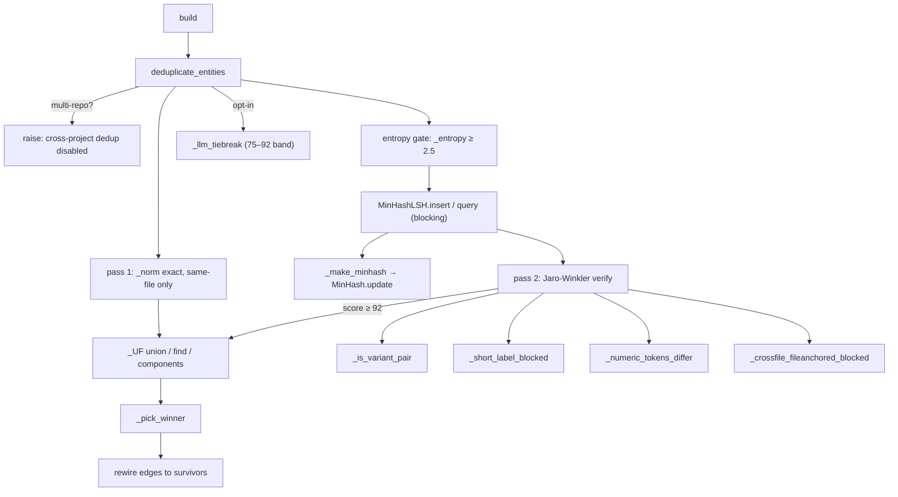

# graphify-dedup — entity deduplication with guarded merges

## Overview
When graphify merges extractions from many chunks, the *same* real-world entity shows up under
many labels ("graph extractor", "graphextractor", "Extractar" typo). Dedup collapses those into
one node while fighting the opposite failure — destructively merging two *distinct* things that
merely look alike ("M1" vs "M1 Pro", "ASR1603" vs "ASR1605"). The single design idea is a
**staged funnel that only ever gets more conservative**: cheap exact normalization, an entropy
gate, MinHash/LSH blocking to avoid the O(n²) all-pairs comparison, Jaro-Winkler verification,
and a battery of guards that veto a merge — with an optional LLM tiebreaker for the genuinely
ambiguous middle band. [`deduplicate_entities`](../catalog/graphify/dedup.md#deduplicate_entities)
is the whole pipeline; every merge is recorded in a union-find structure and applied as an edge
rewiring at the end.

## Diagram

## Design rationale (why it's built this way)
The module docstring names the pipeline exactly: "exact normalization → entropy gate →
MinHash/LSH blocking → Jaro-Winkler verification → same-community boost → union-find merge." Each
stage exists for a reason grounded in a real bug number.

**Code is never label-merged.** The most important guard is that AST-extracted code nodes are
excluded from both passes. As the source explains, a code node's identity *is* its ID (which
encodes module/class/symbol), while its label is only a display name — so two backends' `.draw()`
methods, or a function name shared by sibling classes, would be conflated by string similarity
(#1205). Genuine code duplicates share an ID and are already collapsed by the exact-ID pre-dedup,
so code needs no fuzzy merging at all.

**Cross-project dedup is refused outright.**
[`deduplicate_entities`](../catalog/graphify/dedup.md#deduplicate_entities) raises `ValueError`
the moment nodes span more than one `repo`, because "nodes from different repos share label names
by coincidence and must never be merged by string similarity." This is the guard the survey lens
cares about: graphify keeps per-repo silos clean and pushes cross-repo unification to an explicit
later step, exactly the boundary a cross-repo concept wiki wants.

**The guards are the product, not the matcher.** Jaro-Winkler's prefix bonus is a double-edged
sword: it lifts true typos over threshold but also lifts variants that share a prefix. So
[`_is_variant_pair`](../catalog/graphify/dedup.md#_is_variant_pair) blocks short model/SKU
siblings (#878), [`_short_label_blocked`](../catalog/graphify/dedup.md#_short_label_blocked)
allows only same-length single-char substitutions on short labels,
[`_numeric_tokens_differ`](../catalog/graphify/dedup.md#_numeric_tokens_differ) rejects
numbered/versioned siblings whose shared boilerplate keeps the score high (#1284), and
[`_crossfile_fileanchored_blocked`](../catalog/graphify/dedup.md#_crossfile_fileanchored_blocked)
stops cross-file `rationale`/`document` boilerplate from merging (#1205 "one layer up"). Cross-file
long labels are additionally scored on plain Jaro (no prefix bonus) so a shared prefix with a
diverging token falls short (#1243).

**MinHash/LSH is a home-grown datasketch clone** — see [graphify-_minhash](graphify-_minhash.md)
for why (a scipy import in datasketch hangs under Windows EDR); dedup uses only its
[`insert`](../catalog/graphify/_minhash.md#MinHashLSH.insert) /
[`query`](../catalog/graphify/_minhash.md#MinHashLSH.query) surface.

## Entry points
- [`deduplicate_entities`](../catalog/graphify/dedup.md#deduplicate_entities) — the only public
  entry; reached from [`build`](../catalog/graphify/build.md#build) before graph assembly. Takes
  nodes, edges, and a `communities` map; returns deduped nodes and edges rewired to survivors.
- [`_llm_tiebreak`](../catalog/graphify/dedup.md#_llm_tiebreak) — the opt-in third pass, invoked
  from [`deduplicate_entities`](../catalog/graphify/dedup.md#deduplicate_entities) only when a
  `dedup_llm_backend` is passed; resolves score-in-`[75,92)` pairs via a batched yes/no LLM
  prompt through [`_call_llm`](../catalog/graphify/llm.md#_call_llm).

## Mechanism (step-by-step)
1. **Guard and pre-dedup.** [`deduplicate_entities`](../catalog/graphify/dedup.md#deduplicate_entities)
   raises if nodes span multiple repos, returns early for ≤1 node, then keeps the first node per
   id, warning when two ids collide from different `source_file`s (cross-chunk collision, #1504).
2. **Pass 1 — exact, same-file.** Non-code nodes are grouped by
   [`_norm`](../catalog/graphify/dedup.md#_norm) (NFKC-fold + collapse non-alphanumerics); within
   a normalized key, nodes are merged **only** if they share a `source_file`, via
   [`union`](../catalog/graphify/dedup.md#_UF.union) after [`_pick_winner`](../catalog/graphify/dedup.md#_pick_winner)
   chooses the survivor.
3. **Entropy gate.** [`deduplicate_entities`](../catalog/graphify/dedup.md#deduplicate_entities)
   admits a node to fuzzy matching only if [`_entropy`](../catalog/graphify/dedup.md#_entropy) of
   its label is ≥ 2.5 bits/char, so low-information short labels never enter the fuzzy stage.
4. **LSH blocking.** For each candidate, [`_make_minhash`](../catalog/graphify/dedup.md#_make_minhash)
   builds a sketch from space-stripped 3-gram [`_shingles`](../catalog/graphify/dedup.md#_shingles)
   feeding [`MinHash.update`](../catalog/graphify/_minhash.md#MinHash.update); the sketch is
   [`insert`](../catalog/graphify/_minhash.md#MinHashLSH.insert)ed and then
   [`query`](../catalog/graphify/_minhash.md#MinHashLSH.query)ed to get only the near neighbours,
   avoiding an all-pairs scan.
5. **Pass 2 — verify with guards.** Each neighbour pair is scored by Jaro-Winkler (or plain Jaro
   for cross-file long labels), then vetoed by
   [`_is_variant_pair`](../catalog/graphify/dedup.md#_is_variant_pair),
   [`_short_label_blocked`](../catalog/graphify/dedup.md#_short_label_blocked),
   [`_numeric_tokens_differ`](../catalog/graphify/dedup.md#_numeric_tokens_differ), a
   prefix-extension check, and
   [`_crossfile_fileanchored_blocked`](../catalog/graphify/dedup.md#_crossfile_fileanchored_blocked).
   Survivors in the same community get a small score boost; pairs ≥ 92 are
   [`union`](../catalog/graphify/dedup.md#_UF.union)ed.
6. **Pass 3 — LLM tiebreak (opt-in).** [`_llm_tiebreak`](../catalog/graphify/dedup.md#_llm_tiebreak)
   re-scans candidate pairs with the identical guards, collects those in `[75,92)`, batches them
   into a yes/no prompt via [`_call_llm`](../catalog/graphify/llm.md#_call_llm), and unions the
   "yes" pairs.
7. **Apply.** [`components`](../catalog/graphify/dedup.md#_UF.components) yields the merge groups;
   [`_pick_winner`](../catalog/graphify/dedup.md#_pick_winner) chooses each survivor; a remap
   rewires every edge's endpoints, drops self-loops, and returns the deduped graph.

## Key data structures
- `_UF` union-find — [`find`](../catalog/graphify/dedup.md#_UF.find) with path halving,
  [`union`](../catalog/graphify/dedup.md#_UF.union), and
  [`components`](../catalog/graphify/dedup.md#_UF.components), backed by the
  [`_parent`](../catalog/graphify/dedup.md#_UF._parent) map — records every merge decision so the
  final remap is a single connected-components pass.
- `MinHashLSH` band tables — [`_tables`](../catalog/graphify/_minhash.md#MinHashLSH._tables), a
  list of `band → [keys]` dicts, with band width [`r`](../catalog/graphify/_minhash.md#MinHashLSH.r);
  the blocking index.
- The winner rule in [`_pick_winner`](../catalog/graphify/dedup.md#_pick_winner): prefer no
  `_c\d+` chunk suffix, then shorter id — so the canonical survivor is the most "primary" node.

## Dynamics (design intent)
The test suite is almost entirely a specification of *what must not merge*:
`test_dedup_does_not_merge_model_with_suffix`, `test_dedup_does_not_merge_numeric_variants`,
`test_dedup_does_not_merge_short_insertion_variants`,
`test_dedup_does_not_merge_crossfile_document_headings`, and
`test_prefix_extension_symbols_not_merged` each pin one guard on
[`deduplicate_entities`](../catalog/graphify/dedup.md#deduplicate_entities), while
`test_typo_merged` and `test_dedup_still_merges_crossfile_true_duplicates` confirm real
duplicates still collapse. `test_edges_rewired_after_merge` and
`test_self_loops_dropped_after_merge` verify the final remap.

## Edge cases
- Empty or single-node input returns unchanged
  ([`deduplicate_entities`](../catalog/graphify/dedup.md#deduplicate_entities)).
- Identical labels across different `source_file`s are refused even at score 100 — treated as
  "same-named but different symbols" (#1046/#1178).
- [`_llm_tiebreak`](../catalog/graphify/dedup.md#_llm_tiebreak) no-ops safely on an unknown
  backend or missing API key, and surfaces (rather than silently swallowing) an import failure of
  [`_call_llm`](../catalog/graphify/llm.md#_call_llm) (F-038).
- Edges using legacy `from`/`to` keys are tolerated during rewiring because dedup runs before
  `build_from_json` normalizes them (#803).

## Open questions
- The rapidfuzz `Jaro`/`JaroWinkler` scorers and the `_MERGE_THRESHOLD`/`_COMMUNITY_BOOST`
  constants are read from source but are not catalog symbols in this subgraph, so their exact
  numeric roles are described rather than cited.

## See also
- [graphify-_minhash](graphify-_minhash.md) — the LSH blocking engine dedup depends on.
- [graphify-build](graphify-build.md) — the caller; also does exact-ID and ghost merging that
  complements label dedup.
- [graphify-cluster](graphify-cluster.md) — source of the `communities` same-community boost.
