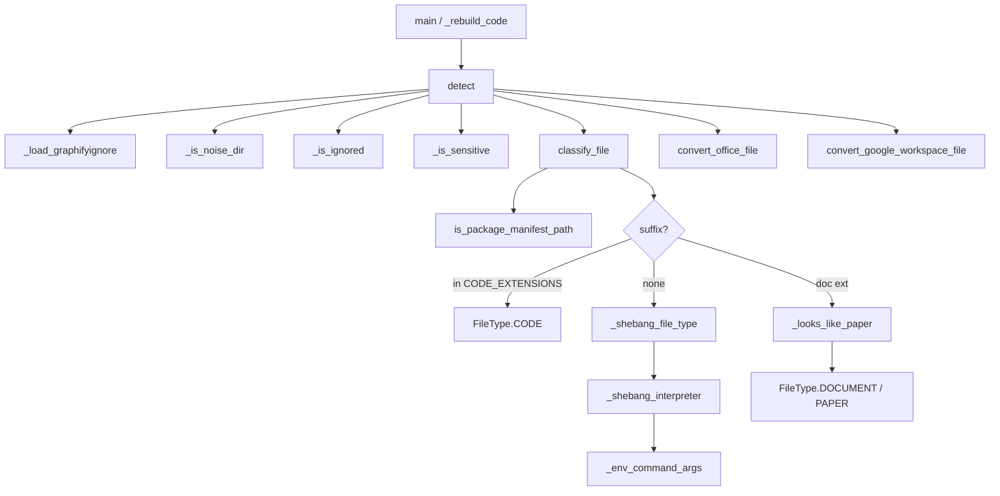

# File detection — routing every input to the right ingest lane

<!-- connect:up:begin -->
> **Cross-repo concept:** part of [multi-language-extraction](../../../concepts/multi-language-extraction.md) across this wiki's repos.
<!-- connect:up:end -->
## Overview
`graphify.detect` is the pipeline's **front-of-house triage**: before anything is parsed, it walks a
target tree and sorts each file into a [`FileType`](../catalog/graphify/detect.md#FileType) —
`CODE`, `DOCUMENT`, `PAPER`, `IMAGE`, or `VIDEO`. That single classification is what decides which
downstream lane a file takes: `CODE` goes to the deterministic AST extractor, `DOCUMENT`/`PAPER` go
to the LLM semantic path, images/video go to the vision path. The key idea is that classification is
**extension-first but signal-aware** — a `.py` is obviously code, but a `.md` might be documentation
*or* a research paper, an extensionless file needs its shebang read, and a `.yml` package manifest
must be forced to the code lane so it isn't LLM-summarized into duplicate nodes. Getting this routing
right is what lets one graph hold code, docs, papers, and media together.

## Diagram

## Design rationale (why it's built this way)
The most interesting decision is that classification is **not** a pure extension table. The comment
atop [`classify_file`](../catalog/graphify/detect.md#classify_file) explains why package manifests
are special-cased first: *"apm.yml (a .yml 'document') would be LLM-extracted and a package would
split into duplicate file-anchored nodes (#1377)"* — so [`classify_file`](../catalog/graphify/detect.md#classify_file)
routes anything [`is_package_manifest_path`](../catalog/graphify/manifest_ingest.md#is_package_manifest_path)
recognizes to [`CODE`](../catalog/graphify/detect.md#FileType.CODE) *before* the suffix lookup. The
same function distinguishes a documentation `.md` from a research `.md` via
[`_looks_like_paper`](../catalog/graphify/detect.md#_looks_like_paper), because papers deserve a
different ingest treatment than prose docs.

Extensionless scripts are the second reason for the signal logic: with no suffix,
[`classify_file`](../catalog/graphify/detect.md#classify_file) falls back to
[`_shebang_file_type`](../catalog/graphify/detect.md#_shebang_file_type), which peeks at the first
line. The disproportionate number of shebang tests in this packet
(`test_shebang_interpreter_env_*`) shows how much correctness lives in
[`_shebang_interpreter`](../catalog/graphify/detect.md#_shebang_interpreter): its docstring enumerates
`env -S`, `env -i`, `env -u VAR`, `env -C`, `env -P`, and inline-assignment forms a naive parser
misses. [`_env_command_args`](../catalog/graphify/detect.md#_env_command_args) exists solely to strip
those leading `env(1)` options and reach the real interpreter.

The third theme is **safety and noise control**: the scan prunes venv/cache dirs via
[`_is_noise_dir`](../catalog/graphify/detect.md#_is_noise_dir), honors `.graphifyignore`
gitignore-style rules through [`_is_ignored`](../catalog/graphify/detect.md#_is_ignored), skips files
that [`_is_sensitive`](../catalog/graphify/detect.md#_is_sensitive) flags as likely secrets, and
rejects zip/XML bombs with [`_zip_within_caps`](../catalog/graphify/detect.md#_zip_within_caps) —
detection is also the security boundary of ingest.

## Entry points
- [`detect`](../catalog/graphify/detect.md#detect) — the public scan: given a root, it walks the
  tree and returns a dict of `FileType → list[str]` plus word totals. Driven by the CLI
  [`main`](../catalog/graphify/__main__.md#main) and the watcher
  [`_rebuild_code`](../catalog/graphify/watch.md#_rebuild_code).
- [`detect_incremental`](../catalog/graphify/detect.md#detect_incremental) — the delta variant; its
  docstring: *"Like detect(), but returns only new or modified files since the last run"*, backing
  watch-driven rebuilds by re-classifying just what changed.
- [`classify_file`](../catalog/graphify/detect.md#classify_file) — the per-file decision, callable on
  its own; the `test_classify_*` suite exercises it directly for python, typescript, markdown, pdf,
  images, video, and manifests.

## Mechanism (step-by-step)
1. **Set up the scan.** [`detect`](../catalog/graphify/detect.md#detect) resolves the root, seeds a
   `files` dict keyed by [`FileType`](../catalog/graphify/detect.md#FileType), and loads ignore rules
   with [`_load_graphifyignore`](../catalog/graphify/detect.md#_load_graphifyignore). It always
   additionally scans the `graphify-out/memory/` tree (path from
   [`GRAPHIFY_OUT`](../catalog/graphify/paths.md#GRAPHIFY_OUT)) so query results filed back into the
   graph are re-ingested.

2. **Walk and prune.** As it `os.walk`s the tree it prunes directories in-place with
   [`_is_noise_dir`](../catalog/graphify/detect.md#_is_noise_dir) (venvs, framework caches) so it
   never descends into dependency trees, and drops paths matched by
   [`_is_ignored`](../catalog/graphify/detect.md#_is_ignored), which implements gitignore
   last-match-wins semantics (including `!` negations) per its docstring.

3. **Screen for danger.** Files that [`_is_sensitive`](../catalog/graphify/detect.md#_is_sensitive)
   flags (*"likely contains secrets"*) are collected into a skipped list rather than ingested, and
   symlink targets are checked to resolve under the root via
   [`_resolves_under_root`](../catalog/graphify/detect.md#_resolves_under_root).

4. **Classify.** Each surviving file goes through
   [`classify_file`](../catalog/graphify/detect.md#classify_file): manifests →
   [`CODE`](../catalog/graphify/detect.md#FileType.CODE) first (via
   [`is_package_manifest_path`](../catalog/graphify/manifest_ingest.md#is_package_manifest_path));
   then a suffix lookup against `CODE_EXTENSIONS`
   ([`CODE_EXTENSIONS`](../catalog/graphify/detect.md#CODE_EXTENSIONS)), paper/image/doc/office/video
   extension sets; and for a `DOC_EXTENSIONS` file a
   [`_looks_like_paper`](../catalog/graphify/detect.md#_looks_like_paper) check that can promote it to
   `PAPER`.

5. **Handle no-extension files.** With an empty suffix,
   [`classify_file`](../catalog/graphify/detect.md#classify_file) delegates to
   [`_shebang_file_type`](../catalog/graphify/detect.md#_shebang_file_type), which reads the
   interpreter via [`_shebang_interpreter`](../catalog/graphify/detect.md#_shebang_interpreter) — that
   in turn normalizes `env` invocations with
   [`_env_command_args`](../catalog/graphify/detect.md#_env_command_args) — and maps a recognized
   interpreter to [`CODE`](../catalog/graphify/detect.md#FileType.CODE).

6. **Convert office / workspace docs to markdown sidecars.** For Office and Google-Workspace inputs
   [`detect`](../catalog/graphify/detect.md#detect) invokes
   [`convert_office_file`](../catalog/graphify/detect.md#convert_office_file) and
   [`convert_google_workspace_file`](../catalog/graphify/google_workspace.md#convert_google_workspace_file)
   to produce a markdown sidecar that the [`DOCUMENT`](../catalog/graphify/detect.md#FileType.DOCUMENT)
   lane can then ingest, and it tallies prose size with
   [`count_words`](../catalog/graphify/detect.md#count_words). Media files land in
   [`VIDEO`](../catalog/graphify/detect.md#FileType.VIDEO).

## Key data structures
- **[`FileType`](../catalog/graphify/detect.md#FileType)** — a `str, Enum` with members
  [`CODE`](../catalog/graphify/detect.md#FileType.CODE),
  [`DOCUMENT`](../catalog/graphify/detect.md#FileType.DOCUMENT), `PAPER`, `IMAGE`, and
  [`VIDEO`](../catalog/graphify/detect.md#FileType.VIDEO). This enum is the routing contract the rest
  of the pipeline reads.
- **The `detect` result** — a dict of `FileType → list[str]` plus totals; the buckets are what the
  driver hands to the AST, LLM, or vision extractors.
- **Extension sets** — `CODE_EXTENSIONS`
  ([`CODE_EXTENSIONS`](../catalog/graphify/detect.md#CODE_EXTENSIONS)) and its sibling paper/image/doc
  sets are the fast-path lookup that classification tries before any content sniffing.
- **Ignore patterns** — `(anchor_dir, pattern)` pairs from
  [`_load_graphifyignore`](../catalog/graphify/detect.md#_load_graphifyignore), evaluated with
  gitignore semantics by [`_is_ignored`](../catalog/graphify/detect.md#_is_ignored).

## Dynamics (design intent)
The classification contract is pinned by tests rather than runtime observation:
`test_classify_python`, `test_classify_typescript`, and `test_classify_powershell_manifest` assert
[`CODE`](../catalog/graphify/detect.md#FileType.CODE); `test_classify_markdown` and
`test_manifests_classify_as_code_not_document` assert the doc-vs-code split;
`test_classify_attention_paper` and `test_classify_md_paper_by_signals` assert the paper promotion;
and `test_classify_video_extensions` asserts [`VIDEO`](../catalog/graphify/detect.md#FileType.VIDEO).
The shebang forms are locked down by the large `test_shebang_interpreter_env_*` family, each pinning
one `env(1)` parsing corner (`-S`, `-C`, `--split-string`, clumped `-uPYTHONPATH`, etc.) against
[`_shebang_interpreter`](../catalog/graphify/detect.md#_shebang_interpreter) and
[`classify_file`](../catalog/graphify/detect.md#classify_file).

## Edge cases
- **Manifest masquerading as a document** — routed to
  [`CODE`](../catalog/graphify/detect.md#FileType.CODE) before suffix dispatch so it isn't
  LLM-extracted into duplicate nodes (#1377).
- **`.md` that is really a paper** — [`_looks_like_paper`](../catalog/graphify/detect.md#_looks_like_paper)
  promotes it; `test_classify_md_doc_without_signals` confirms a plain `.md` stays
  [`DOCUMENT`](../catalog/graphify/detect.md#FileType.DOCUMENT).
- **PDF inside an Xcode asset catalog** —
  [`classify_file`](../catalog/graphify/detect.md#classify_file) returns `None` (it's a vector icon,
  not a paper).
- **Extensionless script** — resolved by its shebang; unreadable or shebang-less files return `None`
  from [`_shebang_interpreter`](../catalog/graphify/detect.md#_shebang_interpreter).
- **Zip/XML bomb office file** — rejected by
  [`_zip_within_caps`](../catalog/graphify/detect.md#_zip_within_caps) before conversion.
- **Secrets / out-of-root symlinks** — screened by
  [`_is_sensitive`](../catalog/graphify/detect.md#_is_sensitive) and
  [`_resolves_under_root`](../catalog/graphify/detect.md#_resolves_under_root).

## Open questions
- The `IMAGE` and `PAPER` [`FileType`](../catalog/graphify/detect.md#FileType) members are referenced
  but not exposed as their own Subgraph terms here, so their extension sets are described only from
  the [`classify_file`](../catalog/graphify/detect.md#classify_file) source, not a citable symbol.
- How `detect` decides `PAPER` promotion thresholds inside
  [`_looks_like_paper`](../catalog/graphify/detect.md#_looks_like_paper) (the specific signal count)
  is truncated in the packet.

## See also
- [`graphify-extract`](graphify-extract.md) — where the `CODE` bucket goes.
- [`graphify-file_slice`](graphify-file_slice.md) — how oversized `DOCUMENT`/`PAPER` files are split
  before the LLM lane.
- [`graphify-extractors-base`](graphify-extractors-base.md) — the id primitives the code lane uses.
