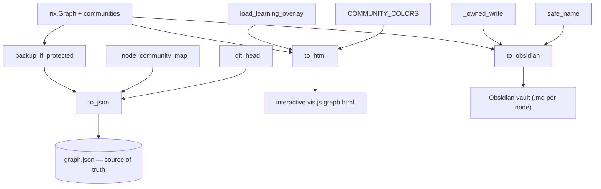

# graphify-export — persisting the graph to JSON, HTML, and Obsidian

## Overview
`export` is the write side of graphify's "persistent knowledge graph": after the pipeline builds an
in-memory NetworkX graph and detects communities, this module *materialises* it into three durable
forms — the canonical `graph.json` that every reader (serve, callflow_html, benchmark) later loads, an
interactive vis.js HTML visualization, and an Obsidian vault of one note per node. The load-bearing idea
is that `graph.json` is the **single source of truth** the whole system re-reads, so writing it is
guarded like a database commit: refuse to silently shrink it, preserve edge *direction* that undirected
storage would flip, stamp each node with its community, and snapshot a curated graph before overwriting.
The three writers are [`to_json`](../catalog/graphify/export.md#to_json),
[`to_html`](../catalog/graphify/export.md#to_html), and
[`to_obsidian`](../catalog/graphify/export.md#to_obsidian), fronted by
[`backup_if_protected`](../catalog/graphify/export.md#backup_if_protected).

## Diagram

## Design rationale (why it's built this way)
Because `graph.json` is re-read on every query, corrupting or shrinking it is the worst failure mode, so
the writers are defensive in ways that only make sense once you see them as *the* persistence layer.

- **Refuse-to-shrink guard.** [`to_json`](../catalog/graphify/export.md#to_json) reads the existing file
  and, unless `force=True`, *refuses to overwrite* when the new graph has fewer nodes than the one on
  disk — the error message names the likely causes (missing chunk files, an over-eager fuzzy dedup during
  `--update`) and tells the user to do a full rebuild. This is what lets incremental rebuilds run
  fearlessly: a partial extraction can't quietly destroy an accumulated graph.

- **Direction survives an undirected round-trip.** NetworkX canonicalizes endpoint order for an
  undirected graph, which would flip directional relations like `calls`. The build path stashes the true
  endpoints in `_src`/`_tgt`; [`to_json`](../catalog/graphify/export.md#to_json) pops them back into
  `source`/`target` on write (#563), and [`to_html`](../catalog/graphify/export.md#to_html) does the same
  for the rendered arrows. Reading a node's neighbors elsewhere then goes through
  [`edge_data`](../catalog/graphify/build.md#edge_data), which tolerates MultiGraph storage. Without this,
  a `calls` edge could point backwards after a save/load cycle.

- **Community identity is stamped at write time.**
  [`to_json`](../catalog/graphify/export.md#to_json) inverts the communities dict with
  [`_node_community_map`](../catalog/graphify/analyze.md#_node_community_map) and writes `community` +
  `community_name` onto every node, and also backfills `norm_label` (diacritic-stripped) — precisely the
  field [`serve`'s scorer](graphify-serve.md) later reads. Export isn't just serialization; it precomputes
  the query-time index.

- **Backups protect *expensive* graphs only.**
  [`backup_if_protected`](../catalog/graphify/export.md#backup_if_protected) snapshots before an overwrite
  only when the graph "cost real LLM tokens" (a semantic marker) or has been human-curated (non-default
  community labels) — one dated folder per day, never raising on failure. Cheap AST-only graphs are
  rebuildable and skip the backup, so the guard doesn't bloat the output dir.

- **HTML/Obsidian never clobber the user's files.**
  [`to_obsidian`](../catalog/graphify/export.md#to_obsidian) tracks a manifest of graphify-owned files and
  [`_owned_write`](../catalog/graphify/export.md#to_obsidian._owned_write) refuses to overwrite any
  pre-existing file it didn't create (#1506), so exporting into a real vault leaves the user's notes and
  `.obsidian/` config intact.

## Entry points
- [`to_json`](../catalog/graphify/export.md#to_json) — writes the canonical `graph.json`; returns a bool
  so a refused (shrinking) write is observable. Called from the CLI export path and the watcher's
  [`_rebuild_code`](../catalog/graphify/watch.md#_rebuild_code), and exercised by many tests
  (e.g. [`test_to_json_valid_json`](../catalog/tests/test_export.md#test_to_json_valid_json),
  [`test_to_json_nodes_have_community`](../catalog/tests/test_export.md#test_to_json_nodes_have_community)).
- [`to_html`](../catalog/graphify/export.md#to_html) — writes the interactive vis.js page (node-size by
  degree, community filter, search, confidence-styled edges), aliased as
  [`generate_html`](../catalog/graphify/export.md#generate_html) for the skill;
  [`test_to_html_contains_visjs`](../catalog/tests/test_export.md#test_to_html_contains_visjs) pins the
  output shape.
- [`to_obsidian`](../catalog/graphify/export.md#to_obsidian) — writes one `.md` per node with
  `[[wikilinks]]` plus per-community overview notes, returning the count written.
- [`backup_if_protected`](../catalog/graphify/export.md#backup_if_protected) — the pre-overwrite snapshot
  gate the CLI and [`_rebuild_code`](../catalog/graphify/watch.md#_rebuild_code) call before writing.
- [`main`](../catalog/graphify/__main__.md#main) — the CLI dispatcher that wires all of the above together
  for an `export`/rebuild.

## Mechanism (step-by-step)
1. **Snapshot first (if warranted).** Before any overwrite,
   [`backup_if_protected`](../catalog/graphify/export.md#backup_if_protected) checks for a semantic marker
   or curated labels and, if present, copies the current artifacts to a dated subfolder (idempotent for
   the day, content-hashed to skip redundant copies).
2. **Guard the shrink and serialize.** [`to_json`](../catalog/graphify/export.md#to_json) validates the
   existing file with [`check_graph_file_size_cap`](../catalog/graphify/security.md#check_graph_file_size_cap),
   compares node counts, and bails (returns `False`) on an unforced shrink. Otherwise it serializes via
   `node_link_data`.
3. **Enrich every node and edge.** For each node,
   [`to_json`](../catalog/graphify/export.md#to_json) sets `community`/`community_name` from
   [`_node_community_map`](../catalog/graphify/analyze.md#_node_community_map) and a normalized label; for
   each edge it defaults a `confidence_score` and restores `_src`/`_tgt` direction. The commit hash comes
   from [`_git_head`](../catalog/graphify/export.md#_git_head).
4. **Render the interactive view.** [`to_html`](../catalog/graphify/export.md#to_html) either draws the
   full node set or, above [`_viz_node_limit`](../catalog/graphify/export.md#_viz_node_limit), aggregates
   into a community meta-graph; it colors nodes by [`COMMUNITY_COLORS`](../catalog/graphify/export.md#COMMUNITY_COLORS),
   overlays learning-status rings from [`load_learning_overlay`](../catalog/graphify/reflect.md#load_learning_overlay),
   sanitises every label with [`sanitize_label`](../catalog/graphify/security.md#sanitize_label), and
   embeds the data as JSON escaped by [`_js_safe`](../catalog/graphify/export.md#to_html._js_safe) so it
   can't break out of the `<script>` tag.
5. **Write the vault.** [`to_obsidian`](../catalog/graphify/export.md#to_obsidian) maps each node to a
   collision-safe filename via [`safe_name`](../catalog/graphify/export.md#to_obsidian.safe_name), writes
   each note only through [`_owned_write`](../catalog/graphify/export.md#to_obsidian._owned_write), escapes
   YAML frontmatter with [`_yaml_str`](../catalog/graphify/export.md#_yaml_str), reads neighbor edges via
   [`edge_data`](../catalog/graphify/build.md#edge_data), and emits per-community overview notes named by
   [`_community_name`](../catalog/graphify/export.md#to_obsidian._community_name).

## Key data structures
- **`graph.json` (node-link JSON)** — the canonical persisted graph
   [`to_json`](../catalog/graphify/export.md#to_json) writes: nodes carrying `community`/`community_name`/
   `norm_label`, edges carrying restored direction and `confidence_score`, plus hyperedges. This is the
   file every downstream reader re-loads.
- **The learning overlay sidecar** — loaded by
   [`load_learning_overlay`](../catalog/graphify/reflect.md#load_learning_overlay) from
   [`LEARNING_SIDECAR_NAME`](../catalog/graphify/reflect.md#LEARNING_SIDECAR_NAME) next to `graph.json`,
   with staleness judged by [`_is_stale`](../catalog/graphify/reflect.md#_is_stale). It is display-only:
   [`to_html`](../catalog/graphify/export.md#to_html) merges it into node styling without touching the
   graph itself.
- **The Obsidian ownership manifest** — the set behind
   [`_owned_write`](../catalog/graphify/export.md#to_obsidian._owned_write) that distinguishes
   graphify-authored notes from the user's, so re-runs update the former and never the latter.

## Dynamics (design intent)
The three writers are independent and side-effect-scoped: [`to_json`](../catalog/graphify/export.md#to_json)
is the only one whose output is re-consumed, so it carries all the integrity guards while
[`to_html`](../catalog/graphify/export.md#to_html) and
[`to_obsidian`](../catalog/graphify/export.md#to_obsidian) are throwaway views. Tests encode the
invariants the persistence layer must hold: round-trip fidelity of hyperedges and confidence scores
([`test_hyperedges_roundtrip_via_json_file`](../catalog/tests/test_hypergraph.md#test_hyperedges_roundtrip_via_json_file),
[`test_confidence_score_round_trip`](../catalog/tests/test_confidence.md#test_confidence_score_round_trip)),
edge-direction preservation
([`test_build_from_json_preserves_first_direction_on_bidirectional_pair`](../catalog/tests/test_build.md#test_build_from_json_preserves_first_direction_on_bidirectional_pair)),
and that an unannotated graph produces byte-identical HTML whether or not an overlay is passed
([`test_to_html_unannotated_identical_to_pre_feature`](../catalog/tests/test_export.md#test_to_html_unannotated_identical_to_pre_feature)).

## Edge cases
- **Filename collisions on case-insensitive filesystems.**
  [`to_obsidian`](../catalog/graphify/export.md#to_obsidian) dedups filenames keyed on lowercase and
  re-checks generated suffixes, pinned by
  [`test_to_obsidian_case_only_distinct_labels_dont_overwrite`](../catalog/tests/test_export.md#test_to_obsidian_case_only_distinct_labels_dont_overwrite)
  and [`test_to_obsidian_generated_suffix_doesnt_overwrite_literal`](../catalog/tests/test_export.md#test_to_obsidian_generated_suffix_doesnt_overwrite_literal).
- **Pathological labels.** All-punctuation or very long labels are handled so no `@.md`-style or
  over-255-byte filename is emitted
  ([`test_to_obsidian_never_emits_punctuation_only_filenames`](../catalog/tests/test_export.md#test_to_obsidian_never_emits_punctuation_only_filenames),
  [`test_obsidian_long_cjk_label_byte_cap`](../catalog/tests/test_obsidian_filename_cap.md#test_obsidian_long_cjk_label_byte_cap)).
- **Graph too large to visualize.** [`to_html`](../catalog/graphify/export.md#to_html) auto-aggregates to
  a community meta-graph above [`_viz_node_limit`](../catalog/graphify/export.md#_viz_node_limit) instead
  of raising, and skips output entirely if that collapses to a single community.
- **Dangling community member.** A community listing a node absent from the graph does not crash the
  Obsidian export
  ([`test_obsidian_dangling_community_member_does_not_crash`](../catalog/tests/test_obsidian_dangling_member.md#test_obsidian_dangling_community_member_does_not_crash)).
- **Backups can be disabled/absent.** [`backup_if_protected`](../catalog/graphify/export.md#backup_if_protected)
  returns `None` (no-op) when `GRAPHIFY_NO_BACKUP` is set or the graph is neither semantic nor curated.

## Open questions
- The `to_canvas` writer (a sibling of [`to_obsidian`](../catalog/graphify/export.md#to_obsidian) whose
  filename agreement is checked by
  [`test_obsidian_canvas_filenames_agree`](../catalog/tests/test_export.md#test_obsidian_canvas_filenames_agree))
  is not in this Subgraph, so how the canvas view stays consistent with the node notes isn't grounded here.
- The exact hyperedge remapping when [`to_html`](../catalog/graphify/export.md#to_html) builds a community
  meta-graph is only partially visible in the packet snippet.

## See also
- [graphify-serve](graphify-serve.md) — re-reads the `graph.json` this module writes (and the `norm_label` it precomputes).
- [graphify-callflow_html](graphify-callflow_html.md) — the static-HTML reader of the same graph.
- [graphify-paths](graphify-paths.md) — resolves where `graph.json` and the backups live.
