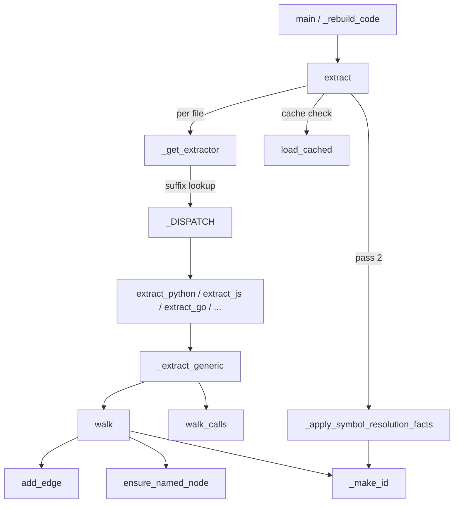

# AST extraction — turning source files into graph nodes and edges

<!-- connect:up:begin -->
> **Cross-repo concept:** part of [multi-language-extraction](../../../concepts/multi-language-extraction.md) across this wiki's repos.
<!-- connect:up:end -->
## Overview
`graphify.extract` is the **deterministic, LLM-free front door** of graphify's ingest
pipeline: it takes a list of source files and returns one flat `{"nodes": [...], "edges": [...]}`
dict that the rest of the toolchain builds a knowledge graph from. The key design idea is a
**two-pass structure** — first every file is parsed *in isolation* into local structural nodes
(classes, functions, imports) via [`extract`](../catalog/graphify/extract.md#extract); then a
whole-corpus resolution pass rewires file-level imports into precise symbol-to-symbol edges via
[`_apply_symbol_resolution_facts`](../catalog/graphify/extract.md#_apply_symbol_resolution_facts).
Everything is content-hash cached, so re-ingesting a repo only re-parses the files that changed.
This is what makes graphify comparable to SCIP-style code-comprehension tools: a code graph you
can query, but produced from a tree-sitter parse rather than a compiler.

## Diagram

## Design rationale (why it's built this way)
The two-pass split is stated verbatim in the author's docstring on
[`extract`](../catalog/graphify/extract.md#extract): *"1. Per-file structural extraction (classes,
functions, imports); 2. Cross-file import resolution: turns file-level imports into class-level
INFERRED edges (DigestAuth --uses--> Response)."* The reason for the split is that a single file
cannot know where `import Response` resolves to — that requires seeing the whole corpus. Pass one
stays embarrassingly parallel and cacheable; pass two runs once, globally, after all files are in.

A second deliberate decision is the **cache boundary**. `extract` infers a common path prefix as
the cache root and checks [`load_cached`](../catalog/graphify/cache.md#load_cached) — which returns
a previously extracted result only when the file's [`file_hash`](../catalog/graphify/cache.md#file_hash)
(SHA256 of contents + relative path) still matches. Unchanged files are never re-parsed, so a
watch-driven rebuild is cheap. JS/TS suffixes deliberately *bypass* the cache because their
symbol-resolution facts are collected corpus-wide.

A third decision is the **config-driven generic extractor**. Rather than hand-writing a full walker
per language, most languages funnel through
[`_extract_generic`](../catalog/graphify/extract.md#_extract_generic), a single tree-sitter driver
parameterized by a `LanguageConfig` whose
[`ts_module`](../catalog/graphify/extract.md#LanguageConfig.ts_module) names the grammar to import
(`tree_sitter_python`, etc.). Adding a mainstream language is mostly declaring node/edge type sets,
not writing a new walker. Formats that tree-sitter can't cleanly handle (Pascal, XAML, forms,
manifests) get bespoke extractors instead.

## Entry points
- [`main`](../catalog/graphify/__main__.md#main) — the CLI dispatcher; the `extract`/build path
  reaches [`extract`](../catalog/graphify/extract.md#extract) from here for a one-shot ingest of a
  target directory.
- [`_rebuild_code`](../catalog/graphify/watch.md#_rebuild_code) — the incremental entry: the file
  watcher and git hooks call it to *"Re-run AST extraction + build + optional cluster + report for
  code files. No LLM needed"* (its docstring), re-invoking `extract` on only the changed paths.
- [`collect_files`](../catalog/graphify/extract.md#collect_files) — walks a target tree and keeps
  the files whose suffix appears in [`_DISPATCH`](../catalog/graphify/extract.md#_DISPATCH._DISPATCH),
  producing the `paths` list that `extract` consumes.
- [`extract`](../catalog/graphify/extract.md#extract) — the public API. Given `paths`, it returns
  the merged nodes/edges dict; `run_pipeline` in the test suite and `_extract_for` in the JS-import
  tests both drive it.

## Mechanism (step-by-step)
1. **Per-file dispatch.** For each path, [`extract`](../catalog/graphify/extract.md#extract) asks
   [`_get_extractor`](../catalog/graphify/extract.md#_get_extractor) for the right handler. That
   function first special-cases ambiguous files — `.blade.php`, MCP configs, package manifests, and
   `.h` headers that sniff as Objective-C ([`extract_objc`](../catalog/graphify/extract.md#extract_objc))
   or C++ ([`extract_cpp`](../catalog/graphify/extract.md#extract_cpp)) — then falls back to a plain
   suffix lookup in [`_DISPATCH`](../catalog/graphify/extract.md#_DISPATCH._DISPATCH), the table
   mapping `.py → extract_python`, `.rs → extract_rust`, and so on.

2. **Cache gate.** Before parsing, `extract` calls
   [`load_cached`](../catalog/graphify/cache.md#load_cached); if the file's
   [`file_hash`](../catalog/graphify/cache.md#file_hash) matches a prior run the cached nodes/edges
   are reused and the parse is skipped. Only cache misses (and cache-bypassed JS/TS) become
   "uncached work" to extract, optionally across a process pool.

3. **Structural parse (mainstream languages).** Handlers like
   [`extract_python`](../catalog/graphify/extract.md#extract_python),
   [`extract_js`](../catalog/graphify/extract.md#extract_js),
   [`extract_cpp`](../catalog/graphify/extract.md#extract_cpp),
   [`extract_swift`](../catalog/graphify/extract.md#extract_swift),
   [`extract_php`](../catalog/graphify/extract.md#extract_php), and
   [`extract_groovy`](../catalog/graphify/extract.md#extract_groovy) are thin wrappers that hand a
   `LanguageConfig` to [`_extract_generic`](../catalog/graphify/extract.md#_extract_generic). That
   driver imports the grammar named by
   [`ts_module`](../catalog/graphify/extract.md#LanguageConfig.ts_module) (from configs such as
   [`_JS_CONFIG`](../catalog/graphify/extract.md#_JS_CONFIG),
   [`_TS_CONFIG`](../catalog/graphify/extract.md#_TS_CONFIG),
   [`_TSX_CONFIG`](../catalog/graphify/extract.md#_TSX_CONFIG),
   [`_PHP_CONFIG`](../catalog/graphify/extract.md#_PHP_CONFIG),
   [`_LUA_CONFIG`](../catalog/graphify/extract.md#_LUA_CONFIG)), parses the bytes, then recursively
   descends the syntax tree.

4. **Tree walk → nodes & edges.** Inside `_extract_generic`,
   [`walk`](../catalog/graphify/extract.md#_extract_generic.walk) recurses the AST: on an import
   node it materializes a `type=module` node; on a class/function node it reads the identifier via
   [`_read_text`](../catalog/graphify/extractors/base.md#_read_text) (raw bytes → decoded slice),
   mints a stable node id with [`_make_id`](../catalog/graphify/extractors/base.md#_make_id), and
   for cross-file references calls
   [`ensure_named_node`](../catalog/graphify/extract.md#_extract_generic.ensure_named_node) to emit a
   *sourceless stub* the corpus pass can later collapse onto the real definition. Structural edges
   (`contains`, `inherits`, `references`) are recorded via
   [`add_edge`](../catalog/graphify/extract.md#_extract_generic.add_edge). A second recursion,
   [`walk_calls`](../catalog/graphify/extract.md#_extract_generic.walk_calls), finds call sites and
   records caller→callee call relations (appended directly to the edge/`raw_calls` lists).

5. **Bespoke extractors for non-tree-sitter-friendly formats.** Handlers that don't route through
   the generic driver parse their own structure: regex-based
   [`extract_pascal`](../catalog/graphify/extract.md#extract_pascal) (with its
   [`_extract_pascal_regex`](../catalog/graphify/extract.md#_extract_pascal_regex) fallback),
   XML-based [`extract_xaml`](../catalog/graphify/extract.md#extract_xaml),
   [`extract_csproj`](../catalog/graphify/extract.md#extract_csproj),
   [`extract_delphi_form`](../catalog/graphify/extract.md#extract_delphi_form),
   [`extract_lazarus_form`](../catalog/graphify/extract.md#extract_lazarus_form) and
   [`extract_lazarus_package`](../catalog/graphify/extract.md#extract_lazarus_package),
   config-oriented [`extract_json`](../catalog/graphify/extract.md#extract_json) and
   [`extract_mcp_config`](../catalog/graphify/mcp_ingest.md#extract_mcp_config), plus
   [`extract_markdown`](../catalog/graphify/extract.md#extract_markdown),
   [`extract_terraform`](../catalog/graphify/extract.md#extract_terraform),
   [`extract_bash`](../catalog/graphify/extract.md#extract_bash),
   [`extract_fortran`](../catalog/graphify/extract.md#extract_fortran),
   [`extract_go`](../catalog/graphify/extract.md#extract_go),
   [`extract_rust`](../catalog/graphify/extract.md#extract_rust),
   [`extract_julia`](../catalog/graphify/extract.md#extract_julia),
   [`extract_dm`](../catalog/graphify/extract.md#extract_dm),
   [`extract_dart`](../catalog/graphify/extract.md#extract_dart),
   [`extract_apex`](../catalog/graphify/extract.md#extract_apex),
   [`extract_powershell`](../catalog/graphify/extract.md#extract_powershell),
   [`extract_verilog`](../catalog/graphify/extract.md#extract_verilog),
   [`extract_vue`](../catalog/graphify/extract.md#extract_vue),
   [`extract_elixir`](../catalog/graphify/extractors/elixir.md#extract_elixir) and
   [`extract_razor`](../catalog/graphify/extractors/razor.md#extract_razor). Every one emits the same
   node/edge shape, keyed off [`_file_stem`](../catalog/graphify/extractors/base.md#_file_stem).

6. **Pass two — cross-file resolution.** After all per-file results are merged,
   [`_apply_symbol_resolution_facts`](../catalog/graphify/extract.md#_apply_symbol_resolution_facts)
   *"Apply[s] language-provided import/export/use facts to graph edges."* Facts are gathered
   language-specifically — e.g.
   [`_collect_js_symbol_resolution_facts`](../catalog/graphify/extract.md#_collect_js_symbol_resolution_facts)
   parses each JS/TS file to record which symbol an import names and where it resolves
   (via [`_resolve_js_module_path`](../catalog/graphify/extract.md#_resolve_js_module_path)), and
   [`_collect_python_symbol_resolution_facts`](../catalog/graphify/extract.md#_collect_python_symbol_resolution_facts)
   does the analogous job for Python. C# gets a dedicated arbitration pass,
   [`_resolve_csharp_type_references`](../catalog/graphify/extractors/csharp.md#_resolve_csharp_type_references).
   The resolution pass ensures every edge points at a real symbol id rather than a bare file, so an
   `import { Response }` becomes a precise symbol→symbol edge.

## Key data structures
- **The extraction dict** — `{"nodes": [...], "edges": [...]}` (plus internal `raw_calls`). Each node
  carries `id`, `label`, `file_type`, `source_file`, `source_location`; each edge carries
  `source`/`target`/`relation`/`confidence`/`weight`, minted by
  [`add_edge`](../catalog/graphify/extract.md#_extract_generic.add_edge).
- **Node ids** — built by [`_make_id`](../catalog/graphify/extractors/base.md#_make_id) from a
  [`_file_stem`](../catalog/graphify/extractors/base.md#_file_stem) prefix plus the symbol name, so
  the same symbol gets a stable id across runs and files with the same basename in different
  directories don't collide.
- **`LanguageConfig`** — the per-language parameter object; its
  [`ts_module`](../catalog/graphify/extract.md#LanguageConfig.ts_module) field selects the grammar
  and its type-set fields tell [`walk`](../catalog/graphify/extract.md#_extract_generic.walk) which
  AST node types are classes, functions, imports, and calls.
- **`_SymbolResolutionFacts`** — the accumulator that the language-specific collectors fill and
  [`_apply_symbol_resolution_facts`](../catalog/graphify/extract.md#_apply_symbol_resolution_facts)
  consumes (declarations, imports, aliases, exports, uses). Its exact fields are visible in that
  function's early guard.

## Dynamics (design intent)
The `extract` docstring documents that pass one runs on a `ProcessPoolExecutor` when there are at
least `_PARALLEL_THRESHOLD` uncached files, bounded by `max_workers` (default cpu_count or
`GRAPHIFY_MAX_WORKERS`). The incremental path is governed by
[`_rebuild_code`](../catalog/graphify/watch.md#_rebuild_code): its docstring states that when
`changed_paths` is provided *"only those files are re-extracted; nodes for unchanged files are
preserved from the existing graph"*, and a non-blocking per-repo flock serializes concurrent
rebuilds. Both paths converge on the same `extract` → resolve → build sequence, so a full ingest and
a one-file watch produce structurally identical graphs.

## Edge cases
- **Unsupported files** — [`_get_extractor`](../catalog/graphify/extract.md#_get_extractor) returns
  `None`, and `extract` records an empty result rather than failing the run.
- **`.h` ambiguity** — a header is routed to
  [`extract_objc`](../catalog/graphify/extract.md#extract_objc) or
  [`extract_cpp`](../catalog/graphify/extract.md#extract_cpp) by content sniffing before the plain
  suffix map (which would send `.h` to the C extractor and lose the class).
- **Cross-file references with no local definition** —
  [`ensure_named_node`](../catalog/graphify/extract.md#_extract_generic.ensure_named_node) emits a
  *sourceless* stub (empty `source_file`) precisely so the corpus rewire collapses it onto the real
  definition instead of baking the referencing file's path into the id (the phantom-duplicate bug the
  source comment cites).
- **Pascal without tree-sitter** — [`extract_pascal`](../catalog/graphify/extract.md#extract_pascal)
  falls back to [`_extract_pascal_regex`](../catalog/graphify/extract.md#_extract_pascal_regex).
- **Empty fact set** —
  [`_apply_symbol_resolution_facts`](../catalog/graphify/extract.md#_apply_symbol_resolution_facts)
  returns immediately if no declarations/imports/uses were collected, so languages without a
  collector pay nothing in pass two.

## Open questions
- The Subgraph does not expose the parallel driver (`_extract_parallel`/`_extract_sequential`), the
  id-remap/disambiguation passes, or the cache-write side, so the exact post-merge node-id
  canonicalization is described only from the `extract` source I read, not from a citable symbol.
- `raw_calls` accumulation and how `walk_calls` guards indirect dispatch are visible in source but
  their helper symbols aren't in this packet's Subgraph.

## See also
- [`graphify-extractors-base`](graphify-extractors-base.md) — the shared id/text helpers
  (`_make_id`, `_file_stem`, `_read_text`) and the walker family.
- [`graphify-detect`](graphify-detect.md) — how files are classified (CODE vs DOCUMENT vs …) before
  they reach `extract`.
- [`graphify-scip_ingest`](graphify-scip_ingest.md) — the alternate, SCIP-index ingest path into the
  same node/edge schema.
