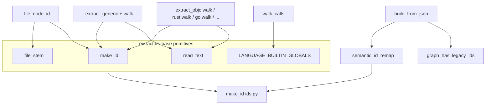

# Extractor primitives — stable node identity across every language

<!-- connect:up:begin -->
> **Cross-repo concept:** part of [multi-language-extraction](../../../concepts/multi-language-extraction.md) across this wiki's repos.
<!-- connect:up:end -->
## Overview
`graphify.extractors.base` is the tiny shared foundation every one of graphify's ~30 language
extractors stands on. It is three primitives — a node-id minter
[`_make_id`](../catalog/graphify/extractors/base.md#_make_id), a path-to-id-prefix function
[`_file_stem`](../catalog/graphify/extractors/base.md#_file_stem), and a byte-slice reader
[`_read_text`](../catalog/graphify/extractors/base.md#_read_text) — plus a set of language keyword
globals [`_LANGUAGE_BUILTIN_GLOBALS`](../catalog/graphify/extractors/base.md#_LANGUAGE_BUILTIN_GLOBALS._LANGUAGE_BUILTIN_GLOBALS).
The single key idea is **deterministic, collision-free node identity**: because a persistent graph
must survive re-ingests, merges, and moves without duplicating or losing nodes, *every* extractor
mints ids through the same function so the same symbol always lands on the same node. Get identity
right here and the whole graph stays stable; get it wrong and the graph fragments.

## Diagram

## Design rationale (why it's built this way)
The most load-bearing decision is documented directly in
[`_file_stem`](../catalog/graphify/extractors/base.md#_file_stem)'s docstring: it uses *"every
segment — not just the immediate parent dir (#1504) — [so that] same-named files in different
directories get distinct IDs instead of colliding into one last-writer-wins node"*. The example the
author gives — `docs/v1/api/README.md → docs_v1_api_readme` vs `docs/v2/api/README.md →
docs_v2_api_readme` — is exactly the fragmentation a naive stem would cause. The same docstring
notes it returns `""` for a nameless path (`Path('.')`) to keep `path.with_suffix("")` from raising
(#1618) — a guard that protects every caller, not just one.

The second decision is the **thin indirection**: [`_make_id`](../catalog/graphify/extractors/base.md#_make_id)
is a one-liner that forwards to [`make_id`](../catalog/graphify/ids.md#make_id) in `graphify.ids`,
whose docstring calls it *"Build a canonical node ID from one or more name parts."* Centralizing the
canonicalization (separator collapsing to underscores) in one place means the *build* side can
independently re-derive the same ids — which is what
[`_semantic_id_remap`](../catalog/graphify/build.md#_semantic_id_remap) and
[`graph_has_legacy_ids`](../catalog/graphify/build.md#graph_has_legacy_ids) do to migrate older graphs.

The third is that [`_read_text`](../catalog/graphify/extractors/base.md#_read_text) decodes a
tree-sitter node's byte span with `errors="replace"` — extraction must never crash on a file with
odd encoding, so a replacement char is preferred over an exception.

## Entry points
- [`_make_id`](../catalog/graphify/extractors/base.md#_make_id) — reached by essentially every
  extractor to mint a node id; it delegates to
  [`make_id`](../catalog/graphify/ids.md#make_id) for the canonical form.
- [`_file_stem`](../catalog/graphify/extractors/base.md#_file_stem) — reached whenever an extractor
  needs the id-prefix for a file and its symbols; it also underlies
  [`_file_node_id`](../catalog/graphify/extract.md#_file_node_id), the spec-form `{parent_dir}_{stem}`
  file-node id.
- [`_read_text`](../catalog/graphify/extractors/base.md#_read_text) — reached from every tree-sitter
  walk to turn a node's byte range into an identifier or label string.
- [`_LANGUAGE_BUILTIN_GLOBALS`](../catalog/graphify/extractors/base.md#_LANGUAGE_BUILTIN_GLOBALS._LANGUAGE_BUILTIN_GLOBALS)
  — consulted by [`walk_calls`](../catalog/graphify/extract.md#_extract_generic.walk_calls) so a call
  to a language builtin isn't mistaken for a call to a user-defined symbol of the same name.

## Mechanism (step-by-step)
1. **A file becomes an id prefix.** When an extractor such as
   [`_extract_generic`](../catalog/graphify/extract.md#_extract_generic) starts a file, it computes
   the stem with [`_file_stem`](../catalog/graphify/extractors/base.md#_file_stem) and the file-node
   id with [`_file_node_id`](../catalog/graphify/extract.md#_file_node_id). Every symbol id in that
   file is `_make_id(stem, ...names)`, so all of a file's nodes share one prefix.

2. **The walker reads names.** The recursive
   [`walk`](../catalog/graphify/extract.md#_extract_generic.walk) inside the generic driver — and its
   per-language siblings, e.g.
   [`walk`](../catalog/graphify/extract.md#extract_objc.walk),
   [`walk`](../catalog/graphify/extract.md#extract_go.walk),
   [`walk`](../catalog/graphify/extract.md#extract_rust.walk),
   [`walk`](../catalog/graphify/extract.md#extract_julia.walk),
   [`walk`](../catalog/graphify/extract.md#extract_fortran.walk),
   [`walk`](../catalog/graphify/extract.md#extract_pascal.walk),
   [`walk`](../catalog/graphify/extract.md#extract_dm.walk),
   [`walk`](../catalog/graphify/extract.md#extract_bash.walk),
   [`walk`](../catalog/graphify/extract.md#extract_powershell.walk),
   [`walk`](../catalog/graphify/extract.md#extract_verilog.walk),
   [`walk`](../catalog/graphify/extract.md#extract_sql.walk),
   [`walk`](../catalog/graphify/extractors/elixir.md#extract_elixir.walk),
   and the JSON structural walker
   [`walk_object`](../catalog/graphify/extract.md#extract_json.walk_object) — extracts each
   identifier via [`_read_text`](../catalog/graphify/extractors/base.md#_read_text) and mints its
   node id with [`_make_id`](../catalog/graphify/extractors/base.md#_make_id). The uniformity is the
   point: dozens of grammars, one id scheme.

3. **Cross-file references get a placeholder id.**
   [`ensure_named_node`](../catalog/graphify/extract.md#_extract_generic.ensure_named_node) uses
   `_make_id` to produce a bare-name id for a symbol not defined in the current file, so a later
   corpus pass can collapse the stub onto the real definition.

4. **Calls are filtered against builtins.**
   [`walk_calls`](../catalog/graphify/extract.md#_extract_generic.walk_calls) reads the called name
   with [`_read_text`](../catalog/graphify/extractors/base.md#_read_text) and skips it when it is in
   [`_LANGUAGE_BUILTIN_GLOBALS`](../catalog/graphify/extractors/base.md#_LANGUAGE_BUILTIN_GLOBALS._LANGUAGE_BUILTIN_GLOBALS),
   avoiding spurious edges to `print`, `len`, and the like.

5. **Specialized post-passes reuse the same primitives.** Type-relation facts come from
   [`_ts_walk_class_members`](../catalog/graphify/extract.md#_ts_walk_class_members); Python
   docstrings/rationale from
   [`_extract_python_rationale`](../catalog/graphify/extract.md#_extract_python_rationale);
   SystemVerilog semantics from
   [`_augment_systemverilog_semantics`](../catalog/graphify/extract.md#_augment_systemverilog_semantics);
   and container/asset formats from
   [`extract_astro`](../catalog/graphify/extract.md#extract_astro) and
   [`extract_dmf`](../catalog/graphify/extract.md#extract_dmf). All of them mint ids through
   [`_make_id`](../catalog/graphify/extractors/base.md#_make_id) so their nodes join the same graph
   cleanly.

6. **The build side re-derives ids.** When
   [`build_from_json`](../catalog/graphify/build.md#build_from_json) turns the extraction dict into a
   NetworkX graph, [`_semantic_id_remap`](../catalog/graphify/build.md#_semantic_id_remap)
   *"re-derive[s] non-AST node ids from source_file using the canonical"* scheme — calling the same
   [`make_id`](../catalog/graphify/ids.md#make_id) — and
   [`graph_has_legacy_ids`](../catalog/graphify/build.md#graph_has_legacy_ids) detects pre-#1504
   graphs so they can be migrated. This is only possible because id construction is centralized.

## Key data structures
- **The node id string** — produced by [`_make_id`](../catalog/graphify/extractors/base.md#_make_id)
  /[`make_id`](../catalog/graphify/ids.md#make_id): a canonical, separator-collapsed concatenation of
  name parts, prefixed by the file stem so ids are stable and directory-disambiguated.
- **The file-node id** — [`_file_node_id`](../catalog/graphify/extract.md#_file_node_id) computes the
  `{parent_dir}_{stem}` spec form so AST file nodes match the ids semantic subagents generate.
- **`_LANGUAGE_BUILTIN_GLOBALS`** — a `frozenset` of language builtin/keyword names used purely as a
  call-edge suppression filter.

## Dynamics (design intent)
Identity stability is asserted from both ends of the pipeline. The
[`_file_stem`](../catalog/graphify/extractors/base.md#_file_stem) docstring frames the invariant
(same-named files in different directories must not collide), and the build-side
[`graph_has_legacy_ids`](../catalog/graphify/build.md#graph_has_legacy_ids) exists to *detect* graphs
that predate it. Because extraction and build both route through
[`make_id`](../catalog/graphify/ids.md#make_id), an id computed at extract time and one re-derived at
build time from `source_file` agree — the property `_semantic_id_remap` depends on.

## Edge cases
- **Nameless path** — [`_file_stem`](../catalog/graphify/extractors/base.md#_file_stem) returns `""`
  for `Path('.')` (a source_file equal to the scan root), guarding every caller from the
  empty-name `ValueError`.
- **Absolute input paths** — the docstring notes the whole absolute path is encoded at extract time,
  then the id-remap post-pass re-derives the canonical repo-relative form so the on-disk location
  can't leak into persisted ids (#502).
- **Undecodable bytes** — [`_read_text`](../catalog/graphify/extractors/base.md#_read_text) uses
  `errors="replace"`, so extraction never aborts on encoding problems.
- **Builtin name collision** — a user function named like a builtin is still defined as a node, but a
  *call* to that name is suppressed as an edge by the
  [`_LANGUAGE_BUILTIN_GLOBALS`](../catalog/graphify/extractors/base.md#_LANGUAGE_BUILTIN_GLOBALS._LANGUAGE_BUILTIN_GLOBALS)
  filter.

## Open questions
- The exact contents of
  [`_LANGUAGE_BUILTIN_GLOBALS`](../catalog/graphify/extractors/base.md#_LANGUAGE_BUILTIN_GLOBALS._LANGUAGE_BUILTIN_GLOBALS)
  are truncated in the packet; only that it is a `frozenset[str]` of builtin names is grounded here.
- Whether the same builtin set is applied uniformly across all languages, or filtered per-grammar
  inside [`walk_calls`](../catalog/graphify/extract.md#_extract_generic.walk_calls), isn't settled by
  the Subgraph alone.

## See also
- [`graphify-extract`](graphify-extract.md) — the extraction pipeline these primitives serve.
- [`graphify-scip_ingest`](graphify-scip_ingest.md) — an alternate ingest that mints its own id form
  (`_make_scip_node_id`) rather than the file-stem scheme here.
