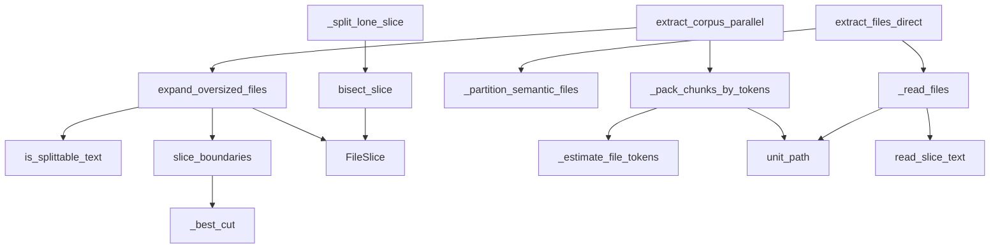

# File slicing — splitting oversized docs for the LLM lane without fragmenting the graph

Scope: how graphify chops a document too large for one LLM request into contiguous
[`FileSlice`](../catalog/graphify/file_slice.md#FileSlice) chunks that reassemble losslessly, while
keeping every slice keyed to its parent file so the knowledge graph never fragments per-chunk.

## Overview
The LLM semantic lane can't send an arbitrarily large document to a model in one request, but naively
chunking would either drop content or, worse, scatter one file across many graph nodes. `file_slice`
solves both: [`expand_oversized_files`](../catalog/graphify/file_slice.md#expand_oversized_files)
replaces each oversized *splittable-text* file with a list of
[`FileSlice`](../catalog/graphify/file_slice.md#FileSlice) records that tile the file with no gaps,
and every downstream helper treats a slice as belonging to its
[`path`](../catalog/graphify/file_slice.md#FileSlice.path) (the parent file) — so all slices collapse
back to one `source_file`. The key idea, stated in the
[`FileSlice`](../catalog/graphify/file_slice.md#FileSlice) docstring, is that *"the slice always
reports path as its source so slices don't fragment the graph."* Code is deliberately **never**
sliced — it needs whole-symbol context.

## Diagram

## Entry points
- [`expand_oversized_files`](../catalog/graphify/file_slice.md#expand_oversized_files) — the pre-pass:
  *"Replace each oversized splittable-text file with a list of FileSlices."* Called by
  [`extract_corpus_parallel`](../catalog/graphify/llm.md#extract_corpus_parallel) before chunk
  packing.
- [`extract_corpus_parallel`](../catalog/graphify/llm.md#extract_corpus_parallel) — the LLM corpus
  driver; it expands oversized docs, then packs units into token-bounded chunks with
  [`_pack_chunks_by_tokens`](../catalog/graphify/llm.md#_pack_chunks_by_tokens).
- [`extract_files_direct`](../catalog/graphify/llm.md#extract_files_direct) — the single-request LLM
  path; it accepts [`FileSlice`](../catalog/graphify/file_slice.md#FileSlice) units untouched
  (constructing `Path(FileSlice)` would raise) and formats them via
  [`_read_files`](../catalog/graphify/llm.md#_read_files).
- [`bisect_slice`](../catalog/graphify/file_slice.md#bisect_slice) — the adaptive-retry entry: when a
  single slice still overflows the model's *output*, it halves the slice at a newline.

## Mechanism (step-by-step)
1. **Decide splittability.** [`expand_oversized_files`](../catalog/graphify/file_slice.md#expand_oversized_files)
   asks [`is_splittable_text`](../catalog/graphify/file_slice.md#is_splittable_text) whether the
   suffix is in [`_SPLITTABLE_TEXT_SUFFIXES`](../catalog/graphify/file_slice.md#_SPLITTABLE_TEXT_SUFFIXES)
   (`.md`, `.mdx`, `.markdown`, `.txt`, `.rst`). Non-splittable files — including oversized code —
   pass through unchanged as a `Path`, verified by
   [`test_expand_does_not_slice_code_even_when_oversized`](../catalog/tests/test_file_slice.md#test_expand_does_not_slice_code_even_when_oversized).
2. **Skip small / unreadable files.** A splittable file at or below `max_chars` passes through whole
   ([`test_expand_small_file_stays_whole`](../catalog/tests/test_file_slice.md#test_expand_small_file_stays_whole)),
   and an unreadable one passes through untouched so the reader handles the error
   ([`test_expand_unreadable_file_passes_through`](../catalog/tests/test_file_slice.md#test_expand_unreadable_file_passes_through)) —
   both branches of [`expand_oversized_files`](../catalog/graphify/file_slice.md#expand_oversized_files).
3. **Compute gap-free ranges.** For a genuinely oversized file,
   [`slice_boundaries`](../catalog/graphify/file_slice.md#slice_boundaries) produces contiguous
   `(start, end)` ranges each ≤ `max_chars`; its docstring guarantees they are *"gap-free and
   non-overlapping, so concatenating the slices reproduces text exactly."* Each cut point comes from
   [`_best_cut`](../catalog/graphify/file_slice.md#_best_cut), which prefers the strongest nearby
   boundary in [`_BOUNDARY_SEPARATORS`](../catalog/graphify/file_slice.md#_BOUNDARY_SEPARATORS)
   (`\n#` heading, then blank line, then newline) and falls back to a hard cut to guarantee forward
   progress.
4. **Materialize slices.** [`expand_oversized_files`](../catalog/graphify/file_slice.md#expand_oversized_files)
   wraps each range in a [`FileSlice`](../catalog/graphify/file_slice.md#FileSlice) carrying
   [`path`](../catalog/graphify/file_slice.md#FileSlice.path),
   [`start`](../catalog/graphify/file_slice.md#FileSlice.start),
   [`end`](../catalog/graphify/file_slice.md#FileSlice.end),
   [`index`](../catalog/graphify/file_slice.md#FileSlice.index), and
   [`total`](../catalog/graphify/file_slice.md#FileSlice.total). Full lossless coverage plus
   same-parent-path anchoring is asserted by
   [`test_expand_oversized_markdown_is_sliced_with_full_coverage`](../catalog/tests/test_file_slice.md#test_expand_oversized_markdown_is_sliced_with_full_coverage).
5. **Pack into token-bounded chunks.**
   [`_pack_chunks_by_tokens`](../catalog/graphify/llm.md#_pack_chunks_by_tokens) groups units by
   parent directory (via [`unit_path`](../catalog/graphify/file_slice.md#unit_path)) and greedily
   fills chunks, sizing each unit with
   [`_estimate_file_tokens`](../catalog/graphify/llm.md#_estimate_file_tokens) — which for a slice
   costs only its character range, using [`read_slice_text`](../catalog/graphify/file_slice.md#read_slice_text)
   when a tokenizer is present. Because slicing already ran, the *"one file larger than the budget"*
   case no longer drops content (its docstring).
6. **Keep slices out of the image partition.**
   [`_partition_semantic_files`](../catalog/graphify/llm.md#_partition_semantic_files) splits a chunk
   into text vs raster-image units; a [`FileSlice`](../catalog/graphify/file_slice.md#FileSlice) *"is
   always text (only splittable text is sliced), so it never lands in the image partition"* — pinned
   by [`test_partition_keeps_slices_as_text`](../catalog/tests/test_file_slice.md#test_partition_keeps_slices_as_text).
7. **Format for the prompt, keyed to the parent.**
   [`_read_files`](../catalog/graphify/llm.md#_read_files) reads each slice with
   [`read_slice_text`](../catalog/graphify/file_slice.md#read_slice_text) and emits an
   `<untrusted_source>` block whose `path` is the parent file (from
   [`unit_path`](../catalog/graphify/file_slice.md#unit_path)) — so every slice of a file shares one
   `source_file`, verified by
   [`test_read_files_keys_every_slice_to_parent_path`](../catalog/tests/test_file_slice.md#test_read_files_keys_every_slice_to_parent_path).
8. **Adaptive retry on output overflow.** If a lone-slice chunk still overflows the model's response,
   [`_split_lone_slice`](../catalog/graphify/llm.md#_extract_with_adaptive_retry._split_lone_slice)
   calls [`bisect_slice`](../catalog/graphify/file_slice.md#bisect_slice), which halves the slice at a
   newline near its midpoint (contiguous, no gap) — see
   [`test_bisect_slice_splits_at_newline`](../catalog/tests/test_file_slice.md#test_bisect_slice_splits_at_newline).

## Key data structures
- **[`FileSlice`](../catalog/graphify/file_slice.md#FileSlice)** — a `@dataclass(frozen=True)`
  representing a `[start, end)` character range of one file:
  [`path`](../catalog/graphify/file_slice.md#FileSlice.path) (the real on-disk parent),
  [`start`](../catalog/graphify/file_slice.md#FileSlice.start)/[`end`](../catalog/graphify/file_slice.md#FileSlice.end)
  (the range), and [`index`](../catalog/graphify/file_slice.md#FileSlice.index)/[`total`](../catalog/graphify/file_slice.md#FileSlice.total)
  (for logging only, per the docstring).
- **`Path | FileSlice` unit** — the polymorphic "work item" flowing through the LLM lane;
  [`unit_path`](../catalog/graphify/file_slice.md#unit_path) collapses either back to a `Path` (the
  parent file for a slice), which is what keeps the graph un-fragmented.
- **Boundary tables** — [`_SPLITTABLE_TEXT_SUFFIXES`](../catalog/graphify/file_slice.md#_SPLITTABLE_TEXT_SUFFIXES)
  gates *what* may be sliced; [`_BOUNDARY_SEPARATORS`](../catalog/graphify/file_slice.md#_BOUNDARY_SEPARATORS)
  ranks *where* to cut.

## Dynamics (design intent)
The anti-fragmentation invariant is asserted from two directions:
[`test_expand_oversized_markdown_is_sliced_with_full_coverage`](../catalog/tests/test_file_slice.md#test_expand_oversized_markdown_is_sliced_with_full_coverage)
confirms slices reconstruct the whole file and all share `s.path == f`, and
[`test_read_files_keys_every_slice_to_parent_path`](../catalog/tests/test_file_slice.md#test_read_files_keys_every_slice_to_parent_path)
confirms every prompt block points at the one parent path. Token accounting is exercised by
[`test_estimate_tokens_for_slice_scales_with_range`](../catalog/tests/test_file_slice.md#test_estimate_tokens_for_slice_scales_with_range)
and [`test_pack_chunks_handles_slices`](../catalog/tests/test_file_slice.md#test_pack_chunks_handles_slices),
and [`unit_path`](../catalog/graphify/file_slice.md#unit_path) resolution by
[`test_unit_path_resolves_slice_and_path`](../catalog/tests/test_file_slice.md#test_unit_path_resolves_slice_and_path).
The broader adaptive-retry behavior is documented in the
[`extract_corpus_parallel`](../catalog/graphify/llm.md#extract_corpus_parallel) docstring (split-on-
`finish_reason="length"`, up to `max_retry_depth`).

## Edge cases
- **Oversized code** — never sliced;
  [`is_splittable_text`](../catalog/graphify/file_slice.md#is_splittable_text) returns False so it
  stays whole for symbol context.
- **Single huge line** — [`slice_boundaries`](../catalog/graphify/file_slice.md#slice_boundaries)
  falls back to a hard cut (`end <= pos` guard) so it never stalls;
  [`_best_cut`](../catalog/graphify/file_slice.md#_best_cut) returns `end` when the window has no
  usable separator.
- **Slice too small to split** — [`bisect_slice`](../catalog/graphify/file_slice.md#bisect_slice)
  returns `None` when `end - start <= 1` or no interior newline exists
  ([`test_bisect_slice_returns_none_for_tiny`](../catalog/tests/test_file_slice.md#test_bisect_slice_returns_none_for_tiny)).
- **Unreadable slice parent** — [`read_slice_text`](../catalog/graphify/file_slice.md#read_slice_text)
  reads with `errors="replace"`; an `OSError` in
  [`_estimate_file_tokens`](../catalog/graphify/llm.md#_estimate_file_tokens) yields a 0 cost so
  packing doesn't blow up.

## Open questions
- The `max_chars` value that [`extract_corpus_parallel`](../catalog/graphify/llm.md#extract_corpus_parallel)
  passes to [`expand_oversized_files`](../catalog/graphify/file_slice.md#expand_oversized_files) (the
  `_FILE_CHAR_CAP` constant seen in tests) is not itself a Subgraph symbol, so the exact cap is
  described only from the test source.
- How merged results from re-extracted bisected halves are stitched back into one chunk's output is
  handled in `_extract_with_adaptive_retry`, whose body beyond
  [`_split_lone_slice`](../catalog/graphify/llm.md#_extract_with_adaptive_retry._split_lone_slice) is
  not in this Subgraph.

## See also
- [`graphify-detect`](graphify-detect.md) — classifies which files reach the `DOCUMENT`/`PAPER` LLM
  lane in the first place.
- [`graphify-extract`](graphify-extract.md) — the deterministic code lane, which by contrast keeps
  files whole.
