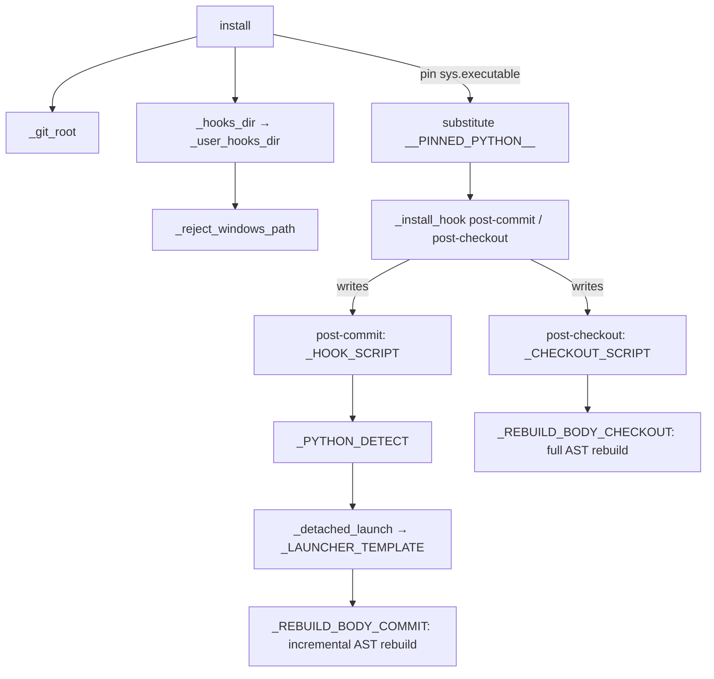

# Git hook system

<!-- connect:up:begin -->
> **Cross-repo concept:** part of [incremental-reconcile](../../../concepts/incremental-reconcile.md) across this wiki's repos.
<!-- connect:up:end -->
## Overview
The hook system is how graphify keeps the graph fresh *without a human running anything*:
it writes `post-commit` and `post-checkout` git hooks that re-ingest changed code after
every commit and every branch switch. The design centers on writing **self-contained shell
scripts** into `.git/hooks` that (a) find and pin a working Python interpreter, (b) compute
the changed file set, and (c) launch the AST rebuild **detached** so `git commit` returns
instantly. Install and uninstall are marker-delimited and idempotent, so graphify's block
can be appended to a user's existing hook and later removed cleanly.

## Diagram

## Design rationale (why it's built this way)
**Markers make install idempotent and non-destructive.**
[`_install_hook`](../catalog/graphify/hooks.md#_install_hook) appends the graphify block only
if the [`_HOOK_MARKER`](../catalog/graphify/hooks.md#_HOOK_MARKER) /
[`_CHECKOUT_MARKER`](../catalog/graphify/hooks.md#_CHECKOUT_MARKER) is absent, so re-installing
is a no-op (`test_install_idempotent`) and installing over a hand-written hook preserves it
(`test_install_appends_to_existing_hook`). [`_uninstall_hook`](../catalog/graphify/hooks.md#_uninstall_hook)
excises exactly the region between the start marker and its
[`_HOOK_MARKER_END`](../catalog/graphify/hooks.md#_HOOK_MARKER_END) /
[`_CHECKOUT_MARKER_END`](../catalog/graphify/hooks.md#_CHECKOUT_MARKER_END).

**Pin the interpreter at install time.** [`install`](../catalog/graphify/hooks.md#install)
substitutes `sys.executable` (the venv Python running the install) into the scripts because
tools like `uv tool install` and `pipx` put graphify in an isolated venv whose launcher is
often not on `PATH` when git fires a hook. Without pinning, `command -v graphify` fails, the
`python3` fallback imports the wrong venv, and the hook "silently exits 0" — the graph goes
stale with no signal (`test_install_embeds_pinned_interpreter`). The pinned path is passed
through the same allowlist as [`_PYTHON_DETECT`](../catalog/graphify/hooks.md#_PYTHON_DETECT),
so a path with unsafe shell characters degrades to empty (skipping the pinned probe) rather
than injecting into the generated script.

**Launch detached — no `nohup`.** A full-repo rebuild can take minutes; blocking the
post-commit hook would stall the shell. The old form was `nohup … &`, but Git for Windows'
MSYS shell ships no `nohup`/`setsid`, so the rebuild silently never ran (#1161). The fix:
[`_detached_launch`](../catalog/graphify/hooks.md#_detached_launch) wraps the rebuild body in
[`_LAUNCHER_TEMPLATE`](../catalog/graphify/hooks.md#_LAUNCHER_TEMPLATE), a tiny Python program
that `Popen`s the real rebuild with `start_new_session=True` on POSIX and
`DETACHED_PROCESS | CREATE_NEW_PROCESS_GROUP` on Windows, then returns immediately — child
output goes to `~/.cache/graphify-rebuild.log`. `test_installed_hooks_contain_no_nohup`
asserts the written hooks are nohup-free and use `start_new_session=True`.

**Reject Windows paths loudly.** On WSL/POSIX, `Path("C:\\…").is_absolute()` is `False`, so a
Windows `core.hooksPath` would be joined under the repo and `mkdir`'d as a literal
backslash-named junk directory while install reported success and the real `.git/hooks` got
nothing. [`_reject_windows_path`](../catalog/graphify/hooks.md#_reject_windows_path) (matching
[`_WINDOWS_DRIVE_RE`](../catalog/graphify/hooks.md#_WINDOWS_DRIVE_RE)) raises instead (#1385,
`test_windows_hookspath_rejected_no_junk_dir_on_posix`).

**Determinism.** Both scripts export `PYTHONHASHSEED=0` because networkx Louvain iterates
string-keyed sets whose order is per-process randomized — pinning it keeps community
assignments reproducible across hook-triggered rebuilds.

## Entry points
- [`install`](../catalog/graphify/hooks.md#install) — writes both hooks; reached by
  `graphify hook install` and folded into platform installs. Refuses to run outside a git
  repo (`test_no_git_repo_raises`).
- [`uninstall`](../catalog/graphify/hooks.md#uninstall) — removes both hooks; also invoked by
  [`uninstall_all`](../catalog/graphify/__main__.md#uninstall_all) during a full
  [`main`](../catalog/graphify/__main__.md#main)-driven uninstall.
- [`status`](../catalog/graphify/hooks.md#status) — reports whether each hook is installed;
  reached by `graphify hook status`.

## Mechanism (step-by-step)
1. **Locate the repo & hooks dir.** [`install`](../catalog/graphify/hooks.md#install) walks up
   with [`_git_root`](../catalog/graphify/hooks.md#_git_root) to find `.git`, then resolves the
   hooks directory via [`_hooks_dir`](../catalog/graphify/hooks.md#_hooks_dir) — which honors a
   custom `core.hooksPath` (Husky) and rejects Windows paths — and normalizes Husky's `_`
   wrapper dir back to the user-editable parent with
   [`_user_hooks_dir`](../catalog/graphify/hooks.md#_user_hooks_dir).
2. **Pin the interpreter.** [`install`](../catalog/graphify/hooks.md#install) sanitizes
   `sys.executable` and substitutes it for the `__PINNED_PYTHON__` placeholder in both
   [`_HOOK_SCRIPT`](../catalog/graphify/hooks.md#_HOOK_SCRIPT) and
   [`_CHECKOUT_SCRIPT`](../catalog/graphify/hooks.md#_CHECKOUT_SCRIPT).
3. **Write each hook.** [`_install_hook`](../catalog/graphify/hooks.md#_install_hook) writes (or
   marker-guardedly appends) the script, keyed by
   [`_HOOK_MARKER`](../catalog/graphify/hooks.md#_HOOK_MARKER) and
   [`_CHECKOUT_MARKER`](../catalog/graphify/hooks.md#_CHECKOUT_MARKER), and makes it executable
   (`test_install_is_executable`).
4. **Detect Python at run time.** When git fires the hook,
   [`_PYTHON_DETECT`](../catalog/graphify/hooks.md#_PYTHON_DETECT) (embedded in both scripts)
   tries the pinned interpreter first, then falls back to probing — using `find_spec`, not a
   full `import graphify`, because a full import costs 10s+ (`test_probes_use_find_spec_not_full_import`)
   — and emits a loud stderr message if it can't find one rather than a bare `exit 0`
   (`test_install_fallback_is_loud_not_silent`).
5. **Compute the change set (commit).** [`_HOOK_SCRIPT`](../catalog/graphify/hooks.md#_HOOK_SCRIPT)
   skips during rebase/merge/cherry-pick, diffs `HEAD~1..HEAD`, drops changes that are only
   under `graphify-out/` (to avoid a rebuild loop), and exports the list as
   `GRAPHIFY_CHANGED`.
6. **Launch the rebuild detached.**
   [`_detached_launch`](../catalog/graphify/hooks.md#_detached_launch) wraps
   [`_REBUILD_BODY_COMMIT`](../catalog/graphify/hooks.md#_REBUILD_BODY_COMMIT) in
   [`_LAUNCHER_TEMPLATE`](../catalog/graphify/hooks.md#_LAUNCHER_TEMPLATE); the body reads
   `GRAPHIFY_CHANGED`, applies a resource-limited, signal-timed guard, and drives the AST
   rebuild for exactly the changed paths (incremental), then best-effort refreshes the
   work-memory lessons doc.
7. **Branch switches (checkout).** [`_CHECKOUT_SCRIPT`](../catalog/graphify/hooks.md#_CHECKOUT_SCRIPT)
   only runs on a real branch switch (`$3 == 1`) and only if `graphify-out/` already exists;
   its [`_REBUILD_BODY_CHECKOUT`](../catalog/graphify/hooks.md#_REBUILD_BODY_CHECKOUT) triggers a
   *full* rebuild (no changed-paths list), because a checkout can touch arbitrary files.
8. **Uninstall / status.** [`uninstall`](../catalog/graphify/hooks.md#uninstall) removes the
   marked regions via [`_uninstall_hook`](../catalog/graphify/hooks.md#_uninstall_hook);
   [`status`](../catalog/graphify/hooks.md#status) checks for the markers with its inner
   [`_check`](../catalog/graphify/hooks.md#status._check).

## Key data structures
- **The script templates** — [`_HOOK_SCRIPT`](../catalog/graphify/hooks.md#_HOOK_SCRIPT) and
  [`_CHECKOUT_SCRIPT`](../catalog/graphify/hooks.md#_CHECKOUT_SCRIPT) are the full POSIX-sh
  bodies written to disk; each embeds
  [`_PYTHON_DETECT`](../catalog/graphify/hooks.md#_PYTHON_DETECT) and a
  [`_detached_launch`](../catalog/graphify/hooks.md#_detached_launch)-wrapped rebuild body.
- **The markers** — [`_HOOK_MARKER`](../catalog/graphify/hooks.md#_HOOK_MARKER) /
  [`_HOOK_MARKER_END`](../catalog/graphify/hooks.md#_HOOK_MARKER_END) and the checkout pair
  ([`_CHECKOUT_MARKER`](../catalog/graphify/hooks.md#_CHECKOUT_MARKER),
  [`_CHECKOUT_MARKER_END`](../catalog/graphify/hooks.md#_CHECKOUT_MARKER_END)) delimit graphify's
  region for idempotent install/uninstall/status.
- **Rebuild bodies** — [`_REBUILD_BODY_COMMIT`](../catalog/graphify/hooks.md#_REBUILD_BODY_COMMIT)
  (incremental, driven by `GRAPHIFY_CHANGED`) and
  [`_REBUILD_BODY_CHECKOUT`](../catalog/graphify/hooks.md#_REBUILD_BODY_CHECKOUT) (full); both are
  Python snippets that drive the watch module's AST rebuild engine.

## Dynamics (design intent)
The hook returns immediately: the detached launcher in
[`_detached_launch`](../catalog/graphify/hooks.md#_detached_launch) spawns the rebuild and exits,
so `git commit`/`git checkout` never block on graph work. The rebuild itself is serialized by a
per-repo flock in the watch module's rebuild engine — the checkout hook's comment notes this is
what prevents pile-ups when a commit and a checkout fire back-to-back. On
Windows/MSYS, both scripts default `GRAPHIFY_MAX_WORKERS=1` to avoid fragile inherited pipe
handles, while an explicit env value still wins.

## Edge cases
- **In-progress git operations.** Both scripts `exit 0` during rebase/merge/cherry-pick so a
  rebuild can't block `git --continue` with unstaged output.
- **Graph-only commits.** [`_HOOK_SCRIPT`](../catalog/graphify/hooks.md#_HOOK_SCRIPT) skips when
  every changed file is under `graphify-out/`, breaking the otherwise-infinite rebuild loop when
  graph outputs are committed.
- **`.exe` launchers on Windows.** [`_PYTHON_DETECT`](../catalog/graphify/hooks.md#_PYTHON_DETECT)
  skips shebang extraction for `.exe` binaries and is null-byte-safe against launcher paths that
  return no shebang (`test_hook_skips_head_on_exe`, `test_shebang_read_is_null_byte_safe`).
- **`GRAPHIFY_SKIP_HOOK=1`** short-circuits the post-commit hook entirely.

## Open questions
- The full body of [`_PYTHON_DETECT`](../catalog/graphify/hooks.md#_PYTHON_DETECT) (its exact
  probe order across `graphify`, `python3`, sibling `python.exe`) is a long shell heredoc only
  partially visible in this packet; the tests confirm its properties but not every branch.
- The rebuild engine the hook bodies invoke (`_rebuild_code`), the lessons-doc refresher
  (`reflect`), and `_apply_resource_limits` are referenced by the rebuild bodies but live outside
  this packet's subgraph — they are documented on the graphify-watch page.

## See also
- graphify-watch — the AST rebuild engine the hooks trigger.
- graphify-__main__ — the `hook install/uninstall/status` verbs and
  [`uninstall_all`](../catalog/graphify/__main__.md#uninstall_all).
